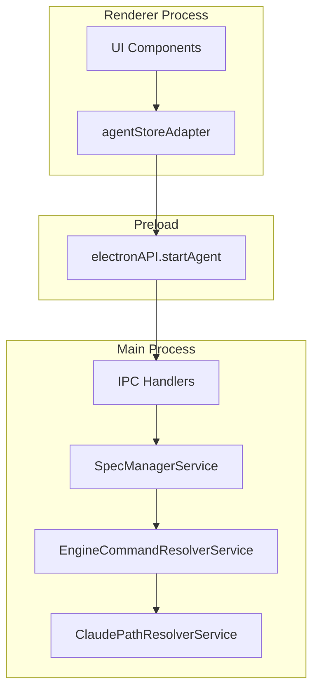
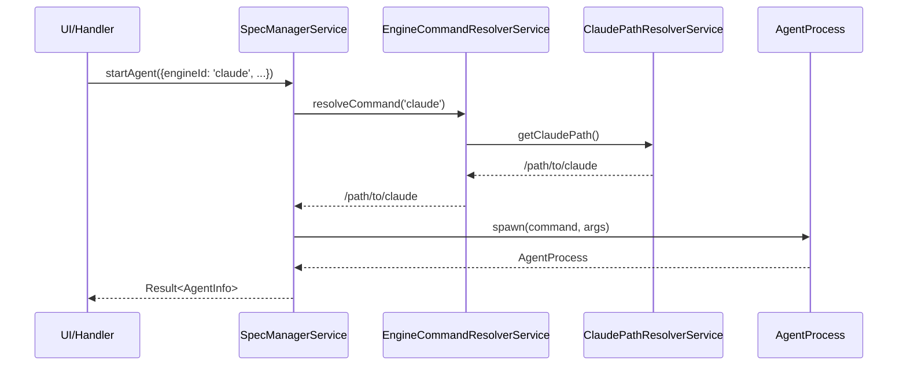

# Design: Unified Engine Command Resolution

## Overview

**Purpose**: この機能は、`startAgent` APIの`command`パラメータを`engineId`パラメータに置き換え、LLMエンジンのコマンドパス解決を`startAgent`内部で統一的に行う仕組みを提供する。

**Users**: 開発者（SDD Orchestratorの内部コード）が、エージェント起動時にエンジンIDを指定するだけでコマンドパス解決を自動的に行えるようになる。

**Impact**: 既存の`command: 'claude'`呼び出しを`engineId: 'claude'`に置き換え、`getClaudeCommand()`の呼び出し責任を呼び出し側から`startAgent`内部に移動する。

### Goals

- `startAgent` APIの引数を`command`から`engineId`に変更し、内部でコマンドパス解決を統一
- 将来的なマルチエンジン対応（Gemini CLI等）への拡張ポイントを提供
- GUIアプリ起動時のシェルプロファイル未読み込み問題を根本的に解決

### Non-Goals

- Gemini CLI等の他エンジンの実際のサポート実装（拡張ポイントのみ）
- `LLMEngineRegistry`との完全統合（段階的に行う）
- エンジン選択UIの追加
- エンジンごとの設定画面

## Architecture

### Existing Architecture Analysis

現在のアーキテクチャでは、コマンドパス解決の責任が分散している:

1. **ClaudePathResolverService**: `which claude`を実行し、フルパスをキャッシュ
2. **getClaudeCommand()**: `ClaudePathResolverService.getClaudePath()`を呼び出すヘルパー
3. **呼び出し側（handlers.ts, agentHandlers.ts等）**: `command: 'claude'`または`command: getClaudeCommand()`を渡す
4. **startAgent内部**: `command === 'claude'`の場合のみ`getClaudeCommand()`を呼び出す条件分岐

問題点:
- 呼び出し側で`getClaudeCommand()`を呼ぶ箇所と`'claude'`リテラルを渡す箇所が混在
- `startAgent`内部で`isClaudeCommand`チェックが必要
- 将来的なマルチエンジン対応が困難

### Architecture Pattern & Boundary Map



**Key Decisions**:
- `EngineCommandResolverService`を新設し、`engineId`からコマンドパスを解決
- `startAgent`内部で`EngineCommandResolverService`を呼び出し、呼び出し側の責任を削除
- 既存の`ClaudePathResolverService`は`EngineCommandResolverService`から委譲される

### Technology Stack

| Layer | Choice / Version | Role in Feature | Notes |
|-------|------------------|-----------------|-------|
| Backend / Services | TypeScript | `EngineCommandResolverService`の実装 | 既存のService層パターンに準拠 |
| IPC | Electron contextBridge | `engineId`パラメータの追加 | 既存のIPC設計パターン維持 |

## System Flows

### Agent Start Flow with engineId



**Key Decisions**:
- `engineId`はオプショナルでデフォルト値`'claude'`
- コマンド解決は`startAgent`内部で完結し、呼び出し側は意識不要
- E2Eテスト用の`E2E_MOCK_CLAUDE_COMMAND`環境変数は引き続きサポート

## Requirements Traceability

| Criterion ID | Summary | Components | Implementation Approach |
|--------------|---------|------------|------------------------|
| 1.1 | `startAgent`引数から`command`削除、`engineId`追加 | `SpecManagerService`, `StartAgentOptions` | `command`を`engineId`に置換、デフォルト`'claude'` |
| 1.2 | `engineId`デフォルト値`'claude'` | `SpecManagerService` | 既存コード維持（既に実装済み） |
| 1.3 | `startAgent`内部でコマンドパス解決 | `SpecManagerService`, `EngineCommandResolverService` | 新規サービスで解決 |
| 1.4 | `ClaudePathResolverService`活用 | `EngineCommandResolverService` | 委譲パターンで既存活用 |
| 2.1 | `EngineCommandResolverService`作成 | `EngineCommandResolverService` | 新規サービス作成 |
| 2.2 | `'claude'`のみサポート | `EngineCommandResolverService` | `ClaudePathResolverService`に委譲 |
| 2.3 | 他エンジン拡張ポイント | `EngineCommandResolverService` | `switch`文で拡張可能な設計 |
| 2.4 | E2E環境変数サポート | `EngineCommandResolverService` | `ClaudePathResolverService`経由で継続 |
| 3.1 | `handlers.ts`移行 | `handlers.ts` | `command: 'claude'`を`engineId`に変更 |
| 3.2 | `specManagerService.ts`内部解決統一 | `SpecManagerService` | `getClaudeCommand()`呼び出し削除 |
| 3.3 | ハードコード置換 | 全ハンドラー | `'claude'`を`engineId: 'claude'`に |
| 4.1-4.3 | IPC/preload API更新 | `preload/index.ts`, `electron.d.ts`, `IpcApiClient` | `command`パラメータを`engineId`に |
| 5.1-5.4 | フロントエンド更新 | `agentStoreAdapter.ts`, `BugWorkflowView.tsx` | `command`を`engineId`に |
| 6.1-6.4 | テスト更新 | 各テストファイル | `command: 'claude'`を`engineId: 'claude'`に |
| 7.1-7.3 | Remote UI対応 | `webSocketHandler.ts`, `remoteAccessHandlers.ts` | `engineId`受け取り、内部解決 |

## Components and Interfaces

| Component | Domain/Layer | Intent | Req Coverage | Key Dependencies | Contracts |
|-----------|--------------|--------|--------------|------------------|-----------|
| EngineCommandResolverService | Main/Services | engineIdからコマンドパスを解決 | 2.1-2.4 | ClaudePathResolverService (P0) | Service |
| SpecManagerService | Main/Services | startAgent APIの変更 | 1.1-1.4, 3.2 | EngineCommandResolverService (P0) | Service |
| StartAgentOptions | Main/Types | engineIdパラメータ追加 | 1.1 | - | Type |

### Main/Services

#### EngineCommandResolverService

| Field | Detail |
|-------|--------|
| Intent | `engineId`からLLM CLIのコマンドパスを解決するサービス |
| Requirements | 2.1, 2.2, 2.3, 2.4 |

**Responsibilities & Constraints**
- `engineId`に基づいてコマンドパスを解決
- 現時点では`'claude'`のみサポート、他エンジンは将来拡張
- E2E_MOCK_CLAUDE_COMMAND環境変数をサポート

**Dependencies**
- Outbound: `ClaudePathResolverService` - claudeコマンドパス解決 (P0)

**Contracts**: Service [x]

##### Service Interface
```typescript
interface EngineCommandResolverService {
  /**
   * engineIdからコマンドパスを解決する
   * @param engineId - LLMエンジンID（'claude' | 'gemini'）
   * @returns コマンドパス（未解決の場合はengineIdをそのまま返す）
   * @precondition engineIdはLLMEngineId型
   * @postcondition 'claude'の場合はClaudePathResolverService経由で解決されたパス
   * @invariant E2E_MOCK_CLAUDE_COMMANDが設定されている場合はその値を優先
   */
  resolveCommand(engineId: LLMEngineId): string;
}
```

**Implementation Notes**
- Singleton パターンで実装し、`getEngineCommandResolverService()`でインスタンス取得
- 将来のエンジン追加時は`switch`文に分岐を追加

#### SpecManagerService (Update)

| Field | Detail |
|-------|--------|
| Intent | `startAgent`メソッドの引数変更と内部コマンド解決 |
| Requirements | 1.1, 1.2, 1.3, 1.4, 3.2 |

**Changes Required**
- `StartAgentOptions.command`を削除（既に`engineId`は存在）
- `startAgent`内部で`EngineCommandResolverService.resolveCommand()`を呼び出し
- `isClaudeCommand`チェックを`engineId === 'claude'`に変更

##### Updated StartAgentOptions
```typescript
interface StartAgentOptions {
  specId: string;
  phase: string;
  // command: string; // REMOVED
  args: string[];
  group?: ExecutionGroup;
  sessionId?: string;
  providerType?: ProviderType;
  skipPermissions?: boolean;
  worktreeCwd?: string;
  prompt?: string;
  engineId?: LLMEngineId; // Existing, now required internally
}
```

- Preconditions: `engineId`未指定時は`DEFAULT_LLM_ENGINE`（'claude'）を使用
- Postconditions: コマンドパスは`EngineCommandResolverService`で解決される

### Summary-Only Components

以下のコンポーネントは既存パターンに従う単純な更新のため、詳細ブロック不要:

| Component | Change | Notes |
|-----------|--------|-------|
| `handlers.ts` | `command: 'claude'`を`engineId: 'claude'`に | STEERING_VERIFICATION, GENERATE_RELEASE, BUG_WORKFLOW |
| `agentHandlers.ts` | `command`パラメータ削除、`engineId`使用 | START_AGENT |
| `bugHandlers.ts` | `command: 'claude'`を`engineId: 'claude'`に | Bug操作 |
| `specHandlers.ts` | `execute`メソッド内部で`engineId`使用 | 既にservice層で解決 |
| `installHandlers.ts` | `command: 'claude'`を`engineId: 'claude'`に | インストール操作 |
| `remoteAccessHandlers.ts` | `command: 'claude'`を`engineId: 'claude'`に | Remote UI操作 |
| `scheduleTaskHandlers.ts` | `command: 'claude'`を`engineId: 'claude'`に | スケジュール実行 |
| `preload/index.ts` | `startAgent`の`command`パラメータを`engineId`に | IPC API |
| `electron.d.ts` | 型定義更新 | TypeScript型 |
| `IpcApiClient.ts` | `'claude'`を`engineId`に | API Client |
| `WebSocketApiClient.ts` | `command`を`engineId`に | WebSocket API |
| `agentStoreAdapter.ts` | `command`パラメータを`engineId`に | Store Adapter |
| `BugWorkflowView.tsx` | `startAgent`呼び出し更新 | UI Component |

## Data Models

### StartAgentOptions Type Change

```typescript
// Before
interface StartAgentOptions {
  command: string;  // 'claude' or getClaudeCommand()
  engineId?: LLMEngineId;
  // ...
}

// After
interface StartAgentOptions {
  // command: string; // REMOVED
  engineId?: LLMEngineId; // Optional, defaults to 'claude'
  // ...
}
```

## Error Handling

### Error Strategy

既存のエラーハンドリングパターンを維持:
- `ClaudePathResolverService`が解決に失敗した場合、`'claude'`を返す（既存動作）
- 未知の`engineId`が渡された場合、`engineId`をそのままコマンドとして使用

## Testing Strategy

### Unit Tests
- `EngineCommandResolverService.resolveCommand()`のテスト
  - `'claude'`でClaudePathResolverServiceに委譲
  - E2E_MOCK_CLAUDE_COMMAND環境変数のサポート
  - 未知のengineIdの処理

### Integration Tests
- `SpecManagerService.startAgent()`で`engineId`が正しく解決されることを検証
- 既存の`command`パラメータを使用するテストを更新

### E2E Tests
- E2E_MOCK_CLAUDE_COMMANDが正しく適用されることを検証

## Verification Contract

### User Journey Definition

| Journey ID | Operation Flow | Expected Result | E2E Required |
|------------|---------------|-----------------|--------------|
| UJ-001 | UIからSpec実行ボタンをクリック | AgentがengineId解決で起動 | No |
| UJ-002 | Bug Workflowでfix実行 | AgentがengineId解決で起動 | No |
| UJ-003 | Schedule Taskの自動実行 | AgentがengineId解決で起動 | No |

**E2E Required = No の理由**: この変更は内部リファクタリングであり、ユーザー操作の観点では動作に変化なし。既存のE2EテストがengineId解決を間接的に検証する。

### Impact Analysis Contract

| Target File | Action | Reason |
|-------------|--------|--------|
| `src/main/services/engineCommandResolverService.ts` | CREATE | engineId→コマンドパス解決サービス |
| `src/main/services/specManagerService.ts` | UPDATE | startAgentからcommand削除、engineId使用 |
| `src/main/ipc/handlers.ts` | UPDATE | command: 'claude'をengineId: 'claude'に |
| `src/main/ipc/agentHandlers.ts` | UPDATE | commandパラメータ削除 |
| `src/main/ipc/bugHandlers.ts` | UPDATE | command: 'claude'をengineId: 'claude'に |
| `src/main/ipc/specHandlers.ts` | UPDATE | engineId使用（内部解決） |
| `src/main/ipc/installHandlers.ts` | UPDATE | command: 'claude'をengineId: 'claude'に |
| `src/main/ipc/remoteAccessHandlers.ts` | UPDATE | command: 'claude'をengineId: 'claude'に |
| `src/main/ipc/scheduleTaskHandlers.ts` | UPDATE | command: 'claude'をengineId: 'claude'に |
| `src/preload/index.ts` | UPDATE | startAgentのcommandパラメータをengineIdに |
| `src/renderer/types/electron.d.ts` | UPDATE | startAgent型定義更新 |
| `src/shared/api/IpcApiClient.ts` | UPDATE | 'claude'をengineIdに |
| `src/shared/api/WebSocketApiClient.ts` | UPDATE | commandをengineIdに |
| `src/renderer/stores/agentStoreAdapter.ts` | UPDATE | commandパラメータをengineIdに |
| `src/renderer/components/BugWorkflowView.tsx` | UPDATE | startAgent呼び出し更新 |
| `src/main/services/agentProcess.ts` | UPDATE | getClaudeCommand export維持（後方互換） |
| 各テストファイル | UPDATE | command: 'claude'をengineId: 'claude'に |

## Integration Test Strategy

### Components
- `SpecManagerService`
- `EngineCommandResolverService`
- `ClaudePathResolverService`

### Data Flow
```
startAgent({engineId: 'claude'})
  -> EngineCommandResolverService.resolveCommand('claude')
  -> ClaudePathResolverService.getClaudePath()
  -> spawn(resolvedCommand, args)
```

### Mock Boundaries
- `ClaudePathResolverService`: 実際のシェル呼び出しをモック
- `AgentProcess.spawn`: プロセス起動をモック

### Verification Points
- `EngineCommandResolverService`が正しいパスを返すこと
- `startAgent`が解決されたコマンドでプロセスを起動すること

### Robustness Strategy
- `waitFor`パターンでサービス初期化を待機
- タイムアウト設定でテストハング防止

### Prerequisites
- 既存のテストインフラで対応可能

## Interface Changes & Impact Analysis

### IPC API変更

**変更されるインターフェース**: `electronAPI.startAgent`

| パラメータ | Before | After | 影響 |
|-----------|--------|-------|------|
| `command` | `string` (required) | 削除 | 全呼び出し元の更新が必要 |
| `engineId` | なし | `LLMEngineId` (optional) | 新規追加、デフォルト'claude' |

**Callers (更新が必要な箇所)**:
- `agentStoreAdapter.ts`: `startAgent(specId, phase, command, args, ...)`
- `IpcApiClient.ts`: `startAgent(bugName, action, 'claude', [...])`
- `BugWorkflowView.tsx`: `electronAPI.startAgent(...)`
- 各IPCハンドラー内の`service.startAgent({command: 'claude', ...})`

## Design Decisions

### DD-001: engineIdパラメータ方式の採用

| Field | Detail |
|-------|--------|
| Status | Accepted |
| Context | `command`パラメータを維持するか、`engineId`パラメータに変更するかの選択 |
| Decision | `engineId`パラメータ方式を採用し、`command`パラメータを削除 |
| Rationale | セマンティクスが明確（「claudeコマンドを使う」ではなく「claudeエンジンを使う」）で、将来的なエンジン切り替えに対応しやすい |
| Alternatives Considered | 1. `command`パラメータ維持（後方互換）: 混乱が生じる、2. 両パラメータ併用: 複雑化 |
| Consequences | 全呼び出し元の更新が必要だが、影響範囲は全て内部コードなので破壊的変更でも問題なし |

### DD-002: EngineCommandResolverServiceの新設

| Field | Detail |
|-------|--------|
| Status | Accepted |
| Context | コマンドパス解決を`startAgent`内部で行うための設計 |
| Decision | `EngineCommandResolverService`を新設し、`engineId`からコマンドパスを解決 |
| Rationale | 単一責任原則に従い、パス解決ロジックを分離。将来のマルチエンジン対応で拡張しやすい |
| Alternatives Considered | 1. `startAgent`内に直接実装: 肥大化、2. `LLMEngineRegistry`に統合: 段階的統合の方針に反する |
| Consequences | 新しいサービスファイルの追加、DIパターンでテスト容易性を維持 |

### DD-003: 後方互換性を維持しない決定

| Field | Detail |
|-------|--------|
| Status | Accepted |
| Context | 現在の`command`パラメータとの後方互換性を維持するか |
| Decision | 後方互換性は維持しない（`engineId`に統一） |
| Rationale | 調査の結果、すべての呼び出しで`'claude'`が使用されており、カスタムコマンドを渡しているケースはなかった。`command`パラメータを残すと混乱が生じる |
| Alternatives Considered | `command`パラメータをdeprecated警告付きで残す: 不要な複雑さ |
| Consequences | 一度に全箇所を更新する必要があるが、影響範囲が明確で安全 |
