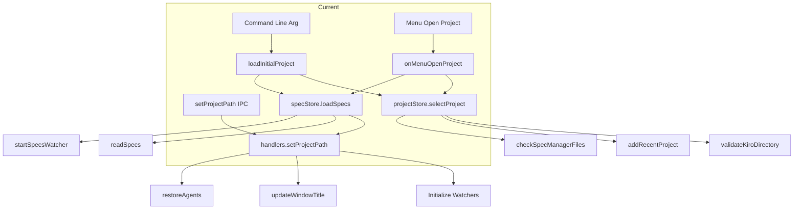
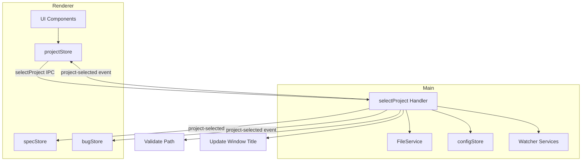
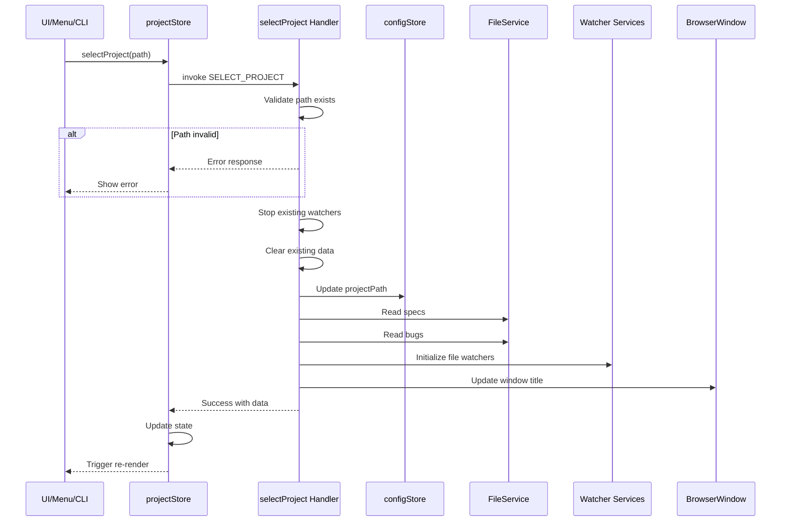
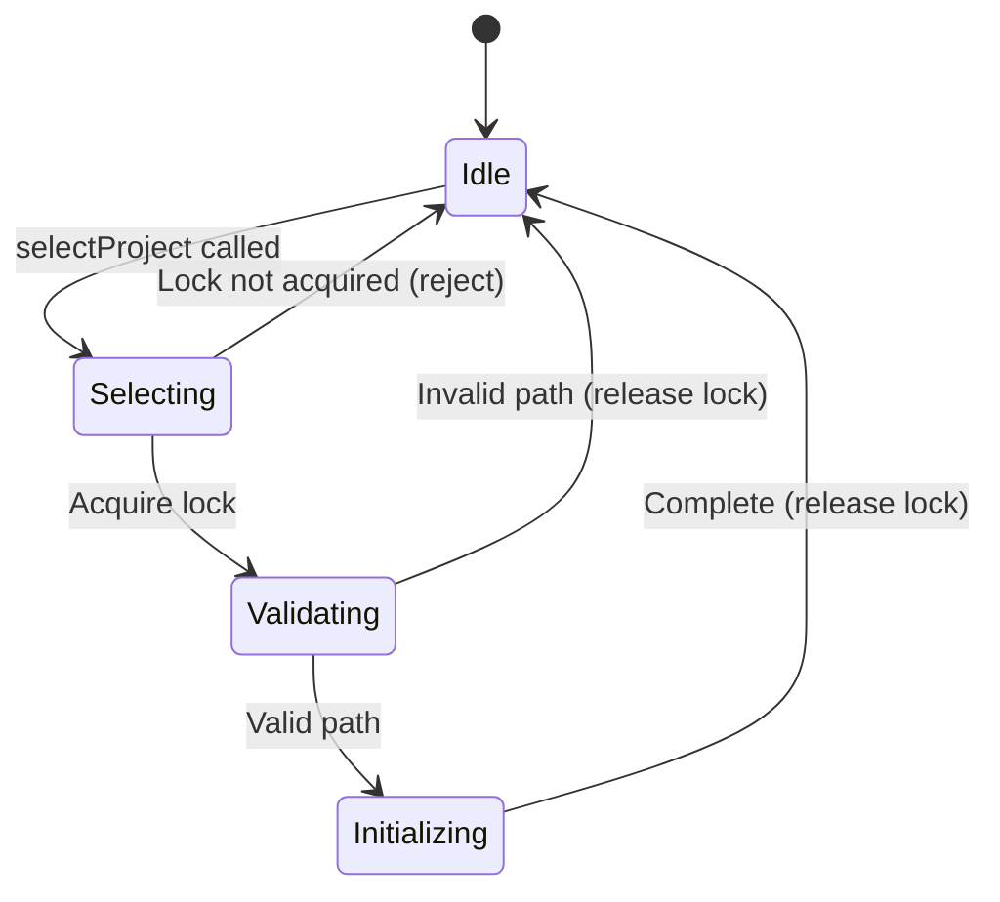
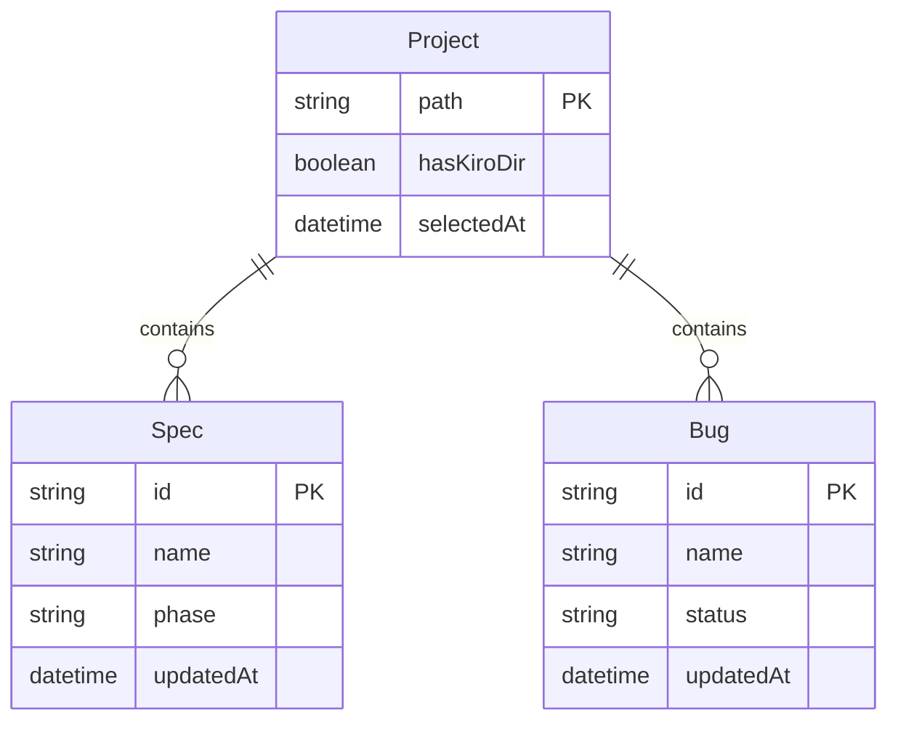

# Design Document

## Overview

**Purpose**: 本機能は、SDD Orchestratorにおけるプロジェクト選択処理を統一し、すべての経路（コマンドライン引数、メニュー、IPC）から一貫した動作を保証する。

**Users**: 開発者およびテスト担当者がプロジェクト選択時に一貫したUI更新とデータロードを期待する。

**Impact**: 現在の`setProjectPath` IPCハンドラーを`selectProject`に置き換え、分散していたプロジェクト選択ロジックを統合する。

### Goals

- すべてのプロジェクト選択経路で統一されたハンドラーを使用する
- プロジェクト選択時にUI（サイドバー、ウィンドウタイトル、ステータス）が確実に更新される
- E2Eテストやデバッグでプログラム的にプロジェクトを切り替え可能にする
- プロジェクト切り替え時の状態一貫性を保証する

### Non-Goals

- プロジェクトのバリデーションルールの変更（既存のロジックを維持）
- ファイルウォッチャーの実装変更（既存のサービスを再利用）
- UIコンポーネントのレイアウト変更

## Architecture

### Existing Architecture Analysis

現在のプロジェクト選択には3つの独立した経路が存在する。



**問題点**:
1. `projectStore.selectProject`は`setProjectPath`を呼び出さないためmainプロセスの状態が更新されない
2. `specStore.loadSpecs`は`setProjectPath`を呼び出すが、projectStoreの状態更新は行わない
3. 各経路で異なる処理順序と責任分担により、予期しない動作が発生しうる

### Architecture Pattern & Boundary Map



**Architecture Integration**:
- Selected pattern: 単一エントリーポイントパターン（Facade）
- Domain/feature boundaries: mainプロセスの`selectProject`がプロジェクト選択の唯一のエントリーポイント
- Existing patterns preserved: IPC通信パターン、Zustandストアパターン、ファイルウォッチャーパターン
- New components rationale: 統一ハンドラーにより重複コードを排除し、状態の一貫性を保証
- Steering compliance: Electron IPCパターン、TypeScript strict mode、Zustand状態管理

### Technology Stack

| Layer | Choice / Version | Role in Feature | Notes |
|-------|------------------|-----------------|-------|
| Frontend | React 19, Zustand | 状態管理、UI更新 | 既存のストアパターンを拡張 |
| Backend | Electron 35, Node.js 20+ | IPCハンドラー、ファイル操作 | 既存のサービスを再利用 |
| IPC | contextBridge | プロセス間通信 | 新規チャンネル追加 |

## System Flows

### プロジェクト選択フロー



### 排他制御フロー



## Requirements Traceability

| Requirement | Summary | Components | Interfaces | Flows |
|-------------|---------|------------|------------|-------|
| 1.1 | selectProject IPCハンドラー提供 | SelectProjectHandler | ISelectProjectHandler | プロジェクト選択フロー |
| 1.2 | パス検証実行 | SelectProjectHandler | validateProjectPath | プロジェクト選択フロー |
| 1.3 | configStore更新 | SelectProjectHandler | configStore | プロジェクト選択フロー |
| 1.4 | ファイルウォッチャー初期化 | SelectProjectHandler | WatcherServices | プロジェクト選択フロー |
| 1.5 | データ読み込み | SelectProjectHandler | FileService | プロジェクト選択フロー |
| 1.6 | エラーメッセージ返却 | SelectProjectHandler | SelectProjectResult | プロジェクト選択フロー |
| 2.1 | CLI経由の統合 | main/index.ts | selectProject | プロジェクト選択フロー |
| 2.2 | メニュー経由の統合 | App.tsx, projectStore | selectProject | プロジェクト選択フロー |
| 2.3 | IPC経由の統合 | preload, handlers | selectProject | プロジェクト選択フロー |
| 2.4 | setProjectPath廃止 | handlers.ts | - | - |
| 3.1-3.4 | UI自動更新 | projectStore, specStore | ProjectSelectedEvent | プロジェクト選択フロー |
| 4.1-4.4 | E2Eテスト対応 | preload, handlers | selectProject API | プロジェクト選択フロー |
| 5.1-5.4 | パス検証 | SelectProjectHandler | validateProjectPath | プロジェクト選択フロー |
| 6.1-6.4 | 状態一貫性 | SelectProjectHandler | SelectionLock | 排他制御フロー |

## Components and Interfaces

| Component | Domain/Layer | Intent | Req Coverage | Key Dependencies (P0/P1) | Contracts |
|-----------|--------------|--------|--------------|--------------------------|-----------|
| SelectProjectHandler | Main/IPC | 統一されたプロジェクト選択処理 | 1.1-1.6, 5.1-5.4, 6.1-6.4 | FileService (P0), configStore (P0), WatcherServices (P1) | Service |
| projectStore (extension) | Renderer/Store | プロジェクト状態管理とIPC呼び出し | 2.1-2.3, 3.1-3.4 | selectProject IPC (P0) | State |
| preload (extension) | Preload | selectProject APIの公開 | 4.1-4.4 | ipcRenderer (P0) | API |

### Main / IPC Layer

#### SelectProjectHandler

| Field | Detail |
|-------|--------|
| Intent | すべてのプロジェクト選択経路を統合し、一貫した初期化処理を提供 |
| Requirements | 1.1, 1.2, 1.3, 1.4, 1.5, 1.6, 5.1, 5.2, 5.3, 5.4, 6.1, 6.2, 6.3, 6.4 |

**Responsibilities & Constraints**
- プロジェクトパスの検証（存在確認、ディレクトリ確認、アクセス権限）
- 既存ウォッチャーの停止と新規ウォッチャーの初期化
- configStoreへのprojectPath保存
- specs、bugsデータの読み込み
- ウィンドウタイトルの更新
- 排他制御による同時選択操作の防止

**Dependencies**
- Inbound: projectStore (Renderer) - selectProject呼び出し (P0)
- Outbound: FileService - specs/bugs読み込み (P0)
- Outbound: configStore - projectPath保存 (P0)
- Outbound: SpecsWatcherService - ファイル監視 (P1)
- Outbound: BugsWatcherService - バグファイル監視 (P1)
- Outbound: AgentRecordWatcherService - エージェント記録監視 (P1)

**Contracts**: Service [x] / API [ ] / Event [ ] / Batch [ ] / State [ ]

##### Service Interface

```typescript
/** プロジェクト選択結果 */
interface SelectProjectResult {
  success: boolean;
  projectPath: string;
  kiroValidation: KiroValidation;
  specs: SpecMetadata[];
  bugs: BugMetadata[];
  error?: SelectProjectError;
}

/** プロジェクト選択エラー */
type SelectProjectError =
  | { type: 'PATH_NOT_EXISTS'; path: string }
  | { type: 'NOT_A_DIRECTORY'; path: string }
  | { type: 'PERMISSION_DENIED'; path: string }
  | { type: 'SELECTION_IN_PROGRESS' }
  | { type: 'INTERNAL_ERROR'; message: string };

/** 統一プロジェクト選択ハンドラー */
interface ISelectProjectHandler {
  /**
   * プロジェクトを選択し、必要な初期化処理を実行する
   * @param projectPath プロジェクトのルートパス
   * @returns 選択結果（成功時はspecs/bugsデータを含む）
   */
  selectProject(projectPath: string): Promise<SelectProjectResult>;
}
```

- Preconditions:
  - projectPathは絶対パスであること
  - 他の選択操作が進行中でないこと
- Postconditions:
  - 成功時: configStore.projectPath更新済み、ウォッチャー起動済み、ウィンドウタイトル更新済み
  - 失敗時: 前の状態を維持
- Invariants:
  - 同時に1つの選択操作のみ実行可能
  - 選択操作完了後は必ずロックが解放される

**Implementation Notes**
- Integration: 既存の`setProjectPath`関数のロジックを`selectProject`に移行し、specs/bugs読み込みを統合
- Validation: `fs.access`と`fs.stat`を使用してパスの存在、ディレクトリ確認、読み取り権限を検証
- Risks: ファイルシステムアクセスの遅延による選択操作のタイムアウト（低リスク）

### Renderer / Store Layer

#### projectStore (extension)

| Field | Detail |
|-------|--------|
| Intent | selectProject IPCを呼び出し、結果でローカル状態を更新 |
| Requirements | 2.1, 2.2, 2.3, 3.1, 3.2, 3.3, 3.4 |

**Responsibilities & Constraints**
- selectProject IPCの呼び出し
- 返却されたspecs/bugsでspecStore/bugStoreを更新
- エラーハンドリングとUI通知
- recentProjectsへの追加

**Dependencies**
- Outbound: selectProject IPC - プロジェクト選択実行 (P0)
- Outbound: specStore - specs一覧の更新 (P1)
- Outbound: bugStore - bugs一覧の更新 (P1)

**Contracts**: Service [ ] / API [ ] / Event [ ] / Batch [ ] / State [x]

##### State Management

```typescript
interface ProjectState {
  currentProject: string | null;
  recentProjects: string[];
  kiroValidation: KiroValidation | null;
  isLoading: boolean;
  error: string | null;
  // 既存フィールド（specManagerCheck, permissionsCheck等）は維持
}

interface ProjectActions {
  /**
   * 統一されたプロジェクト選択
   * - selectProject IPCを呼び出す
   * - specs/bugsを受け取りストアを更新
   * - recentProjectsに追加
   */
  selectProject: (path: string) => Promise<void>;

  // 既存アクション（loadRecentProjects, clearProject等）は維持
}
```

- State model: Zustand store with projectPath, validation, specs, bugs
- Persistence: recentProjectsはelectron-storeで永続化（既存）
- Concurrency: 単一のisLoadingフラグで選択中状態を管理

**Implementation Notes**
- Integration: specStore.loadSpecs()の呼び出しを削除し、IPCからの結果でspecStore.setSpecs()を呼び出す
- Validation: IPCからのエラーをerrorStateにマッピングしユーザーに表示
- Risks: specStore/bugStoreとの依存関係によるストア更新順序の問題（setSpecs/setBugsで解決）

### Preload Layer

#### preload (extension)

| Field | Detail |
|-------|--------|
| Intent | selectProject APIをrendererに公開 |
| Requirements | 4.1, 4.2, 4.3, 4.4 |

**Responsibilities & Constraints**
- contextBridge経由でselectProjectを公開
- 戻り値の型安全性を保証
- 既存のsetProjectPathを廃止またはエイリアス化

**Dependencies**
- Outbound: ipcRenderer - IPC通信 (P0)

**Contracts**: Service [ ] / API [x] / Event [ ] / Batch [ ] / State [ ]

##### API Contract

```typescript
interface ElectronAPI {
  /**
   * プロジェクトを選択する（統一ハンドラー）
   * @param projectPath プロジェクトのルートパス
   * @returns 選択結果
   */
  selectProject(projectPath: string): Promise<SelectProjectResult>;

  /**
   * @deprecated selectProjectを使用してください
   */
  setProjectPath?(projectPath: string): Promise<void>;
}
```

**Implementation Notes**
- Integration: 既存の`setProjectPath`を`selectProject`のラッパーとして維持（後方互換性）
- Validation: TypeScript型定義でAPI契約を保証
- Risks: 既存コードが`setProjectPath`に依存している場合の互換性（ラッパーで解決）

## Data Models

### Domain Model



**Business rules & invariants**:
- プロジェクトパスは一意の識別子として機能
- .kiroディレクトリの有無はプロジェクトの有効性に影響しない（警告のみ）
- specs/bugsはプロジェクト選択時に読み込まれる

### Logical Data Model

**SelectProjectResult Structure**:
- `success`: boolean - 選択成功フラグ
- `projectPath`: string - 選択されたプロジェクトパス
- `kiroValidation`: KiroValidation - .kiroディレクトリの検証結果
- `specs`: SpecMetadata[] - 読み込まれたspec一覧
- `bugs`: BugMetadata[] - 読み込まれたbug一覧
- `error?`: SelectProjectError - エラー情報（失敗時のみ）

**Consistency & Integrity**:
- トランザクション境界: selectProject操作全体が1つのトランザクション
- 部分的な成功は許可しない（all-or-nothing）
- エラー発生時は前の状態を維持

## Error Handling

### Error Strategy

| Error Type | Response | Recovery |
|------------|----------|----------|
| PATH_NOT_EXISTS | ユーザーエラー通知 | 別のパスを選択 |
| NOT_A_DIRECTORY | ユーザーエラー通知 | ディレクトリを選択 |
| PERMISSION_DENIED | ユーザーエラー通知 | アクセス権限を確認 |
| SELECTION_IN_PROGRESS | 操作をブロック | 前の操作完了を待機 |
| INTERNAL_ERROR | エラーログ + 通知 | アプリケーション再起動 |

### Error Categories and Responses

**User Errors (4xx equivalent)**:
- PATH_NOT_EXISTS: 「指定されたパスが存在しません」
- NOT_A_DIRECTORY: 「指定されたパスはディレクトリではありません」
- PERMISSION_DENIED: 「パスへのアクセス権限がありません」

**Business Logic Errors (422 equivalent)**:
- SELECTION_IN_PROGRESS: 「プロジェクト選択処理が進行中です」

**System Errors (5xx equivalent)**:
- INTERNAL_ERROR: 「内部エラーが発生しました: {message}」

### Monitoring

- ログ出力: `logger.info`/`logger.error`でプロジェクト選択操作を記録
- エラー追跡: エラータイプとパスをログに含める

## Testing Strategy

### Unit Tests

1. **validateProjectPath**: パス存在確認、ディレクトリ確認、アクセス権限確認
2. **selectProject handler**: 正常系（全初期化完了）、異常系（各エラータイプ）
3. **排他制御**: 同時選択操作のブロック、ロック解放の確認
4. **projectStore.selectProject**: IPC呼び出し、状態更新、エラーハンドリング

### Integration Tests

1. **handlers.ts + FileService**: プロジェクト選択時のspecs/bugs読み込み
2. **handlers.ts + WatcherServices**: ウォッチャーの停止と再初期化
3. **projectStore + specStore**: IPC結果によるストア更新連携

### E2E Tests

1. **メニューからのプロジェクト選択**: UI更新（サイドバー、ウィンドウタイトル）の確認
2. **コマンドライン引数でのプロジェクト選択**: 起動時の自動選択確認
3. **window.electronAPI.selectProject**: MCP経由でのプログラム的選択
4. **無効なパス選択**: エラー表示とUI状態の確認

## Migration Strategy

### Phase 1: selectProjectハンドラー追加

1. `handlers.ts`に`selectProject`ハンドラーを実装
2. `channels.ts`に`SELECT_PROJECT`チャンネルを追加
3. `preload/index.ts`に`selectProject` APIを追加
4. 単体テストを追加

### Phase 2: ストア統合

1. `projectStore.selectProject`を新IPCを呼び出すよう変更
2. `specStore.loadSpecs`から`setProjectPath`呼び出しを削除
3. `specStore`に`setSpecs`メソッドを追加（外部からのspecs設定用）
4. `bugStore`に`setBugs`メソッドを追加（外部からのbugs設定用）

### Phase 3: 既存経路の統合

1. `App.tsx`のメニューイベントハンドラーを更新
2. `loadInitialProject`を`selectProject`を使用するよう変更
3. `setProjectPath`を`selectProject`のラッパーに変更（後方互換性）

### Phase 4: クリーンアップ

1. 不要になった重複コードを削除
2. 統合テスト・E2Eテストの実行
3. ドキュメント更新

### Rollback Triggers

- E2Eテストで3件以上の失敗
- プロジェクト選択時の致命的なエラー発生
- ファイルウォッチャーの動作不良

### Validation Checkpoints

- Phase 1完了: ユニットテストがすべてパス
- Phase 2完了: projectStore.selectProjectがspecs/bugsを正しく更新
- Phase 3完了: 全経路からのプロジェクト選択が動作
- Phase 4完了: E2Eテストがすべてパス
