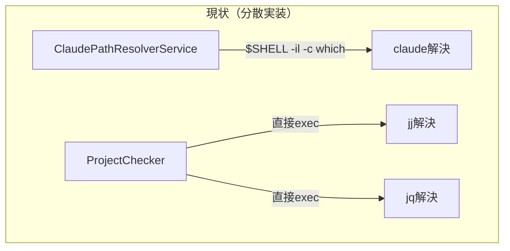
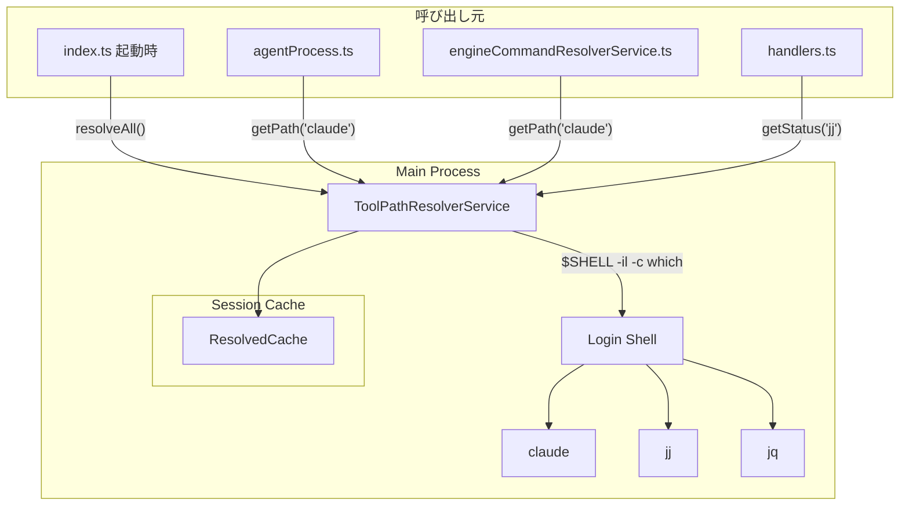
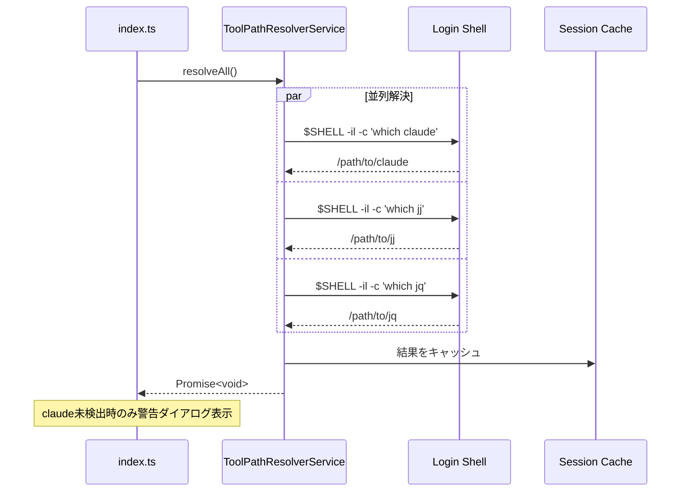

# 設計ドキュメント: 外部ツールパス解決の統合

## 概要

**目的**: 外部ツール（`claude`, `jj`, `jq`）のパス解決ロジックを単一の`ToolPathResolverService`に統合し、GUIアプリ起動時のPATH制限問題を一貫した方法で解決する。

**ユーザー**: 開発者（コード品質向上・重複排除）、エンドユーザー（Homebrewインストールツールの確実な検出）

**影響**: `ClaudePathResolverService`と`ProjectChecker`内の個別メソッドを削除し、新しい統一サービスに移行する。

### 目標

- 全外部ツールで一貫したログインシェル経由のパス解決を提供
- セッション単位のキャッシュによるパフォーマンス向上
- 将来のツール追加が容易な拡張性の確保
- E2Eテストでのモック対応

### 非目標

- Windows/Linux固有のパス解決（現状macOS向け）
- ツールの自動インストール機能
- バージョン互換性チェック
- リモートマシン上のツール検出

## アーキテクチャ

### 既存アーキテクチャ分析

**現状の問題点**:



- `claude`: ログインシェル経由で正しく解決（`$SHELL -il -c 'which claude'`）
- `jj`/`jq`: 単純な`execAsync('jj --version')`で検出 → GUI起動時にPATH不足で失敗

**技術的背景**:
- macOSでElectronアプリをGUIから起動すると`process.env.PATH`は制限的（`/usr/local/bin:/usr/bin:/bin`等）
- Homebrewでインストールされたツール（`/opt/homebrew/bin`）がPATHに含まれない
- ログインシェル経由で実行すると`.zshrc`や`.zprofile`のPATH設定が反映される

### アーキテクチャパターンと境界マップ



**アーキテクチャ統合**:
- **選択パターン**: シングルトンサービス + セッションキャッシュ
- **ドメイン境界**: Main Processのサービス層に配置（既存パターン準拠）
- **既存パターン継承**: `ClaudePathResolverService`のログインシェル解決ロジックを汎用化
- **新コンポーネント理由**: 重複排除（DRY）と一貫性のため単一責任に統合

### 技術スタック

| レイヤー | 選択 / バージョン | 機能における役割 |
|---------|------------------|-----------------|
| Runtime | Node.js 20+ / Electron 35 | child_process.exec によるシェル実行 |
| 言語 | TypeScript 5.8+ (strict) | 型安全なインターフェース定義 |

## システムフロー

### 起動時一括解決フロー



**キー決定事項**:
- 起動時に全ツールを並列解決（UI表示の即時性確保）
- `claude`未検出時のみ警告ダイアログ（必須ツールのため）
- `jj`/`jq`は任意ツールのため起動時警告なし

## 要件トレーサビリティ

| 基準ID | 概要 | コンポーネント | 実装アプローチ |
|--------|------|---------------|---------------|
| 1.1 | ToolPathResolverServiceクラス存在 | `ToolPathResolverService` | 新規作成 |
| 1.2 | claude, jj, jqサポート | `TOOL_DEFINITIONS` | 定数配列で定義 |
| 1.3 | 将来のツール追加容易性 | `ToolDefinition`型 | エントリ追加のみで拡張可 |
| 2.1 | ログインシェル経由解決 | `ToolPathResolverService.resolveTool()` | 既存`ClaudePathResolverService`ロジック汎用化 |
| 2.2 | .zshrc/.zprofile反映 | `$SHELL -il` フラグ | 既存実装継承 |
| 2.3 | シェル未設定時フォールバック | `process.env.SHELL \|\| '/bin/sh'` | 既存実装継承 |
| 2.4 | タイムアウト5秒 | `TIMEOUT_MS = 5000` | 既存実装継承 |
| 3.1 | セッションキャッシュ | `resolvedCache: Map<string, ToolResolutionResult>` | 新規実装 |
| 3.2 | getPath即座取得 | `ToolPathResolverService.getPath()` | キャッシュ参照 |
| 3.3 | 解決状態キャッシュ | `ToolResolutionResult.resolved` | 成功/失敗両方保持 |
| 4.1 | 起動時一括解決 | `ToolPathResolverService.resolveAll()` | 新規実装 |
| 4.2 | 並列解決 | `Promise.all()` | 新規実装 |
| 4.3 | 完了通知 | `resolveAll(): Promise<void>` | Promise解決で通知 |
| 5.1 | 定数オブジェクト管理 | `TOOL_DEFINITIONS` | 新規実装 |
| 5.2 | ツール定義情報 | `ToolDefinition`型 | name, required, versionCommand, installGuidance |
| 5.3 | エントリ追加のみ対応 | 配列追加 | 設計による保証 |
| 6.1 | 解決結果インターフェース | `ToolResolutionResult` | resolved, path, version, error |
| 6.2 | ツール定義情報取得 | `ToolPathResolverService.getDefinition()` | 新規実装 |
| 7.1 | ClaudePathResolverService削除 | - | ファイル削除 |
| 7.2 | checkJjAvailability削除 | - | メソッド削除 |
| 7.3 | checkJqAvailability削除 | - | メソッド削除 |
| 7.4 | 呼び出し元移行 | 各呼び出し元 | 新API呼び出しに変更 |
| 8.1 | E2Eモック環境変数対応 | `E2E_MOCK_{TOOL}_COMMAND` | 新規実装 |
| 8.2 | claude用E2Eモック | `E2E_MOCK_CLAUDE_COMMAND` | 既存環境変数継承 |

### カバレッジ検証チェックリスト

- [x] requirements.mdの全基準IDが上記テーブルに存在
- [x] 各基準に具体的なコンポーネント名が記載
- [x] 実装アプローチで「既存継承」と「新規実装」を区別

## コンポーネントとインターフェース

| コンポーネント | ドメイン/レイヤー | 意図 | 要件カバレッジ | 主要依存関係 | コントラクト |
|---------------|------------------|------|---------------|-------------|-------------|
| ToolPathResolverService | Main/Services | 外部ツールパス解決の統一サービス | 1.1-6.2, 8.1-8.2 | child_process (P0) | Service, State |
| TOOL_DEFINITIONS | Main/Services | ツール定義の定数配列 | 5.1-5.3, 1.2-1.3 | なし | State |

### Main / Services

#### ToolPathResolverService

| フィールド | 詳細 |
|-----------|------|
| 意図 | 外部ツール（claude, jj, jq）のパス解決を統一的に提供 |
| 要件 | 1.1, 1.2, 1.3, 2.1-2.4, 3.1-3.3, 4.1-4.3, 6.1, 6.2, 8.1, 8.2 |

**責務と制約**
- 主責務: ログインシェル経由でツールのフルパスを解決しキャッシュ
- ドメイン境界: Main Process内、外部プロセス実行を担当
- データ所有: セッション単位のキャッシュを保持

**依存関係**
- Outbound: child_process.exec — シェルコマンド実行 (P0)
- Outbound: projectLogger — ログ出力 (P1)

**コントラクト**: Service [x] / API [ ] / Event [ ] / Batch [ ] / State [x]

##### サービスインターフェース

```typescript
/** ツール定義 */
interface ToolDefinition {
  readonly name: string;
  readonly required: boolean;
  readonly versionCommand: string;
  readonly installGuidance: string;
}

/** 解決結果 */
interface ToolResolutionResult {
  readonly resolved: boolean;
  readonly path?: string;
  readonly version?: string;
  readonly error?: string;
}

/** ツール状態（定義 + 解決結果の統合） */
interface ToolStatus {
  readonly definition: ToolDefinition;
  readonly resolution: ToolResolutionResult;
}

/** 依存性注入用 */
interface ExecDeps {
  execAsync: (
    command: string,
    options?: { timeout?: number }
  ) => Promise<{ stdout: string; stderr: string }>;
}

interface ToolPathResolverService {
  /** 全登録ツールを並列解決 */
  resolveAll(): Promise<void>;

  /** 単一ツールを解決 */
  resolveTool(toolName: string): Promise<ToolResolutionResult>;

  /** キャッシュからパス取得（E2Eモック対応） */
  getPath(toolName: string): string;

  /** ツール定義を取得 */
  getDefinition(toolName: string): ToolDefinition | undefined;

  /** ツール状態を取得（定義 + 解決結果） */
  getStatus(toolName: string): ToolStatus | undefined;

  /** 全ツール状態を取得 */
  getAllStatuses(): ToolStatus[];

  /** 解決成功したか */
  isResolved(toolName: string): boolean;
}
```

- Preconditions: `toolName`はTOOL_DEFINITIONSに存在するツール名
- Postconditions: `resolveAll()`完了後、全ツールの解決結果がキャッシュされる
- Invariants: キャッシュされた結果はセッション終了まで保持

##### 状態管理

```typescript
/** 内部キャッシュ構造 */
interface ToolPathResolverState {
  readonly resolvedCache: Map<string, ToolResolutionResult>;
  readonly initialized: boolean;
}
```

- 状態モデル: Map<toolName, ToolResolutionResult>
- 永続化: なし（セッション単位メモリキャッシュ）
- 同時実行戦略: `resolveAll()`は初回のみ実行、以降はキャッシュ参照

**実装ノート**
- 統合: `index.ts`の`resolveClaudePathAtStartup()`を`resolveAll()`呼び出しに置換
- 検証: 各ツール解決後にログ出力（既存パターン継承）
- リスク: シェル起動のオーバーヘッド（並列実行で軽減）

### 定数定義

#### TOOL_DEFINITIONS

```typescript
const TOOL_DEFINITIONS: readonly ToolDefinition[] = [
  {
    name: 'claude',
    required: true,
    versionCommand: '--version',
    installGuidance: 'Claude Codeをインストールしてください: https://claude.ai/code',
  },
  {
    name: 'jj',
    required: false,
    versionCommand: '--version',
    installGuidance: 'brew install jj',
  },
  {
    name: 'jq',
    required: false,
    versionCommand: '--version',
    installGuidance: 'brew install jq (macOS) / apt install jq (Ubuntu/Debian)',
  },
] as const;
```

## データモデル

### ドメインモデル

**エンティティ**: なし（ステートレスサービス）

**値オブジェクト**:
- `ToolDefinition`: ツールのメタデータ（不変）
- `ToolResolutionResult`: 解決結果（不変）
- `ToolStatus`: 定義と解決結果の組み合わせ（不変）

**ビジネスルール**:
- `required: true`のツールが未解決の場合のみ起動時警告を表示
- E2E環境変数が設定されている場合、シェル解決をスキップしてその値を使用

## エラーハンドリング

### エラー戦略

- **シェルタイムアウト**: 5秒でタイムアウト、`resolved: false`と`error`メッセージを返却
- **ツール未検出**: `which`が空を返した場合、`resolved: false`として記録
- **必須ツール未検出**: `claude`のみ起動時に警告ダイアログを表示（既存動作継承）

### モニタリング

- `projectLogger`を使用してパス解決の成功/失敗をログ出力
- 既存の`[ClaudePathResolver]`ログフォーマットを`[ToolPathResolver]`に変更

## テスト戦略

### ユニットテスト

- `ToolPathResolverService.resolveTool()`: 正常解決、タイムアウト、未検出ケース
- `ToolPathResolverService.getPath()`: キャッシュ参照、E2Eモック優先
- `ToolPathResolverService.resolveAll()`: 並列解決、部分失敗ケース
- キャッシュ動作: 2回目呼び出しでシェル実行なし

### 統合テスト

- 起動時の`resolveAll()`呼び出しと警告ダイアログ表示
- `agentProcess.ts`からの`getPath('claude')`呼び出し
- IPCハンドラからの`getStatus('jj')`呼び出し

## 検証コントラクト

### ユーザージャーニー定義

| ジャーニーID | 操作フロー | 期待結果 | E2E必要 |
|-------------|-----------|---------|---------|
| UJ-001 | アプリ起動 → claude未検出時 | 警告ダイアログ表示 | Yes |
| UJ-002 | プロジェクト選択 → jj未検出 → インストールセクション表示 | jjInstallGuidance表示 | No |
| UJ-003 | Agent実行 → claudeパス使用 | 解決済みパスでプロセス起動 | No |

**E2E必要 = No の理由**:
- UJ-002: 既存E2Eテストでカバー（jj-merge-support機能）
- UJ-003: 内部動作であり、既存Agent実行E2Eでカバー

### 影響分析コントラクト

| 対象ファイル | アクション | 理由 |
|-------------|----------|------|
| `src/main/services/claudePathResolverService.ts` | DELETE | 新サービスに統合 |
| `src/main/services/claudePathResolverService.test.ts` | DELETE | 新テストに統合 |
| `src/main/services/projectChecker.ts` | UPDATE | `checkJjAvailability`/`checkJqAvailability`削除 |
| `src/main/services/projectChecker.test.ts` | UPDATE | 関連テスト削除 |
| `src/main/services/toolPathResolverService.ts` | CREATE | 新統一サービス |
| `src/main/services/toolPathResolverService.test.ts` | CREATE | 新サービスのテスト |
| `src/main/index.ts` | UPDATE | `resolveClaudePathAtStartup`を`resolveAll`に置換 |
| `src/main/services/agentProcess.ts` | UPDATE | `getClaudePathResolverService`を`getToolPathResolverService`に変更 |
| `src/main/services/engineCommandResolverService.ts` | UPDATE | 同上 |
| `src/main/services/engineCommandResolverService.test.ts` | UPDATE | モック対象変更 |
| `src/main/ipc/handlers.ts` | UPDATE | `checkJjAvailability`を新API呼び出しに変更 |
| `src/preload/index.ts` | UPDATE | 型定義更新（既存API互換維持可能） |
| `src/renderer/stores/projectStore.ts` | NO CHANGE | IPC経由で同じ結果を受け取る |

## インターフェース変更と影響分析

### 削除されるAPI

| API | 現在の呼び出し元 | 移行先 |
|-----|----------------|-------|
| `getClaudePathResolverService().getClaudePath()` | `agentProcess.ts`, `engineCommandResolverService.ts` | `getToolPathResolverService().getPath('claude')` |
| `getClaudePathResolverService().resolveClaudePath()` | `index.ts` | `getToolPathResolverService().resolveAll()` |
| `projectChecker.checkJjAvailability()` | `handlers.ts` | `getToolPathResolverService().getStatus('jj')` |
| `projectChecker.checkJqAvailability()` | （未使用） | 削除のみ |

### IPC互換性

- `CHECK_JJ_AVAILABILITY`: 既存の`ToolCheck`型を返却（互換性維持）
- 内部実装のみ変更、Renderer側は変更不要

```typescript
// handlers.ts 変更後
safeHandle(IPC_CHANNELS.CHECK_JJ_AVAILABILITY, async () => {
  const status = getToolPathResolverService().getStatus('jj');
  if (!status) {
    return { name: 'jj', available: false, installGuidance: 'brew install jj' };
  }
  // ToolStatus -> ToolCheck 変換
  return {
    name: status.definition.name,
    available: status.resolution.resolved,
    version: status.resolution.version,
    installGuidance: status.definition.installGuidance,
  };
});
```

## 統合テスト戦略

### コンポーネント

- `ToolPathResolverService` (SUT)
- `index.ts` (起動フロー)
- `handlers.ts` (IPC層)

### データフロー

```
index.ts起動 → resolveAll() → 並列シェル実行 → キャッシュ保存
→ IPC呼び出し → getStatus() → ToolCheck返却 → Renderer表示
```

### モック境界

- **モック対象**: `child_process.exec`（シェル実行）
- **実装使用**: キャッシュ、型変換ロジック

### 検証ポイント

- `resolveAll()`完了後に全ツールのキャッシュが存在
- `getPath()`がキャッシュ値を返却（再度シェル実行しない）
- E2E環境変数設定時にその値が優先される

### ロバストネス戦略

- `resolveAll()`は`Promise.all()`で並列実行、個別失敗は全体をブロックしない
- タイムアウトは各ツール独立（1ツール遅延が他に影響しない）

### 前提条件

- 既存のテストインフラストラクチャで十分（新規ヘルパー不要）

## 設計決定

### DD-001: サービス統合方針

| フィールド | 詳細 |
|-----------|------|
| ステータス | Accepted |
| コンテキスト | `claude`は専用サービス、`jj`/`jq`は`ProjectChecker`内メソッドと分散実装 |
| 決定 | `ToolPathResolverService`として単一サービスに統合 |
| 理由 | 同じ問題（GUIアプリのPATH制限）を同じ方法で解決すべき。DRY原則。 |
| 検討した代替案 | 1) 既存構造維持＋`jj`/`jq`にログインシェル追加 — 重複コード発生 |
| 影響 | 呼び出し元の移行作業が必要だが、長期的な保守性向上 |

### DD-002: 既存コードの扱い

| フィールド | 詳細 |
|-----------|------|
| ステータス | Accepted |
| コンテキスト | `ClaudePathResolverService`を残すか削除するか |
| 決定 | 完全削除。古いロジック（`ProjectChecker.checkJj/JqAvailability`も含む）は全て削除 |
| 理由 | 後方互換ラッパーは技術的負債。呼び出し元を新サービスに移行する方が健全。 |
| 検討した代替案 | 1) ラッパーで後方互換維持 — 二重管理の負債 |
| 影響 | 要件7.1-7.4の明示的な削除・移行タスク |

### DD-003: キャッシュ戦略

| フィールド | 詳細 |
|-----------|------|
| ステータス | Accepted |
| コンテキスト | ツールごとに個別キャッシュか、統一キャッシュか |
| 決定 | セッション単位での統一キャッシュ（Map<string, ToolResolutionResult>） |
| 理由 | 外部ツールのパスはセッション中に変わらない。実装もシンプル。 |
| 検討した代替案 | 1) ツール別インスタンス — 複雑化、メリットなし |
| 影響 | シングルトンサービスで全ツールを管理 |

### DD-004: 初期化タイミング

| フィールド | 詳細 |
|-----------|------|
| ステータス | Accepted |
| コンテキスト | 起動時一括解決 vs lazy解決 |
| 決定 | 起動時に全ツールを並列で一括解決 |
| 理由 | UI表示の即時性確保。lazy解決だと初回アクセス時にUIブロックの可能性。 |
| 検討した代替案 | 1) 必要時に解決 — 初回遅延、UX低下 |
| 影響 | 起動時間に若干のオーバーヘッド（並列実行で軽減） |

### DD-005: ツール定義の管理方法

| フィールド | 詳細 |
|-----------|------|
| ステータス | Accepted |
| コンテキスト | 設定ファイル外部化 vs コード内定数 |
| 決定 | コード内の定数配列で管理 |
| 理由 | 開発効率優先。ツール追加頻度は低く、型安全性も確保できる。 |
| 検討した代替案 | 1) JSON設定ファイル — 過剰な柔軟性、型安全性低下 |
| 影響 | ツール追加時はコード変更が必要（許容範囲） |

### DD-006: IPC互換性戦略

| フィールド | 詳細 |
|-----------|------|
| ステータス | Accepted |
| コンテキスト | Renderer側のAPI変更を最小化したい |
| 決定 | IPCハンドラ内で`ToolStatus`→`ToolCheck`変換を行い、既存API互換を維持 |
| 理由 | Renderer側の変更を不要にし、影響範囲を最小化。 |
| 検討した代替案 | 1) 新IPC API追加 — 変更箇所増大 |
| 影響 | `handlers.ts`で変換ロジックを実装 |
