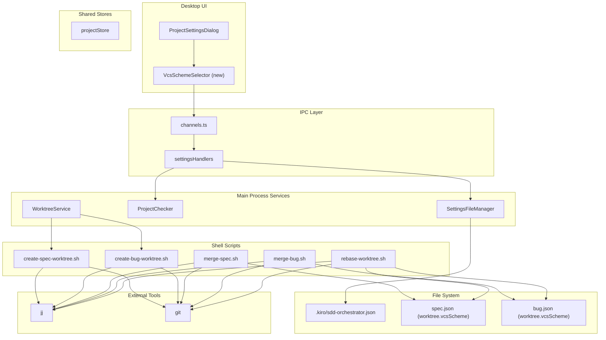
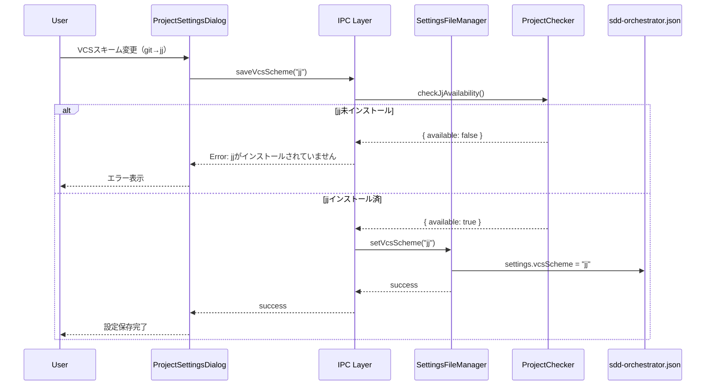
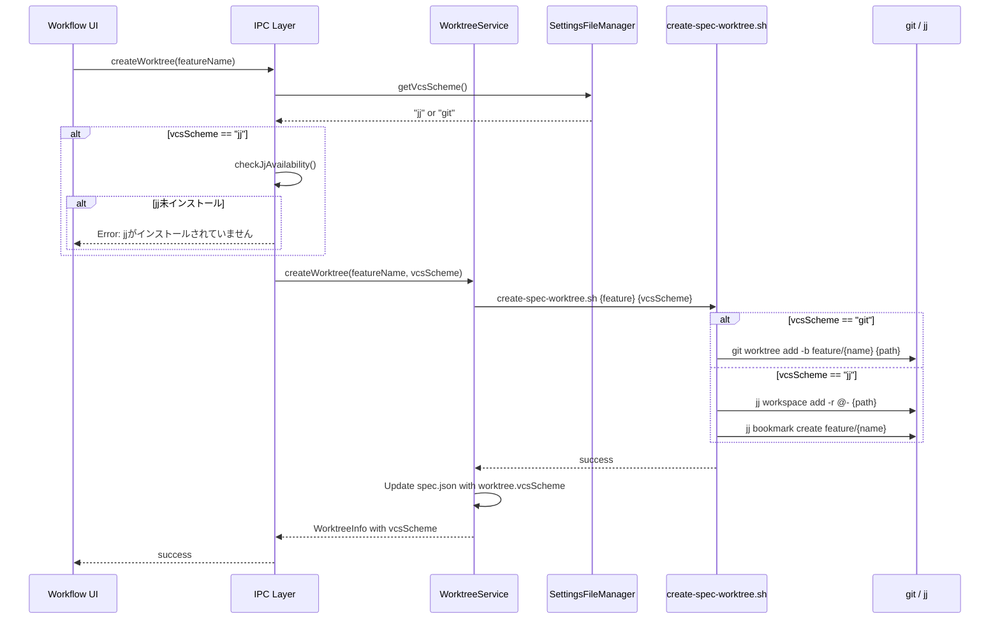
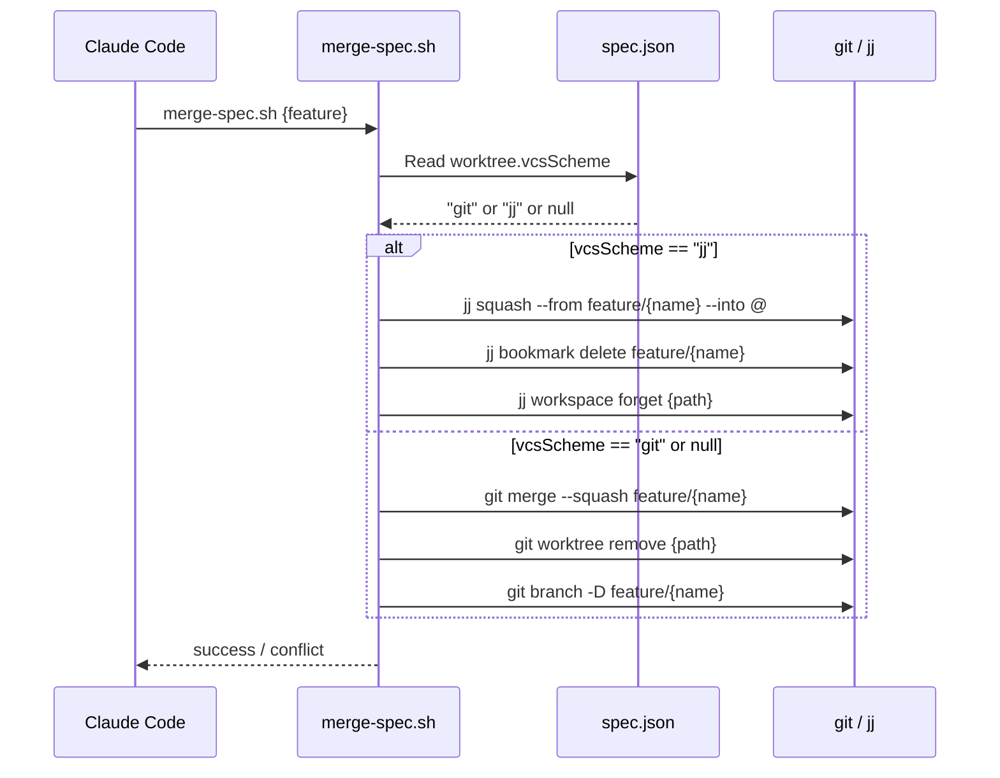
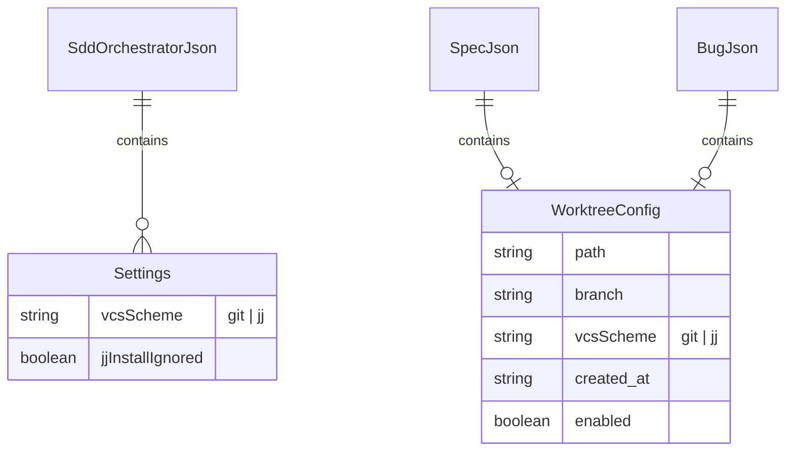

# Design: VCS Scheme Switching

## Overview

この機能は、worktree操作で使用するVCS（git/jj）をプロジェクト設定で明示的に選択可能にする。現在の「jj優先・gitフォールバック」方式を廃止し、プロジェクト設定で選択したスキームを一貫して使用する。spec.jsonにworktree作成時のVCSスキームを記録し、merge/rebase等の後続操作は記録されたスキームに従って実行する。

**Purpose**: VCSスキームの明示的な選択により、意図しない動作を防ぎ、ワークフローの一貫性を確保する。

**Users**: SDD Orchestratorを使用する開発者が、プロジェクトごとにgitまたはjjを選択できる。

**Impact**: 既存の自動判定ロジックを廃止し、設定ベースの明示的なスキーム選択に移行する。

### Goals

- プロジェクト設定画面でVCSスキーム（git/jj）を選択可能にする
- worktree作成時に選択されたスキームをspec.json/bug.jsonに記録する
- merge/rebaseスクリプトが記録されたスキームに従って動作する
- jj選択時にjjの存在を検証し、未インストールならエラーを表示する

### Non-Goals

- Spec個別でのVCSスキームオーバーライド
- Remote UIからのVCSスキーム設定変更
- git/jj以外のVCS対応
- 既存worktreeのVCSスキーム変換機能
- jj colocatedモード対応

## Architecture

### Existing Architecture Analysis

現在のworktree操作は以下の設計で動作している：

- **create-spec-worktree.sh / create-bug-worktree.sh**: `git worktree add`を直接使用
- **merge-spec.sh / merge-bug.sh**: `command -v jj`でjjの存在を確認し、jj優先・gitフォールバック方式で動作
- **rebase-worktree.sh**: 同様にjj優先・gitフォールバック方式
- **WorktreeService**: TypeScriptサービスで`git worktree`コマンドを実行

既存のjj-merge-support機能は、マージ時にjjを優先使用する自動判定ロジックを実装したが、本機能ではこれを明示的な設定ベースの選択に置き換える。

### Architecture Pattern & Boundary Map



**Architecture Integration**:
- Selected pattern: 既存のSettingsFileManager/ProjectCheckerパターンを拡張
- Domain boundaries: UI設定 → IPC → Service → Script → External Tools
- Existing patterns preserved: jj-merge-supportで導入されたProjectChecker.checkJjAvailability()
- New components rationale: VcsSchemeSelectorはSchemeSelector（ドキュメントレビュー用）と同じパターンで実装
- Steering compliance: SSOT原則に従い、sdd-orchestrator.jsonに設定を集約

### Technology Stack

| Layer | Choice / Version | Role in Feature | Notes |
|-------|------------------|-----------------|-------|
| Frontend | React 19, TypeScript 5.8+ | VcsSchemeSelector UI | ProjectSettingsDialogに統合 |
| Backend / Services | Node.js 20+, Electron 35 | 設定管理、jjチェック | SettingsFileManager拡張 |
| Data / Storage | `.kiro/sdd-orchestrator.json`, `spec.json` | vcsScheme設定の永続化 | 既存スキーマを拡張 |
| Scripts | Bash | worktree作成/merge/rebase | 引数でスキーム受け取り |

## System Flows

### VCSスキーム設定フロー



**Key Decisions**:
- jj選択時に即座にインストールチェックを実行し、未インストールなら設定変更を拒否
- 既存のcheckJjAvailability()を再利用（DRY原則）
- エラーメッセージは日本語で明確に表示

### Worktree作成フロー（VCSスキーム対応）



**Key Decisions**:
- worktree作成時にも再度jjインストールチェックを実行（設定後にjjがアンインストールされた可能性）
- spec.jsonのworktreeオブジェクトにvcsSchemeを記録し、後続操作で参照
- jjモードではworkspace addとbookmark createを組み合わせて使用

### Mergeフロー（スキーム記録参照）



**Key Decisions**:
- spec.jsonのworktree.vcsSchemeが存在しない場合は後方互換性のため"git"として扱う
- 「jj優先・gitフォールバック」ロジックを完全に削除し、記録されたスキームのみを使用
- jjモードではworkspace forget、bookmark delete、squashの順序で実行

## Requirements Traceability

| Criterion ID | Summary | Components | Implementation Approach |
|--------------|---------|------------|------------------------|
| 1.1 | settings.vcsSchemeフィールド追加 | SettingsFileManager | 既存メソッドを拡張 |
| 1.2 | デフォルト"git"として扱う | SettingsFileManager.getVcsScheme() | フォールバック値を返す |
| 1.3 | 設定画面にVCSスキーム選択UI追加 | VcsSchemeSelector, ProjectSettingsDialog | 新規コンポーネント作成 |
| 1.4 | 選択肢「Git」「Jujutsu (jj)」 | VcsSchemeSelector | ドロップダウンUI |
| 1.5 | 即座に保存 | ProjectSettingsDialog.handleSave() | 既存パターン踏襲 |
| 2.1 | jj変更時に存在確認 | ProjectChecker.checkJjAvailability() | 既存メソッド再利用 |
| 2.2 | 未インストールならエラー表示・拒否 | VcsSchemeSelector | UI側でエラー処理 |
| 2.3 | エラーメッセージ日本語 | VcsSchemeSelector | 固定文字列 |
| 2.4 | worktree作成時にも再確認 | worktreeHandlers | IPC層でチェック |
| 3.1 | spec.json worktree.vcsScheme追加 | WorktreeConfig型, fileService | 型定義拡張 |
| 3.2 | 存在しない場合"git"として扱う | hasWorktreePath(), merge-spec.sh | 後方互換性対応 |
| 3.3 | 設定変更しても既存specは変わらない | 設計原則 | spec.json記録が優先 |
| 4.1 | スクリプト引数でスキーム受け取り | create-spec-worktree.sh | 第2引数追加 |
| 4.2 | git時はgit worktree add | create-spec-worktree.sh | 既存ロジック維持 |
| 4.3 | jj時はjj workspace add + bookmark create | create-spec-worktree.sh | 新規ロジック追加 |
| 4.4 | jjモード操作コマンド | create-spec-worktree.sh | 要件通りのコマンド |
| 4.5 | パス構造はgit/jj共通 | create-spec-worktree.sh | .kiro/worktrees/specs/{name} |
| 4.6 | create-bug-worktree.shも対応 | create-bug-worktree.sh | 同様の変更 |
| 5.1 | merge-spec.shがvcsScheme読み取り | merge-spec.sh | jq使用 |
| 5.2 | 存在しない/"git"ならgitマージ | merge-spec.sh | 条件分岐 |
| 5.3 | "jj"ならjjマージ | merge-spec.sh | 条件分岐 |
| 5.4 | jjモードマージ操作 | merge-spec.sh | 要件通りのコマンド |
| 5.5 | merge-bug.shも対応 | merge-bug.sh | 同様の変更 |
| 5.6 | jj優先・gitフォールバック削除 | merge-spec.sh, merge-bug.sh | コード削除 |
| 6.1 | rebase-worktree.shがvcsScheme読み取り | rebase-worktree.sh | jq使用 |
| 6.2 | "git"ならgit rebase | rebase-worktree.sh | 条件分岐 |
| 6.3 | "jj"ならjj rebase | rebase-worktree.sh | 条件分岐 |
| 6.4 | jjモードrebase操作 | rebase-worktree.sh | jj rebase -d main |
| 7.1 | ドロップダウン追加 | VcsSchemeSelector | UI実装 |
| 7.2 | ラベル「Git」「Jujutsu (jj)」 | VcsSchemeSelector | 固定文字列 |
| 7.3 | 変更時jjチェック・エラー表示 | VcsSchemeSelector | UI側チェック |
| 7.4 | IPC経由でスキーム取得・スクリプトに渡す | worktreeHandlers | 既存フロー拡張 |
| 7.5 | Remote UIから非表示 | VcsSchemeSelector | PlatformProvider条件分岐 |

### Coverage Validation Checklist

- [x] Every criterion ID from requirements.md appears in the table above
- [x] Each criterion has specific component names (not generic references)
- [x] Implementation approach distinguishes "reuse existing" vs "new implementation"
- [x] User-facing criteria specify concrete UI components

## Components and Interfaces

| Component | Domain/Layer | Intent | Req Coverage | Key Dependencies | Contracts |
|-----------|--------------|--------|--------------|------------------|-----------|
| VcsSchemeSelector | UI | VCSスキーム選択ドロップダウン | 1.3, 1.4, 7.1, 7.2, 7.3 | ProjectChecker (P0) | State |
| SettingsFileManager | Service | vcsScheme設定の永続化 | 1.1, 1.2 | fs/promises (P0) | Service |
| ProjectChecker | Service | jjインストールチェック | 2.1, 2.2, 2.4 | child_process (P0) | Service |
| WorktreeConfig | Type | worktree.vcsSchemeフィールド追加 | 3.1, 3.2, 3.3 | - | - |
| create-spec-worktree.sh | Script | VCSスキーム対応worktree作成 | 4.1-4.5 | git, jj | - |
| create-bug-worktree.sh | Script | VCSスキーム対応worktree作成 | 4.6 | git, jj | - |
| merge-spec.sh | Script | スキーム記録参照マージ | 5.1-5.4, 5.6 | git, jj, jq | - |
| merge-bug.sh | Script | スキーム記録参照マージ | 5.5 | git, jj, jq | - |
| rebase-worktree.sh | Script | スキーム記録参照rebase | 6.1-6.4 | git, jj, jq | - |

### UI Layer

#### VcsSchemeSelector

| Field | Detail |
|-------|--------|
| Intent | プロジェクト設定画面でVCSスキームを選択するドロップダウン |
| Requirements | 1.3, 1.4, 7.1, 7.2, 7.3, 7.5 |

**Responsibilities & Constraints**
- VCSスキーム（git/jj）の選択UIを提供
- jj選択時にインストールチェックを実行
- Remote UIでは非表示（PlatformProvider.isDesktop条件）

**Dependencies**
- Inbound: ProjectSettingsDialog - 親コンポーネント (P0)
- Outbound: IPC - checkJjAvailability呼び出し (P0)
- External: なし

**Contracts**: State [x]

##### State Management

```typescript
interface VcsSchemeSelectorState {
  selectedScheme: VcsScheme;
  isChecking: boolean;
  error: string | null;
}
```

- State model: ローカルステート（useStateフック）
- Persistence: 親コンポーネント経由でsdd-orchestrator.jsonに保存
- Concurrency: 単一ユーザー操作のため考慮不要

**Implementation Notes**
- Integration: ProjectSettingsDialogの既存セクション構造に準拠
- Validation: jj選択時にIPCでcheckJjAvailability()を呼び出し
- Risks: なし

### Service Layer

#### SettingsFileManager（拡張）

| Field | Detail |
|-------|--------|
| Intent | sdd-orchestrator.jsonのvcsScheme設定を読み書き |
| Requirements | 1.1, 1.2 |

**Responsibilities & Constraints**
- settings.vcsSchemeフィールドのCRUD
- 存在しない場合は"git"をデフォルトとして返す

**Dependencies**
- Inbound: IPCハンドラ - 設定操作リクエスト (P0)
- Outbound: fs/promises - ファイル読み書き (P0)
- External: なし

**Contracts**: Service [x]

##### Service Interface

```typescript
type VcsScheme = 'git' | 'jj';

interface SettingsFileManager {
  // 既存メソッド省略...

  /**
   * Get VCS scheme setting
   * @returns VcsScheme - "git" or "jj" (defaults to "git" if not set)
   */
  getVcsScheme(projectPath: string): Promise<Result<VcsScheme, MergeError>>;

  /**
   * Set VCS scheme setting
   * @param scheme - "git" or "jj"
   */
  setVcsScheme(projectPath: string, scheme: VcsScheme): Promise<Result<void, MergeError>>;
}
```

- Preconditions: projectPathが有効なプロジェクトディレクトリであること
- Postconditions: sdd-orchestrator.jsonのsettings.vcsSchemeが更新される
- Invariants: vcsSchemeは常に"git"または"jj"の値を持つ

### Type Definitions

#### WorktreeConfig（拡張）

```typescript
/**
 * Worktree configuration stored in spec.json / bug.json
 * Requirements: 3.1, 3.2, 3.3
 */
export interface WorktreeConfig {
  /** Relative path from main project root to worktree directory */
  path?: string;
  /** Branch name (feature/{feature-name} or bugfix/{bug-name}) */
  branch?: string;
  /** Creation timestamp (ISO-8601) */
  created_at?: string;
  /** Worktree mode selection state */
  enabled?: boolean;
  /** VCS scheme used for this worktree (new field) */
  vcsScheme?: VcsScheme;
}
```

## Data Models

### Domain Model

**VcsScheme**: 値オブジェクト
- 取りうる値: `"git"` | `"jj"`
- 制約: これ以外の値は無効

**sdd-orchestrator.json settings拡張**:
```json
{
  "settings": {
    "vcsScheme": "git",
    "jjInstallIgnored": false
  }
}
```

**spec.json/bug.json worktree拡張**:
```json
{
  "worktree": {
    "path": ".kiro/worktrees/specs/{feature}",
    "branch": "feature/{feature}",
    "vcsScheme": "git",
    "created_at": "2026-02-05T10:00:00Z",
    "enabled": true
  }
}
```

### Logical Data Model



- **SSOT**: プロジェクトデフォルトはsdd-orchestrator.json、各Spec/BugのスキームはそれぞれのJSONファイルに記録
- **後方互換性**: vcsSchemeが存在しない場合は"git"として扱う

## Error Handling

### Error Categories and Responses

**User Errors (4xx equivalent)**:
- jj未インストール時の設定変更試行 → 日本語エラーメッセージ表示、設定変更拒否

**System Errors (5xx equivalent)**:
- sdd-orchestrator.jsonの読み書き失敗 → 既存エラーハンドリングパターン適用
- jj/gitコマンド実行失敗 → スクリプトexit code 2、エラーメッセージ出力

### Error Messages

| Error Case | Message (Japanese) |
|------------|-------------------|
| jj未インストール（設定変更時） | jjがインストールされていません。インストール後に再度お試しください。 |
| jj未インストール（worktree作成時） | jjがインストールされていません。設定を「Git」に変更するか、jjをインストールしてください。 |
| スクリプト実行エラー | VCS操作に失敗しました: {詳細メッセージ} |

### jj操作のロールバック戦略

jjモードでのworktree作成は以下の2ステップで実行される：

1. `jj workspace add -r @- {path}` - ワークスペース作成
2. `jj bookmark create feature/{name}` - ブックマーク作成

**エラー発生時の復旧手順**:

| 失敗箇所 | 状態 | 復旧アクション |
|----------|------|---------------|
| ステップ1失敗 | ワークスペース未作成 | 復旧不要（クリーンな状態） |
| ステップ2失敗 | ワークスペース作成済み、ブックマークなし | `jj workspace forget {path}` を実行してワークスペースを削除 |

**実装方針**:

```bash
# create-spec-worktree.sh (jjモード)
if ! jj workspace add -r @- "$WORKTREE_PATH"; then
  echo "Error: Failed to create jj workspace" >&2
  exit 1
fi

if ! jj bookmark create "$BRANCH_NAME"; then
  echo "Error: Failed to create jj bookmark. Rolling back workspace..." >&2
  jj workspace forget "$WORKTREE_PATH" || true
  exit 1
fi
```

**Merge/Rebase時のエラー**:
- merge/rebase操作はアトミックではないため、部分的な失敗状態が発生しうる
- jj squash/rebaseの失敗時はexit code 1または2で終了し、ユーザーに手動復旧を促す
- 自動ロールバックは行わない（jjの操作履歴機能で手動復旧可能）

## Testing Strategy

### Unit Tests
- SettingsFileManager.getVcsScheme(): デフォルト値、保存値の読み取り
- SettingsFileManager.setVcsScheme(): 有効値、無効値の処理
- WorktreeConfig型ガード: vcsSchemeフィールドの検証

### Integration Tests
- VcsSchemeSelector + IPC + SettingsFileManager: 設定保存フロー
- worktreeHandlers + SettingsFileManager + Script: worktree作成フロー
- jjインストールチェック + 設定変更拒否フロー

### E2E Tests
- プロジェクト設定画面でのVCSスキーム変更
- VCSスキーム設定後のworktree作成確認

### Script Tests
- create-spec-worktree.sh: git/jj両モードでの正常動作
- merge-spec.sh: spec.jsonからのvcsScheme読み取りと適切なコマンド実行
- rebase-worktree.sh: vcsSchemeに応じたrebase実行

## Verification Contract

### User Journey Definition

| Journey ID | Operation Flow | Expected Result | E2E Required |
|------------|---------------|-----------------|--------------|
| UJ-001 | プロジェクト設定画面でVCSスキームをjjに変更 | sdd-orchestrator.jsonにvcsScheme: "jj"が保存される | Yes |
| UJ-002 | jj未インストール時にjjを選択 | エラーメッセージが表示され設定は変更されない | Yes |
| UJ-003 | jjモードでworktree作成 | jj workspace add + bookmark createが実行される | No (統合テスト) |
| UJ-004 | jjモードでspec merge実行 | jj squash + bookmark delete + workspace forgetが実行される | No (統合テスト) |

### Impact Analysis Contract

| Target File | Action | Reason |
|-------------|--------|--------|
| electron-sdd-manager/src/renderer/components/ProjectSettingsDialog.tsx | UPDATE | VcsSchemeSelectorを追加 |
| electron-sdd-manager/src/renderer/components/VcsSchemeSelector.tsx | CREATE | 新規UIコンポーネント |
| electron-sdd-manager/src/main/services/settingsFileManager.ts | UPDATE | getVcsScheme/setVcsScheme追加 |
| electron-sdd-manager/src/main/ipc/channels.ts | UPDATE | VCS_SCHEME_GET/SET チャンネル追加 |
| electron-sdd-manager/src/main/ipc/handlers.ts | UPDATE | vcsScheme IPC ハンドラ追加 |
| electron-sdd-manager/src/preload/index.ts | UPDATE | vcsScheme API追加 |
| electron-sdd-manager/src/shared/types/worktree.ts | UPDATE | WorktreeConfig.vcsScheme追加 |
| .kiro/scripts/create-spec-worktree.sh | UPDATE | VCSスキーム引数対応 |
| .kiro/scripts/create-bug-worktree.sh | UPDATE | VCSスキーム引数対応 |
| .kiro/scripts/merge-spec.sh | UPDATE | vcsScheme読み取り、jj優先ロジック削除 |
| .kiro/scripts/merge-bug.sh | UPDATE | vcsScheme読み取り、jj優先ロジック削除 |
| .kiro/scripts/rebase-worktree.sh | UPDATE | vcsScheme読み取り、jj優先ロジック削除 |
| electron-sdd-manager/resources/templates/scripts/* | UPDATE | 上記スクリプトのテンプレート版 |

### Integration Test Strategy

**Components**: WorktreeService, SettingsFileManager, Shell Scripts

**Data Flow**: UI設定 → IPC → Service → Script → VCS Command

**Mock Boundaries**:
- Mock: child_process.exec（VCSコマンド実行）
- Real: SettingsFileManager（ファイル読み書きはテスト用tmpディレクトリ）
- Real: spec.json/bug.json更新

**Verification Points**:
- sdd-orchestrator.json settings.vcsSchemeの値
- spec.json worktree.vcsSchemeの値
- スクリプトに渡される引数

**Robustness Strategy**:
- ファイル操作は同期的に完了を確認
- スクリプト実行はexit codeで成否判定

**Prerequisites**:
- テスト用Gitリポジトリのセットアップヘルパー（既存）
- jjコマンドのモック（統合テスト時）

## Design Decisions

### DD-001: スキーム選択単位をプロジェクトレベルに限定

| Field | Detail |
|-------|--------|
| Status | Accepted |
| Context | VCSスキームをSpec単位で選択可能にするか、プロジェクト単位に限定するか |
| Decision | プロジェクト設定でデフォルトを設定し、worktree作成時にspec.jsonへ記録する |
| Rationale | worktree操作時のみ影響があるため、worktree化タイミングで確定すれば十分。Spec単位のオーバーライドは複雑さを増すだけで実用的なユースケースが限定的 |
| Alternatives Considered | (1) Spec単位オーバーライド：UI/ロジック複雑化、混乱の元 (2) アプリ全体設定：プロジェクト間で使い分けたいケースに対応できない |
| Consequences | シンプルな設定モデル、ただしプロジェクト内で混在させたい場合は対応不可 |

### DD-002: jj優先・gitフォールバックロジックの完全削除

| Field | Detail |
|-------|--------|
| Status | Accepted |
| Context | 現在のmerge-spec.sh等は`command -v jj`でjjを検出し自動的に優先使用する |
| Decision | この自動判定ロジックを完全に削除し、spec.jsonに記録されたvcsSchemeのみを参照する |
| Rationale | 意図しない動作を防ぐ。jjがインストールされていても、ユーザーがgitを選択した場合はgitを使用すべき |
| Alternatives Considered | (1) フォールバック維持：設定と実際の動作が乖離する可能性 (2) 設定がない場合のみフォールバック：後方互換性は維持できるが中途半端 |
| Consequences | 明示的で予測可能な動作、ただし既存worktreeはvcsScheme未設定のためgitとして扱われる |

### DD-003: jj未インストール時のエラー処理

| Field | Detail |
|-------|--------|
| Status | Accepted |
| Context | jjを選択したがjjがインストールされていない場合の挙動 |
| Decision | エラーを表示し処理を中断する。フォールバックしない |
| Rationale | 意図しない動作を防ぐ。ユーザーが明示的にjjを選択した以上、gitへの暗黙のフォールバックは期待に反する |
| Alternatives Considered | (1) gitへフォールバック：ユーザーの意図に反する (2) 選択肢を非表示：jjを後からインストールした場合に対応できない |
| Consequences | エラー時にユーザーアクションが必要、ただし明確なエラーメッセージで対応方法を案内 |

### DD-004: Remote UIからのVCSスキーム設定非表示

| Field | Detail |
|-------|--------|
| Status | Accepted |
| Context | Remote UIから設定変更を許可するか |
| Decision | VCSスキーム設定UIはDesktop UI専用とし、Remote UIでは非表示 |
| Rationale | 設定変更はDesktop UIから行う運用を想定。Remote UIは監視・軽量操作向け |
| Alternatives Considered | Remote UIでも設定変更可能：運用ポリシーの複雑化 |
| Consequences | 一貫した運用ポリシー、ただしRemote UIのみの環境では設定変更不可 |

## Interface Changes & Impact Analysis

### New IPC Channels

```typescript
// channels.ts に追加
VCS_SCHEME_GET: 'settings:vcs-scheme:get',
VCS_SCHEME_SET: 'settings:vcs-scheme:set',
```

### Preload API Changes

```typescript
// preload/index.ts に追加
getVcsScheme: () => Promise<VcsScheme>,
setVcsScheme: (scheme: VcsScheme) => Promise<void>,
```

### Affected Callers

| Caller | Change Required | Impact |
|--------|-----------------|--------|
| worktreeHandlers.handleWorktreeCreate | VCSスキーム取得を追加 | Medium - 引数追加 |
| bugWorktreeHandlers.handleBugWorktreeCreate | VCSスキーム取得を追加 | Medium - 引数追加 |
| convertWorktreeService | VCSスキーム取得を追加 | Medium - 引数追加 |
| ProjectSettingsDialog | VcsSchemeSelectorを追加 | Low - UI追加のみ |
