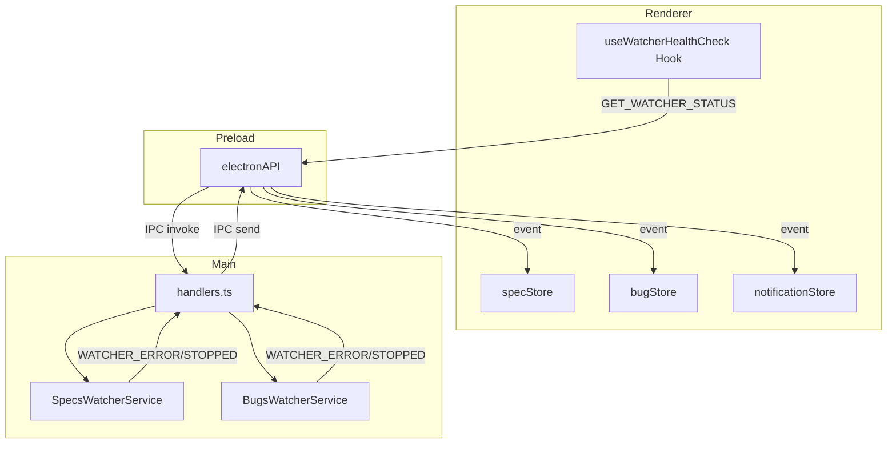
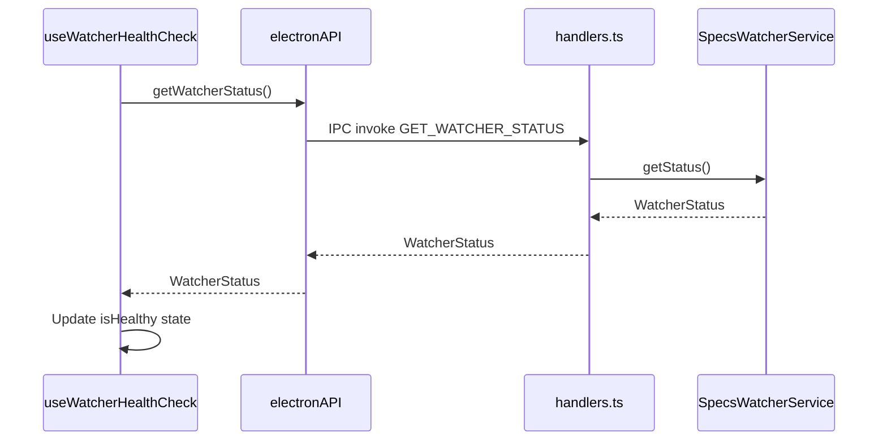
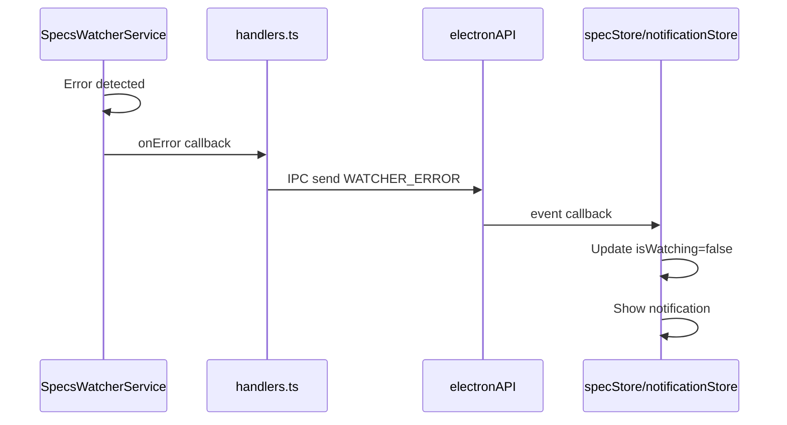

# Design Document

## Overview

**Purpose**: 本機能は、HMR（Hot Module Replacement）時にファイル監視が停止してもフロントエンドから検出できない問題を解決し、開発者に対してwatcher状態の可視性と信頼性を提供する。

**Users**: SDD Orchestratorの開発者がこの機能を使用し、HMR発生後のwatcher健全性を確認し、問題発生時に迅速に対応できるようになる。

**Impact**: 現在のwatcherサービス（SpecsWatcherService, BugsWatcherService等）にプッシュ通知機能と状態確認APIを追加し、フロントエンドに新規hookを導入する。

### Goals

- レンダラープロセスからwatcherの実際の状態を確認できるAPIを提供
- HMR発生後も継続してwatcher状態を監視できるヘルスチェック機構を実装
- watcherエラー時にフロントエンドへプッシュ通知を送信
- isWatching stateとwatcher実際の状態を自動同期

### Non-Goals

- 複数プロジェクト同時監視の対応
- watcherの自動再起動（通知に再起動オプションを含めるのみ）
- BugsWatcherService以外のwatcher（AgentRecordWatcherService等）への拡張は将来対応

## Architecture

### Existing Architecture Analysis

現在のwatcherアーキテクチャ:
- **SpecsWatcherService**: `.kiro/specs`ディレクトリを監視、chokidarベース
- **BugsWatcherService**: `.kiro/bugs`ディレクトリを監視、同様のパターン
- **handlers.ts**: watcher開始/停止のIPCハンドラ、`startSpecsWatcher()`/`stopSpecsWatcher()`
- **specStore.ts/bugStore.ts**: `isWatching` stateを管理、IPCイベントをsubscribe

**課題**:
- watcher状態確認は`isRunning()`メソッドがあるがIPCで公開されていない
- エラー発生時のレンダラーへの通知機構がない
- HMR発生時にIPCリスナーが喪失し、イベントが届かなくなる

### Architecture Pattern & Boundary Map



**Architecture Integration**:
- Selected pattern: 既存のIPC/Watcher拡張パターン
- Domain boundaries: Main Process (Watcher管理) / Renderer (状態表示・通知)
- Existing patterns preserved: chokidar watcherパターン、Zustand store pattern、IPC channels pattern
- New components rationale: useWatcherHealthCheckは定期的なポーリングとHMR対応を担当
- Steering compliance: IPC設計パターン（channels.ts定義、preload公開）に準拠

### Technology Stack

| Layer | Choice / Version | Role in Feature | Notes |
|-------|------------------|-----------------|-------|
| Frontend | React 19 + Zustand | 状態管理、ヘルスチェックHook | 既存パターン継続 |
| IPC | Electron IPC | 状態確認API、イベント通知 | channels.ts拡張 |
| Backend | Node.js + chokidar | Watcher状態管理、エラー検出 | 既存サービス拡張 |

## System Flows

### Watcher状態確認フロー



### Watcherエラー通知フロー



## Requirements Traceability

| Requirement | Summary | Components | Interfaces | Flows |
|-------------|---------|------------|------------|-------|
| 1.1 | GET_WATCHER_STATUS IPCで状態返却 | SpecsWatcherService, handlers.ts | WatcherStatusService | 状態確認フロー |
| 1.2 | アクティブ時isWatching=true | SpecsWatcherService | getStatus() | 状態確認フロー |
| 1.3 | 停止時isWatching=false | SpecsWatcherService | getStatus() | 状態確認フロー |
| 1.4 | channels.tsに型安全定義 | channels.ts | IPC_CHANNELS | - |
| 1.5 | レスポンス型定義 | types/ | WatcherStatus | - |
| 2.1 | 定期的なヘルスチェック | useWatcherHealthCheck | - | - |
| 2.2 | HMR後も継続 | useWatcherHealthCheck | - | - |
| 2.3 | 停止検出でisHealthy=false | useWatcherHealthCheck | - | - |
| 2.4 | 正常時isHealthy=true | useWatcherHealthCheck | - | - |
| 2.5 | 間隔設定オプション | useWatcherHealthCheck | options.interval | - |
| 2.6 | 最後のチェック時刻追跡 | useWatcherHealthCheck | lastCheckedAt | - |
| 3.1 | WATCHER_ERRORイベント送信 | SpecsWatcherService, handlers.ts | - | エラー通知フロー |
| 3.2 | エラー通知表示 | notificationStore | - | エラー通知フロー |
| 3.3 | WATCHER_STOPPEDイベント送信 | SpecsWatcherService, handlers.ts | - | エラー通知フロー |
| 3.4 | IPC型安全定義 | channels.ts | IPC_CHANNELS | - |
| 3.5 | 再起動オプション含む | notificationStore | - | - |
| 4.1 | WATCHER_STARTED送信 | SpecsWatcherService, handlers.ts | - | - |
| 4.2 | WATCHER_STOPPED送信 | SpecsWatcherService, handlers.ts | - | - |
| 4.3 | STARTED受信でisWatching=true | specStore, bugStore | - | - |
| 4.4 | STOPPED受信でisWatching=false | specStore, bugStore | - | - |
| 4.5 | エラー時isWatching=false | specStore, bugStore | - | - |
| 4.6 | HMR後リスナー再登録 | useWatcherHealthCheck | - | - |
| 5.1 | 状態変化履歴ログ | SpecsWatcherService | logger | - |
| 5.2 | エラー情報含む | WatcherStatus | lastError | - |
| 5.3 | デバッグモードオプション | useWatcherHealthCheck | options.debug | - |
| 5.4 | HMR検出ログ | useWatcherHealthCheck | - | - |

## Components and Interfaces

| Component | Domain/Layer | Intent | Req Coverage | Key Dependencies | Contracts |
|-----------|--------------|--------|--------------|-----------------|-----------|
| SpecsWatcherService | Main/Service | Specs監視とエラー通知 | 1.1-1.3, 3.1, 3.3, 4.1, 4.2, 5.1 | chokidar (P0), logger (P1) | Service |
| BugsWatcherService | Main/Service | Bugs監視とエラー通知 | 1.1-1.3, 3.1, 3.3, 4.1, 4.2, 5.1 | chokidar (P0), logger (P1) | Service |
| handlers.ts | Main/IPC | IPC処理、イベント転送 | 1.1, 1.4, 3.4 | WatcherServices (P0), BrowserWindow (P0) | Service, Event |
| channels.ts | Shared/IPC | IPCチャンネル定義 | 1.4, 3.4 | - | - |
| types/watcher.ts | Shared/Types | Watcher型定義 | 1.5, 5.2 | - | - |
| preload/index.ts | Preload | Renderer API公開 | 1.4 | ipcRenderer (P0) | API |
| useWatcherHealthCheck | Renderer/Hook | ヘルスチェック実行（App.tsx内でマウント） | 2.1-2.6, 4.6, 5.3, 5.4 | electronAPI (P0), specStore (P1) | State |
| specStore | Renderer/Store | Specs状態管理 | 4.3-4.5 | electronAPI (P0) | State |
| bugStore | Renderer/Store | Bugs状態管理 | 4.3-4.5 | electronAPI (P0) | State |
| notificationStore | Renderer/Store | 通知表示 | 3.2, 3.5 | - | State |

### Main/Service Layer

#### SpecsWatcherService (拡張)

| Field | Detail |
|-------|--------|
| Intent | Specs監視状態の提供とエラー・状態変化イベントの発火 |
| Requirements | 1.1, 1.2, 1.3, 3.1, 3.3, 4.1, 4.2, 5.1 |

**Responsibilities & Constraints**
- watcher状態（isWatching, watchedPath, lastEventTime, lastError）を提供
- エラー発生時・停止時にコールバックを呼び出し
- 状態変化をloggerで記録

**Dependencies**
- External: chokidar - ファイルシステム監視 (P0)
- External: logger - ログ記録 (P1)

**Contracts**: Service [x] / API [ ] / Event [x] / Batch [ ] / State [ ]

##### Service Interface

```typescript
interface WatcherStatus {
  readonly isWatching: boolean;
  readonly watchedPath: string | null;
  readonly lastEventTime: string | null;
  readonly lastError: WatcherError | null;
}

interface WatcherError {
  readonly code: string;
  readonly message: string;
  readonly timestamp: string;
}

interface SpecsWatcherService {
  // Existing methods
  start(): void;
  stop(): Promise<void>;
  isRunning(): boolean;
  onChange(callback: SpecsChangeCallback): void;

  // New methods for health check
  getStatus(): WatcherStatus;
  onError(callback: (error: WatcherError) => void): void;
  onStatusChange(callback: (status: 'started' | 'stopped') => void): void;
}
```

- Preconditions: `start()`呼び出し前に`projectPath`が設定されている
- Postconditions: `getStatus()`は常に有効なWatcherStatusを返す
- Invariants: `isRunning()`と`getStatus().isWatching`は一致する

##### Event Contract

- Published events:
  - `onError(WatcherError)`: watcher内部エラー発生時
  - `onStatusChange('started' | 'stopped')`: watcher状態変化時
- Ordering / delivery guarantees: コールバックは同期的に呼び出される

**Implementation Notes**
- Integration: chokidarの`error`イベントを捕捉し、`onError`コールバックを呼び出す
- Validation: エラーオブジェクトは必ずcode, message, timestampを含む
- Risks: chokidarのエラーイベントが発火しないケースがある可能性

#### BugsWatcherService (拡張)

SpecsWatcherServiceと同様のインターフェース拡張を適用。

### Main/IPC Layer

#### handlers.ts (拡張)

| Field | Detail |
|-------|--------|
| Intent | GET_WATCHER_STATUS IPCハンドラ追加、エラー/状態イベント転送 |
| Requirements | 1.1, 1.4, 3.4, 4.1, 4.2 |

**Responsibilities & Constraints**
- `GET_WATCHER_STATUS` IPCハンドラでwatcher状態を返却
- watcherのonError/onStatusChangeコールバックをIPCイベントとして転送

**Dependencies**
- Inbound: ipcMain - IPC受信 (P0)
- Outbound: SpecsWatcherService - 状態取得 (P0)
- Outbound: BrowserWindow - イベント送信 (P0)

**Contracts**: Service [x] / API [ ] / Event [x] / Batch [ ] / State [ ]

##### Service Interface

```typescript
// New IPC handler registration
ipcMain.handle(IPC_CHANNELS.GET_WATCHER_STATUS, async () => {
  const specsStatus = specsWatcherService?.getStatus() ?? defaultStatus;
  const bugsStatus = bugsWatcherService?.getStatus() ?? defaultStatus;
  return { specs: specsStatus, bugs: bugsStatus };
});
```

##### Event Contract

- Published events (via IPC send):
  - `WATCHER_STARTED`: watcher開始時、`{ type: 'specs' | 'bugs' }`
  - `WATCHER_STOPPED`: watcher停止時、`{ type: 'specs' | 'bugs', reason?: string }`
  - `WATCHER_ERROR`: エラー発生時、`{ type: 'specs' | 'bugs', error: WatcherError }`

**Implementation Notes**
- Integration: `startSpecsWatcher()`内でonError/onStatusChangeコールバックを登録
- Risks: windowが破棄された後のイベント送信でエラー発生（既存パターンでガード済み）

### Shared/IPC Layer

#### channels.ts (拡張)

```typescript
export const IPC_CHANNELS = {
  // ... existing channels

  // Watcher Health Check (watcher-hmr-health-check feature)
  GET_WATCHER_STATUS: 'ipc:get-watcher-status',
  WATCHER_STARTED: 'ipc:watcher-started',
  WATCHER_STOPPED: 'ipc:watcher-stopped',
  WATCHER_ERROR: 'ipc:watcher-error',
} as const;
```

### Shared/Types Layer

#### types/watcher.ts (新規)

```typescript
/**
 * Watcher status for health check
 * Requirements: 1.5, 5.2
 */
export interface WatcherStatus {
  readonly isWatching: boolean;
  readonly watchedPath: string | null;
  readonly lastEventTime: string | null;
  readonly lastError: WatcherError | null;
}

export interface WatcherError {
  readonly code: string;
  readonly message: string;
  readonly timestamp: string;
}

export interface WatcherStatusResult {
  readonly specs: WatcherStatus;
  readonly bugs: WatcherStatus;
}

export interface WatcherStartedEvent {
  readonly type: 'specs' | 'bugs';
}

export interface WatcherStoppedEvent {
  readonly type: 'specs' | 'bugs';
  readonly reason?: string;
}

export interface WatcherErrorEvent {
  readonly type: 'specs' | 'bugs';
  readonly error: WatcherError;
}
```

### Preload Layer

#### preload/index.ts (拡張)

```typescript
const electronAPI = {
  // ... existing methods

  // Watcher Health Check (watcher-hmr-health-check feature)
  getWatcherStatus: (): Promise<WatcherStatusResult> =>
    ipcRenderer.invoke(IPC_CHANNELS.GET_WATCHER_STATUS),

  onWatcherStarted: (callback: (event: WatcherStartedEvent) => void): (() => void) => {
    const handler = (_event: Electron.IpcRendererEvent, data: WatcherStartedEvent) => {
      callback(data);
    };
    ipcRenderer.on(IPC_CHANNELS.WATCHER_STARTED, handler);
    return () => ipcRenderer.removeListener(IPC_CHANNELS.WATCHER_STARTED, handler);
  },

  onWatcherStopped: (callback: (event: WatcherStoppedEvent) => void): (() => void) => {
    // Similar pattern
  },

  onWatcherError: (callback: (event: WatcherErrorEvent) => void): (() => void) => {
    // Similar pattern
  },
};
```

### Renderer/Hook Layer

#### useWatcherHealthCheck (新規)

| Field | Detail |
|-------|--------|
| Intent | HMR対応のwatcher状態定期監視 |
| Requirements | 2.1, 2.2, 2.3, 2.4, 2.5, 2.6, 4.6, 5.3, 5.4 |

**Responsibilities & Constraints**
- 定期的にGET_WATCHER_STATUS IPCを呼び出し
- HMR発生時にIPCリスナーを再登録
- isHealthy状態を提供

**Dependencies**
- Outbound: electronAPI - IPC呼び出し (P0)
- Outbound: specStore/bugStore - isWatching同期 (P1)

**Contracts**: Service [ ] / API [ ] / Event [ ] / Batch [ ] / State [x]

##### State Management

```typescript
interface WatcherHealthCheckOptions {
  /** ヘルスチェック間隔（ms）。デフォルト: 5000 */
  interval?: number;
  /** デバッグモード。trueの場合、コンソールにログ出力 */
  debug?: boolean;
  /** 対象watcher。デフォルト: 'all' */
  target?: 'specs' | 'bugs' | 'all';
}

interface WatcherHealthCheckState {
  /** specs watcherの健全性 */
  isSpecsHealthy: boolean;
  /** bugs watcherの健全性 */
  isBugsHealthy: boolean;
  /** 最後のヘルスチェック時刻 */
  lastCheckedAt: Date | null;
  /** 最後のエラー */
  lastError: WatcherError | null;
}

interface WatcherHealthCheckActions {
  /** 即座にヘルスチェックを実行 */
  checkNow: () => Promise<void>;
  /** ヘルスチェックを一時停止 */
  pause: () => void;
  /** ヘルスチェックを再開 */
  resume: () => void;
}

type UseWatcherHealthCheckReturn = WatcherHealthCheckState & WatcherHealthCheckActions;

function useWatcherHealthCheck(options?: WatcherHealthCheckOptions): UseWatcherHealthCheckReturn;
```

- State model: React useStateとuseEffectで状態管理
- Persistence: なし（メモリ内のみ）
- Concurrency: 複数インスタンス間で独立動作

**Implementation Notes**
- Integration: App.tsx内でuseEffect経由でマウント（useRefで二重実行防止、既存のイベントリスナーパターンに準拠）
- Validation: interval値が100ms未満の場合は100msにクランプ
- HMR対応: import.meta.hot APIを使用（型定義: vite/client）
- Risks: HMR時の古いインターバルが残る可能性（cleanupで対応）

### Renderer/Store Layer

#### specStore (拡張)

**追加する状態と処理**:
- `onWatcherStarted`/`onWatcherStopped`イベントリスナーをセットアップで登録
- イベント受信時に`isWatching`を更新
- HMR対応: import.meta.hot API（Vite HMR）でリスナー再登録（型定義: vite/client）

```typescript
// specStore extension
interface SpecState {
  // ... existing fields
  watcherError: WatcherError | null;
}

interface SpecActions {
  // ... existing methods
  setupWatcherEventListeners: () => (() => void);
}
```

#### bugStore (拡張)

specStoreと同様のパターンで拡張。

#### notificationStore (利用)

既存の`addNotification`メソッドを使用してエラー通知を表示。

## Data Models

### Domain Model

本機能は新規データ永続化を必要としない。状態はメモリ内で管理。

**エンティティ**:
- WatcherStatus: watcher状態のスナップショット（値オブジェクト）
- WatcherError: エラー情報（値オブジェクト）

**ドメインイベント**:
- WatcherStarted: watcher開始
- WatcherStopped: watcher停止
- WatcherErrorOccurred: エラー発生

## Error Handling

### Error Strategy

エラー発生時の挙動:
1. SpecsWatcherService/BugsWatcherServiceでchokidarエラーを捕捉
2. WatcherErrorオブジェクトを生成
3. onErrorコールバック経由でhandlers.tsに通知
4. handlers.tsがIPC経由でレンダラーに通知
5. specStore/bugStoreがisWatching=falseに更新
6. notificationStoreがエラー通知を表示

### Error Categories and Responses

**System Errors**:
- chokidarエラー: watcherをfalse状態に、再起動オプションを含む通知を表示
- IPCエラー: ヘルスチェックがタイムアウト、次回リトライ

### Error Recovery Strategy

Watcherエラー発生後の再起動手順:

1. **停止**: 現在のwatcherインスタンスを`stop()`で完全に停止
2. **エラークリア**: `lastError`状態をクリア
3. **状態リセット**: `isWatching`をfalseに設定
4. **パス再設定**: 監視対象パス（`.kiro/specs`または`.kiro/bugs`）を再確認
5. **再開始**: `start()`で新しいwatcherインスタンスを作成
6. **成功通知**: WATCHER_STARTEDイベントを送信

```typescript
// 再起動シーケンス例
async function restartWatcher(watcherService: SpecsWatcherService): Promise<void> {
  await watcherService.stop();           // 1. 停止
  watcherService.clearError();           // 2. エラークリア（新規メソッド）
  // 3, 4は stop() 内で処理済み
  watcherService.start();                // 5. 再開始
  // 6. 成功時はonStatusChangeで'started'が発火
}
```

### Monitoring

- logger.error: watcherエラー発生時に詳細をログ出力
- logger.info: 状態変化（started/stopped）をログ出力
- debugオプション: フロントエンドでヘルスチェック結果をconsole.log

## Testing Strategy

### Unit Tests

- SpecsWatcherService.getStatus(): 正常状態、停止状態、エラー状態の返却値
- SpecsWatcherService.onError(): エラーコールバック呼び出し
- useWatcherHealthCheck: インターバル設定、状態更新、HMR対応

### Integration Tests

- handlers.ts GET_WATCHER_STATUS: IPC経由での状態取得
- WATCHER_ERROR イベント伝播: main -> preload -> renderer
- specStore/bugStore: イベント受信でのisWatching更新

### E2E Tests (if applicable)

- watcher起動確認: プロジェクト選択後にwatcher状態がhealthyになる
- エラー通知確認: watcherエラー時に通知が表示される

## Optional Sections

### Performance & Scalability

- ヘルスチェックのデフォルト間隔は5秒（過度な負荷を避ける）
- 最小間隔は100ms（DoS防止）
- IPCオーバーヘッドは最小（単純なオブジェクト返却のみ）
