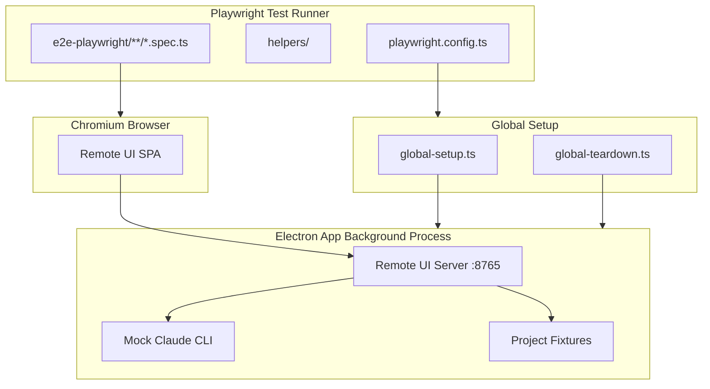
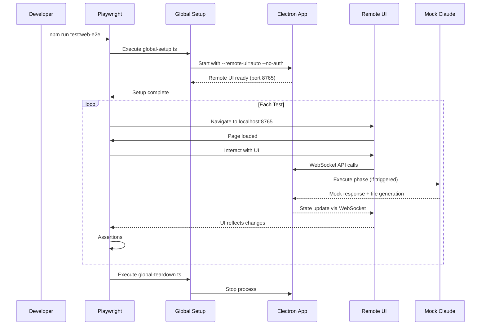
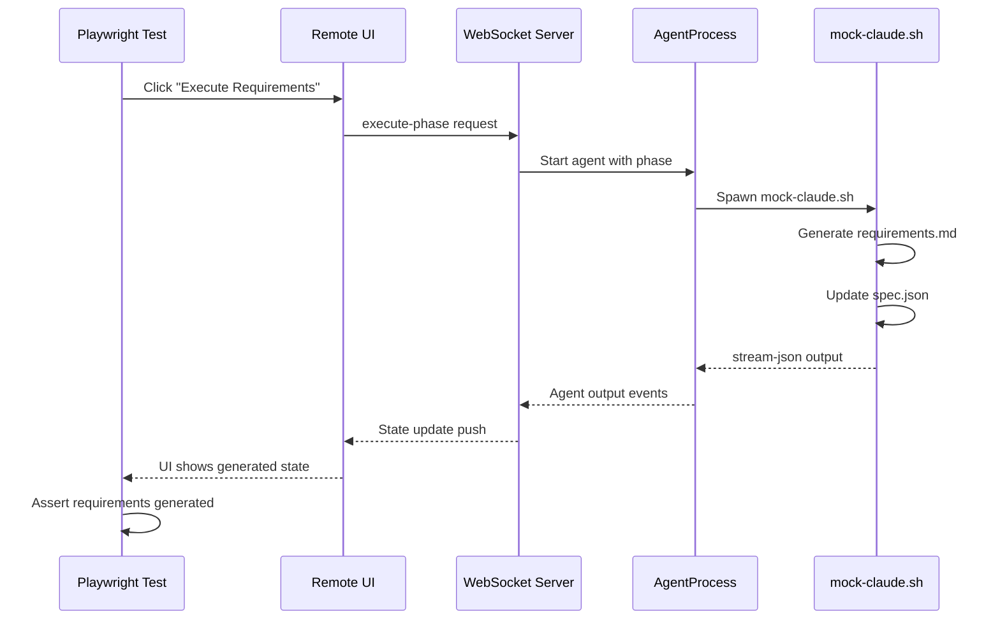

# Technical Design: Web E2Eテスト基盤

## Overview

**Purpose**: Remote UIのE2Eテストを、Playwrightスタンドアロン構成で実行可能にする基盤を提供する。既存のElectronアプリをRemote UIモードで起動し、Playwrightからブラウザ経由でアクセスしてテストを実行する。

**Users**: 開発者がCIおよびローカル環境でRemote UI固有の機能をテストするために使用する。

**Impact**: 既存のWebdriverIOベースのElectron E2Eテストと並行して、Web UI専用のテストレイヤーを追加する。

### Goals
- PlaywrightスタンドアロンのRemote UIテスト環境を構築する
- 既存Mock Claude CLIを活用し、API呼び出しなしでワークフローをテスト可能にする
- CIで軽量かつ高速に実行できるテスト基盤を提供する
- 既存WebdriverIOテストとの関心分離を明確にする

### Non-Goals
- 既存WebdriverIOテストのPlaywrightへの移行
- WebSocket経由の直接データ操作API（Mock Claudeで対応可能）
- Cloudflare Tunnel経由のリモートアクセステスト
- モバイルデバイス実機テスト

## Architecture

### Existing Architecture Analysis

現在のE2Eテストアーキテクチャ:

| 層 | 技術 | 用途 |
|---|------|------|
| Electron E2E | WebdriverIO + wdio-electron-service | デスクトップアプリ全体のテスト |
| Remote UI内テスト | Playwright（WebdriverIO内から呼び出し） | Remote UI接続・基本動作（`remote-webserver.e2e.spec.ts`） |

**統合パターン（現状）**:
- `remote-webserver.e2e.spec.ts`ではWebdriverIOテスト内からPlaywrightを呼び出し
- WebdriverIOがElectronアプリを起動し、Playwrightがブラウザ経由でRemote UIにアクセス
- この方式はElectronとRemote UI両方のテストを1つのスイートで実行可能だが、セットアップが複雑

**新アーキテクチャ（Playwright Standalone）**:
- Playwrightを独立したテストランナーとして使用
- Electronアプリはglobalセットアップで起動（テスト前）
- テストはRemote UIにのみアクセス（純粋なWebテスト）
- Mock Claudeでワークフロー実行をエミュレート

### Architecture Pattern & Boundary Map



**Architecture Integration**:
- Selected pattern: Global Setup/Teardown + Standalone Playwright
- Domain boundaries: Playwright E2E（Web UI）/ WebdriverIO E2E（Electron App）の分離
- Existing patterns preserved: Mock Claude CLI、既存fixtures構造
- New components rationale: Playwright専用の設定・ヘルパー・テストディレクトリを新設
- Steering compliance: 関心の分離原則に従い、Remote UIテストを独立させる

### Technology Stack

| Layer | Choice / Version | Role in Feature | Notes |
|-------|------------------|-----------------|-------|
| テストフレームワーク | Playwright 1.57+ | テストランナー・ブラウザ自動化 | 既にdevDependenciesに存在 |
| ブラウザ | Chromium (headless) | Remote UIアクセス | Playwright組み込み |
| プロセス管理 | Node.js child_process | Electron起動/停止 | global-setup/teardownで使用 |
| モック | mock-claude.sh | ワークフロー実行エミュレート | 既存スクリプト流用 |
| Fixtures | e2e-wdio/fixtures/ | テストデータ | 既存を共有 |

## System Flows

### テスト実行フロー



### Mock Claude連携フロー



## Requirements Traceability

| Criterion ID | Summary | Components | Implementation Approach |
|--------------|---------|------------|------------------------|
| 1.1 | playwright.config.ts存在 | PlaywrightConfig | 新規作成 |
| 1.2 | baseURL設定（localhost:8765） | PlaywrightConfig | 設定値として定義 |
| 1.3 | テストパターン e2e-playwright/**/*.spec.ts | PlaywrightConfig | testDir + testMatch設定 |
| 1.4 | レポート出力設定 | PlaywrightConfig | reporter設定（html, list） |
| 1.5 | npm run test:web-e2e実行可能 | package.json | scripts追加 |
| 2.1 | Electronアプリ起動オプション | ElectronStartupHelper | global-setup.ts内で実装 |
| 2.2 | E2E_MOCK_CLAUDE_COMMAND設定 | ElectronStartupHelper | 環境変数設定 |
| 2.3 | Remote UI応答待機 | ElectronStartupHelper | waitForRemoteUI関数 |
| 2.4 | テスト後プロセス終了 | ElectronTeardownHelper | global-teardown.ts内で実装 |
| 2.5 | 起動失敗時エラーメッセージ | ElectronStartupHelper | エラーハンドリング |
| 3.1 | Mock Claude CLI有効化 | ElectronStartupHelper | 環境変数経由 |
| 3.2 | フェーズ実行がMock応答で動作 | 既存mock-claude.sh | 流用（変更不要） |
| 3.3 | 生成ファイルがUIに反映 | RemoteUIHelpers | waitForElement + assertion |
| 3.4 | spec.json更新がUIに反映 | RemoteUIHelpers | waitForElement + assertion |
| 4.1 | Remote UIアクセス検証テスト | smoke.spec.ts | 新規作成 |
| 4.2 | Spec一覧表示検証テスト | smoke.spec.ts | 新規作成 |
| 4.3 | Spec選択・詳細パネル検証テスト | smoke.spec.ts | 新規作成 |
| 4.4 | Bugsタブ切り替え検証テスト | smoke.spec.ts | 新規作成 |
| 4.5 | npm run test:web-e2eで実行可能 | package.json | スクリプト追加 |
| 5.1 | web-e2e-testing.md作成 | SteeringDocument | 新規作成 |
| 5.2 | セットアップ手順セクション | SteeringDocument | 新規作成 |
| 5.3 | 実行コマンドセクション | SteeringDocument | 新規作成 |
| 5.4 | シナリオ記述パターンセクション | SteeringDocument | 新規作成 |
| 5.5 | Mock Claude活用方法セクション | SteeringDocument | 新規作成 |
| 5.6 | 既存E2Eとの使い分けセクション | SteeringDocument | 新規作成 |
| 5.7 | トラブルシューティングセクション | SteeringDocument | 新規作成 |
| 5.8 | e2e-testing.mdとの関連明記 | SteeringDocument | 新規作成 |
| 6.1 | e2e-playwright/ディレクトリ配置 | DirectoryStructure | 新規ディレクトリ作成 |
| 6.2 | helpers/サブディレクトリ配置 | DirectoryStructure | 新規ディレクトリ作成 |
| 6.3 | 既存fixtures参照 | テスト実装 | e2e-wdio/fixtures/を参照 |

### Coverage Validation Checklist

- [x] Every criterion ID from requirements.md appears in the table above
- [x] Each criterion has specific component names (not generic references)
- [x] Implementation approach distinguishes "reuse existing" vs "new implementation"
- [x] User-facing criteria specify concrete UI components (not just "shared components")

## Components and Interfaces

### Component Summary

| Component | Domain/Layer | Intent | Req Coverage | Key Dependencies | Contracts |
|-----------|--------------|--------|--------------|------------------|-----------|
| PlaywrightConfig | Configuration | Playwrightテスト設定定義 | 1.1-1.5 | Playwright (P0) | - |
| ElectronStartupHelper | Setup | Electronアプリ起動管理 | 2.1-2.5, 3.1 | child_process (P0), mock-claude.sh (P0) | Service |
| RemoteUIHelpers | Helpers | Remote UI操作ヘルパー | 3.3, 3.4 | Playwright Page (P0) | Service |
| SmokeTests | Tests | 基本動作検証テスト | 4.1-4.5 | RemoteUIHelpers (P0) | - |
| SteeringDocument | Documentation | 開発者向けガイド | 5.1-5.8 | - | - |

### Configuration Layer

#### PlaywrightConfig

| Field | Detail |
|-------|--------|
| Intent | Remote UIテスト用Playwright設定を定義 |
| Requirements | 1.1, 1.2, 1.3, 1.4 |

**Responsibilities & Constraints**
- テスト実行パラメータの一元管理
- ブラウザ設定（Chromium headless）
- タイムアウト・リトライ設定
- レポーター設定

**Dependencies**
- External: @playwright/test — テストフレームワーク (P0)

##### Service Interface

```typescript
// playwright.config.ts
import { defineConfig, devices } from '@playwright/test';

export default defineConfig({
  testDir: './e2e-playwright',
  testMatch: '**/*.spec.ts',
  fullyParallel: false, // Electron共有のため順次実行
  retries: process.env.CI ? 1 : 0,
  workers: 1, // Electronプロセス共有のため1ワーカー
  reporter: [
    ['list'],
    ['html', { outputFolder: 'playwright-report' }],
  ],
  use: {
    baseURL: 'http://localhost:8765',
    trace: 'on-first-retry',
    screenshot: 'only-on-failure',
  },
  globalSetup: require.resolve('./e2e-playwright/global-setup'),
  globalTeardown: require.resolve('./e2e-playwright/global-teardown'),
  projects: [
    {
      name: 'chromium',
      use: { ...devices['Desktop Chrome'] },
    },
  ],
});
```

**Implementation Notes**
- Integration: fullyParallel=false, workers=1でElectronプロセス共有を保証
- Validation: baseURLはElectronのRemote UIデフォルトポート
- Risks: Electronプロセスが不安定な場合テストが全て失敗する

### Setup Layer

#### ElectronStartupHelper

| Field | Detail |
|-------|--------|
| Intent | テスト前にElectronアプリを適切な設定で起動 |
| Requirements | 2.1, 2.2, 2.3, 2.4, 2.5, 3.1 |

**Responsibilities & Constraints**
- Electronアプリのバックグラウンド起動
- Mock Claude環境変数設定
- Remote UI起動待機
- 起動失敗時のエラーハンドリング

**Dependencies**
- External: child_process — プロセス管理 (P0)
- External: mock-claude.sh — ワークフローモック (P0)
- Inbound: global-setup.ts — 起動トリガー (P0)

##### Service Interface

```typescript
// e2e-playwright/helpers/electron-launcher.ts

export interface ElectronLauncherConfig {
  projectPath: string;
  remotePort: number;
  mockClaudePath: string;
  mockClaudeDelay: string;
  timeout: number;
}

export interface ElectronLauncherResult {
  process: ChildProcess;
  url: string;
  port: number;
}

export interface ElectronLauncher {
  /**
   * Electronアプリを起動しRemote UIが応答可能になるまで待機
   * @throws Error 起動失敗時またはタイムアウト時
   */
  start(config: ElectronLauncherConfig): Promise<ElectronLauncherResult>;

  /**
   * Electronプロセスを終了
   */
  stop(): Promise<void>;

  /**
   * 現在の起動状態を取得
   */
  isRunning(): boolean;
}
```

- Preconditions: Electronアプリがビルド済み、fixtureプロジェクトが存在
- Postconditions: Remote UIがhttp://localhost:{port}で応答可能
- Invariants: 1つのElectronプロセスのみ起動

```typescript
// e2e-playwright/global-setup.ts

import { ElectronLauncher } from './helpers/electron-launcher';
import * as path from 'path';

const FIXTURE_PROJECT = path.resolve(__dirname, '../e2e-wdio/fixtures/test-project');
const MOCK_CLAUDE_PATH = path.resolve(__dirname, '../scripts/e2e-mock/mock-claude.sh');

async function globalSetup(): Promise<void> {
  const launcher = new ElectronLauncher();

  const result = await launcher.start({
    projectPath: FIXTURE_PROJECT,
    remotePort: 8765,
    mockClaudePath: MOCK_CLAUDE_PATH,
    mockClaudeDelay: '0.1',
    timeout: 30000,
  });

  // Store for teardown
  process.env.ELECTRON_PID = String(result.process.pid);
  process.env.REMOTE_UI_URL = result.url;

  console.log(`[global-setup] Electron started, Remote UI at ${result.url}`);
}

export default globalSetup;
```

```typescript
// e2e-playwright/global-teardown.ts

import { exec } from 'child_process';
import { promisify } from 'util';

const execAsync = promisify(exec);

async function globalTeardown(): Promise<void> {
  const pid = process.env.ELECTRON_PID;

  if (pid) {
    try {
      // プロセスツリーごと終了
      await execAsync(`kill -TERM ${pid} || true`);
      console.log(`[global-teardown] Electron process ${pid} terminated`);
    } catch (error) {
      console.warn(`[global-teardown] Failed to terminate process: ${error}`);
    }
  }

  // 残存プロセスのクリーンアップ
  try {
    await execAsync("pkill -f 'e2e-playwright-test' || true");
  } catch {
    // プロセスが見つからない場合は無視
  }
}

export default globalTeardown;
```

**Implementation Notes**
- Integration: `npm run build`でビルドされたElectronアプリを使用
- Validation: Remote UIのヘルスチェックエンドポイントで応答確認
- Risks: タイムアウト設定が短すぎると起動失敗、長すぎるとCI遅延

### Helpers Layer

#### RemoteUIHelpers

| Field | Detail |
|-------|--------|
| Intent | Remote UI操作の共通ヘルパー関数を提供 |
| Requirements | 3.3, 3.4 |

**Responsibilities & Constraints**
- 要素待機のラッパー関数
- WebSocket接続待機
- 状態更新待機

**Dependencies**
- Inbound: Playwright Page — ブラウザ操作 (P0)

##### Service Interface

```typescript
// e2e-playwright/helpers/remote-ui.helpers.ts

import { Page, expect } from '@playwright/test';

export interface RemoteUIHelpers {
  /**
   * WebSocket接続が確立されるまで待機
   */
  waitForConnection(page: Page, timeout?: number): Promise<void>;

  /**
   * Spec一覧が表示されるまで待機
   */
  waitForSpecList(page: Page, timeout?: number): Promise<void>;

  /**
   * 特定のSpec詳細が表示されるまで待機
   */
  waitForSpecDetail(page: Page, specName: string, timeout?: number): Promise<void>;

  /**
   * 指定フェーズが生成済み状態になるまで待機
   */
  waitForPhaseGenerated(page: Page, phase: string, timeout?: number): Promise<void>;
}

// 実装例
export async function waitForConnection(page: Page, timeout = 10000): Promise<void> {
  await page.waitForFunction(
    () => {
      const statusText = document.querySelector('[data-testid="remote-status-text"]');
      return statusText?.textContent === 'Connected';
    },
    { timeout }
  );
}

export async function waitForSpecList(page: Page, timeout = 10000): Promise<void> {
  await page.waitForSelector('[data-testid="remote-spec-list"]', { timeout });
  const specItems = page.locator('[data-testid^="remote-spec-item-"]');
  await expect(specItems.first()).toBeVisible({ timeout });
}

export async function selectSpec(page: Page, specName: string): Promise<void> {
  const specItem = page.locator(`[data-testid="remote-spec-item-${specName}"]`);
  await specItem.click();
  await page.waitForSelector('[data-testid="remote-spec-detail"]:not(.hidden)', { timeout: 5000 });
}

export async function switchToTab(page: Page, tabName: 'specs' | 'bugs'): Promise<void> {
  await page.click(`[data-testid="remote-tab-${tabName}"]`);
  await page.waitForFunction(
    (tab) => {
      const tabEl = document.querySelector(`[data-testid="remote-tab-${tab}"]`);
      return tabEl?.getAttribute('aria-selected') === 'true';
    },
    tabName
  );
}
```

**Implementation Notes**
- Integration: 既存Remote UIのdata-testid属性を活用
- Validation: タイムアウトはデフォルト10秒、CI環境では延長可能
- Risks: data-testid変更時にヘルパー更新が必要

### Test Layer

#### SmokeTests

| Field | Detail |
|-------|--------|
| Intent | Remote UIの基本動作を検証するSmoke Test |
| Requirements | 4.1, 4.2, 4.3, 4.4 |

**Responsibilities & Constraints**
- Remote UIアクセス確認
- Spec一覧表示確認
- Spec詳細パネル表示確認
- タブ切り替え確認

**Dependencies**
- Inbound: RemoteUIHelpers — UI操作 (P0)
- Inbound: Playwright test — テストフレームワーク (P0)

##### Service Interface

```typescript
// e2e-playwright/smoke.spec.ts

import { test, expect } from '@playwright/test';
import { waitForConnection, waitForSpecList, selectSpec, switchToTab } from './helpers/remote-ui.helpers';

test.describe('Remote UI Smoke Tests', () => {
  test.beforeEach(async ({ page }) => {
    await page.goto('/');
    await waitForConnection(page);
  });

  test('should access Remote UI and show connected status', async ({ page }) => {
    // 4.1: Remote UIにブラウザからアクセスできる
    const statusText = page.locator('[data-testid="remote-status-text"]');
    await expect(statusText).toHaveText('Connected');
  });

  test('should display spec list', async ({ page }) => {
    // 4.2: Spec一覧が表示される
    await waitForSpecList(page);
    const specItems = page.locator('[data-testid^="remote-spec-item-"]');
    await expect(specItems).toHaveCount(await specItems.count());
    expect(await specItems.count()).toBeGreaterThan(0);
  });

  test('should show spec detail panel on selection', async ({ page }) => {
    // 4.3: Spec選択で詳細パネルが表示される
    await waitForSpecList(page);
    const firstSpec = page.locator('[data-testid^="remote-spec-item-"]').first();
    await firstSpec.click();

    const detailPanel = page.locator('[data-testid="remote-spec-detail"]');
    await expect(detailPanel).toBeVisible();
  });

  test('should switch to Bugs tab', async ({ page }) => {
    // 4.4: Bugsタブへの切り替えが動作する
    await switchToTab(page, 'bugs');

    const bugsTab = page.locator('[data-testid="remote-tab-bugs"]');
    await expect(bugsTab).toHaveAttribute('aria-selected', 'true');

    const bugList = page.locator('[data-testid="remote-bug-list"]');
    await expect(bugList).toBeVisible();
  });
});
```

**Implementation Notes**
- Integration: 既存fixtureプロジェクトを使用（test-project）
- Validation: 各テストは独立して実行可能
- Risks: fixtureデータ破損時にテスト失敗

## Data Models

### Domain Model

本機能はテスト基盤であり、永続化データモデルは持たない。テスト実行時に参照するデータ:

- **SpecJson**: `.kiro/specs/{feature}/spec.json`（既存）
- **Fixtures**: `e2e-wdio/fixtures/`（既存、共有）
- **Test Artifacts**: `playwright-report/`（テスト結果）

### Logical Data Model

**Process State** (メモリ内):

```typescript
interface ElectronProcessState {
  pid: number | null;
  url: string | null;
  isRunning: boolean;
  startedAt: Date | null;
}
```

**Test Context** (環境変数経由):

| 変数名 | 型 | 用途 |
|--------|-----|------|
| ELECTRON_PID | string | Electronプロセス識別 |
| REMOTE_UI_URL | string | Remote UIベースURL |
| E2E_MOCK_CLAUDE_COMMAND | string | Mock Claude CLIパス |
| E2E_MOCK_CLAUDE_DELAY | string | Mock応答遅延（秒） |

## Error Handling

### Error Strategy

テスト実行時のエラーは以下のカテゴリで分類し、適切にハンドリング:

| カテゴリ | 例 | 対応 |
|----------|-----|------|
| Setup Error | Electron起動失敗 | 詳細エラーログ出力、全テストスキップ |
| Connection Error | Remote UI接続タイムアウト | リトライ後テスト失敗 |
| Assertion Error | UI要素不一致 | スクリーンショット取得、テスト失敗 |
| Teardown Error | プロセス終了失敗 | 警告ログ出力、強制終了試行 |

### Error Categories and Responses

**Setup Errors**:
```typescript
// global-setup.ts
try {
  await launcher.start(config);
} catch (error) {
  console.error(`[global-setup] Failed to start Electron: ${error.message}`);
  console.error('[global-setup] Ensure app is built: npm run build');
  throw error; // テスト実行を中止
}
```

**Connection Errors**:
```typescript
// Playwright設定でリトライ
export default defineConfig({
  retries: process.env.CI ? 1 : 0,
  use: {
    trace: 'on-first-retry', // リトライ時にトレース取得
  },
});
```

### Monitoring

- **テストレポート**: `playwright-report/index.html`でビジュアル確認
- **失敗時スクリーンショット**: `test-results/`に自動保存
- **トレース**: リトライ時に`trace.zip`生成（詳細デバッグ用）

## Testing Strategy

### Unit Tests
- ElectronLauncher: プロセス起動・停止ロジック（Vitestでモック）
- RemoteUIHelpers: ヘルパー関数の単体テスト（DOMモック使用）

### Integration Tests
- global-setup/teardown: 実際のElectron起動を伴う統合テスト
- Mock Claude連携: ファイル生成・spec.json更新の検証

### E2E Tests (this feature)
- smoke.spec.ts: Remote UI基本動作（4テスト）
- 将来追加: ワークフロー実行テスト、Mock Claude連携テスト

### Performance Considerations
- 全テスト実行時間: 目標1分以内（Smoke Test）
- Electron起動時間: 最大10秒
- 各テスト: 最大10秒

## Design Decisions

### DD-001: Playwright Standalone構成の採用

| Field | Detail |
|-------|--------|
| Status | Accepted |
| Context | Remote UIのE2Eテストをどのように実装するか。現在WebdriverIO内からPlaywrightを呼び出す方式（`remote-webserver.e2e.spec.ts`）が存在する |
| Decision | Playwright Standaloneとして独立したテストスイートを構築する |
| Rationale | Remote UIは純粋なWeb UIであり、Electronアプリ内部のテストと分離することで関心の分離が明確になる。CI実行も軽量・高速になる |
| Alternatives Considered | 1) WebdriverIO内Playwright継続 - 設定複雑、起動オーバーヘッド大 2) Cypress - Electron連携が弱い |
| Consequences | 2つのE2Eテストスイート（WebdriverIO/Playwright）の管理が必要。ただし責務が明確に分かれるため保守性は向上 |

### DD-002: Global Setup/Teardownパターンの採用

| Field | Detail |
|-------|--------|
| Status | Accepted |
| Context | Electronアプリの起動タイミングをどう管理するか |
| Decision | Playwrightのglobal-setup/global-teardownでElectronを起動・停止する |
| Rationale | 全テストでElectronプロセスを共有することで起動オーバーヘッドを削減。テスト間の状態はRemote UI経由でリセット可能 |
| Alternatives Considered | 1) テストごと起動 - 遅い、リソース消費大 2) beforeAll/afterAll - スコープがファイル単位で制御しにくい |
| Consequences | テスト間で状態が共有されるリスク。fixtureリセット機構の検討が必要（Phase 2） |

### DD-003: 既存Mock Claude CLIの流用

| Field | Detail |
|-------|--------|
| Status | Accepted |
| Context | ワークフロー実行のモック方法 |
| Decision | 既存の`scripts/e2e-mock/mock-claude.sh`をそのまま使用する |
| Rationale | 既にrequirements/design/tasks生成、spec.json更新の機能が実装済み。追加開発不要 |
| Alternatives Considered | 1) Playwright用新規モック - 重複実装 2) APIモック（MSWなど） - WebSocket対応が複雑 |
| Consequences | mock-claude.shの変更がPlaywrightテストにも影響する。変更時は両テストスイートの検証が必要 |

### DD-004: 既存Fixturesの共有

| Field | Detail |
|-------|--------|
| Status | Accepted |
| Context | テストデータの管理方法 |
| Decision | 既存の`e2e-wdio/fixtures/`を共有して使用する |
| Rationale | 既に整備されたテストデータを再利用でき、一貫性を保てる。メンテナンスコストを削減 |
| Alternatives Considered | Playwright専用fixtures - データ重複、同期コスト |
| Consequences | fixture変更時に両テストスイートへの影響を考慮する必要がある |

### DD-005: 単一ワーカー実行

| Field | Detail |
|-------|--------|
| Status | Accepted |
| Context | テストの並列実行設定 |
| Decision | workers=1でシーケンシャル実行とする |
| Rationale | 単一のElectronプロセスを共有するため、並列実行は状態競合を引き起こす。Remote UIは同時接続をサポートするが、テスト観点では予測可能性を優先 |
| Alternatives Considered | 複数Electronインスタンス起動 - リソース消費大、ポート競合リスク |
| Consequences | テスト実行時間が線形に増加。Smoke Testレベルでは問題なし。大規模テストスイートでは再検討が必要 |

## Supporting References

### ディレクトリ構造

```
electron-sdd-manager/
├── playwright.config.ts              # 新規: Playwright設定
├── e2e-playwright/                   # 新規: Playwrightテストディレクトリ
│   ├── global-setup.ts               # 新規: Electron起動
│   ├── global-teardown.ts            # 新規: Electron停止
│   ├── helpers/                      # 新規: ヘルパー関数
│   │   ├── electron-launcher.ts      # 新規: Electron起動ヘルパー
│   │   └── remote-ui.helpers.ts      # 新規: Remote UI操作ヘルパー
│   └── smoke.spec.ts                 # 新規: Smoke Test
├── e2e-wdio/                         # 既存: WebdriverIOテスト
│   └── fixtures/                     # 既存: テストフィクスチャ（共有）
├── scripts/e2e-mock/                 # 既存: Mock Claude CLI
│   └── mock-claude.sh                # 既存: 流用
└── package.json                      # 既存: scripts追加
```

### package.json追加スクリプト

```json
{
  "scripts": {
    "test:web-e2e": "npx playwright test",
    "test:web-e2e:headed": "npx playwright test --headed",
    "test:web-e2e:ui": "npx playwright test --ui"
  }
}
```

### Playwrightベストプラクティス参照

本設計は以下のベストプラクティスに基づく:

- [Playwright Configuration](https://playwright.dev/docs/test-configuration)
- [Playwright Best Practices](https://playwright.dev/docs/best-practices)
- [How to configure Playwright Tests in 2025 | BrowserStack](https://www.browserstack.com/guide/playwright-config)
