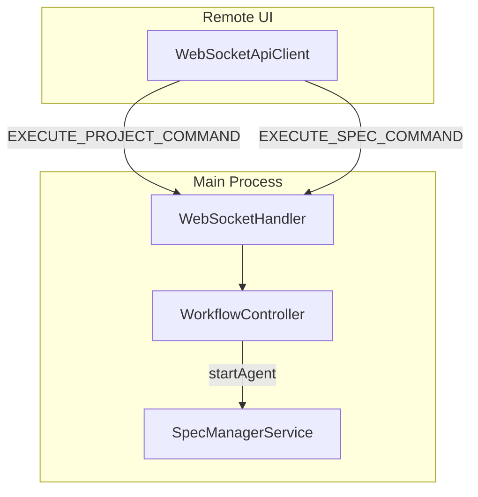
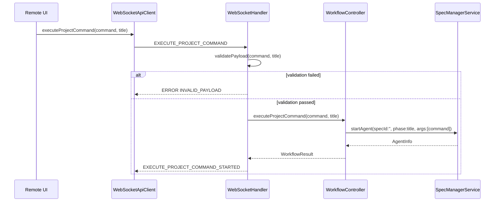
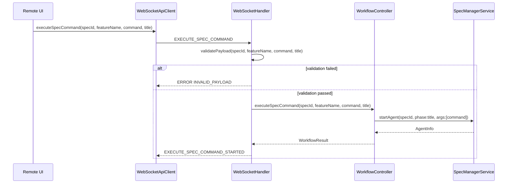

# Design: WebSocket コマンド実行の汎用化

## Overview

**Purpose**: この機能はRemote UIからProject-level/Spec-levelの任意のコマンドを汎用的に実行できるようにする。IPC側で既に完成している `EXECUTE_PROJECT_COMMAND` パターンをWebSocket側にも適用し、個別ハンドラの乱立を解消する。

**Users**: Remote UIユーザーがProject Ask、Spec Ask、Spec作成、Bug作成、Spec Plan実行などの操作を行う。

**Impact**: 現在の個別WebSocketメッセージタイプ（`ASK_PROJECT`, `ASK_SPEC`, `CREATE_SPEC`, `CREATE_BUG`, `EXECUTE_SPEC_PLAN`）を2つの汎用メッセージタイプ（`EXECUTE_PROJECT_COMMAND`, `EXECUTE_SPEC_COMMAND`）に統合する。

### Goals

- IPC側と同じ汎用コマンド実行パターンをWebSocket側に導入
- 新しいコマンド追加時に個別ハンドラを追加する必要を排除
- Remote UIとElectron UIで同じコマンド文字列を使用可能にする

### Non-Goals

- `EXECUTE_PHASE`, `EXECUTE`, `EXECUTE_BUG_PHASE`, `EXECUTE_DOCUMENT_REVIEW` 等の既存の構造化されたSpec実行ハンドラの統合
- `INSPECTION_START`, `INSPECTION_FIX` ハンドラの統合
- IPC側の `EXECUTE_PROJECT_COMMAND` の変更
- Auto Execution関連ハンドラの変更

## Architecture

### Existing Architecture Analysis

現在のシステムでは以下の2つのアプローチが混在している：

**IPC側（完成済み）**:
- `EXECUTE_PROJECT_COMMAND` チャネル経由で汎用コマンド実行
- コマンド文字列を直接 `specManagerService.startAgent()` に渡す
- titleは表示用phaseとして使用

**WebSocket側（問題あり）**:
- 個別メッセージタイプ（`ASK_PROJECT`, `ASK_SPEC`, `CREATE_SPEC`, `CREATE_BUG`, `EXECUTE_SPEC_PLAN`）が乱立
- 各メッセージに対応する個別ハンドラ（`handleAskProject`, `handleAskSpec` 等）が必要
- 一部は `WorkflowController` 側にメソッドが欠落して動作しない

### Architecture Pattern & Boundary Map



**Key Decisions**:
- 汎用化は2チャネル方式: Project-level（specId不要）とSpec-level（specId必須）を分離
- `WorkflowController` に `executeProjectCommand` / `executeSpecCommand` メソッドを追加
- IPC側と同じく `specManagerService.startAgent()` に委譲

### Technology Stack

| Layer | Choice / Version | Role in Feature | Notes |
|-------|------------------|-----------------|-------|
| Backend / Services | TypeScript | WebSocketHandler拡張 | 既存パターンを踏襲 |
| Messaging / Events | WebSocket (ws) | クライアント-サーバー通信 | 既存インフラを使用 |

## System Flows

### EXECUTE_PROJECT_COMMAND シーケンス



**Key Decisions**:
- バリデーションはWebSocketHandler側で実施（既存パターン踏襲）
- `specId: ''` でProject-levelエージェントを起動
- titleをphase（表示名）として使用

### EXECUTE_SPEC_COMMAND シーケンス



**Key Decisions**:
- Spec-levelは `specId` と `featureName` を必須とする（Worktree解決に必要）
- コマンド内でspecIdを参照可能（例: `/kiro:spec-ask "${prompt}"` がspec contextで実行される）

## Requirements Traceability

| Criterion ID | Summary | Components | Implementation Approach |
|--------------|---------|------------|------------------------|
| 1.1 | EXECUTE_PROJECT_COMMAND送信時にstartAgent呼び出し | WebSocketHandler, WorkflowController | 新規実装: handleExecuteProjectCommand |
| 1.2 | command/titleをargs/phaseに渡す | WorkflowController.executeProjectCommand | 新規実装 |
| 1.3 | command/title未指定時にINVALID_PAYLOAD | WebSocketHandler.handleExecuteProjectCommand | 新規実装 |
| 1.4 | 成功時にEXECUTE_PROJECT_COMMAND_STARTEDを返却 | WebSocketHandler | 新規実装 |
| 1.5 | 失敗時にERRORを返却 | WebSocketHandler | 新規実装 |
| 2.1 | EXECUTE_SPEC_COMMAND送信時にstartAgent呼び出し | WebSocketHandler, WorkflowController | 新規実装: handleExecuteSpecCommand |
| 2.2 | specId/featureName/command/titleを渡す | WorkflowController.executeSpecCommand | 新規実装 |
| 2.3 | 必須フィールド未指定時にINVALID_PAYLOAD | WebSocketHandler.handleExecuteSpecCommand | 新規実装 |
| 2.4 | 成功時にEXECUTE_SPEC_COMMAND_STARTEDを返却 | WebSocketHandler | 新規実装 |
| 2.5 | 失敗時にERRORを返却 | WebSocketHandler | 新規実装 |
| 3.1 | WorkflowController.executeProjectCommand定義 | WorkflowController interface | 新規追加 |
| 3.2 | WorkflowController.executeSpecCommand定義 | WorkflowController interface | 新規追加 |
| 3.3 | 個別メソッド削除 | WorkflowController interface | 削除: executeAskProject, executeAskSpec（createSpec, createBug, executeSpecPlanは維持） |
| 3.4 | createWorkflowController実装更新 | remoteAccessHandlers.ts | 既存パターン踏襲 |
| 4.1 | 個別メッセージタイプcase文削除 | WebSocketHandler.routeMessage | 削除: ASK_PROJECT, ASK_SPEC（CREATE_SPEC, CREATE_BUG, EXECUTE_SPEC_PLANは維持） |
| 4.2 | 個別ハンドラメソッド削除 | WebSocketHandler | 削除: handleAskProject, handleAskSpec（handleCreateSpec, handleCreateBug, handleExecuteSpecPlanは維持） |
| 4.3 | 関連テスト削除 | webSocketHandler.test.ts | 削除 |
| 5.1 | WebSocketApiClient.executeProjectCommand実装 | WebSocketApiClient | 既存スタブを実装に置換 |
| 5.2 | WebSocketApiClient.executeSpecCommand追加 | WebSocketApiClient | 新規実装 |
| 5.3 | executeAskProject/executeAskSpec削除 | WebSocketApiClient | 削除 |
| 5.4 | ApiClient interface更新 | types.ts | executeAskProject?, executeAskSpec?削除, executeSpecCommand追加 |
| 5.5 | ApiClient.executeSpecCommand追加 | types.ts | 新規追加 |
| 6.1 | Project Ask呼び出し更新 | Remote UIコンポーネント | executeProjectCommand使用 |
| 6.2 | Spec Ask呼び出し更新 | Remote UIコンポーネント | executeSpecCommand使用 |
| 6.3 | Spec作成呼び出し | Remote UIコンポーネント | 既存executeSpecPlan APIを維持（変更不要） |
| 6.4 | Bug作成呼び出し | Remote UIコンポーネント | 既存createBug APIを維持（変更不要） |
| 6.5 | Spec Plan呼び出し | Remote UIコンポーネント | 既存executeSpecPlan APIを維持（6.3と同一） |
| 7.1 | IpcApiClient.executeSpecCommand実装 | IpcApiClient | 新規実装 |
| 7.2 | IPC経由でエージェント起動 | IpcApiClient | 既存EXECUTE_PROJECT_COMMANDチャネルを活用 |

## Components and Interfaces

| Component | Domain/Layer | Intent | Req Coverage | Key Dependencies | Contracts |
|-----------|--------------|--------|--------------|------------------|-----------|
| WebSocketHandler | Backend/Services | 汎用コマンドメッセージのルーティング | 1.1-1.5, 2.1-2.5, 4.1-4.3 | WorkflowController (P0) | Service |
| WorkflowController | Backend/Services | コマンド実行の委譲 | 3.1-3.4 | SpecManagerService (P0) | Service |
| WebSocketApiClient | Shared/API | クライアント側APIラッパー | 5.1-5.5 | WebSocket (P0) | Service |
| ApiClient | Shared/Types | APIインターフェース定義 | 5.4, 5.5 | - | Service |
| IpcApiClient | Shared/API | IPC側API互換実装 | 7.1, 7.2 | IPC (P0) | Service |

### Backend / Services

#### WebSocketHandler - 汎用コマンドハンドラ追加

| Field | Detail |
|-------|--------|
| Intent | EXECUTE_PROJECT_COMMAND/EXECUTE_SPEC_COMMANDメッセージをルーティングし、WorkflowControllerに委譲 |
| Requirements | 1.1, 1.2, 1.3, 1.4, 1.5, 2.1, 2.2, 2.3, 2.4, 2.5, 4.1, 4.2, 4.3 |

**Responsibilities & Constraints**
- メッセージペイロードのバリデーション
- WorkflowControllerへの委譲
- レスポンスの返却

**Dependencies**
- Outbound: WorkflowController - コマンド実行委譲 (P0)

**Contracts**: Service [x]

##### Service Interface

```typescript
// routeMessage内の新規case追加
case 'EXECUTE_PROJECT_COMMAND':
  await this.handleExecuteProjectCommand(client, message);
  break;
case 'EXECUTE_SPEC_COMMAND':
  await this.handleExecuteSpecCommand(client, message);
  break;

// 新規プライベートメソッド
private async handleExecuteProjectCommand(
  client: ClientInfo,
  message: WebSocketMessage
): Promise<void>;

private async handleExecuteSpecCommand(
  client: ClientInfo,
  message: WebSocketMessage
): Promise<void>;
```

- Preconditions: `workflowController` がセットされていること
- Postconditions: 成功時は `*_STARTED` レスポンス、失敗時は `ERROR` レスポンスを返却

**Implementation Notes**
- 既存の `handleCreateSpec`, `handleCreateBug` 等のパターンを参考に実装
- バリデーションロジックは既存ハンドラと同等

---

#### WorkflowController Interface 拡張

| Field | Detail |
|-------|--------|
| Intent | 汎用コマンド実行メソッドを提供 |
| Requirements | 3.1, 3.2, 3.3, 3.4 |

**Responsibilities & Constraints**
- コマンド文字列をSpecManagerServiceに渡す
- 個別メソッド（executeAskProject等）を削除

**Dependencies**
- Outbound: SpecManagerService.startAgent - エージェント起動 (P0)

**Contracts**: Service [x]

##### Service Interface

```typescript
interface WorkflowController {
  // 既存メソッド（維持）
  executePhase(specId: string, phase: string): Promise<WorkflowResult<AgentInfo>>;
  execute?(options: ExecuteOptions): Promise<WorkflowResult<AgentInfo>>;
  stopAgent(agentId: string): Promise<WorkflowResult<void>>;
  resumeAgent(agentId: string): Promise<WorkflowResult<AgentInfo>>;
  // ... その他既存メソッド

  // 新規追加
  executeProjectCommand?(
    command: string,
    title: string
  ): Promise<WorkflowResult<AgentInfo>>;

  executeSpecCommand?(
    specId: string,
    featureName: string,
    command: string,
    title: string
  ): Promise<WorkflowResult<AgentInfo>>;

  // 削除: executeAskProject, executeAskSpec, createSpec, createBug, executeSpecPlan
}
```

- Preconditions: `specManagerService` が初期化済みであること
- Postconditions: 成功時は `AgentInfo` を含む `WorkflowResult`、失敗時はエラー情報

---

### Shared / API

#### WebSocketApiClient - 汎用コマンドAPI実装

| Field | Detail |
|-------|--------|
| Intent | WebSocket経由で汎用コマンドを実行 |
| Requirements | 5.1, 5.2, 5.3 |

**Responsibilities & Constraints**
- 既存の `executeProjectCommand` スタブを実際の実装に置換
- 新規 `executeSpecCommand` メソッドを追加
- `executeAskProject`, `executeAskSpec` を削除

**Dependencies**
- Outbound: WebSocket - サーバー通信 (P0)

**Contracts**: Service [x]

##### Service Interface

```typescript
class WebSocketApiClient implements ApiClient {
  // 既存スタブを実装に置換
  async executeProjectCommand(
    command: string,
    title: string
  ): Promise<Result<AgentInfo, ApiError>>;

  // 新規追加
  async executeSpecCommand(
    specId: string,
    featureName: string,
    command: string,
    title: string
  ): Promise<Result<AgentInfo, ApiError>>;

  // 削除: executeAskProject, executeAskSpec
}
```

---

#### ApiClient Interface 更新

| Field | Detail |
|-------|--------|
| Intent | API型定義の統一 |
| Requirements | 5.4, 5.5 |

**Contracts**: Service [x]

##### Service Interface

```typescript
interface ApiClient {
  // 既存（維持）
  executeProjectCommand(
    command: string,
    title: string
  ): Promise<Result<AgentInfo, ApiError>>;

  // 新規追加
  executeSpecCommand?(
    specId: string,
    featureName: string,
    command: string,
    title: string
  ): Promise<Result<AgentInfo, ApiError>>;

  // 削除: executeAskProject?, executeAskSpec?
}
```

---

#### IpcApiClient - executeSpecCommand追加

| Field | Detail |
|-------|--------|
| Intent | IPC側にもSpec-level汎用コマンドを追加 |
| Requirements | 7.1, 7.2 |

**Contracts**: Service [x]

##### Service Interface

```typescript
class IpcApiClient implements ApiClient {
  // 新規追加
  async executeSpecCommand(
    specId: string,
    featureName: string,
    command: string,
    title: string
  ): Promise<Result<AgentInfo, ApiError>>;
}
```

- Implementation: 既存 `EXECUTE_PROJECT_COMMAND` IPCチャネルを使用し、specIdをcommandに含める方式を採用（新規IPCチャネル追加は不要）

## Testing Strategy

### Unit Tests
- `handleExecuteProjectCommand`: 正常系、バリデーションエラー、WorkflowController未設定時
- `handleExecuteSpecCommand`: 正常系、必須フィールド不足、エージェント起動失敗
- `WorkflowController.executeProjectCommand`: startAgent呼び出し検証
- `WorkflowController.executeSpecCommand`: specId/featureNameの伝播検証
- `WebSocketApiClient.executeProjectCommand`: リクエスト送信・レスポンス処理
- `WebSocketApiClient.executeSpecCommand`: リクエスト送信・レスポンス処理

### Integration Tests
- Remote UIからのコマンド実行E2E: Project-level、Spec-level各1パターン

## Verification Contract

### User Journey Definition

| Journey ID | Operation Flow | Expected Result | E2E Required |
|------------|---------------|-----------------|--------------|
| UJ-001 | Remote UIでProject Askを実行 | エージェントが起動し、Agent一覧に表示される | Yes |
| UJ-002 | Remote UIでSpec Askを実行 | 指定Specのコンテキストでエージェントが起動 | Yes |
| UJ-003 | 必須パラメータ未指定でコマンド送信 | INVALID_PAYLOADエラーが返却される | No |

### Impact Analysis Contract

| Target File | Action | Reason |
|-------------|--------|--------|
| `src/main/services/webSocketHandler.ts` | UPDATE | 新規ハンドラ追加、個別ハンドラ削除 |
| `src/main/ipc/remoteAccessHandlers.ts` | UPDATE | WorkflowController実装更新 |
| `src/shared/api/WebSocketApiClient.ts` | UPDATE | executeProjectCommand実装、executeSpecCommand追加、executeAskProject/executeAskSpec削除 |
| `src/shared/api/IpcApiClient.ts` | UPDATE | executeSpecCommand追加 |
| `src/shared/api/types.ts` | UPDATE | ApiClient interface更新 |
| `src/remote-ui/` (呼び出し側コンポーネント) | UPDATE | 汎用APIを使用するよう更新 |
| `src/main/services/webSocketHandler.test.ts` | UPDATE | 個別ハンドラテスト削除、新規ハンドラテスト追加 |

## Integration Test Strategy

### Components
- WebSocketApiClient -> WebSocketHandler -> WorkflowController -> SpecManagerService

### Data Flow
1. Client sends `EXECUTE_PROJECT_COMMAND` / `EXECUTE_SPEC_COMMAND` message
2. WebSocketHandler validates and routes to WorkflowController
3. WorkflowController calls `specManagerService.startAgent()`
4. Response broadcasted back to client

### Mock Boundaries
- **Real Implementation**: WebSocketHandler, WorkflowController routing logic
- **Mock**: SpecManagerService.startAgent (returns mock AgentInfo)

### Verification Points
- 正しいメッセージタイプがルーティングされること
- バリデーションエラー時に適切なエラーレスポンスが返却されること
- 成功時に `*_STARTED` レスポンスが返却されること
- AgentInfoが正しく伝播されること

### Robustness Strategy
- `waitFor` パターンでWebSocketレスポンスを待機
- タイムアウトは既存テストと同等（30秒）

### Prerequisites
- 既存のWebSocketHandler統合テストインフラを使用

## Interface Changes & Impact Analysis

### executeProjectCommand (WebSocketApiClient)

**変更内容**: 既存のNOT_IMPLEMENTEDスタブを実際のWebSocketリクエストに置換

**Callers**:
- Remote UIの呼び出し側コンポーネント（要更新なし、既存シグネチャを維持）

### executeSpecCommand (新規)

**変更内容**: 新規メソッド追加

**Callers**:
- Remote UIでSpec Ask機能を使用するコンポーネント（新規呼び出しコード追加）

### executeAskProject / executeAskSpec (削除)

**変更内容**: メソッド削除

**Callers**:
| 現在の呼び出し元 | 対応方法 |
|-----------------|---------|
| Remote UIコンポーネント | `executeProjectCommand` / `executeSpecCommand` に置換 |

## Design Decisions

### DD-001: 2チャネル方式の採用

| Field | Detail |
|-------|--------|
| Status | Accepted |
| Context | Project-levelとSpec-levelでは必要なパラメータが異なる（Spec-levelはspecId, featureNameが必須） |
| Decision | `EXECUTE_PROJECT_COMMAND` と `EXECUTE_SPEC_COMMAND` の2つのメッセージタイプを定義 |
| Rationale | 型安全性を維持しながら、各レベルに適したバリデーションを実施可能 |
| Alternatives Considered | 単一メッセージタイプでオプショナルなspecIdを持つ方式 - 型安全性が低下するため却下 |
| Consequences | 新規メッセージタイプが2つ増加するが、個別ハンドラ5つを削除するため全体としては簡素化 |

### DD-002: IpcApiClient.executeSpecCommandの実装方式

| Field | Detail |
|-------|--------|
| Status | Accepted |
| Context | IpcApiClientにもSpec-level汎用コマンドが必要（API互換性のため） |
| Decision | 既存の `EXECUTE_PROJECT_COMMAND` IPCチャネルを再利用し、specIdをcommandに含める |
| Rationale | 新規IPCチャネル追加は影響範囲が大きく、既存チャネルで十分対応可能 |
| Alternatives Considered | 新規 `EXECUTE_SPEC_COMMAND` IPCチャネルを追加 - overheadに見合う利点がないため却下 |
| Consequences | IPC側はProject-levelチャネルのみ維持（シンプル）、Spec contextはcommand文字列内で表現 |

### DD-003: WorkflowController個別メソッドの削除

| Field | Detail |
|-------|--------|
| Status | Accepted |
| Context | 既存の `executeAskProject`, `executeAskSpec`, `createSpec`, `createBug`, `executeSpecPlan` メソッドを残すか削除するか |
| Decision | 全て削除し汎用メソッドに統合 |
| Rationale | DRY原則。中途半端に残すと新コマンド毎に個別対応が必要な問題が再発 |
| Alternatives Considered | 動作中の `createSpec`, `createBug` のみ残す - 一貫性が失われるため却下 |
| Consequences | Remote UIの呼び出し側コンポーネントを更新する必要がある |
