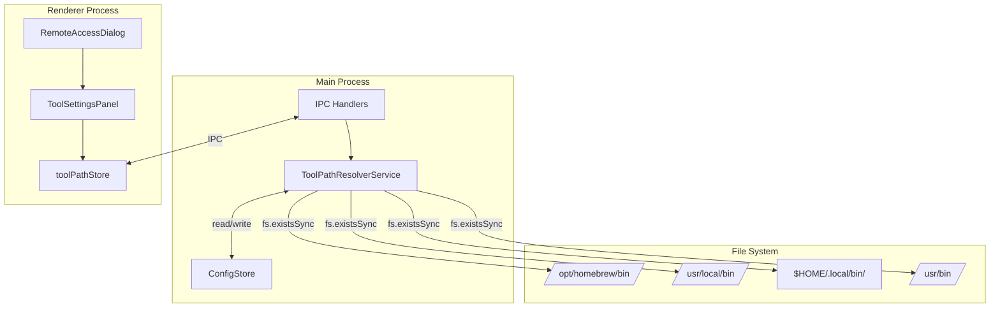
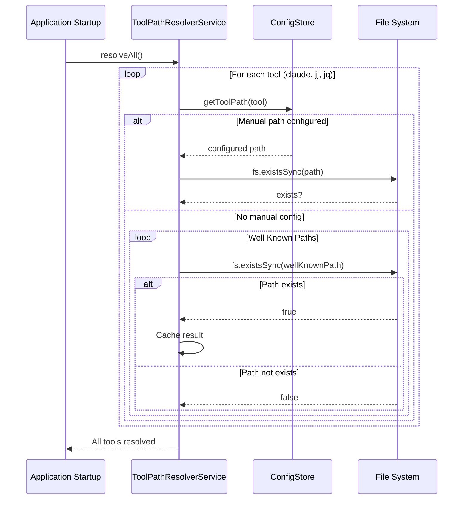
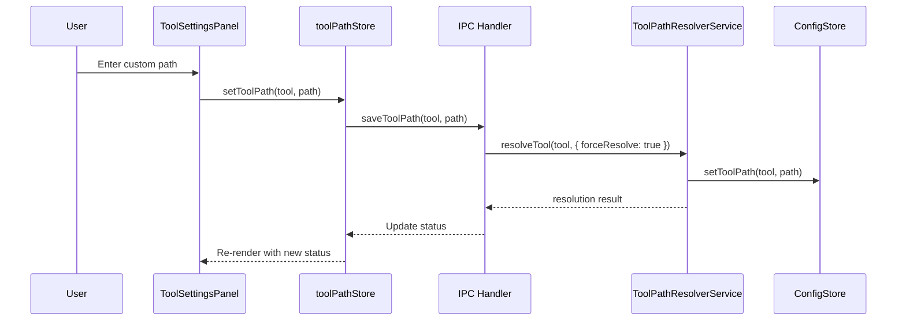
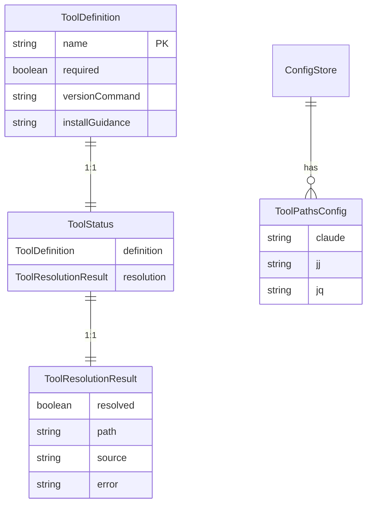

# Design Document: Well Known Tool Paths

## Overview

**Purpose**: シェル起動による副作用のないツールパス解決機構を提供する。外部ツール（claude, jj, jq）のパス解決を、Well Knownパスの直接チェック + 設定画面での手動指定に変更することで、TTYエラー、セッション保存メッセージ、ANSIエスケープシーケンス混入などの問題を根本的に解消する。

**Users**: SDD Orchestratorユーザー。特に、Homebrewでツールをインストールしており、GUI起動時にパス解決が失敗するケースに対応。

**Impact**: 既存の`ToolPathResolverService`を全面的に書き換え、シェル起動ロジックを削除する。

### Goals

- シェル起動（`-il`フラグ）を完全に廃止し、副作用のないパス解決を実現
- Well Knownパス（`/opt/homebrew/bin`, `/usr/local/bin`等）の順次チェックによる自動検出
- 設定画面での手動パス指定による柔軟な対応
- 後方互換性を維持したAPI設計（`getPath()`, `isResolved()`の維持）

### Non-Goals

- Windowsサポート（現在macOS専用）
- ツールの自動インストール機能
- バージョン要件のチェック

## Architecture

### Existing Architecture Analysis

現在の`ToolPathResolverService`は以下の問題を抱えている：

- `$SHELL -il -c 'which tool'`によるシェル起動
- VSCodeシェル統合のANSIエスケープシーケンス混入
- macOSの「Saving session...」メッセージ
- `SHELL_SESSIONS_DISABLE=1`、`TERM=dumb`などのワークアラウンド

既存パターン：
- `ConfigStore`（electron-store）によるグローバル設定管理
- `ProjectSettingsDialog`パターンによる設定UI

### Architecture Pattern & Boundary Map



**Key Decisions**:
- Well Knownパスの順次チェックでシェル起動を完全に回避
- `ConfigStore`拡張でグローバルなツールパス設定を永続化
- 設定画面は`RemoteAccessDialog`内に統合（`ToolSettingsPanel`として追加）

### Technology Stack

| Layer | Choice / Version | Role in Feature | Notes |
|-------|------------------|-----------------|-------|
| Backend / Services | Node.js `fs` API | Well Knownパスの存在確認 | `fs.existsSync`使用、非同期不要 |
| Data / Storage | electron-store | ツールパス設定の永続化 | 既存`ConfigStore`を拡張 |
| Frontend | React + Zustand | ツール設定UI | 既存パターン踏襲 |

## System Flows

### ツールパス解決フロー



**Key Decisions**:
- 手動設定パスはWell Known探索より優先（要件2.4）
- Well Knownパスは順序固定（Homebrew Apple Silicon → Homebrew Intel → npm global → system）
- シェル起動は一切行わない（`fs.existsSync`のみ使用）

### 設定画面での手動指定フロー



**Key Decisions**:
- 保存時に即座に再解決を実行し、パスの有効性を検証
- 解決結果はキャッシュをクリアして再検証（`forceResolve: true`）

## Requirements Traceability

| Criterion ID | Summary | Components | Implementation Approach |
|--------------|---------|------------|------------------------|
| 1.1 | Well Knownパス順次チェック | ToolPathResolverService | 新規実装：`checkWellKnownPaths()` |
| 1.2 | 最初に見つかったパスを使用 | ToolPathResolverService | 新規実装：順次チェックロジック |
| 1.3 | シェル起動禁止 | ToolPathResolverService | 既存シェル起動コード削除 |
| 1.4 | 対象ツール定義 | ToolPathResolverService | 既存`TOOL_DEFINITIONS`維持 |
| 2.1 | ConfigStore拡張 | ConfigStore | 新規実装：`toolPaths`スキーマ追加 |
| 2.2 | ToolSettingsPanel追加 | ToolSettingsPanel | 新規実装 |
| 2.3 | ツール情報表示 | ToolSettingsPanel | 新規実装：ステータス表示UI |
| 2.4 | 手動設定優先 | ToolPathResolverService | 新規実装：解決順序変更 |
| 3.1 | 自動設定画面表示 | App.tsx | 新規実装：未検出時の自動遷移 |
| 3.2 | 未検出ツールハイライト | ToolSettingsPanel | 新規実装：警告スタイル |
| 3.3 | トースト通知廃止 | - | 削除確認 |
| 4.1 | ToolPathResolverService書き換え | ToolPathResolverService | 全面リファクタリング |
| 4.2 | シェル起動ロジック削除 | ToolPathResolverService | 既存コード削除 |
| 4.3 | ワークアラウンド削除 | ToolPathResolverService | `SHELL_SESSIONS_DISABLE`, `TERM=dumb`削除 |
| 4.4 | API後方互換性 | ToolPathResolverService | `getPath()`, `isResolved()`維持 |

### Coverage Validation Checklist

- [x] Every criterion ID from requirements.md appears in the table above
- [x] Each criterion has specific component names (not generic references)
- [x] Implementation approach distinguishes "reuse existing" vs "new implementation"
- [x] User-facing criteria specify concrete UI components

## Components and Interfaces

| Component | Domain/Layer | Intent | Req Coverage | Key Dependencies | Contracts |
|-----------|--------------|--------|--------------|------------------|-----------|
| ToolPathResolverService | Main/Service | Well Knownパス探索 + 手動設定 | 1.1-1.4, 2.4, 4.1-4.4 | ConfigStore (P0), fs (P0) | Service |
| ConfigStore | Main/Service | ツールパス設定永続化 | 2.1 | electron-store (P0) | State |
| ToolSettingsPanel | Renderer/UI | ツール設定UI | 2.2, 2.3, 3.2 | toolPathStore (P0) | - |
| toolPathStore | Renderer/Store | UIステート + IPC呼び出し | 2.2, 2.3 | IPC (P0) | State |
| toolPathHandlers | Main/IPC | ツールパス関連IPC | 2.1, 2.4 | ToolPathResolverService (P0) | API |

### Main / Service

#### ToolPathResolverService

| Field | Detail |
|-------|--------|
| Intent | シェル起動なしでのツールパス解決 |
| Requirements | 1.1, 1.2, 1.3, 1.4, 2.4, 4.1, 4.2, 4.3, 4.4 |

**Responsibilities & Constraints**
- Well Knownパスの順次存在確認
- 手動設定パスの優先適用
- 解決結果のキャッシュ管理
- **禁止**: シェル起動（`exec`, `spawn`等でのシェル呼び出し）

**Dependencies**
- Inbound: agentProcess — claudeパス取得 (P0)
- Inbound: engineCommandResolverService — claudeパス取得 (P0)
- Inbound: IPC handlers — 解決状態取得 (P0)
- Outbound: ConfigStore — 手動設定読み取り (P0)
- External: Node.js fs — ファイル存在確認 (P0)

**Contracts**: Service [x] / API [ ] / Event [ ] / Batch [ ] / State [ ]

##### Service Interface

```typescript
/** Well Knownパス定義 */
const WELL_KNOWN_PATHS: readonly string[] = [
  '/opt/homebrew/bin',    // Homebrew Apple Silicon
  '/usr/local/bin',       // Homebrew Intel
  `${process.env.HOME}/.local/bin`,  // npm global等
  '/usr/bin',             // System
];

interface ToolResolutionResult {
  readonly resolved: boolean;
  readonly path?: string;
  readonly source?: 'manual' | 'well-known' | 'not-found';
  readonly error?: string;
}

interface ToolPathResolverService {
  /** 全ツールのパスを解決 */
  resolveAll(): Promise<void>;

  /** 単一ツールのパスを解決 */
  resolveTool(
    toolName: string,
    options?: { forceResolve?: boolean }
  ): Promise<ToolResolutionResult>;

  /** キャッシュされたパスを取得（後方互換） */
  getPath(toolName: string): string;

  /** ツールが解決済みか確認（後方互換） */
  isResolved(toolName: string): boolean;

  /** ツール定義を取得 */
  getDefinition(toolName: string): ToolDefinition | undefined;

  /** ツールステータスを取得 */
  getStatus(toolName: string): ToolStatus | undefined;

  /** 全ツールステータスを取得 */
  getAllStatuses(): ToolStatus[];
}
```

- Preconditions: `ConfigStore`が初期化済み
- Postconditions: 解決結果がキャッシュに格納される
- Invariants: シェル起動は行わない、`fs.existsSync`のみ使用

##### State Management

- State model: `Map<string, ToolResolutionResult>`（メモリキャッシュ）
- Persistence: 手動設定のみ`ConfigStore`経由で永続化
- Concurrency: シングルスレッド（Electron Main Process）

**Implementation Notes**
- Integration: 起動時に`resolveAll()`を呼び出し（既存パターン維持）
- Validation: `fs.existsSync`でパス存在確認
- Risks: Well Knownパスがカバーしない特殊環境では手動設定必須

---

#### ConfigStore (拡張)

| Field | Detail |
|-------|--------|
| Intent | ツールパス設定の永続化 |
| Requirements | 2.1 |

**Responsibilities & Constraints**
- `toolPaths`スキーマの追加
- 既存設定との互換性維持

**Dependencies**
- External: electron-store — 永続化ストレージ (P0)

**Contracts**: Service [ ] / API [ ] / Event [ ] / Batch [ ] / State [x]

##### Service Interface

```typescript
interface ToolPathsConfig {
  claude: string | null;
  jj: string | null;
  jq: string | null;
}

interface ConfigStore {
  /** ツールパス設定を取得 */
  getToolPaths(): ToolPathsConfig;

  /** 単一ツールパスを取得 */
  getToolPath(toolName: string): string | null;

  /** 単一ツールパスを設定 */
  setToolPath(toolName: string, path: string | null): void;
}
```

- Preconditions: electron-storeが初期化済み
- Postconditions: 設定がディスクに永続化される
- Invariants: スキーマバリデーション適用

---

### Main / IPC

#### toolPathHandlers

| Field | Detail |
|-------|--------|
| Intent | ツールパス関連のIPC通信 |
| Requirements | 2.1, 2.4 |

**Summary**: 既存の`registerConfigHandlers`パターンに従い、ツールパス関連のIPCハンドラを追加。新規ファイルではなく`configHandlers.ts`に統合。

**Contracts**: API [x]

##### API Contract

| Channel | Direction | Request | Response | Notes |
|---------|-----------|---------|----------|-------|
| GET_TOOL_STATUSES | Renderer→Main | - | ToolStatus[] | 全ツールステータス取得 |
| SET_TOOL_PATH | Renderer→Main | { tool: string, path: string \| null } | ToolResolutionResult | パス設定 + 再解決 |
| RESOLVE_TOOL | Renderer→Main | { tool: string } | ToolResolutionResult | 単一ツール再解決 |

---

### Renderer / UI

#### ToolSettingsPanel

| Field | Detail |
|-------|--------|
| Intent | ツールパス設定UI |
| Requirements | 2.2, 2.3, 3.2 |

**Summary**: `RemoteAccessDialog`内に配置するツール設定パネル。各ツールのステータス表示と手動パス入力フィールドを提供。未検出ツールは警告スタイルでハイライト表示。

**Dependencies**
- Inbound: RemoteAccessDialog — 親コンポーネント (P0)
- Outbound: toolPathStore — ステート管理 (P0)

**Implementation Notes**
- Integration: `RemoteAccessDialog`のタブまたはセクションとして追加
- Validation: 入力パスの存在確認はMain Process側で実施
- UI Pattern: `McpSettingsPanel`と同様のカード形式

---

#### toolPathStore (Zustand)

| Field | Detail |
|-------|--------|
| Intent | ツールパス状態のUI管理 |
| Requirements | 2.2, 2.3 |

**Summary**: ツールステータスのUI状態管理。IPC経由でMain Processと同期。

**Contracts**: State [x]

```typescript
interface ToolPathStore {
  statuses: ToolStatus[];
  isLoading: boolean;
  error: string | null;

  /** 全ステータスを取得 */
  fetchStatuses(): Promise<void>;

  /** ツールパスを設定 */
  setToolPath(tool: string, path: string | null): Promise<void>;

  /** ツールを再解決 */
  resolveTool(tool: string): Promise<void>;
}
```

---

## Data Models

### Domain Model



### Logical Data Model

**ToolPathsConfig Schema (ConfigStore拡張)**:

```typescript
// electron-store schema extension
const toolPathsSchema = {
  toolPaths: {
    type: ['object', 'null'],
    default: null,
    properties: {
      claude: { type: ['string', 'null'] },
      jj: { type: ['string', 'null'] },
      jq: { type: ['string', 'null'] },
    },
  },
};
```

## Error Handling

### Error Strategy

| Error Type | Detection | Response | Recovery |
|------------|-----------|----------|----------|
| Tool not found | Well Knownパス全てで`fs.existsSync`失敗 | `resolved: false`を返す | 設定画面への自動誘導（3.1） |
| Invalid manual path | 設定パスで`fs.existsSync`失敗 | `resolved: false`、`error`にメッセージ | UI上でエラー表示、再入力促進 |
| ConfigStore read error | electron-store例外 | デフォルト値（null）使用 | ログ出力、Well Known探索にフォールバック |

### Error Categories and Responses

**User Errors (設定ミス)**:
- 無効なパス入力 → フィールドレベルで警告表示、保存は許可（再解決で検証）

**System Errors**:
- `fs.existsSync`例外 → catch して`resolved: false`、ログ出力

## Testing Strategy

### Unit Tests

- `ToolPathResolverService.resolveTool()`: Well Knownパス順次チェック
- `ToolPathResolverService.resolveTool()`: 手動設定優先
- `ConfigStore.getToolPath()` / `setToolPath()`: 永続化検証
- `checkWellKnownPaths()`: 各パスの存在確認ロジック

### Integration Tests

- 起動時`resolveAll()`でのステータス初期化
- IPC経由でのツールパス設定と再解決
- 設定画面からの手動パス保存フロー

### E2E/UI Tests

- ツール未検出時の設定画面自動表示（要件3.1）
- 手動パス入力後の即時検証・ステータス更新

## Verification Contract

### User Journey Definition

| Journey ID | Operation Flow | Expected Result | E2E Required |
|------------|---------------|-----------------|--------------|
| UJ-001 | アプリ起動 → claude未検出 | 設定画面が自動で開く | Yes |
| UJ-002 | 設定画面 → claudeパス手動入力 → 保存 | ステータスが「見つかった」に更新 | Yes |
| UJ-003 | 設定画面 → 無効なパス入力 → 保存 | エラー表示、ステータスは「見つからない」 | Yes |

### Impact Analysis Contract

| Target File | Action | Reason |
|-------------|--------|--------|
| electron-sdd-manager/src/main/services/toolPathResolverService.ts | UPDATE | シェル起動ロジック削除、Well Known探索実装 |
| electron-sdd-manager/src/main/services/toolPathResolverService.test.ts | UPDATE | 新ロジックに合わせたテスト書き換え |
| electron-sdd-manager/src/main/services/configStore.ts | UPDATE | `toolPaths`スキーマ追加 |
| electron-sdd-manager/src/main/services/configStore.test.ts | UPDATE | `toolPaths`テスト追加 |
| electron-sdd-manager/src/main/ipc/configHandlers.ts | UPDATE | ツールパスIPCハンドラ追加 |
| electron-sdd-manager/src/main/ipc/channels.ts | UPDATE | 新チャンネル定義追加 |
| electron-sdd-manager/src/preload/index.ts | UPDATE | 新IPC API公開 |
| electron-sdd-manager/src/renderer/types/electron.d.ts | UPDATE | 型定義追加 |
| electron-sdd-manager/src/renderer/components/ToolSettingsPanel.tsx | CREATE | ツール設定パネルUI |
| electron-sdd-manager/src/renderer/components/ToolSettingsPanel.test.tsx | CREATE | コンポーネントテスト |
| electron-sdd-manager/src/shared/stores/toolPathStore.ts | CREATE | ツールパス状態管理 |
| electron-sdd-manager/src/shared/stores/toolPathStore.test.ts | CREATE | ストアテスト |
| electron-sdd-manager/src/renderer/components/RemoteAccessDialog.tsx | UPDATE | ToolSettingsPanelを統合 |
| electron-sdd-manager/src/renderer/App.tsx | UPDATE | claude未検出時の設定画面自動表示 |
| electron-sdd-manager/src/main/index.ts | UPDATE | 起動時警告ダイアログを設定画面誘導に変更 |

## Design Decisions

### DD-001: シェル起動からWell Knownパス直接チェックへの変更

| Field | Detail |
|-------|--------|
| Status | Accepted |
| Context | 現在の`ToolPathResolverService`は`$SHELL -il`でログインシェルを起動してPATHを解決しているが、VSCodeシェル統合のANSIエスケープシーケンス、macOSのセッション保存メッセージなど多数の副作用が発生。パッチ対応がモグラたたき状態。 |
| Decision | シェル起動を完全に廃止し、Well Knownパス（`/opt/homebrew/bin`等）を`fs.existsSync`で直接チェックする方式に変更する。 |
| Rationale | シェルを起動しないため副作用なし、高速、予測可能、デバッグ容易。macOSのHomebrew環境では4つのWell Knownパスで99%以上をカバー可能。 |
| Alternatives Considered | 1. `SHELL_SESSIONS_DISABLE`等の環境変数によるワークアラウンド継続 → 新たな副作用が発生するたびにパッチ追加が必要、根本解決にならない |
| Consequences | 非標準パスにインストールされたツールは手動設定が必要。ただし設定画面での対応が可能。 |

### DD-002: グローバル設定（ConfigStore）の採用

| Field | Detail |
|-------|--------|
| Status | Accepted |
| Context | ツールパス設定をプロジェクトごとに持つか、グローバル（アプリ全体）で持つかの選択。 |
| Decision | グローバル設定（ConfigStore使用）を採用。 |
| Rationale | ツールのインストール場所はマシン固有であり、プロジェクト間で共通。プロジェクトを切り替えるたびに設定が変わるのは不自然。 |
| Alternatives Considered | 1. プロジェクト固有設定（`.kiro/settings/`） → ツールパスはプロジェクトではなくマシンに依存するため不適切 |
| Consequences | 複数マシンで異なるパス設定が必要な場合はマシンごとに設定。これは想定される使用パターンと合致。 |

### DD-003: 設定画面への自動誘導（ダイアログ廃止）

| Field | Detail |
|-------|--------|
| Status | Accepted |
| Context | 必須ツール（claude）が見つからない場合のユーザー通知方法。現在は警告ダイアログを表示。 |
| Decision | ダイアログではなく、設定画面（ToolSettingsPanel）を自動で開く。トースト通知は使用しない。 |
| Rationale | ユーザーが即座に対応可能。ダイアログは「OK」を押すだけで終わり、次のアクションが不明確。設定画面を開けば即座にパス入力が可能。 |
| Alternatives Considered | 1. 警告ダイアログ継続 → アクションに繋がりにくい 2. トースト通知 → 見逃す可能性、廃止要件（3.3） |
| Consequences | 初回起動時にツールが見つからない場合、ユーザーは自動的に設定画面を目にすることになる。明示的なオンボーディングフローとして機能。 |

### DD-004: ToolSettingsPanelの配置場所

| Field | Detail |
|-------|--------|
| Status | Accepted |
| Context | 新規作成するToolSettingsPanelをどこに配置するか。 |
| Decision | `RemoteAccessDialog`内にセクションまたはタブとして統合。 |
| Rationale | RemoteAccessDialogは既にMcpSettingsPanelを含んでおり、「サーバー/ツール設定」の集約場所として機能している。新規ダイアログを増やすよりも、既存の設定集約場所に追加する方がUIの一貫性が保たれる。 |
| Alternatives Considered | 1. ProjectSettingsDialog内 → プロジェクト固有設定の場所であり、グローバル設定には不適切 2. 独立した新規ダイアログ → ダイアログ数増加、発見性低下 |
| Consequences | RemoteAccessDialogのタイトルや構成の見直しが必要になる可能性（「リモートアクセス & ツール設定」等）。 |

## Integration Test Strategy

### Components
- ToolPathResolverService (Main Process)
- ConfigStore (Main Process)
- toolPathStore (Renderer Process)
- IPC Handlers (Main Process)

### Data Flow
1. Renderer: `toolPathStore.setToolPath('claude', '/custom/path')`
2. IPC: `SET_TOOL_PATH` channel
3. Main: `ConfigStore.setToolPath()` → `ToolPathResolverService.resolveTool()`
4. IPC: Response with `ToolResolutionResult`
5. Renderer: Store update → UI re-render

### Mock Boundaries
- **Mock**: `fs.existsSync` → テスト環境でのパス存在シミュレーション
- **Real**: ConfigStore（electron-store） → 実際の永続化テスト
- **Real**: IPC通信 → 実際のチャンネル通信テスト

### Verification Points
- `ConfigStore`に設定が永続化されていること
- `ToolPathResolverService`のキャッシュが更新されていること
- Renderer側のstoreが正しいステータスを受け取っていること

### Robustness Strategy
- IPC応答の`waitFor`パターン使用（固定sleepは避ける）
- ConfigStore書き込み完了の検証にはファイル読み戻しを使用

### Prerequisites
- `fs.existsSync`のモック機構
- IPC統合テスト用の既存ヘルパー（`safeHandle`パターン）
