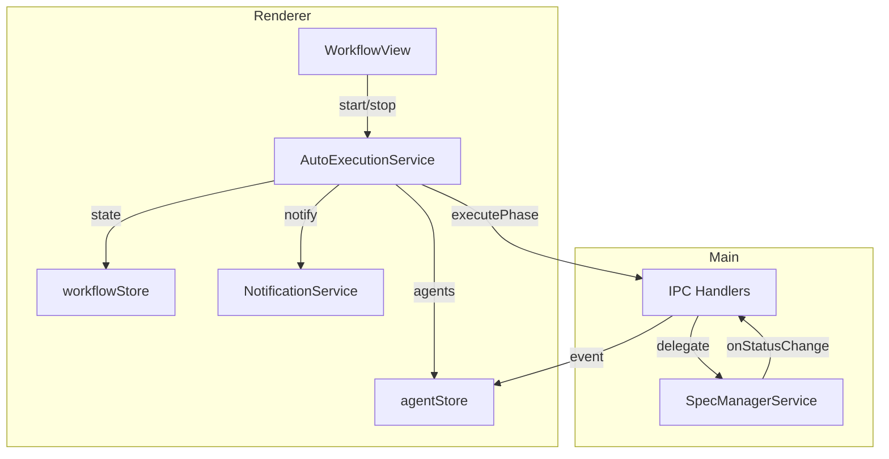
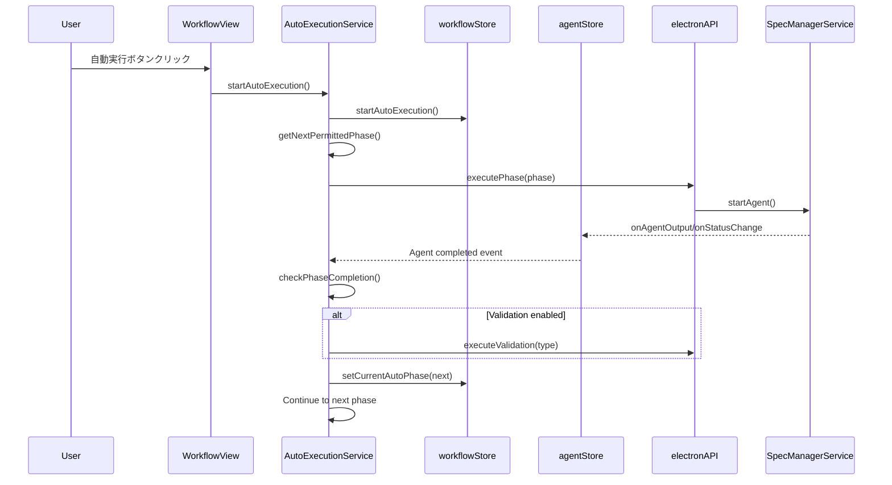
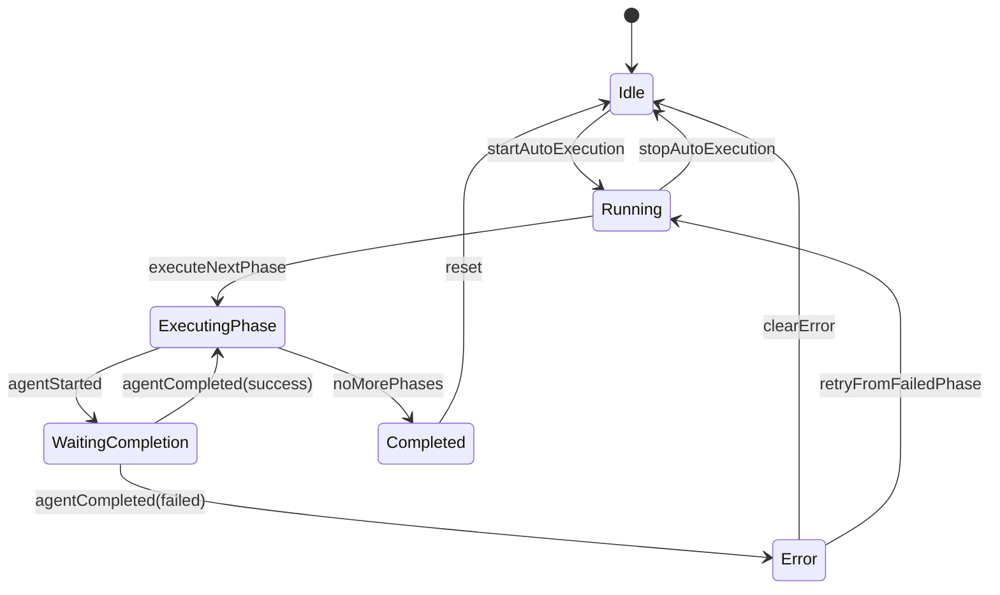

# 技術設計ドキュメント

## Overview

**Purpose**: 本機能は、SDD Managerにおいてユーザーがワークフローの自動実行を制御し、許可されたフェーズを順次実行することで、SDDワークフロー全体の効率化を実現する。

**Users**: SDD Managerを利用する開発者・チームが、SDDワークフローを効率的に進めるために使用する。

**Impact**: 既存のworkflowStore、agentStore、WorkflowViewコンポーネントを拡張し、自動実行ロジック（AutoExecutionService）を新規追加する。

### Goals

- 許可されたフェーズを自動的に順次実行する機能の実装
- Agent完了検知に基づく次フェーズへの自動遷移
- バリデーション挿入オプションのサポート
- エラーリカバリーと再実行機能の提供
- 実行状態のリアルタイム通知

### Non-Goals

- バックグラウンドでの長期自動実行（ユーザーセッション内のみ）
- 複数Spec間の並列自動実行
- inspection/deployフェーズの自動化（将来検討）
- 外部CIサービスとの連携

## Architecture

### Existing Architecture Analysis

現在のシステムには以下のコンポーネントが実装済み：

1. **workflowStore** (`src/renderer/stores/workflowStore.ts`):
   - `autoExecutionPermissions`: フェーズごとの自動実行許可設定
   - `validationOptions`: バリデーションオプション設定
   - `isAutoExecuting`: 自動実行中フラグ
   - `currentAutoPhase`: 現在の自動実行フェーズ
   - LocalStorageへの永続化（persist middleware）

2. **agentStore** (`src/renderer/stores/agentStore.ts`):
   - Agent状態管理（running/completed/failed/interrupted）
   - IPCイベントリスナー（output/status変更/record変更）
   - `startAgent`/`stopAgent`/`updateAgentStatus`アクション

3. **WorkflowView** (`src/renderer/components/WorkflowView.tsx`):
   - 6フェーズのUI表示
   - 個別フェーズ実行ハンドラ
   - 自動実行ボタン（未実装: TODO）
   - SpecManagerStatusDisplay（実行状態表示）

4. **SpecManagerService** (`src/main/services/specManagerService.ts`):
   - `executePhase`/`executeValidation`/`executeTaskImpl`
   - Agent完了検知（`onExit`コールバック）
   - ログ解析（LogParserService/ImplCompletionAnalyzer）

### Architecture Pattern & Boundary Map



**Architecture Integration**:
- **Selected pattern**: Event-driven State Machine - 自動実行の状態遷移をステートマシンとして管理し、Agent完了イベントで次フェーズへ遷移
- **Domain/feature boundaries**: AutoExecutionServiceはRenderer層で動作し、既存のworkflowStore/agentStoreと連携
- **Existing patterns preserved**: Zustand store pattern、IPC通信パターン、Agent lifecycle管理
- **New components rationale**: AutoExecutionServiceは複雑な状態遷移ロジックを分離し、テスタビリティを向上
- **Steering compliance**: 4層アーキテクチャに準拠、UI層とOrchestrator層の責務分離を維持

### Technology Stack

| Layer | Choice / Version | Role in Feature | Notes |
|-------|------------------|-----------------|-------|
| Frontend | React 19 + TypeScript | WorkflowView拡張、AutoExecutionService | 既存スタック維持 |
| State Management | Zustand | workflowStore/agentStore拡張 | persist middleware使用 |
| IPC | contextBridge + preload | Agent実行・状態通知 | 既存パターン維持 |
| Backend | Node.js (Electron) | SpecManagerService拡張 | 既存サービス活用 |

## System Flows

### Auto Execution Flow



**Key Decisions**:
- Agent完了検知はagentStore経由でsubscribe（既存イベントリスナーを活用）
- フェーズ間のバリデーション挿入は同期的に実行（バリデーション完了を待機）
- 自動承認は前フェーズがgenerated状態の場合のみ実行

### Error Recovery Flow



## Requirements Traceability

| Requirement | Summary | Components | Interfaces | Flows |
|-------------|---------|------------|------------|-------|
| 1.1, 1.2 | 自動実行開始・停止制御 | WorkflowView, AutoExecutionService | `startAutoExecution()`, `stopAutoExecution()` | Auto Execution Flow |
| 1.3 | 実行中フェーズハイライト | WorkflowView, PhaseItem | `currentAutoPhase` state | - |
| 1.4 | 自動実行正常終了 | AutoExecutionService | `completeAutoExecution()` | Auto Execution Flow |
| 2.1 | 許可フェーズ特定 | AutoExecutionService | `getNextPermittedPhase()` | Auto Execution Flow |
| 2.2 | フェーズ順序遵守 | AutoExecutionService | `WORKFLOW_PHASES` | Auto Execution Flow |
| 2.3 | 次フェーズ自動遷移 | AutoExecutionService | `advanceToNextPhase()` | Auto Execution Flow |
| 2.4 | フェーズ失敗時停止 | AutoExecutionService | `handlePhaseError()` | Error Recovery Flow |
| 2.5 | 自動承認 | AutoExecutionService | `autoApprovePhase()` | Auto Execution Flow |
| 3.1 | 前フェーズ承認状態検証 | AutoExecutionService | `validatePreconditions()` | Auto Execution Flow |
| 3.2 | 自動承認試行 | AutoExecutionService | `autoApprovePhase()` | Auto Execution Flow |
| 3.3 | Agent実行中待機 | AutoExecutionService | `waitForRunningAgent()` | Auto Execution Flow |
| 3.4 | specDetail/specJson検証 | AutoExecutionService | `validateSpecState()` | Auto Execution Flow |
| 4.1, 4.2, 4.3 | バリデーション連携 | AutoExecutionService | `executeValidationIfEnabled()` | Auto Execution Flow |
| 4.4 | バリデーション失敗時停止 | AutoExecutionService | `handleValidationError()` | Error Recovery Flow |
| 5.1 | 進捗状況表示 | WorkflowView | `AutoExecutionStatusDisplay` | - |
| 5.2, 5.3 | 成功・エラー通知 | NotificationService | `showNotification()` | - |
| 5.4 | 完了通知・サマリー | AutoExecutionService, NotificationService | `showCompletionSummary()` | - |
| 5.5 | ローディングインジケーター | WorkflowView | `isAutoPhaseExecuting` | - |
| 6.1 | Agent開始追跡 | agentStore | `startAgent()` | Auto Execution Flow |
| 6.2 | Agent完了更新 | agentStore | `updateAgentStatus()` | Auto Execution Flow |
| 6.3 | Agent完了監視 | AutoExecutionService | `subscribeToAgentStatus()` | Auto Execution Flow |
| 6.4 | タイムアウト処理 | AutoExecutionService | `handleTimeout()` | Error Recovery Flow |
| 7.1 | 設定永続化 | workflowStore | persist middleware | - |
| 7.2 | 起動時復元 | workflowStore | persist middleware | - |
| 7.3 | 即座永続化 | workflowStore | persist middleware | - |
| 7.4 | isAutoExecuting非永続化 | workflowStore | `partialize` | - |
| 8.1 | エラーキャプチャ・停止 | AutoExecutionService | `handleError()` | Error Recovery Flow |
| 8.2 | 再実行ボタン表示 | WorkflowView | `showRetryButton` | - |
| 8.3 | 失敗フェーズから再開 | AutoExecutionService | `retryFromPhase()` | Error Recovery Flow |
| 8.4 | エラーログ記録 | AutoExecutionService | `logError()` | - |
| 8.5 | 連続失敗時リトライ制限 | AutoExecutionService | `failedRetryCount`, `MAX_RETRIES` | Error Recovery Flow |

## Components and Interfaces

| Component | Domain/Layer | Intent | Req Coverage | Key Dependencies (P0/P1) | Contracts |
|-----------|--------------|--------|--------------|--------------------------|-----------|
| AutoExecutionService | Service/Renderer | 自動実行ロジック管理 | 1.1-1.4, 2.1-2.5, 3.1-3.4, 4.1-4.4, 6.3-6.4, 8.1-8.5 | workflowStore (P0), agentStore (P0), electronAPI (P0) | Service |
| workflowStore (拡張) | Store/Renderer | 自動実行状態管理 | 7.1-7.4 | Zustand persist (P0) | State |
| WorkflowView (拡張) | UI/Renderer | 自動実行UI | 1.1-1.3, 5.1, 5.5, 8.2 | AutoExecutionService (P0) | - |
| AutoExecutionStatusDisplay | UI/Renderer | 進捗・状態表示 | 5.1-5.5 | workflowStore (P0) | - |
| NotificationService | Service/Renderer | 通知表示 | 5.2-5.4 | NotificationProvider (P1) | Service |

### Service Layer

#### AutoExecutionService

| Field | Detail |
|-------|--------|
| Intent | 許可されたフェーズの順次自動実行を制御する中核サービス |
| Requirements | 1.1-1.4, 2.1-2.5, 3.1-3.4, 4.1-4.4, 6.3-6.4, 8.1-8.5 |

**Responsibilities & Constraints**
- 自動実行の開始・停止・再開を管理
- フェーズ遷移ロジックの実行（順序・許可・前提条件）
- Agent完了イベントの監視と次フェーズトリガー
- エラーハンドリングとリトライ制御

**Dependencies**
- Outbound: workflowStore — 状態読み書き (P0)
- Outbound: agentStore — Agent状態監視 (P0)
- Outbound: specStore — spec情報取得 (P0)
- Outbound: electronAPI — フェーズ/バリデーション実行 (P0)
- Outbound: NotificationService — 通知表示 (P1)

**Contracts**: Service [x] / API [ ] / Event [ ] / Batch [ ] / State [ ]

##### Service Interface

```typescript
interface AutoExecutionService {
  /**
   * 自動実行を開始する
   * @returns 開始成功の場合true
   */
  start(): boolean;

  /**
   * 自動実行を停止する
   * 実行中のAgentがあれば完了を待機
   */
  stop(): Promise<void>;

  /**
   * 失敗したフェーズから自動実行を再開する
   * @param fromPhase 再開開始フェーズ
   */
  retryFrom(fromPhase: WorkflowPhase): boolean;

  /**
   * 次の許可されたフェーズを取得する
   * @param currentPhase 現在のフェーズ（nullの場合は最初から）
   * @returns 次の許可フェーズ、なければnull
   */
  getNextPermittedPhase(currentPhase: WorkflowPhase | null): WorkflowPhase | null;

  /**
   * フェーズの前提条件を検証する
   * @param phase 検証対象フェーズ
   * @returns 検証結果と必要なアクション
   */
  validatePreconditions(phase: WorkflowPhase): Promise<PreconditionResult>;

  /**
   * クリーンアップ（イベントリスナー解除）
   */
  dispose(): void;
}

interface PreconditionResult {
  readonly valid: boolean;
  readonly requiresApproval: boolean;
  readonly waitingForAgent: boolean;
  readonly missingSpec: boolean;
  readonly error: string | null;
}
```

- Preconditions: specDetailとspecJsonが利用可能であること
- Postconditions: 自動実行状態がworkflowStoreに反映される
- Invariants: 同時に複数の自動実行は行わない

**Implementation Notes**
- Integration: agentStoreの`setupEventListeners`と連携してAgent完了を検知
- Validation: 各フェーズ実行前に`validatePreconditions`を呼び出し
- Risks: Agent長時間実行時のタイムアウト閾値の調整が必要

#### NotificationService

| Field | Detail |
|-------|--------|
| Intent | ユーザーへの通知表示を統一管理 |
| Requirements | 5.2-5.4 |

**Responsibilities & Constraints**
- 成功・エラー・情報通知の表示
- 通知の自動消去タイミング管理
- 通知スタック管理

**Dependencies**
- Outbound: NotificationProvider — React Context経由での表示 (P0)

**Contracts**: Service [x] / API [ ] / Event [ ] / Batch [ ] / State [ ]

##### Service Interface

```typescript
interface NotificationService {
  /**
   * 成功通知を表示
   * @param message メッセージ
   * @param duration 表示時間（ms）、デフォルト3000
   */
  success(message: string, duration?: number): void;

  /**
   * エラー通知を表示
   * @param message メッセージ
   * @param details 詳細情報（オプション）
   */
  error(message: string, details?: string): void;

  /**
   * 情報通知を表示
   * @param message メッセージ
   */
  info(message: string): void;

  /**
   * 完了サマリーを表示
   * @param summary 実行サマリー情報
   */
  showCompletionSummary(summary: ExecutionSummary): void;
}

interface ExecutionSummary {
  readonly executedPhases: readonly WorkflowPhase[];
  readonly executedValidations: readonly ValidationType[];
  readonly totalDuration: number;
  readonly errors: readonly string[];
}
```

- Preconditions: NotificationProviderがマウントされていること
- Postconditions: 通知がUIに表示される
- Invariants: 通知は最大5件までスタック

### Store Layer

#### workflowStore (拡張)

| Field | Detail |
|-------|--------|
| Intent | 自動実行の状態と設定を管理・永続化 |
| Requirements | 7.1-7.4, 1.1-1.4 |

**Responsibilities & Constraints**
- 自動実行許可設定の管理
- 自動実行状態（isAutoExecuting, currentAutoPhase）の管理
- LocalStorageへの永続化（isAutoExecutingを除く）

**Dependencies**
- External: Zustand persist middleware — 永続化 (P0)

**Contracts**: Service [ ] / API [ ] / Event [ ] / Batch [ ] / State [x]

##### State Management

```typescript
// 既存の型に追加
interface AutoExecutionState {
  /** 自動実行の詳細状態 */
  autoExecutionStatus: AutoExecutionStatus;
  /** 最後に失敗したフェーズ */
  lastFailedPhase: WorkflowPhase | null;
  /** 連続失敗回数 */
  failedRetryCount: number;
  /** 実行サマリー（完了時） */
  executionSummary: ExecutionSummary | null;
}

type AutoExecutionStatus =
  | 'idle'           // 待機中
  | 'running'        // 実行中
  | 'paused'         // 一時停止（Agent待機中）
  | 'completing'     // 完了処理中
  | 'error'          // エラー停止
  | 'completed';     // 完了

interface WorkflowActions {
  // 既存アクションに追加
  setAutoExecutionStatus: (status: AutoExecutionStatus) => void;
  setLastFailedPhase: (phase: WorkflowPhase | null) => void;
  incrementFailedRetryCount: () => void;
  resetFailedRetryCount: () => void;
  setExecutionSummary: (summary: ExecutionSummary | null) => void;
}
```

- Persistence: autoExecutionStatus, lastFailedPhase, failedRetryCountは永続化しない（partialize除外）
- Consistency: 状態更新は単一トランザクションで実行

### UI Layer

#### AutoExecutionStatusDisplay

| Field | Detail |
|-------|--------|
| Intent | 自動実行の進捗と状態をリアルタイム表示 |
| Requirements | 5.1, 5.5 |

**Implementation Notes**
- Integration: workflowStoreをsubscribeして状態を反映
- Validation: 自動実行中のみ表示
- 既存のSpecManagerStatusDisplayを参考にした実装

```typescript
interface AutoExecutionStatusDisplayProps {
  /** 自動実行状態 */
  status: AutoExecutionStatus;
  /** 現在実行中のフェーズ */
  currentPhase: WorkflowPhase | null;
  /** 最後に失敗したフェーズ */
  lastFailedPhase: WorkflowPhase | null;
  /** リトライ回数 */
  retryCount: number;
  /** 再実行ハンドラ */
  onRetry: () => void;
  /** 停止ハンドラ */
  onStop: () => void;
}
```

## Data Models

### Domain Model

**AutoExecution Aggregate**
- `AutoExecutionState`: 自動実行の現在状態を保持
- `ExecutionHistory`: 実行履歴（完了フェーズ、バリデーション結果）
- `ExecutionSummary`: 完了時のサマリー情報

**Invariants**
- 自動実行中は`isAutoExecuting`が`true`
- `currentAutoPhase`は`WORKFLOW_PHASES`の順序を遵守
- 同一specで複数のAgent同時実行は不可

### Logical Data Model

```typescript
// workflowStore state structure
interface WorkflowStoreState {
  // 既存
  autoExecutionPermissions: AutoExecutionPermissions;
  validationOptions: ValidationOptions;
  isAutoExecuting: boolean;
  currentAutoPhase: WorkflowPhase | null;

  // 新規追加
  autoExecutionStatus: AutoExecutionStatus;
  lastFailedPhase: WorkflowPhase | null;
  failedRetryCount: number;
  executionSummary: ExecutionSummary | null;
}

// 永続化対象
interface PersistedState {
  autoExecutionPermissions: AutoExecutionPermissions;
  validationOptions: ValidationOptions;
  // isAutoExecuting, autoExecutionStatus等は除外
}
```

## Error Handling

### Error Strategy

1. **フェーズ実行エラー**: Agent失敗時に自動実行を停止し、エラー状態を設定
2. **バリデーション失敗**: 同上、バリデーション固有のエラーメッセージを表示
3. **タイムアウト**: 設定時間経過後にタイムアウトエラーとして処理
4. **リトライ上限**: 同一フェーズで連続3回失敗で手動介入要求

### Error Categories and Responses

**User Errors (4xx相当)**
- 前提条件未満足 → 条件説明と必要アクション提示
- 許可フェーズなし → 設定変更ガイダンス

**System Errors (5xx相当)**
- Agent起動失敗 → エラー詳細表示、再試行ボタン
- IPC通信失敗 → エラー通知、手動実行ガイダンス

**Business Logic Errors**
- フェーズ失敗 → 失敗内容表示、ログ参照リンク
- バリデーション失敗 → バリデーション結果表示

### Monitoring

- AutoExecutionServiceでの詳細ログ出力（console.log/console.error）
- 実行サマリーでのエラー集計
- agentStore経由のAgent状態追跡

## Testing Strategy

### Unit Tests

1. `AutoExecutionService.getNextPermittedPhase`: 許可設定に基づく次フェーズ取得
2. `AutoExecutionService.validatePreconditions`: 前提条件検証ロジック
3. `workflowStore.setAutoExecutionStatus`: 状態更新と永続化除外
4. `NotificationService.showCompletionSummary`: サマリー通知表示

### Integration Tests

1. 自動実行開始 → フェーズ実行 → 次フェーズ遷移の一連フロー
2. Agent完了イベント → AutoExecutionService通知 → 次フェーズトリガー
3. エラー発生 → 自動停止 → 再実行ボタン表示
4. バリデーション有効時の挿入実行
5. 停止ボタン → Agent完了待機 → 正常停止

### E2E Tests

1. 自動実行ボタンクリック → 複数フェーズ実行 → 完了通知表示
2. フェーズ失敗 → エラー表示 → 再実行 → 成功完了
3. 中断 → 再開 → 完了

## Performance & Scalability

- **Agent待機**: ポーリングではなくイベントドリブンで完了検知
- **状態更新**: Zustandのimmutable updateで効率的レンダリング
- **タイムアウト**: 長時間実行Agent対策（デフォルト10分）
