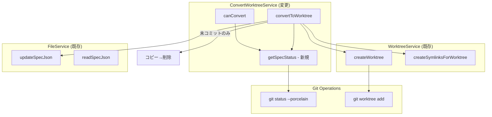
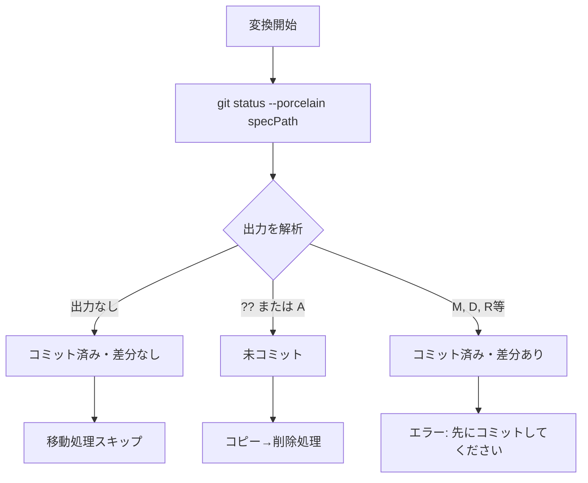
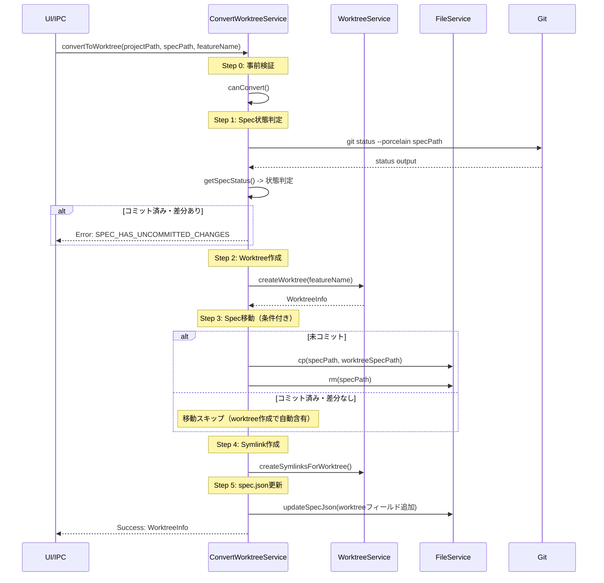

# Design: Worktree Convert Spec Optimization

## Overview

**Purpose**: この機能は、worktree変換時のspec処理を最適化する。specのgitコミット状態を判定し、git worktreeの仕組みを活用することで、不要なファイル操作を省略し、git状態の不整合を解消する。

**Users**: SDDワークフローを使用する開発者が、既存のspec（コミット済み/未コミット）をworktreeモードに変換する際に使用する。

**Impact**: ConvertWorktreeServiceの変換処理ロジックを変更し、specのgit状態に応じた処理分岐を追加する。

### Goals

- specのgitコミット状態（未コミット/コミット済み・差分なし/コミット済み・差分あり）を正確に判定する
- 未コミットspecのみ移動処理（コピー→削除）を実行する
- コミット済み・差分なしspecは移動処理をスキップし、git worktreeの自動含有を活用する
- コミット済み・差分ありの場合は明確なエラーを返し、先にコミットを促す
- spec.jsonのworktreeフィールドは全ケースで適切に更新する

### Non-Goals

- spec-merge処理の変更（現行のsquash merge動作で対応可能）
- UIでの警告表示（将来的に追加可能だが本specでは対象外）
- コミット済みspecの自動コミット機能
- `/kiro:spec-plan --worktree`（新規worktree作成）への変更

## Architecture

### Existing Architecture Analysis

現在のConvertWorktreeServiceの処理フロー:

1. `canConvert()`: 事前検証（mainブランチ、spec存在、非Worktreeモード、impl未開始）
2. `convertToWorktree()`:
   - worktree作成（branch + git worktree add）
   - **常にspecファイルをコピー→削除**
   - symlink作成（logs/runtime）
   - spec.json更新

**問題点**: specのgit状態を考慮せず一律でコピー→削除を行っているため:
- コミット済みspecの場合、main側でファイルがgit削除状態になる
- git worktreeの仕様ではコミット済みファイルは自動で含まれるため、コピーは不要

### Architecture Pattern & Boundary Map



**Architecture Integration**:
- Selected pattern: 既存のConvertWorktreeServiceを拡張し、git状態判定ロジックを追加
- Domain boundaries: spec状態判定はConvertWorktreeServiceの責務として追加
- Existing patterns preserved: エラーハンドリングのResult型パターン、依存性注入パターン
- New components rationale: 状態判定ロジックを`getSpecStatus()`メソッドとして追加し、判定結果に基づく分岐を実装
- Steering compliance: DRY（状態判定の一元化）、KISS（シンプルな3状態判定）

### Technology Stack

| Layer | Choice / Version | Role in Feature | Notes |
|-------|------------------|-----------------|-------|
| Backend | Node.js 20+, Electron 35 | 状態判定と変換処理 | 既存技術スタック |
| Git | git status --porcelain | spec状態判定 | gitコマンド出力解析 |

## System Flows

### Spec状態判定フロー



### 状態別処理フロー



## Requirements Traceability

| Criterion ID | Summary | Components | Implementation Approach |
|--------------|---------|------------|------------------------|
| 1.1 | worktree変換開始時にspec git状態確認 | ConvertWorktreeService.getSpecStatus | 新規メソッド実装 |
| 1.2 | 3状態の判別（未コミット/コミット済み・差分なし/コミット済み・差分あり） | ConvertWorktreeService.getSpecStatus | git status出力解析 |
| 1.3 | 複数状態混在時は最も制約の厳しい状態を採用 | ConvertWorktreeService.getSpecStatus | 優先度ロジック実装 |
| 2.1 | 未コミットspec時にコピー処理実行 | ConvertWorktreeService.convertToWorktree | 既存処理の条件分岐化 |
| 2.2 | コピー成功後にmain側spec削除 | ConvertWorktreeService.convertToWorktree | 既存処理維持 |
| 2.3 | コピー→削除の順序厳守 | ConvertWorktreeService.convertToWorktree | 既存処理維持 |
| 3.1 | コミット済み・差分なし時にコピースキップ | ConvertWorktreeService.convertToWorktree | 条件分岐追加 |
| 3.2 | コミット済み・差分なし時にmain側spec削除しない | ConvertWorktreeService.convertToWorktree | 条件分岐追加 |
| 3.3 | worktree側にspec存在確認 | ConvertWorktreeService.convertToWorktree | 検証ロジック追加 |
| 4.1 | コミット済み・差分あり時に変換中止 | ConvertWorktreeService.canConvert | 事前検証追加 |
| 4.2 | エラーメッセージ表示 | getConvertErrorMessage | 新規エラータイプ追加 |
| 4.3 | worktree/ブランチ未作成でエラー検出 | ConvertWorktreeService.canConvert | 事前検証で検出 |
| 5.1 | 成功時にworktree側spec.json更新 | ConvertWorktreeService.convertToWorktree | 既存処理維持 |
| 5.2 | worktreeフィールド内容 | ConvertWorktreeService.convertToWorktree | 既存処理維持 |
| 5.3 | コミット済み時にmain側spec.json更新しない | ConvertWorktreeService.convertToWorktree | 条件分岐追加（そもそもmain側は触らない） |

### Coverage Validation Checklist

- [x] Every criterion ID from requirements.md appears in the table above
- [x] Each criterion has specific component names (not generic references)
- [x] Implementation approach distinguishes "reuse existing" vs "new implementation"
- [x] User-facing criteria specify concrete UI components (not just "shared components")

## Components and Interfaces

| Component | Domain/Layer | Intent | Req Coverage | Key Dependencies | Contracts |
|-----------|--------------|--------|--------------|------------------|-----------|
| ConvertWorktreeService | Main/Service | Spec変換ロジック（拡張） | 1.1-5.3 | WorktreeService (P0), FileService (P0), Git (P0) | Service |
| getConvertErrorMessage | Main/Service | エラーメッセージ生成 | 4.2 | - | - |

### Main Process / Service Layer

#### ConvertWorktreeService (拡張)

| Field | Detail |
|-------|--------|
| Intent | specのgit状態を判定し、状態に応じた変換処理を実行 |
| Requirements | 1.1, 1.2, 1.3, 2.1, 2.2, 2.3, 3.1, 3.2, 3.3, 4.1, 4.2, 4.3, 5.1, 5.2, 5.3 |

**Responsibilities & Constraints**
- specのgitコミット状態を判定する
- 状態に応じて移動処理の実行/スキップを決定する
- コミット済み・差分ありの場合はエラーを返す
- worktree側のspec.jsonを適切に更新する

**Dependencies**
- Inbound: IPC Handler - 変換リクエスト受信 (P0)
- Outbound: WorktreeService - git worktree操作、git status (P0)
- Outbound: FileService - ファイル操作、spec.json更新 (P0)

**Contracts**: Service [x] / API [ ] / Event [ ] / Batch [ ] / State [ ]

##### Service Interface

```typescript
import type { WorktreeInfo, WorktreeServiceResult } from '../../renderer/types/worktree';

/**
 * Specのgitコミット状態
 * Requirements: 1.2
 */
export type SpecCommitStatus =
  | 'untracked'      // 未コミット（untracked または staged）
  | 'committed-clean' // コミット済み・差分なし
  | 'committed-dirty'; // コミット済み・差分あり

/**
 * Error types for ConvertWorktreeService operations
 * Requirements: 4.2 (新規エラータイプ追加)
 */
export type ConvertError =
  | { type: 'NOT_ON_MAIN_BRANCH'; currentBranch: string }
  | { type: 'SPEC_NOT_FOUND'; specPath: string }
  | { type: 'ALREADY_WORKTREE_MODE'; specPath: string }
  | { type: 'IMPL_ALREADY_STARTED'; specPath: string }
  | { type: 'SPEC_HAS_UNCOMMITTED_CHANGES'; specPath: string; files: string[] } // 新規
  | { type: 'BRANCH_CREATE_FAILED'; message: string }
  | { type: 'WORKTREE_CREATE_FAILED'; message: string }
  | { type: 'FILE_MOVE_FAILED'; message: string }
  | { type: 'SYMLINK_CREATE_FAILED'; message: string }
  | { type: 'SPEC_JSON_UPDATE_FAILED'; message: string }
  | { type: 'SPEC_NOT_IN_WORKTREE'; specPath: string }; // 新規

export type ConvertResult<T> =
  | { ok: true; value: T }
  | { ok: false; error: ConvertError };

export interface ConvertWorktreeService {
  /**
   * Specのgitコミット状態を取得する
   * Requirements: 1.1, 1.2, 1.3
   *
   * @param specPath - Specディレクトリの相対パス（.kiro/specs/{feature}）
   * @returns SpecCommitStatus
   *
   * 判定ロジック:
   * 1. git status --porcelain specPath を実行
   * 2. 出力が空 → committed-clean
   * 3. 出力に ?? または A がある → untracked（未コミット）
   * 4. 出力に M, D, R 等がある → committed-dirty（差分あり）
   * 5. 複数状態混在時: committed-dirty > untracked > committed-clean
   */
  getSpecStatus(specPath: string): Promise<ConvertResult<SpecCommitStatus>>;

  /**
   * 変換可能かどうかを検証する
   * Requirements: 4.1, 4.3
   *
   * 既存の検証に加えて:
   * - SPEC_HAS_UNCOMMITTED_CHANGES: コミット済みspecに未コミット変更がある場合
   */
  canConvert(
    projectPath: string,
    specPath: string
  ): Promise<ConvertResult<boolean>>;

  /**
   * 通常モードのSpecをWorktreeモードに変換する
   * Requirements: 2.1-3.3, 5.1-5.3
   *
   * 処理順序:
   * 1. 事前検証（canConvert）
   * 2. Spec状態判定（getSpecStatus）
   * 3. git worktree作成
   * 4. Specファイル移動（未コミットの場合のみ）
   * 5. Symlink作成
   * 6. spec.json更新（worktree側）
   * 7. worktree側にspec存在確認（コミット済み・差分なしの場合）
   */
  convertToWorktree(
    projectPath: string,
    specPath: string,
    featureName: string
  ): Promise<ConvertResult<WorktreeInfo>>;
}
```

- Preconditions:
  - specPathが存在し、spec.jsonが読み取り可能
  - 現在のブランチがmainまたはmaster
  - spec.json.worktree.pathが未設定（非Worktreeモード）
  - spec.json.worktree.branchが未設定（impl未開始）
  - **新規**: specがコミット済みの場合、未コミット変更がないこと
- Postconditions:
  - `.kiro/worktrees/specs/{featureName}/` にworktreeが作成される
  - 未コミットspecの場合: specディレクトリがworktree内に移動される
  - コミット済み・差分なしの場合: worktree内に自動でspecが含まれている
  - worktree内のspec.jsonにworktree設定が追加される
  - 未コミットspecの場合: main側の`.kiro/specs/{featureName}/`は削除される
  - コミット済み・差分なしの場合: main側の`.kiro/specs/{featureName}/`は残る
- Invariants:
  - エラー時は全ての変更がロールバックされる
  - spec.jsonは常に整合性のある状態を維持

**Implementation Notes**
- Integration: WorktreeServiceの`checkUncommittedSpecChanges()`を拡張して状態判定に利用
- Validation: canConvert()内で状態判定し、committed-dirtyの場合は早期エラー
- Risks:
  - コミット済み・差分なしの場合、worktree作成後にspec存在確認が必要
  - spec-merge時のコンフリクト（Open Question参照）

##### Error Message Function (拡張)

```typescript
/**
 * Get user-friendly error message for ConvertError
 * Requirements: 4.2
 */
export function getConvertErrorMessage(error: ConvertError): string {
  switch (error.type) {
    // ... 既存のケース ...
    case 'SPEC_HAS_UNCOMMITTED_CHANGES':
      return `Specに未コミットの変更があります。先にコミットしてください。\n変更ファイル: ${error.files.join(', ')}`;
    case 'SPEC_NOT_IN_WORKTREE':
      return `Worktree内にSpecが見つかりません: ${error.specPath}`;
    default:
      return '不明なエラーが発生しました';
  }
}
```

## Data Models

### Domain Model

#### SpecCommitStatus (新規)

```typescript
/**
 * Specディレクトリのgitコミット状態
 */
type SpecCommitStatus = 'untracked' | 'committed-clean' | 'committed-dirty';
```

#### 状態判定ロジック

```
git status --porcelain 出力パターン:
- 空 → committed-clean
- ?? file.md → untracked（未追跡ファイル）
- A  file.md → untracked（staged新規ファイル）
-  M file.md → committed-dirty（modified in working tree）
- M  file.md → committed-dirty（modified in index）
- MM file.md → committed-dirty（modified in both）
- D  file.md → committed-dirty（deleted）
- R  file.md → committed-dirty（renamed）

複数ファイルの状態判定:
1. ディレクトリ内の全ファイルの状態を取得
2. 優先度: committed-dirty > untracked > committed-clean
3. 1つでもcommitted-dirtyがあれば全体がcommitted-dirty
4. committed-dirtyがなくuntrackedがあればuntracked
5. 全てclean（出力なし）ならcommitted-clean
```

### Logical Data Model

**変換パターン別のディレクトリ状態**:

```
パターンA: 未コミットspec
変換前:
project/
├── .kiro/specs/my-feature/     # git未追跡
│   ├── spec.json
│   └── requirements.md

変換後:
project/
├── .kiro/specs/                # my-feature削除済み
├── .kiro/worktrees/specs/my-feature/  # git worktree
│   └── .kiro/specs/my-feature/        # コピーされたspec
│       ├── spec.json (worktree設定追加)
│       └── requirements.md

パターンB: コミット済み・差分なしspec
変換前:
project/
├── .kiro/specs/my-feature/     # gitコミット済み
│   ├── spec.json
│   └── requirements.md

変換後:
project/
├── .kiro/specs/my-feature/     # 残る（mainブランチ）
│   ├── spec.json
│   └── requirements.md
├── .kiro/worktrees/specs/my-feature/  # git worktree
│   └── .kiro/specs/my-feature/        # worktree作成で自動含有
│       ├── spec.json (worktree設定追加)
│       └── requirements.md

パターンC: コミット済み・差分あり（エラー）
変換前:
project/
├── .kiro/specs/my-feature/     # gitコミット済み + 未コミット変更
│   ├── spec.json               # modified
│   └── requirements.md

→ エラー: 先にコミットしてください
```

## Error Handling

### Error Strategy

事前検証（canConvert）で可能な限り早期にエラーを検出し、worktree作成前にユーザーにフィードバックする。

### Error Categories and Responses

**User Errors (事前検証エラー)**:
- `SPEC_HAS_UNCOMMITTED_CHANGES`: 「Specに未コミットの変更があります。先にコミットしてください。」
  - Requirement 4.2に対応
  - ユーザーアクション: `git add .kiro/specs/{feature} && git commit`

**System Errors (実行エラー)**:
- `SPEC_NOT_IN_WORKTREE`: 「Worktree内にSpecが見つかりません」
  - コミット済み・差分なしの場合にworktree作成後の検証で発生しうる
  - git worktreeの想定外動作を検出するセーフガード

### Monitoring

- 状態判定結果をINFOレベルでログ出力
- 状態に応じた処理分岐をDEBUGレベルでログ出力
- エラー発生時は詳細をERRORレベルで記録

## Testing Strategy

### Unit Tests

1. **getSpecStatus()**: 各git status出力パターンの解析
   - 空出力 → committed-clean
   - ?? パターン → untracked
   - M パターン → committed-dirty
   - 複数状態混在時の優先度判定
2. **canConvert() 拡張**: committed-dirty状態でのエラー返却
3. **convertToWorktree() 分岐**: 状態別の処理パス
   - 未コミット → コピー→削除実行
   - コミット済み・差分なし → コピースキップ、存在確認

### Integration Tests

1. **未コミットspec変換**: 完全な変換フロー
2. **コミット済み・差分なしspec変換**: 移動スキップ確認
3. **コミット済み・差分ありspec変換**: エラー確認

### E2E Tests

1. **正常系（未コミット）**: ボタンクリックから変換完了
2. **正常系（コミット済み）**: ボタンクリックから変換完了（移動なし）
3. **エラー系**: コミット済み・差分ありでエラー表示

## Design Decisions

### DD-001: git statusを使用した状態判定

| Field | Detail |
|-------|--------|
| Status | Accepted |
| Context | specのgitコミット状態を判定する方法。git status、git diff、git ls-filesなど複数の選択肢がある |
| Decision | `git status --porcelain specPath` を使用する |
| Rationale | 1. --porcelain出力は機械解析に適している。2. 1コマンドでuntracked/modified/stagedを全て検出可能。3. 既存のWorktreeServiceに`checkUncommittedSpecChanges()`が実装済みで、これを拡張できる |
| Alternatives Considered | 1. git diff --cached: stagedのみ検出、untrackedは検出不可。2. git ls-files: untrackedは--others必要で複雑 |
| Consequences | git status出力のパースロジックが必要だが、既存実装を参考にできる |

### DD-002: コミット済み・差分ありの場合のエラー戦略

| Field | Detail |
|-------|--------|
| Status | Accepted |
| Context | コミット済みspecに未コミット変更がある場合の対応。自動コミット、差分のみコピー、エラーの選択肢がある |
| Decision | エラーを返し「先にコミットしてください」と案内する |
| Rationale | 1. 自動コミットはユーザーの意図しないコミットを生む可能性がある。2. 差分のみコピーは複雑で、コミット履歴との整合性が取りにくい。3. 明示的なユーザーアクションを求める方が安全で予測可能 |
| Alternatives Considered | 1. 自動コミット: シンプルだがユーザー意図と異なる可能性。2. 差分コピー: 実装が複雑で、コミット履歴との不整合リスク |
| Consequences | ユーザーに追加の手順（コミット）を要求するが、git状態の一貫性が保たれる |

### DD-003: コミット済み・差分なしの場合のmain側spec保持

| Field | Detail |
|-------|--------|
| Status | Accepted |
| Context | コミット済みspecをworktree化する際、main側のspecをどう扱うか |
| Decision | main側にspecを残す（両方に存在する状態） |
| Rationale | 1. git worktreeの仕組み上、コミット済みファイルは自動でworktreeに含まれる。2. merge時にworktree側のspec.json（phase=deploy-complete）で上書きされるため、main側の明示的な削除は不要。3. 削除コミットを行うとコミット履歴が複雑になる |
| Alternatives Considered | 1. main側を削除: 削除コミットが必要で履歴が複雑化。2. main側をFS削除のみ: git状態が不整合になる |
| Consequences | main側とworktree側に一時的に同じspecが存在するが、merge時に自然に解決される |

### DD-004: Open Questionへの対応（spec.json差分問題）

| Field | Detail |
|-------|--------|
| Status | Accepted |
| Context | コミット済み・差分なしの場合、worktree側でspec.jsonを更新・コミットするとmain側との差分が発生する。spec-merge時に問題なく解決されるか |
| Decision | 現行のspec-mergeのsquash merge動作で問題なく解決される |
| Rationale | 1. spec-mergeはsquash mergeを使用し、worktree側の最終状態がmainに反映される。2. spec.jsonのworktreeフィールドはmerge時に削除され、phaseがdeploy-completeに更新される。3. 同じファイルの変更だが、semantic conflictではないため、squash mergeで後勝ちになる |
| Alternatives Considered | 特になし（現行動作で対応可能） |
| Consequences | merge時にspec.jsonの差分は自動解決される。コンフリクトが発生した場合もspec-mergeのコンフリクト解決ロジックで対応可能 |

### DD-005: 状態判定の優先度ルール

| Field | Detail |
|-------|--------|
| Status | Accepted |
| Context | specディレクトリ内に複数の状態（untracked, modified等）が混在する場合の扱い |
| Decision | 最も制約の厳しい状態を採用: committed-dirty > untracked > committed-clean |
| Rationale | 1. 1つでもcommitted-dirtyがあれば、そのファイルの変更を失う可能性がある。2. 安全側に倒すことで、ユーザーが意図しないデータ損失を防ぐ。3. シンプルで予測可能なルール |
| Alternatives Considered | 1. ファイルごとに個別処理: 実装が複雑で、エラーハンドリングが難しい。2. 多数決: 直感に反する結果になる可能性 |
| Consequences | 1つでもmodifiedファイルがあれば全体がcommitted-dirtyと判定され、ユーザーにコミットを促す |
