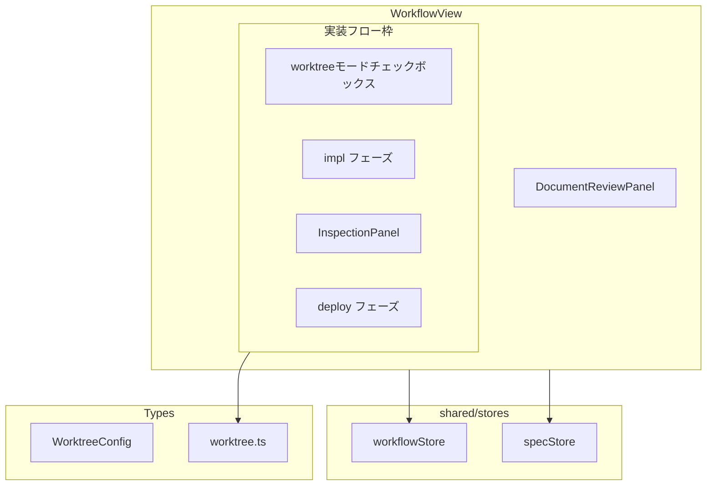
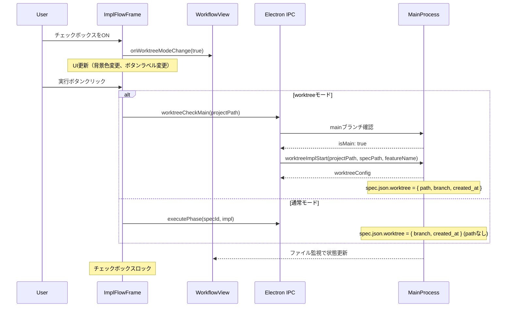
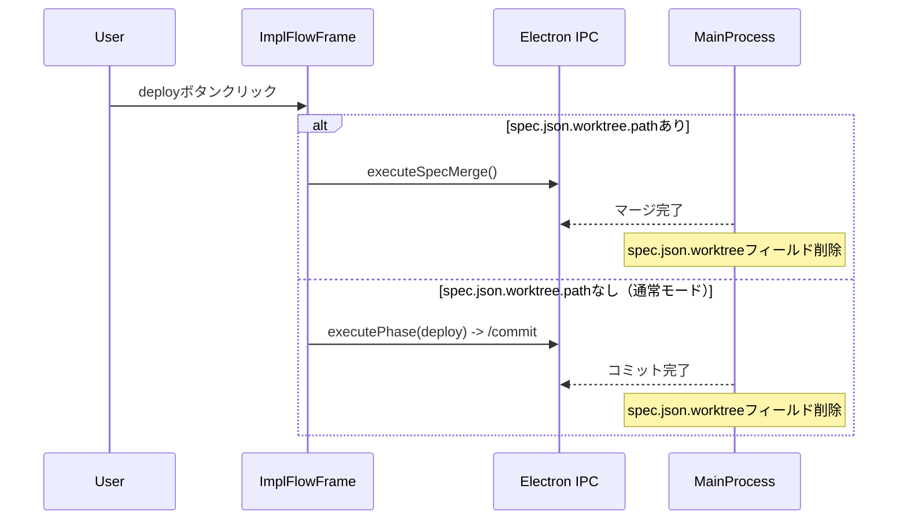
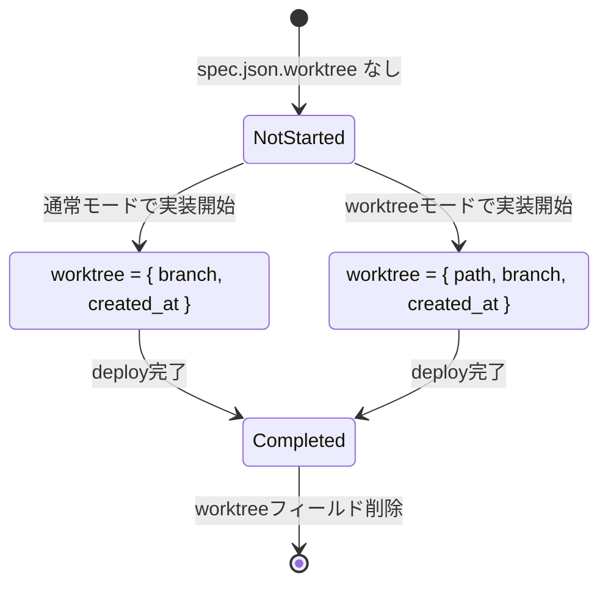

# Design: Worktree実行UIの改善

## Overview

**Purpose**: この機能は、Spec実装フローにおけるworktreeモードの選択と管理を改善する。現在の2ボタン選択UI（ImplStartButtons）を廃止し、チェックボックスによる事前モード選択と、実装フロー枠（impl, inspection, deploy）のグループ化を導入する。

**Users**: SDD Orchestratorを使用する開発者は、実装開始前にworktreeモードを選択し、実装フロー全体で一貫したモード管理が可能になる。

**Impact**: 既存のImplStartButtonsコンポーネントを廃止し、WorktreeConfig型、isWorktreeConfig関数を拡張し、WorkflowView内に新しい実装フロー枠UIを導入する。

### Goals

- impl, inspection, deployの3フェーズを視覚的にグループ化する実装フロー枠の追加
- チェックボックスによるworktreeモード切り替えと状態連動
- 実装開始後のモード変更ロック機能
- worktreeモードと通常モードに応じたUI表示の分岐
- ImplStartButtonsコンポーネントの廃止と移行

### Non-Goals

- worktreeの自動削除・クリーンアップ機能
- worktreeモードと通常モードの途中切り替え（実装開始後）
- 複数worktreeの同時管理
- worktreeパスのカスタマイズ
- Remote UIへの対応（本仕様はElectron UI専用）

## Architecture

### Existing Architecture Analysis

現在のワークフロー構造:
- `WorkflowView.tsx`: 6フェーズ（requirements, design, tasks, impl, inspection, deploy）を縦に配置
- `ImplStartButtons.tsx`: tasksフェーズapproved後に表示される2ボタンUI（「カレントブランチで実装」「Worktreeで実装」）
- `WorktreeConfig`: `{ path: string, branch: string, created_at: string }` - 全フィールド必須
- `isWorktreeConfig()`: pathフィールド必須で判定

変更が必要な点:
- `WorktreeConfig.path`をオプショナル化（通常モードでも`branch`と`created_at`を保存）
- `isWorktreeConfig()`を`branch`と`created_at`のみで判定に変更
- 新規`isActualWorktreeMode()`関数を追加（`path`存在で判定）
- ImplStartButtonsを廃止し、チェックボックス+実装フロー枠UIに置き換え

### Architecture Pattern & Boundary Map



**Architecture Integration**:
- 選択パターン: 既存のWorkflowView内に新規コンポーネント（ImplFlowFrame）を追加
- ドメイン境界: ワークフロー表示（renderer/components）と型定義（renderer/types）の分離を維持
- 既存パターン: PhaseItem、DocumentReviewPanel、InspectionPanelと同様の構造
- 新規コンポーネント: ImplFlowFrame（3フェーズをグループ化）、WorktreeModeCheckbox
- Steering準拠: DRY、SSOT（spec.jsonが唯一の状態源）

### Technology Stack

| Layer | Choice / Version | Role in Feature | Notes |
|-------|------------------|-----------------|-------|
| Frontend | React 19 + TypeScript 5.8+ | UI実装 | 既存スタック継続 |
| State | Zustand | worktreeモード状態管理 | workflowStore拡張 |
| Styling | Tailwind CSS 4 | 実装フロー枠のスタイリング | 既存パターン準拠 |

## System Flows

### worktreeモード選択から実装開始までのフロー



### deploy処理の分岐フロー



## Requirements Traceability

| Criterion ID | Summary | Components | Implementation Approach |
|--------------|---------|------------|------------------------|
| 1.1 | WorktreeConfig.pathをオプショナルに | `worktree.ts` | 既存型定義の修正 |
| 1.2 | worktreeモード時の保存形式 | `worktreeImplHandlers.ts` | 既存ロジック維持 |
| 1.3 | 通常モード時の保存形式 | `WorkflowView.tsx`, 新規IPC | 新規実装: startImplNormalMode |
| 1.4 | 実装未開始時はworktreeフィールドなし | 既存ロジック | 変更なし |
| 2.1 | isWorktreeConfig関数の改修 | `worktree.ts` | path不要、branch+created_at必須に変更 |
| 2.2 | isActualWorktreeMode関数の追加 | `worktree.ts` | 新規関数追加 |
| 2.3 | 実装開始済み判定 | `WorkflowView.tsx` | spec.json.worktree?.branch存在で判定 |
| 3.1 | 実装フロー枠の表示 | `ImplFlowFrame` | 新規コンポーネント |
| 3.2 | チェックボックスの配置 | `ImplFlowFrame` | ヘッダー領域に配置 |
| 3.3 | DocumentReviewPanelは枠外 | `WorkflowView.tsx` | 既存配置を維持 |
| 4.1 | チェックボックスの連動 | `workflowStore`, `ImplFlowFrame` | 単一state参照 |
| 4.2 | 即座反映 | `workflowStore` | Zustand reactivity |
| 4.3 | 既存worktree時の自動ON・変更不可 | `ImplFlowFrame` | isActualWorktreeMode判定 |
| 5.1 | 実装開始時のロック | `ImplFlowFrame` | spec.json.worktree.branch存在で判定 |
| 5.2 | branch存在時のロック | `ImplFlowFrame` | isWorktreeConfig判定 |
| 5.3 | deploy完了後のリセット | `specsWatcherService.ts` | phase: deploy-complete検知でworktree削除 |
| 5.4 | 自動実行中の変更可能 | `ImplFlowFrame` | isAutoExecutingではロックしない |
| 6.1 | worktreeモード時の背景色変更 | `ImplFlowFrame` | Tailwind CSS条件付きクラス |
| 6.2 | 実装ボタンラベル変更 | `PhaseItem` | props経由でラベル変更 |
| 6.3 | 検査パネル従来表示 | `InspectionPanel` | 変更なし |
| 6.4 | コミットパネルラベル変更 | `PhaseItem` | worktreeモード時「マージ」表示 |
| 7.1 | 通常モード時の背景維持 | `ImplFlowFrame` | デフォルトスタイル |
| 7.2 | 通常モード時のパネル表示維持 | 既存コンポーネント | 変更なし |
| 8.1 | ImplStartButtons非使用 | `WorkflowView.tsx` | インポート・使用削除 |
| 8.2 | 独立実装ボタン廃止 | `WorkflowView.tsx` | JSX削除 |
| 8.3 | PhaseItem実行ボタンでimpl実行 | `PhaseItem` | 既存機能維持 |
| 9.1 | 通常モード実装開始時の永続化 | 新規IPC handler | startImplNormalMode実装 |
| 9.2 | branch保存 | `fileService.ts` | カレントブランチ名取得・保存 |
| 9.3 | ファイル監視による更新 | 既存機構 | 変更なし |
| 10.1 | worktreeモード時のspec-merge実行 | `WorkflowView.tsx` | 既存ロジック維持 |
| 10.2 | 通常モード時の/commit実行 | `WorkflowView.tsx` | 既存ロジック維持 |
| 10.3 | deploy完了後のworktreeフィールド削除 | `specsWatcherService.ts` | 新規ロジック追加 |
| 11.1 | worktree情報表示の条件（path存在時のみ） | `SpecDetail.tsx` | isActualWorktreeMode判定 |
| 11.2 | 通常モード時の非表示 | `SpecDetail.tsx` | 条件付きレンダリング |
| 11.3 | SpecListのworktreeバッジ条件 | `SpecListItem.tsx` | isActualWorktreeMode判定 |

### Coverage Validation Checklist

- [x] 全criterion IDがテーブルに含まれている
- [x] 各criterionに具体的なコンポーネント名が記載されている
- [x] Implementation approachで「既存維持」と「新規実装」を区別
- [x] UI criterionに具体的なUIコンポーネントを指定

## Components and Interfaces

### Component Summary

| Component | Domain/Layer | Intent | Req Coverage | Key Dependencies | Contracts |
|-----------|--------------|--------|--------------|------------------|-----------|
| ImplFlowFrame | UI/Workflow | impl, inspection, deployを囲む実装フロー枠 | 3.1, 3.2, 4.1, 5.1, 6.1 | WorkflowView (P0), workflowStore (P0) | State |
| WorktreeModeCheckbox | UI/Workflow | worktreeモード切り替えチェックボックス | 4.1, 4.2, 4.3, 5.1, 5.2, 5.4 | workflowStore (P0) | State |
| worktree.ts | Types | WorktreeConfig型と判定関数 | 1.1, 2.1, 2.2, 2.3 | - | Service |

### UI / Workflow

#### ImplFlowFrame

| Field | Detail |
|-------|--------|
| Intent | impl, inspection, deployの3フェーズをグループ化し、worktreeモード切り替えUIを提供 |
| Requirements | 3.1, 3.2, 4.1, 5.1, 6.1, 6.2, 6.4, 7.1 |

**Responsibilities & Constraints**
- impl, inspection, deployフェーズを視覚的にグループ化
- ヘッダー領域にworktreeモードチェックボックスを配置
- worktreeモード時は背景色を変更（紫系）
- 実装開始後はチェックボックスをロック

**Dependencies**
- Inbound: WorkflowView - 親コンポーネントから呼び出し (P0)
- Outbound: PhaseItem - 各フェーズのレンダリング (P1)
- Outbound: InspectionPanel - inspection表示 (P1)
- Outbound: workflowStore - worktreeモード状態参照 (P0)
- Outbound: specStore - spec.json状態参照 (P0)

**Contracts**: State [x]

##### Props Interface

```typescript
interface ImplFlowFrameProps {
  /** spec.jsonからのworktree設定（undefined = 未開始） */
  worktreeConfig: WorktreeConfig | undefined;
  /** worktreeモードが選択されているか（UIの一時状態） */
  isWorktreeModeSelected: boolean;
  /** worktreeモード変更ハンドラ */
  onWorktreeModeChange: (enabled: boolean) => void;
  /** 実装開始済みか（spec.json.worktree?.branch存在で判定） */
  isImplStarted: boolean;
  /** 自動実行中か */
  isAutoExecuting: boolean;
  /** impl, inspection, deployのPhaseItem用props */
  phaseItemsProps: {
    impl: PhaseItemProps;
    inspection: InspectionPanelProps;
    deploy: PhaseItemProps;
  };
  /** タスク進捗情報 */
  taskProgress: TaskProgress | null;
  /** タスク実行ハンドラ */
  onExecuteTask: (taskId: string) => void;
  /** 子コンポーネントが実行可能か */
  canExecute: boolean;
}
```

**Implementation Notes**
- Integration: WorkflowViewのrender内で、既存のimpl/inspection/deployを囲む形で配置
- Validation: worktreeConfig?.path存在で「実際のworktreeモード」を判定
- Risks: 既存のPhaseItemやInspectionPanelのpropsを正しく透過する必要がある

#### WorktreeModeCheckbox

| Field | Detail |
|-------|--------|
| Intent | worktreeモードのOn/Offを切り替えるチェックボックス |
| Requirements | 4.1, 4.2, 4.3, 5.1, 5.2, 5.4 |

**Responsibilities & Constraints**
- チェックボックスの表示と状態管理
- ロック状態の表示（disabled + ツールチップ）
- 自動実行中は変更可能、実装開始後は変更不可

**Dependencies**
- Inbound: ImplFlowFrame - 親から呼び出し (P0)

**Contracts**: State [x]

##### Props Interface

```typescript
interface WorktreeModeCheckboxProps {
  /** チェック状態 */
  checked: boolean;
  /** 変更ハンドラ */
  onChange: (checked: boolean) => void;
  /** 無効化（ロック）状態 */
  disabled: boolean;
  /** ロック理由（ツールチップ表示用） */
  lockReason?: string;
}
```

### Types

#### worktree.ts 変更

| Field | Detail |
|-------|--------|
| Intent | WorktreeConfig型とworktreeモード判定関数の提供 |
| Requirements | 1.1, 2.1, 2.2, 2.3 |

**Contracts**: Service [x]

##### Type Definitions

```typescript
/**
 * Worktree configuration stored in spec.json
 * Requirement 1.1: path is now optional for normal mode support
 */
export interface WorktreeConfig {
  /** Relative path from main project root to worktree directory (optional) */
  path?: string;
  /** Branch name (feature/{feature-name} or current branch) */
  branch: string;
  /** Creation timestamp (ISO-8601) */
  created_at: string;
}

/**
 * Check if a value is a valid WorktreeConfig
 * Requirement 2.1: path is no longer required, only branch and created_at
 *
 * @param value - Value to check
 * @returns true if value has valid branch and created_at
 */
export function isWorktreeConfig(value: unknown): value is WorktreeConfig;

/**
 * Check if spec is in "actual" worktree mode (has path)
 * Requirement 2.2: Distinguishes actual worktree from normal mode
 *
 * @param specJson - SpecJson object
 * @returns true if spec.worktree.path exists
 */
export function isActualWorktreeMode(specJson: { worktree?: WorktreeConfig }): boolean;

/**
 * Check if implementation has started
 * Requirement 2.3: Uses worktree.branch existence
 *
 * @param specJson - SpecJson object
 * @returns true if spec.worktree?.branch exists
 */
export function isImplStarted(specJson: { worktree?: WorktreeConfig }): boolean;
```

### workflowStore 拡張

| Field | Detail |
|-------|--------|
| Intent | worktreeモード選択状態の管理 |
| Requirements | 4.1, 4.2 |

**Contracts**: State [x]

##### State Interface

```typescript
interface WorkflowStoreState {
  // ... 既存の状態 ...

  /** worktreeモードが選択されているか（UIの一時状態） */
  isWorktreeModeSelected: boolean;

  /** worktreeモード変更 */
  setWorktreeModeSelected: (enabled: boolean) => void;
}
```

## Data Models

### Domain Model

**WorktreeConfig（拡張）**

現在:
```typescript
interface WorktreeConfig {
  path: string;      // 必須
  branch: string;    // 必須
  created_at: string; // 必須
}
```

変更後:
```typescript
interface WorktreeConfig {
  path?: string;     // オプショナル（通常モードではなし）
  branch: string;    // 必須（実装開始の証）
  created_at: string; // 必須
}
```

**状態遷移**



### Logical Data Model

**spec.json worktreeフィールド**

| ケース | worktreeフィールド | 判定関数の結果 |
|--------|-------------------|----------------|
| 実装未開始 | なし | isWorktreeConfig: false, isActualWorktreeMode: false, isImplStarted: false |
| 通常モード実装中 | `{ branch, created_at }` | isWorktreeConfig: true, isActualWorktreeMode: false, isImplStarted: true |
| worktreeモード実装中 | `{ path, branch, created_at }` | isWorktreeConfig: true, isActualWorktreeMode: true, isImplStarted: true |
| deploy完了後 | なし | 上記NotStartedと同じ |

## Error Handling

### Error Categories and Responses

**User Errors**
- チェックボックス操作時のロック状態: disabled表示 + ツールチップで理由説明
- worktreeモード選択時のブランチ確認失敗: notify.error()でエラーメッセージ表示

**System Errors**
- spec.json書き込み失敗: notify.error() + ロールバック
- ファイル監視の遅延: 既存のspec.json監視機構に依存
- カレントブランチ名取得失敗: `getCurrentBranch()`のResult.errorを`notify.error()`で表示し、処理を中断。ユーザーにはgit環境の確認を促す

### Monitoring

- 既存のrenderer-error-loggingを使用
- notify.*()呼び出し時に自動的にプロジェクトログに記録

## Testing Strategy

### Unit Tests

- `worktree.ts`: isWorktreeConfig, isActualWorktreeMode, isImplStarted関数のテスト
- `WorktreeModeCheckbox`: チェック状態、disabled状態のレンダリングテスト
- `ImplFlowFrame`: worktreeモード時/通常モード時のUI差分テスト
- `workflowStore`: setWorktreeModeSelected状態更新テスト

### Integration Tests

- WorkflowView + ImplFlowFrame: チェックボックス操作からPhaseItem表示までの連携
- spec.json変更時のUI更新（ファイル監視経由）
- deploy完了時のworktreeフィールド削除とUI更新

### E2E Tests

- worktreeモード選択→実装開始→チェックボックスロックのフロー
- 通常モード実装開始→deploy完了→worktreeフィールド削除のフロー
- 既存worktree時のチェックボックス自動ON・変更不可の確認

## Design Decisions

### DD-001: WorktreeConfig.pathをオプショナルに変更

| Field | Detail |
|-------|--------|
| Status | Accepted |
| Context | 通常モードでも実装開始状態を永続化したいが、現在のWorktreeConfigはpathが必須。通常モードではworktreeパスは不要。 |
| Decision | WorktreeConfig.pathをオプショナル（`path?: string`）に変更する |
| Rationale | 通常モードでは`{ branch, created_at }`のみ保存し、worktreeモードでは`{ path, branch, created_at }`を保存。branchの存在で「実装開始済み」を判定でき、pathの存在で「実際のworktreeモードか」を判定できる。 |
| Alternatives Considered | 1. 別フィールド（implStarted: boolean）を追加 - 冗長、2. 別の型（NormalModeConfig / WorktreeModeConfig）を定義 - 複雑化 |
| Consequences | 既存のisWorktreeConfig関数をpath不要に変更し、新規isActualWorktreeMode関数を追加する必要がある。後方互換性は維持される（pathがある場合も動作）。 |

### DD-002: ImplStartButtonsの廃止とチェックボックスUIへの移行

| Field | Detail |
|-------|--------|
| Status | Accepted |
| Context | 現在の2ボタンUI（「カレントブランチで実装」「Worktreeで実装」）は実装開始時にのみモードを選択する。実装フロー全体（impl, inspection, deploy）で一貫したモード管理が困難。 |
| Decision | ImplStartButtonsを廃止し、実装フロー枠のヘッダーにチェックボックスを配置する |
| Rationale | 実装開始前にモードを選択し、実装開始後はロックすることで、フロー全体で一貫したモード管理が可能。視覚的にも3フェーズがグループ化されることでワークフローが明確になる。 |
| Alternatives Considered | 1. ImplStartButtonsを維持しつつチェックボックスも追加 - UI冗長化、2. 設定画面でモードを選択 - 直感的でない |
| Consequences | ImplStartButtons.tsxとそのテストファイルは廃止（削除または非使用化）。E2Eテストの更新も必要。 |

### DD-003: 実装フロー枠の範囲

| Field | Detail |
|-------|--------|
| Status | Accepted |
| Context | 実装フロー枠に何を含めるか。DocumentReviewPanelはtasksとimplの間にある。 |
| Decision | impl, inspection, deployの3フェーズのみを枠で囲む。DocumentReviewPanelは枠外に配置。 |
| Rationale | DocumentReviewPanelは「実装準備完了」の確認であり、実装フロー（impl→inspection→deploy）とは概念的に別。worktreeモードの選択は実装フローに関係するため、その枠内にチェックボックスを配置するのが自然。 |
| Alternatives Considered | DocumentReviewPanelも含める - 概念的に不整合 |
| Consequences | UI階層がWorkflowView > DocumentReviewPanel > ImplFlowFrame > (impl, inspection, deploy)となる |

### DD-004: チェックボックスのロックタイミング

| Field | Detail |
|-------|--------|
| Status | Accepted |
| Context | いつチェックボックスを変更不可にするか。自動実行中も含めるか。 |
| Decision | 実装開始後（spec.json.worktree.branch存在時）にロック。自動実行中でも実装開始前なら変更可能。 |
| Rationale | 自動実行中でも、まだrequirements/design/tasksフェーズであればworktreeモードの選択を変更しても問題ない。実装開始後はブランチが作成されているため変更不可にする必要がある。 |
| Alternatives Considered | 自動実行開始時にロック - 柔軟性が低下 |
| Consequences | ロック判定は`spec.json.worktree?.branch`の存在で行う。自動実行状態（isAutoExecuting）はロック判定に使用しない。 |

### DD-005: deploy完了後のworktreeフィールド削除

| Field | Detail |
|-------|--------|
| Status | Accepted |
| Context | deploy完了後、worktreeフィールドを削除するか維持するか。通常モードとworktreeモード両方で同じ処理にするか。 |
| Decision | deploy完了後、worktreeモード・通常モード両方でspec.json.worktreeフィールドを削除する |
| Rationale | 次の実装サイクルのために状態をリセット。フィールドが残っていると「実装開始済み」と誤判定される。両モードで同じ処理にすることで一貫性を保つ。 |
| Alternatives Considered | 1. worktreeフィールドを維持して履歴として使用 - 複雑化、2. worktreeモードのみ削除 - 一貫性がない |
| Consequences | specsWatcherServiceでphase: deploy-complete検知時にworktreeフィールド削除ロジックを追加 |

### DD-006: チェックボックス連動の実装

| Field | Detail |
|-------|--------|
| Status | Accepted |
| Context | 実装フロー枠内のチェックボックスと自動実行ボタン横のチェックボックスをどう連動させるか。 |
| Decision | workflowStoreに単一のisWorktreeModeSelected状態を持ち、両方のチェックボックスがこれを参照・更新する |
| Rationale | SSOT原則に従い、状態を一箇所で管理。Zustandのreactivityにより、一方の変更が自動的に他方に反映される。 |
| Alternatives Considered | 1. 各コンポーネントでローカル状態を持ち同期 - 複雑化・バグの温床、2. Context APIを使用 - Zustand既存なので不要 |
| Consequences | workflowStoreにisWorktreeModeSelectedとsetWorktreeModeSelectedを追加 |
| **Scope Clarification** | **本仕様ではImplFlowFrameヘッダー内にチェックボックスを1つ配置する。Requirements 4.1の「両方のチェックボックス」は将来的な拡張可能性を想定した記載であり、本仕様のスコープではImplFlowFrame内のチェックボックスのみを実装する。** |
