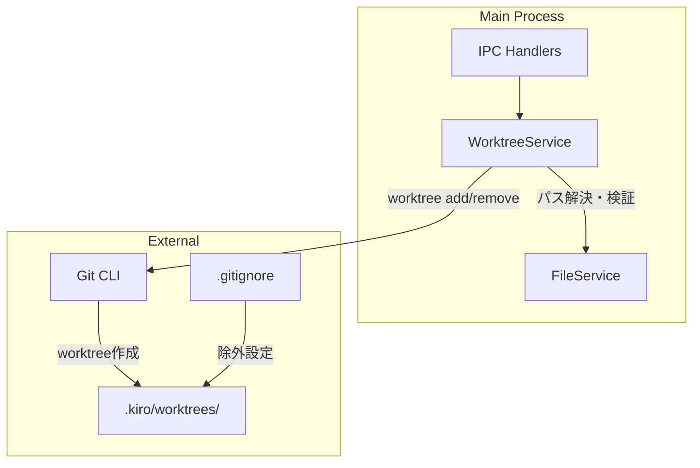
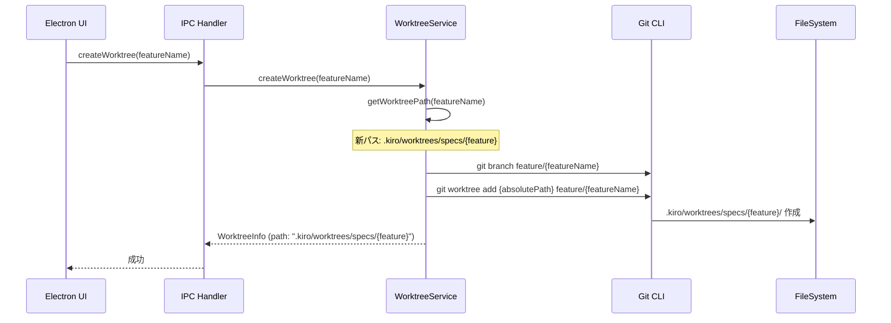

# Design: Worktree Internal Path

## Overview

**Purpose**: Worktree作成場所をプロジェクト外（`../{project}-worktrees/`）からプロジェクト内（`.kiro/worktrees/`）に変更し、SDD成果物の一元管理、ポータビリティ向上、直感的なフォルダ構造を実現する。

**Users**: SDDワークフローを使用する開発者およびAI Agent。worktreeが`.kiro/`配下に集約されることで、プロジェクト構造の理解が容易になり、リポジトリのポータビリティも向上する。

**Impact**: 既存のWorktreeService、関連IPCハンドラ、セキュリティバリデーション、ドキュメント類を変更。後方互換性は提供しない（移行コストより設計のシンプルさを優先）。

### Goals
- Worktree作成場所を`.kiro/worktrees/specs/{feature}/`および`.kiro/worktrees/bugs/{bug}/`に変更
- `.gitignore`に`.kiro/worktrees/`を追加し、git管理対象外化
- セキュリティバリデーションを「プロジェクトディレクトリ内」に更新
- 関連ドキュメント（skill-reference.md、既存spec仕様書）を更新

### Non-Goals
- 後方互換性（既存の`../{project}-worktrees/`からの移行機能）
- worktree作成場所のカスタマイズ機能
- レガシーパス検出・クリーンアップ機能

## Architecture

### Existing Architecture Analysis

現在のworktree実装は以下の構造：
- **WorktreeService**: `getWorktreePath`, `getBugWorktreePath`でパスを生成し、`resolveWorktreePath`でセキュリティ検証
- **パス形式**: 相対パス`../{project}-worktrees/{feature}`（プロジェクト外）
- **セキュリティ検証**: 親ディレクトリ内に収まることを検証

本機能では、パス生成ロジックとセキュリティ検証ロジックを変更し、プロジェクト内（`.kiro/worktrees/`）に配置するよう修正する。

### Architecture Pattern & Boundary Map



**Architecture Integration**:
- Selected pattern: 既存WorktreeServiceのパス生成ロジック変更（内部実装変更のみ、インタフェース維持）
- Domain/feature boundaries: worktree操作はWorktreeServiceに集約（変更なし）
- Existing patterns preserved: IPC handler -> Service -> External のフロー
- New components rationale: 新規コンポーネントなし、既存コンポーネントの内部変更のみ
- Steering compliance: SSOT（.kiro配下にSDD成果物を集約）、KISS（後方互換性を排除しシンプルに）

### Technology Stack

| Layer | Choice / Version | Role in Feature | Notes |
|-------|------------------|-----------------|-------|
| Backend / Services | Node.js child_process | git CLI実行 | 既存パターン維持 |
| Data / Storage | spec.json, bug.json | worktree.path相対パス保存 | パス形式変更 |
| Infrastructure / Runtime | Git 2.x+ | worktree操作 | 変更なし |
| Configuration | .gitignore | worktreeディレクトリ除外 | 1行追加 |

## System Flows

### Worktree Creation Flow（変更後）



## Requirements Traceability

| Criterion ID | Summary | Components | Implementation Approach |
|--------------|---------|------------|------------------------|
| 1.1 | Spec用worktreeを`.kiro/worktrees/specs/{feature}/`に配置 | WorktreeService.getWorktreePath | 既存メソッド修正: パス形式変更 |
| 1.2 | Bug用worktreeを`.kiro/worktrees/bugs/{bug}/`に配置 | WorktreeService.getBugWorktreePath | 既存メソッド修正: パス形式変更 |
| 1.3 | spec.json/bug.jsonに相対パス格納 | WorktreeService | 既存動作維持（パス形式のみ変更） |
| 1.4 | ブランチ命名規則維持 | WorktreeService | 変更なし |
| 2.1 | `.gitignore`に`.kiro/worktrees/`追加 | .gitignore | ドキュメント更新 |
| 2.2 | worktree内ファイルがgit statusに表示されない | .gitignore | .gitignore設定による |
| 3.1 | パスがプロジェクトディレクトリ内であることを検証 | WorktreeService.resolveWorktreePath | 既存メソッド修正: 検証ロジック変更 |
| 3.2 | プロジェクト外パスでエラー | WorktreeService.resolveWorktreePath | 既存メソッド修正 |
| 3.3 | `..`含む相対パスでもプロジェクト内なら許可 | WorktreeService.resolveWorktreePath | 既存メソッド修正 |
| 4.1 | getWorktreePath戻り値変更 | WorktreeService.getWorktreePath | 既存メソッド修正 |
| 4.2 | getBugWorktreePath戻り値変更 | WorktreeService.getBugWorktreePath | 既存メソッド修正 |
| 4.3 | createWorktree新パス使用 | WorktreeService.createWorktree | 既存メソッド内部変更なし（getWorktreePath依存） |
| 4.4 | createBugWorktree新パス使用 | WorktreeService.createBugWorktree | 既存メソッド内部変更なし（getBugWorktreePath依存） |
| 4.5 | removeWorktree新パス使用 | WorktreeService.removeWorktree | 既存メソッド内部変更なし（getWorktreePath依存） |
| 4.6 | removeBugWorktree新パス使用 | WorktreeService.removeBugWorktree | 既存メソッド内部変更なし（getBugWorktreePath依存） |
| 5.1 | skill-reference.mdパス記述更新 | skill-reference.md | ドキュメント更新 |
| 5.2 | git-worktree-support仕様書更新 | git-worktree-support design.md | ドキュメント更新 |
| 5.3 | bugs-worktree-support仕様書更新 | bugs-worktree-support design.md | ドキュメント更新 |

### Coverage Validation Checklist

- [x] Every criterion ID from requirements.md appears in the table above
- [x] Each criterion has specific component names (not generic references)
- [x] Implementation approach distinguishes "reuse existing" vs "new implementation"
- [x] User-facing criteria specify concrete UI components

## Components and Interfaces

| Component | Domain/Layer | Intent | Req Coverage | Key Dependencies | Contracts |
|-----------|--------------|--------|--------------|------------------|-----------|
| WorktreeService | Main/Service | git worktree操作、パス生成・検証 | 1.1-1.4, 3.1-3.3, 4.1-4.6 | Git CLI (P0) | Service |
| .gitignore | Configuration | worktreeディレクトリ除外設定 | 2.1-2.2 | - | - |
| skill-reference.md | Documentation | worktreeパス記述 | 5.1 | - | - |
| git-worktree-support design.md | Documentation | Spec worktreeパス記述 | 5.2 | - | - |
| bugs-worktree-support design.md | Documentation | Bug worktreeパス記述 | 5.3 | - | - |

### Main/Service

#### WorktreeService（変更）

| Field | Detail |
|-------|--------|
| Intent | git worktree操作のラッパー、パス生成・セキュリティ検証 |
| Requirements | 1.1, 1.2, 1.3, 1.4, 3.1, 3.2, 3.3, 4.1, 4.2, 4.3, 4.4, 4.5, 4.6 |

**Responsibilities & Constraints**
- worktreeパスの生成（`.kiro/worktrees/specs/`および`.kiro/worktrees/bugs/`）
- セキュリティ検証（プロジェクトディレクトリ内であることの確認）
- git worktree add/remove操作（変更なし）

**Dependencies**
- Outbound: Git CLI - worktree操作 (P0)
- Outbound: path - パス解決 (P0)

**Contracts**: Service [x]

##### Service Interface（変更箇所）

```typescript
/**
 * Get worktree path for a feature
 * Requirements: 1.1, 4.1
 *
 * @param featureName - Feature name
 * @returns Object with relative and absolute paths
 *
 * 変更前: { relative: '../{project}-worktrees/{feature}', absolute: '...' }
 * 変更後: { relative: '.kiro/worktrees/specs/{feature}', absolute: '...' }
 */
getWorktreePath(featureName: string): { relative: string; absolute: string };

/**
 * Get worktree path for a bug
 * Requirements: 1.2, 4.2
 *
 * @param bugName - Bug name
 * @returns Object with relative and absolute paths
 *
 * 変更前: { relative: '../{project}-worktrees/bugs/{bug}', absolute: '...' }
 * 変更後: { relative: '.kiro/worktrees/bugs/{bug}', absolute: '...' }
 */
getBugWorktreePath(bugName: string): { relative: string; absolute: string };

/**
 * Resolve a relative worktree path to absolute path
 * Requirements: 3.1, 3.2, 3.3
 *
 * @param relativePath - Relative path from spec.json/bug.json
 * @returns Absolute path
 * @throws Error if path validation fails
 *
 * セキュリティ検証（変更）:
 * - path.resolve + path.normalize でパス正規化
 * - 変更前: プロジェクト親ディレクトリ内に収まることを検証
 * - 変更後: プロジェクトディレクトリ内に収まることを検証
 */
resolveWorktreePath(relativePath: string): string;
```

**Implementation Notes**
- getWorktreePath: パス形式を`../{project}-worktrees/{feature}`から`.kiro/worktrees/specs/{feature}`に変更
- getBugWorktreePath: パス形式を`../{project}-worktrees/bugs/{bug}`から`.kiro/worktrees/bugs/{bug}`に変更
- resolveWorktreePath: 検証基準を親ディレクトリからプロジェクトディレクトリに変更
- createWorktree, createBugWorktree, removeWorktree, removeBugWorktree: 内部ロジック変更不要（getWorktreePath/getBugWorktreePathに依存）

## Data Models

### Logical Data Model

**パス形式の変更**:

| 項目 | 変更前 | 変更後 |
|------|--------|--------|
| Spec worktree相対パス | `../{project}-worktrees/{feature}` | `.kiro/worktrees/specs/{feature}` |
| Bug worktree相対パス | `../{project}-worktrees/bugs/{bug}` | `.kiro/worktrees/bugs/{bug}` |
| セキュリティ検証基準 | 親ディレクトリ内 | プロジェクトディレクトリ内 |

**spec.json/bug.json worktree.path フィールド**:
- 変更前例: `"path": "../my-project-worktrees/my-feature"`
- 変更後例: `"path": ".kiro/worktrees/specs/my-feature"`

### Directory Structure

変更後のディレクトリ構造:

```
{project}/
├── .kiro/
│   ├── specs/
│   │   └── {feature}/
│   │       ├── spec.json
│   │       ├── requirements.md
│   │       ├── design.md
│   │       └── tasks.md
│   ├── bugs/
│   │   └── {bug}/
│   │       ├── bug.json
│   │       ├── report.md
│   │       └── ...
│   ├── worktrees/           # 新規ディレクトリ（git管理対象外）
│   │   ├── specs/
│   │   │   └── {feature}/   # Spec用worktree
│   │   └── bugs/
│   │       └── {bug}/       # Bug用worktree
│   └── steering/
├── .gitignore               # .kiro/worktrees/ 追加
└── ...
```

## Error Handling

### Error Strategy

**セキュリティ検証エラー**:
- 検証失敗時は`PATH_VALIDATION_ERROR`をthrow
- エラーメッセージ: `"Path validation failed: {relativePath} resolves outside project directory"`

### Error Categories and Responses

**System Errors (5xx)**:
- パスがプロジェクト外を指す場合: エラーをthrowし、呼び出し元でハンドリング

**変更なし**: 既存のエラーハンドリングパターン（NOT_ON_MAIN_BRANCH, WORKTREE_EXISTS, BRANCH_EXISTS, GIT_ERROR）は維持

## Testing Strategy

### Unit Tests
- WorktreeService.getWorktreePath: 新パス形式（`.kiro/worktrees/specs/{feature}`）を返すこと
- WorktreeService.getBugWorktreePath: 新パス形式（`.kiro/worktrees/bugs/{bug}`）を返すこと
- WorktreeService.resolveWorktreePath: プロジェクト内パスを許可し、プロジェクト外パスをrejectすること
- WorktreeService.resolveWorktreePath: `..`を含むがプロジェクト内に解決されるパスを許可すること

### Integration Tests
- worktree作成から削除までのフロー（新パスで動作確認）
- spec.json/bug.jsonへの相対パス保存（新形式）

## Design Decisions

### DD-001: プロジェクト内配置（`.kiro/worktrees/`）の採用

| Field | Detail |
|-------|--------|
| Status | Accepted |
| Context | Worktree作成場所を決定する必要がある。現行は`../{project}-worktrees/`（プロジェクト外） |
| Decision | `.kiro/worktrees/`（プロジェクト内）に配置 |
| Rationale | SSOT原則に合致（.kiro配下にSDD成果物を集約）、Auto-Claudeの`.auto-claude/worktrees/`と同様の構造で直感的、`.gitignore`に1行追加で対応可能、メタデータ（specs/bugs）と作業ディレクトリ（worktrees）の適切な分離 |
| Alternatives Considered | A: 現行維持（`../{project}-worktrees/`）- プロジェクト外は直感的でない、B: `.worktrees/`（トップレベル）- .kiro配下の方が一貫性あり、C: `.kiro/specs/{name}/worktree/`（各specフォルダ内）- worktreeはメタデータではなく作業ディレクトリなので分離が適切 |
| Consequences | 既存worktreeとの互換性なし（移行機能は提供しない）、`.gitignore`更新が必要 |

### DD-002: 後方互換性の排除

| Field | Detail |
|-------|--------|
| Status | Accepted |
| Context | 既存の`../{project}-worktrees/`方式との互換性をどうするか |
| Decision | 後方互換性は不要（移行機能は提供しない） |
| Rationale | 移行コストより設計のシンプルさを優先。レガシーパス検出・移行ロジックを実装すると複雑化する。既存worktreeは手動で削除し、新方式で再作成すれば良い |
| Alternatives Considered | 自動移行機能の提供 - 実装コストが高く、一時的な機能となる |
| Consequences | 既存worktreeは手動削除が必要、新規worktreeから新パス適用 |

### DD-003: セキュリティ検証基準の変更

| Field | Detail |
|-------|--------|
| Status | Accepted |
| Context | `resolveWorktreePath`のセキュリティ検証基準を変更する必要がある |
| Decision | 検証基準を「親ディレクトリ内」から「プロジェクトディレクトリ内」に変更 |
| Rationale | worktreeがプロジェクト内に配置されるため、プロジェクト外へのパストラバーサルを防止する必要がある。`.kiro/worktrees/`はプロジェクト内なので、プロジェクトディレクトリ内であることを検証すれば十分 |
| Alternatives Considered | 検証なし - セキュリティリスク |
| Consequences | `..`を含む相対パスでもプロジェクト内に解決される場合は許可（例: `.kiro/worktrees/../worktrees/specs/feat`は許可） |

### DD-004: ディレクトリ構造の分離

| Field | Detail |
|-------|--------|
| Status | Accepted |
| Context | Spec用とBug用のworktreeを同じディレクトリに置くか分離するか |
| Decision | `.kiro/worktrees/specs/`と`.kiro/worktrees/bugs/`で分離 |
| Rationale | 現行の`bugs/`サブディレクトリパターンを維持し、一貫性を保つ。ファイルシステム上でSpec用とBug用が明確に分離され、管理が容易 |
| Alternatives Considered | 分離なし（`.kiro/worktrees/{name}`）- Spec/Bugの区別が困難 |
| Consequences | パス生成ロジックでspecs/およびbugs/サブディレクトリを考慮 |

### DD-005: 相対パス形式の維持

| Field | Detail |
|-------|--------|
| Status | Accepted |
| Context | spec.json/bug.jsonに保存するworktree.pathの形式 |
| Decision | 相対パス形式を維持（`.kiro/worktrees/specs/{feature}`） |
| Rationale | プロジェクトの移植性を確保。絶対パスだとプロジェクト移動時に無効になる |
| Alternatives Considered | 絶対パス - 移植性が低下 |
| Consequences | パス解決時に`path.resolve`で絶対パス変換が必要（既存動作維持） |

## Supporting References

### 現行コード（変更対象）

**WorktreeService.getWorktreePath（変更前）**:
```typescript
getWorktreePath(featureName: string): { relative: string; absolute: string } {
  const worktreeDir = `${this.projectName}-worktrees`;
  const relative = `../${worktreeDir}/${featureName}`;
  const absolute = path.resolve(this.projectPath, relative);
  return { relative, absolute };
}
```

**WorktreeService.getBugWorktreePath（変更前）**:
```typescript
getBugWorktreePath(bugName: string): { relative: string; absolute: string } {
  const worktreeDir = `${this.projectName}-worktrees`;
  const relative = `../${worktreeDir}/bugs/${bugName}`;
  const absolute = path.resolve(this.projectPath, relative);
  return { relative, absolute };
}
```

**WorktreeService.resolveWorktreePath（変更前）**:
```typescript
resolveWorktreePath(relativePath: string): string {
  const resolved = path.resolve(this.projectPath, relativePath);
  const normalized = path.normalize(resolved);

  // Security check: path must be within parent directory of project
  const parentDir = path.dirname(this.projectPath);
  if (!normalized.startsWith(parentDir)) {
    throw new Error(`Path validation failed: ${relativePath} resolves outside parent directory`);
  }

  return normalized;
}
```
