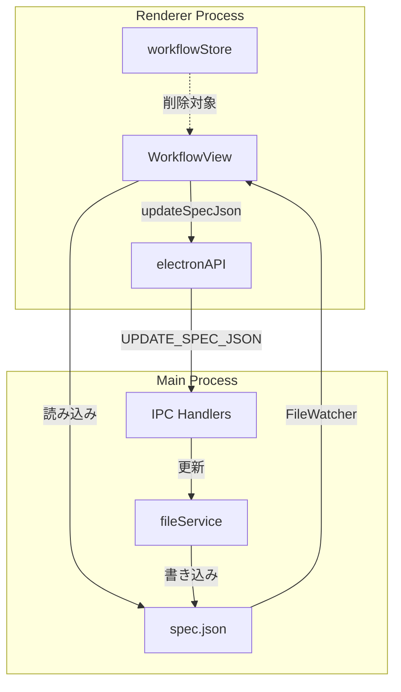
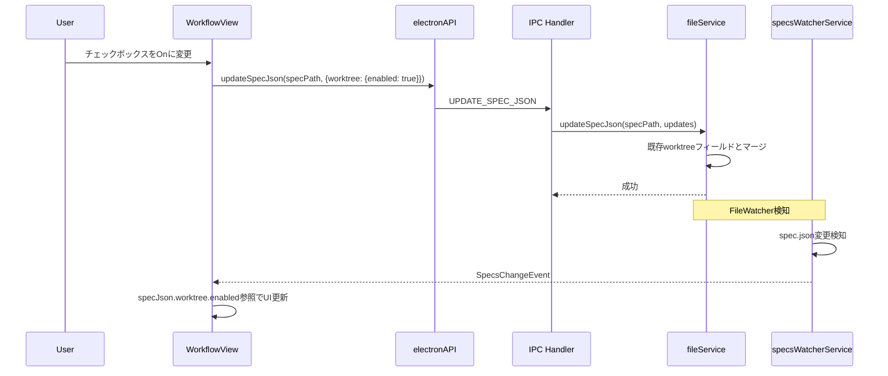
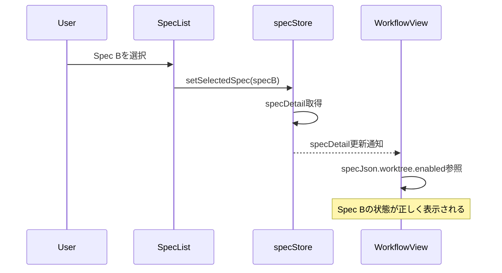

# Design: Worktree Mode Spec-Scoped

## Overview

**Purpose**: worktreeモードのチェックボックス状態をグローバルストア（workflowStore）からSpec単位の永続ストレージ（spec.json）に移行する。これにより、Spec切り替え時に正しい状態が表示され、複数Spec間での状態共有問題を解決する。

**Users**: SDD Orchestrator利用者（開発者）がworktreeモードを使用してSpec実装を行う際、Spec切り替え時に混乱なく作業を継続できる。

**Impact**: 現在の`workflowStore.worktreeModeSelection`状態管理を`spec.json.worktree.enabled`に移行。グローバル状態の削除とUIロジックの変更を伴う。

### Goals
- worktreeモード選択状態をSpec単位で永続化する
- Spec切り替え時に正しいworktreeモード状態を表示する
- 既存spec.jsonとの後方互換性を維持する
- 不要なグローバルストア状態をクリーンアップする

### Non-Goals
- `init.json`テンプレートの変更
- `hasWorktreePath`を使用している既存ロジックの変更
- Bug用worktreeモード管理（`BugWorktreeConfig`は別管理）
- Remote UI対応（本機能はElectron UI専用）

## Architecture

### Existing Architecture Analysis

**現状の問題点**:
- `workflowStore.worktreeModeSelection`はグローバル状態であり、Spec切り替え時にリセットされない
- Spec AでworktreeモードをOnにすると、Spec Bに切り替えてもOnのまま表示される
- `spec.json.worktree`フィールドはworktree作成後のメタデータ用であり、選択状態は含まない

**変更箇所の特定**:
- `WorktreeConfig`型（`renderer/types/worktree.ts`）: `enabled`フィールド追加
- `WorkflowView`コンポーネント: checkbox状態の読み書きロジック変更
- `workflowStore`: 不要な状態・アクションの削除
- `spec.json`更新: `window.electronAPI.updateSpecJson`を使用

### Architecture Pattern & Boundary Map



**Architecture Integration**:
- Selected pattern: SSOT（Single Source of Truth）- `spec.json`をworktreeモード選択の唯一の真実源とする
- Domain boundaries: Spec単位でのworktree設定管理（既存パターンに準拠）
- Existing patterns preserved: `updateSpecJson` IPC、FileWatcher経由のUI更新
- New components rationale: 型拡張のみ、新規コンポーネント不要

### Technology Stack

| Layer | Choice / Version | Role in Feature | Notes |
|-------|------------------|-----------------|-------|
| Frontend | React 19, Zustand | チェックボックスUI、状態クリーンアップ | 既存構成を使用 |
| IPC | Electron IPC | spec.json更新通信 | 既存`updateSpecJson`チャンネル |
| Data | spec.json (JSON file) | worktree.enabled永続化 | 既存ファイルフォーマット拡張 |

## System Flows

### worktreeモード選択時のデータフロー



### Spec切り替え時のデータフロー



## Requirements Traceability

| Criterion ID | Summary | Components | Implementation Approach |
|--------------|---------|------------|------------------------|
| 1.1 | `WorktreeConfig`に`enabled?: boolean`追加 | `worktree.ts` | 既存型にoptionalフィールド追加 |
| 1.2 | `enabled`はoptionalで後方互換性維持 | `worktree.ts` | TypeScriptのoptional型を使用 |
| 1.3 | `isWorktreeConfig`型ガード動作維持 | `worktree.ts` | 既存ロジック変更不要 |
| 2.1 | チェックボックス変更時に`spec.json`更新 | `WorkflowView.tsx` | `handleWorktreeModeChange`修正 |
| 2.2 | `updateSpecJson` IPC使用 | `WorkflowView.tsx` | 既存APIを使用 |
| 2.3 | UI即座反映（FileWatcher経由） | `specsWatcherService` | 既存仕組みを使用 |
| 3.1 | `isWorktreeModeSelected`が`spec.json.worktree.enabled`参照 | `WorkflowView.tsx` | useMemoロジック修正 |
| 3.2 | `hasWorktreePath`がtrueなら強制worktreeモード | `WorkflowView.tsx` | 既存ロジック維持 |
| 3.3 | `enabled`がundefined/falseならOff表示 | `WorkflowView.tsx` | falsy判定を使用 |
| 4.1 | `worktreeModeSelection`状態削除 | `workflowStore.ts` | 状態フィールド削除 |
| 4.2 | `setWorktreeModeSelection`アクション削除 | `workflowStore.ts` | アクション削除 |
| 4.3 | `resetWorktreeModeSelection`アクション削除 | `workflowStore.ts` | アクション削除 |
| 4.4 | `WorktreeModeSelection`型削除 | `workflowStore.ts` | 型定義削除 |
| 4.5 | 関連テストコード削除/更新 | `workflowStore.test.ts` | 該当テスト削除 |
| 5.1 | `worktree`なしでチェックボックスOnで`{enabled: true}`設定 | `WorkflowView.tsx` | 新規オブジェクト作成 |
| 5.2 | 既存`worktree`ある場合`enabled`のみ更新 | `WorkflowView.tsx` | スプレッド演算子でマージ |

### Coverage Validation Checklist

- [x] Every criterion ID from requirements.md appears in the table above
- [x] Each criterion has specific component names (not generic references)
- [x] Implementation approach distinguishes "reuse existing" vs "new implementation"
- [x] User-facing criteria specify concrete UI components

## Components and Interfaces

| Component | Domain/Layer | Intent | Req Coverage | Key Dependencies | Contracts |
|-----------|--------------|--------|--------------|------------------|-----------|
| WorktreeConfig | Types | worktree設定の型定義 | 1.1, 1.2, 1.3 | - | Type |
| WorkflowView | UI | worktreeチェックボックス表示・操作 | 2.1-2.3, 3.1-3.3, 5.1-5.2 | specStore (P0), electronAPI (P0) | State |
| workflowStore | State | 不要状態のクリーンアップ | 4.1-4.5 | - | State |

### Types Layer

#### WorktreeConfig (Extended)

| Field | Detail |
|-------|--------|
| Intent | worktree設定の型定義。`enabled`フィールド追加 |
| Requirements | 1.1, 1.2, 1.3 |

**Responsibilities & Constraints**
- worktree設定のスキーマ定義
- 後方互換性維持（`enabled`はoptional）
- `isWorktreeConfig`型ガードは`enabled`の有無に影響されない

**Contracts**: Type [x]

##### Type Definition

```typescript
// worktree.ts - 既存型の拡張
export interface WorktreeConfig {
  /** Relative path from main project root to worktree directory (optional) */
  path?: string;
  /** Branch name (feature/{feature-name} or current branch) */
  branch: string;
  /** Creation timestamp (ISO-8601) */
  created_at: string;
  /**
   * worktree-mode-spec-scoped: Worktreeモード選択状態
   * - true: worktreeモードが選択されている
   * - false/undefined: normalモードが選択されている
   */
  enabled?: boolean;
}
```

**Implementation Notes**
- 既存の`isWorktreeConfig`型ガードは`branch`と`created_at`の存在のみをチェックするため変更不要
- `enabled`がundefinedの場合はfalseとして扱う

### UI Layer

#### WorkflowView (Modified)

| Field | Detail |
|-------|--------|
| Intent | worktreeモードチェックボックスの状態管理変更 |
| Requirements | 2.1, 2.2, 2.3, 3.1, 3.2, 3.3, 5.1, 5.2 |

**Responsibilities & Constraints**
- チェックボックス状態を`spec.json.worktree.enabled`から読み込む
- チェックボックス変更時に`window.electronAPI.updateSpecJson`で永続化
- 既存の`hasWorktreePath`判定ロジックを維持

**Dependencies**
- Inbound: specStore - specDetail/specJson取得 (P0)
- Outbound: electronAPI - updateSpecJson呼び出し (P0)

**Contracts**: State [x]

##### State Management

**Before (削除対象)**:
```typescript
const worktreeModeSelection = workflowStore.worktreeModeSelection;

const isWorktreeModeSelected = useMemo(() => {
  if (hasWorktreePath({ worktree: specJson?.worktree })) {
    return true;
  }
  return worktreeModeSelection === 'worktree';
}, [specJson?.worktree, worktreeModeSelection]);

const handleWorktreeModeChange = useCallback((enabled: boolean) => {
  workflowStore.setWorktreeModeSelection(enabled ? 'worktree' : 'normal');
}, [workflowStore]);
```

**After (新実装)**:
```typescript
// spec.json.worktree.enabledから状態を取得
const isWorktreeModeSelected = useMemo(() => {
  // hasWorktreePathがtrueなら常にworktreeモード（既存ロジック維持）
  if (hasWorktreePath({ worktree: specJson?.worktree })) {
    return true;
  }
  // それ以外はenabled状態を参照
  return specJson?.worktree?.enabled === true;
}, [specJson?.worktree]);

// チェックボックス変更時にspec.jsonを更新
const handleWorktreeModeChange = useCallback(async (enabled: boolean) => {
  if (!specDetail) return;

  const specPath = specDetail.metadata.path;
  const currentWorktree = specJson?.worktree;

  if (enabled) {
    // Onにする場合: 既存worktreeがあればマージ、なければ新規作成
    const updatedWorktree = currentWorktree
      ? { ...currentWorktree, enabled: true }
      : { enabled: true };
    await window.electronAPI.updateSpecJson(specPath, { worktree: updatedWorktree });
  } else {
    // Offにする場合
    if (currentWorktree) {
      // 既存worktreeがある場合はenabledのみfalseに
      await window.electronAPI.updateSpecJson(specPath, {
        worktree: { ...currentWorktree, enabled: false }
      });
    }
    // worktreeフィールド自体がない場合は何もしない
  }
}, [specDetail, specJson?.worktree]);
```

**Implementation Notes**
- `specJson`はFileWatcher経由で更新されるため、updateSpecJson後のUI更新は自動
- `workflowStore`への依存を削除

### State Layer

#### workflowStore (Cleanup)

| Field | Detail |
|-------|--------|
| Intent | 不要になったworktreeModeSelection関連の削除 |
| Requirements | 4.1, 4.2, 4.3, 4.4, 4.5 |

**Responsibilities & Constraints**
- `worktreeModeSelection`状態の削除
- `setWorktreeModeSelection`アクションの削除
- `resetWorktreeModeSelection`アクションの削除
- `WorktreeModeSelection`型の削除

**Contracts**: State [x]

##### 削除対象

```typescript
// 削除対象の型
export type WorktreeModeSelection = 'undecided' | 'normal' | 'worktree';

// 削除対象の状態
interface WorkflowState {
  // ...
  worktreeModeSelection: WorktreeModeSelection;  // 削除
}

// 削除対象のアクション
interface WorkflowActions {
  // ...
  setWorktreeModeSelection: (selection: WorktreeModeSelection) => void;  // 削除
  resetWorktreeModeSelection: () => void;  // 削除
}

// 削除対象の初期値・実装
worktreeModeSelection: 'undecided' as WorktreeModeSelection,  // 削除

setWorktreeModeSelection: (selection: WorktreeModeSelection) => {  // 削除
  set({ worktreeModeSelection: selection });
},

resetWorktreeModeSelection: () => {  // 削除
  set({ worktreeModeSelection: 'undecided' });
},
```

**Implementation Notes**
- `workflowStore.test.ts`の関連テストも削除
- インポート・エクスポートの整理

## Data Models

### Domain Model

**Spec worktree設定の構造**:

```
SpecJson
└── worktree?: WorktreeConfig
    ├── path?: string (worktree作成後に設定)
    ├── branch: string (worktree作成後に設定)
    ├── created_at: string (worktree作成後に設定)
    └── enabled?: boolean (NEW: 選択状態)
```

**状態パターン**:

| パターン | worktree.enabled | worktree.path | 解釈 |
|---------|-----------------|---------------|------|
| A | undefined/false | undefined | normalモード選択中 |
| B | true | undefined | worktreeモード選択中（未作成） |
| C | true | 存在 | worktreeモード（作成済み） |
| D | false | 存在 | **異常状態**: hasWorktreePathで強制worktree |

**Business Rules**:
- `enabled`がundefinedの場合はfalseとして扱う
- `hasWorktreePath`がtrueの場合は`enabled`に関わらず強制的にworktreeモード
- 実装開始後（`worktree.branch`存在時）はチェックボックスをdisable

### Logical Data Model

**spec.json worktreeフィールド構造**:

```typescript
interface SpecJson {
  // ... 既存フィールド
  worktree?: {
    enabled?: boolean;     // NEW: モード選択状態
    path?: string;         // 既存: worktreeディレクトリパス
    branch: string;        // 既存: ブランチ名
    created_at: string;    // 既存: 作成日時
  };
}
```

**Consistency & Integrity**:
- `enabled`の更新は他のフィールドに影響しない
- `updateSpecJson`による部分更新をサポート

## Error Handling

### Error Strategy

本機能で発生しうるエラーは既存の`updateSpecJson`エラーハンドリングに準拠。

### Error Categories and Responses

**System Errors**:
- `updateSpecJson`失敗: 既存のトースト通知で表示

**特記事項**:
- FileWatcher経由の更新が失敗した場合、UIが古い状態のままになる可能性
- 対策: `updateSpecJson`成功後、ローカル状態を楽観的に更新しない（FileWatcher経由の更新を待つ）

## Testing Strategy

### Unit Tests

1. **WorktreeConfig型テスト** (`worktree.test.ts`)
   - `enabled`フィールドの有無に関わらず`isWorktreeConfig`が正しく動作
   - `enabled: true`の場合の型チェック
   - `enabled: undefined`の場合の型チェック

2. **WorkflowView状態テスト** (`WorkflowView.test.tsx`)
   - `specJson.worktree.enabled`からチェックボックス状態が正しく導出される
   - `hasWorktreePath`がtrueの場合は強制worktreeモード
   - `enabled`がundefinedの場合はOff表示

3. **workflowStoreテスト** (`workflowStore.test.ts`)
   - `worktreeModeSelection`関連テストの削除確認
   - 残りの機能への影響がないことを確認

### Integration Tests

1. **チェックボックス操作→spec.json更新フロー**
   - チェックボックスOnで`worktree.enabled: true`がspec.jsonに書き込まれる
   - チェックボックスOffで`worktree.enabled: false`がspec.jsonに書き込まれる
   - FileWatcher経由でUIが更新される

2. **Spec切り替えフロー**
   - Spec Aでworktreeモード選択
   - Spec Bに切り替え
   - Spec Bの状態が正しく表示される
   - Spec Aに戻ると選択状態が維持されている

### E2E Tests

1. **worktreeモード選択の永続化** (`spec-workflow.e2e.spec.ts`に追加)
   - チェックボックス操作後、アプリ再起動しても状態が維持される

2. **Spec切り替え時の状態維持** (`spec-workflow.e2e.spec.ts`に追加)
   - **前提**: Spec Aとspec Bが存在し、両方ともtasksフェーズ完了済み
   - **ステップ1**: Spec Aを選択し、worktreeモードチェックボックスをOnにする
   - **検証1**: `spec.json.worktree.enabled`が`true`に更新されることを確認
   - **ステップ2**: Spec Bを選択する
   - **検証2**: Spec Bのチェックボックス状態がSpec Aと独立していることを確認（Off表示）
   - **ステップ3**: Spec Aに戻る
   - **検証3**: Spec Aのチェックボックス状態がOnのまま維持されていることを確認

## Design Decisions

### DD-001: SSOTとしてspec.jsonを使用

| Field | Detail |
|-------|--------|
| Status | Accepted |
| Context | worktreeモード選択状態をどこで管理するか。現状はグローバルなworkflowStoreで揮発性管理されており、Spec切り替え時に状態が共有されてしまう。 |
| Decision | `spec.json.worktree.enabled`をSSOT（Single Source of Truth）とする |
| Rationale | Spec単位の設定は`spec.json`に保存する既存の設計原則（autoExecution, documentReviewなど）に準拠。永続化され、Spec切り替え時に正しく読み込まれる。 |
| Alternatives Considered | 1. workflowStoreにSpecごとのMapを持つ → 複雑化、永続化問題<br>2. localStorageにSpecごとに保存 → spec.jsonとの二重管理 |
| Consequences | updateSpecJson IPCの使用、FileWatcher経由のUI更新に依存 |

### DD-002: enabledフィールドをoptionalとする

| Field | Detail |
|-------|--------|
| Status | Accepted |
| Context | 既存のspec.jsonに`worktree`フィールドがない場合の扱い |
| Decision | `enabled?: boolean`としてoptionalフィールドで追加 |
| Rationale | 後方互換性を維持。既存のspec.jsonは変更不要で、undefinedはfalseとして扱う。 |
| Alternatives Considered | 1. requiredフィールドとして追加 → マイグレーション必要<br>2. 別フィールド`worktreeEnabled`を追加 → worktreeオブジェクト内に統一が自然 |
| Consequences | コードでundefinedチェックが必要（`=== true`での比較で対応） |

### DD-003: hasWorktreePathの優先

| Field | Detail |
|-------|--------|
| Status | Accepted |
| Context | `enabled`と`hasWorktreePath`のどちらを参照すべきか |
| Decision | UI表示（チェックボックス状態）には`enabled`、実際のworktreeディレクトリ操作には`hasWorktreePath`。ただし`hasWorktreePath`がtrueなら`enabled`に関わらず強制worktreeモード。 |
| Rationale | 目的が異なる。`enabled`はユーザーの意図、`hasWorktreePath`は実際のファイルシステム状態。worktree作成済みの場合、ユーザーが誤ってOff操作しても安全性を担保。 |
| Alternatives Considered | 1. `enabled`のみを参照 → worktree存在時の整合性問題<br>2. `hasWorktreePath`のみを参照 → 選択意図が保存されない |
| Consequences | `isWorktreeModeSelected`の判定ロジックで両方を考慮 |

### DD-004: グローバルストア状態の完全削除

| Field | Detail |
|-------|--------|
| Status | Accepted |
| Context | 移行後の`workflowStore.worktreeModeSelection`の扱い |
| Decision | 完全に削除する（状態、アクション、型すべて） |
| Rationale | SSOTの原則。二重管理は混乱を招く。コードベースの保守性向上。 |
| Alternatives Considered | 1. deprecatedとして残す → 二重管理の温床<br>2. キャッシュとして残す → 不整合リスク |
| Consequences | テストコードも含めた削除作業が必要 |

### DD-005: worktreeフィールドの初期化戦略

| Field | Detail |
|-------|--------|
| Status | Accepted |
| Context | spec.jsonに`worktree`フィールドが存在しない状態でチェックボックスをOnにした場合の挙動 |
| Decision | `{ enabled: true }`のみで初期化。`branch`や`created_at`は実装開始時に追加。 |
| Rationale | 最小限の情報で開始し、必要に応じて拡張。既存の`worktree`オブジェクトがある場合は`enabled`のみ更新。 |
| Alternatives Considered | 1. 完全なWorktreeConfigを要求 → 選択段階では情報が不足<br>2. `worktree: true`のようなブール値 → 将来の拡張性低下 |
| Consequences | `isWorktreeConfig`型ガードは`enabled`のみの状態では`false`を返す（`branch`と`created_at`がないため）。これは意図した動作。 |
