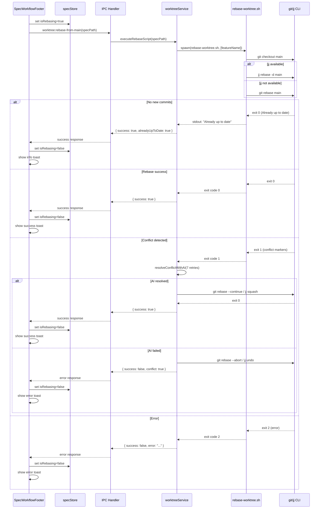
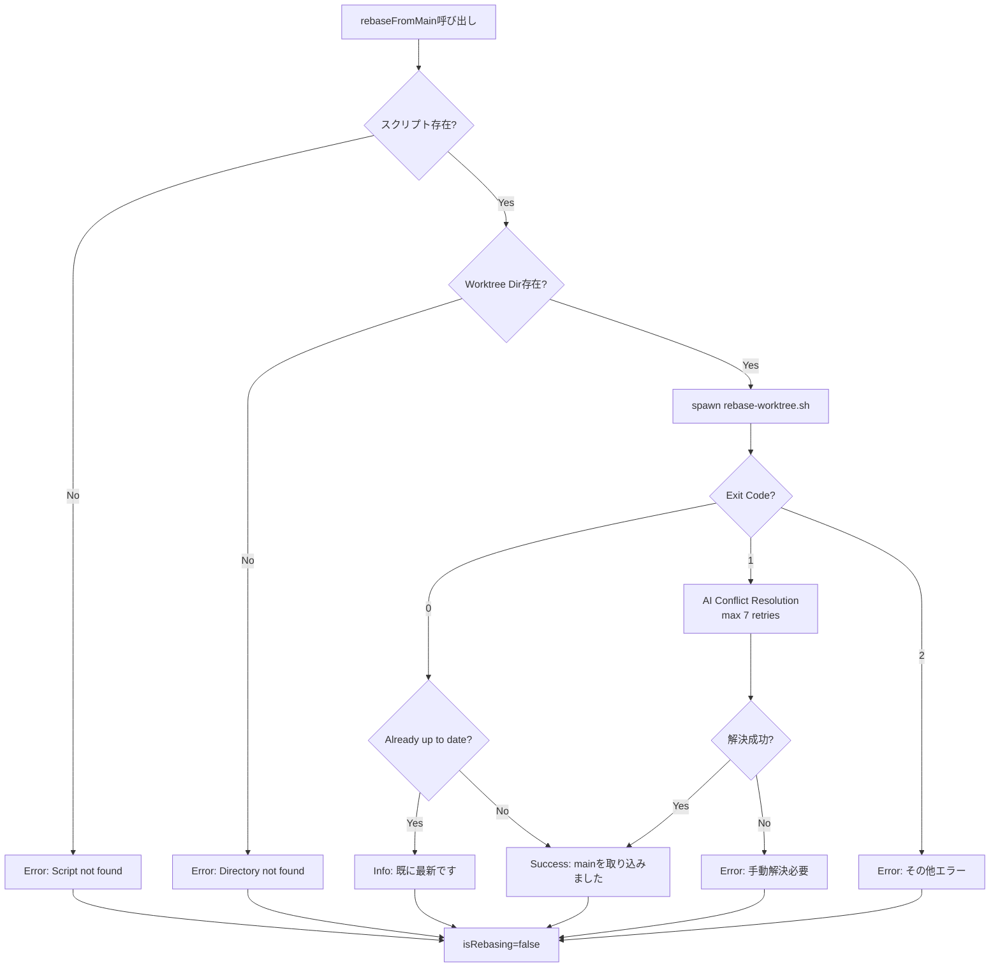

# Design: Worktree Rebase from Main

## Overview

**目的**: Worktreeモードで実装作業中のSpec/Bugに対して、mainブランチの最新変更を取り込むrebase機能を提供する。ユーザーは「mainを取り込み」ボタンをクリックすることで、jj優先・gitフォールバックでrebaseを実行し、コンフリクトが発生した場合はAIによる自動解決を試行する。

**対象ユーザー**: Worktreeモードで実装作業を行うSpec/Bugワークフローユーザー

**影響**: 既存のWorktreeワークフローを拡張し、mainブランチからの変更取り込み操作を追加する。新規スクリプト `rebase-worktree.sh` を導入し、Electron IPCおよびRemote UI WebSocketハンドラを追加する。

### Goals

- Worktreeモード時にmainブランチの最新変更を手動で取り込む機能を提供
- jj優先・gitフォールバックでrebaseを安定的に実行
- コンフリクト発生時はAIによる自動解決を試行（最大7回）
- Desktop UIおよびRemote UIの両方で同一操作を提供
- SpecとBugの両ワークフローで一貫したUXを実現

### Non-Goals

- spec-merge前の自動rebase（手動ボタンのみ）
- rebaseのプレビュー機能（取り込まれるコミットの事前確認）
- mainブランチ以外からのrebase
- 部分的なrebase（特定コミットのみ取り込み）
- rebase履歴の記録・表示

## Architecture

### Existing Architecture Analysis

**Worktree Infrastructure**:
- `worktreeService.ts`: Git Worktree操作の抽象化
- `convertWorktreeService.ts`: 通常モード→Worktreeモード変換
- `SpecWorkflowFooter.tsx` / `BugWorkflowFooter.tsx`: Worktree操作ボタン表示
- `spec.json` / `bug.json`: `worktree` フィールド（`path`, `branch`, `created_at`, `enabled`）

**Merge Script Pattern** (`merge-spec.sh`):
- jq経由で `spec.json` から `worktree.branch` を読み取り
- jj優先・gitフォールバックでsquash merge実行
- コンフリクト検知と終了コード分離（0: success, 1: conflict, 2: error）

**IPC Architecture**:
- `channels.ts`: IPCチャンネル名定義
- `handlers.ts`: Electronメインプロセスハンドラ
- `webSocketHandler.ts`: Remote UI用WebSocketハンドラ
- preload経由でrendererに公開

**Design Decision**: 既存のmerge-spec.shパターンをrebase用に転用し、jj/gitコマンド実行を `rebase-worktree.sh` スクリプトとして分離する。これにより、シェルスクリプトの安定性とメンテナンス性を確保する。

### Architecture Pattern & Boundary Map

```mermaid
graph TB
    subgraph "Renderer Process (Electron / Remote UI)"
        UI[SpecWorkflowFooter<br/>BugWorkflowFooter]
        Store[Zustand Store<br/>specStore / bugStore]
        ApiClient[ApiClient<br/>IpcApiClient / WebSocketApiClient]
    end

    subgraph "Main Process (Electron)"
        IPC[IPC Handlers<br/>worktreeRebaseHandlers]
        Service[worktreeService]
        Script[rebase-worktree.sh]
        Git[Git / jj CLI]
        FileSystem[File System<br/>spec.json / bug.json]
    end

    subgraph "Remote UI WebSocket"
        WS[WebSocket Handler]
    end

    UI -->|rebaseFromMain| ApiClient
    ApiClient -->|IPC/WebSocket| IPC
    ApiClient -->|WebSocket| WS
    WS -->|delegate| IPC
    IPC -->|executeRebaseScript| Service
    Service -->|spawn| Script
    Script -->|jj/git rebase| Git
    Service -->|read/write| FileSystem
    Service -->|update| Store
    Store -->|render| UI
</graph>
```

**Architecture Integration**:
- **選択パターン**: Layered Architecture（Renderer → IPC → Service → Script）
- **ドメイン境界**: UI層（Renderer/RemoteUI）、IPC層（チャンネル/ハンドラ）、Service層（worktreeService）、Script層（rebase-worktree.sh）
- **既存パターン継承**: merge-spec.shと同様のスクリプト分離パターン、IPC+WebSocketの二重対応
- **新規コンポーネント理由**: `rebase-worktree.sh`（Git操作の安定性）、`worktree:rebase-from-main` IPCチャンネル（機能分離）

### Technology Stack

| Layer | Choice / Version | Role in Feature | Notes |
|-------|------------------|-----------------|-------|
| Frontend | React 19 + Zustand | UI状態管理（isRebasing） | 既存Storeに状態追加 |
| Backend | Node.js 20+ (Electron Main) | IPC処理、スクリプト実行 | child_process.spawn使用 |
| Script | Bash + jq | Git/jj rebase実行 | jq 1.6+ required |
| VCS | jj (optional) / git 2.35+ | Rebase操作 | jj優先、gitフォールバック |
| Data | JSON (spec.json / bug.json) | Worktree状態管理 | 既存フォーマット利用 |
| Messaging | IPC + WebSocket | Desktop/Remote UI通信 | 既存パターン踏襲 |

## System Flows

### Rebase Execution Flow



**フロー設計の決定事項**:
- スクリプト終了コードで結果を判定（0: success, 1: conflict, 2: error）
- AI解決フローは既存のspec-merge実装を参考に最大7回試行
- エラー時はgit/jj状態を元に戻す（--abort / undo）

## Requirements Traceability

| Criterion ID | Summary | Components | Implementation Approach |
|--------------|---------|------------|------------------------|
| 1.1 | Spec Worktreeモード時にボタン表示 | SpecWorkflowFooter | 既存コンポーネント拡張（条件分岐追加） |
| 1.2 | Spec 通常モード時はボタン非表示 | SpecWorkflowFooter | 既存条件 `hasWorktreePath()` 利用 |
| 1.3 | Spec Agent実行中はdisabled | SpecWorkflowFooter | 既存 `hasRunningAgents` プロパティ利用 |
| 1.4 | Spec 自動実行中はdisabled | SpecWorkflowFooter | 既存 `isAutoExecuting` プロパティ利用 |
| 1.5 | Spec rebase処理中はdisabled+「取り込み中...」表示 | SpecWorkflowFooter, specStore | 新規 `isRebasing` 状態追加 |
| 2.1 | Bug Worktreeモード時にボタン表示 | BugWorkflowFooter | 既存コンポーネント拡張 |
| 2.2 | Bug 通常モード時はボタン非表示 | BugWorkflowFooter | 既存 `hasWorktreePath()` 利用 |
| 2.3 | Bug Agent実行中はdisabled | BugWorkflowFooter | 既存 `hasRunningAgents` プロパティ利用 |
| 2.4 | Bug 自動実行中はdisabled | BugWorkflowFooter | 既存 `isAutoExecuting` プロパティ利用 |
| 2.5 | Bug rebase処理中はdisabled+「取り込み中...」表示 | BugWorkflowFooter, bugStore | 新規 `isRebasing` 状態追加 |
| 3.1 | rebase-worktree.shスクリプト作成 | rebase-worktree.sh | 新規スクリプト実装 |
| 3.2 | jj存在確認 | rebase-worktree.sh | `command -v jj` で判定 |
| 3.3 | jj rebase -d main実行 | rebase-worktree.sh | jj利用可能時 |
| 3.4 | git rebase mainフォールバック | rebase-worktree.sh | jj不在時 |
| 3.5 | mainに新規コミットなし時の処理 | rebase-worktree.sh | 標準出力チェック |
| 3.6 | コンフリクト検知（終了コード1） | rebase-worktree.sh | git/jj終了コード判定 |
| 3.7 | 成功時（終了コード0） | rebase-worktree.sh | 正常終了 |
| 4.1 | コンフリクト時AI解決試行 | worktreeService | 新規メソッド `resolveConflictWithAI()` |
| 4.2 | AI解決後rebase続行 | worktreeService | `git rebase --continue` / `jj squash` |
| 4.3 | 7回試行失敗時中断 | worktreeService | リトライループ実装 |
| 4.4 | 中断時worktree元の状態に戻す | worktreeService | `git rebase --abort` / `jj undo` |
| 5.1 | レンダラーからrebaseリクエスト | IPC Handlers | 新規チャンネル `worktree:rebase-from-main` |
| 5.2 | スクリプト成功時レスポンス | IPC Handlers | `{ success: true }` 返却 |
| 5.3 | 「Already up to date」レスポンス | IPC Handlers | `{ success: true, alreadyUpToDate: true }` |
| 5.4 | コンフリクト時解決フロー開始 | IPC Handlers | worktreeService.resolveConflictWithAI呼び出し |
| 5.5 | worktree:rebase-from-mainチャンネル使用 | IPC Channels | channels.ts追加 |
| 6.1 | Spec rebase開始時isRebasing=true | specStore | 新規状態フィールド追加 |
| 6.2 | Spec rebase完了時isRebasing=false | specStore | 状態リセット |
| 6.3 | Spec rebase成功通知 | specStore | notificationStore連携 |
| 6.4 | Spec 最新時情報通知 | specStore | notificationStore連携 |
| 6.5 | Spec rebaseエラー通知 | specStore | notificationStore連携 |
| 7.1 | Bug rebase開始時isRebasing=true | bugStore | 新規状態フィールド追加 |
| 7.2 | Bug rebase完了時isRebasing=false | bugStore | 状態リセット |
| 7.3 | Bug rebase成功通知 | bugStore | notificationStore連携 |
| 7.4 | Bug 最新時情報通知 | bugStore | notificationStore連携 |
| 7.5 | Bug rebaseエラー通知 | bugStore | notificationStore連携 |
| 8.1 | Remote UI Spec Worktreeモード時ボタン表示 | RemoteWorkflowView | Shared SpecWorkflowFooter再利用 |
| 8.2 | Remote UI WebSocket経由rebase実行 | WebSocketApiClient, webSocketHandler | 既存WebSocket経路利用 |
| 8.3 | Remote UI処理完了後メッセージ表示 | RemoteWorkflowView | Shared通知コンポーネント再利用 |
| 8.4 | Remote UI rebase処理中disabled | RemoteWorkflowView | Shared SpecWorkflowFooter再利用 |
| 9.1 | commandsetインストール時スクリプトコピー | ccSddWorkflowInstaller | 新規テンプレート配置 |
| 9.2 | スクリプトコピー時実行権限付与 | ccSddWorkflowInstaller | `fs.chmodSync(path, 0o755)` |
| 9.3 | .kiro/scripts/ディレクトリ自動作成 | ccSddWorkflowInstaller | `fs.mkdirSync(dir, { recursive: true })` |
| 9.4 | スクリプト既存時上書き | ccSddWorkflowInstaller | `fs.copyFileSync(src, dst)` |
| 10.1 | rebase-worktree.sh不在時エラー | worktreeService | スクリプト存在チェック |
| 10.2 | worktreeディレクトリ不在時エラー | worktreeService | ディレクトリ存在チェック |
| 10.3 | gitリポジトリでない場合エラー | rebase-worktree.sh | `.git` ディレクトリチェック |
| 10.4 | mainブランチ不在時エラー | rebase-worktree.sh | `git show-ref` チェック |
| 10.5 | コンフリクト解決失敗時エラー | worktreeService | AI解決失敗時のメッセージ |

### Coverage Validation Checklist

- [x] Every criterion ID from requirements.md appears in the table above
- [x] Each criterion has specific component names (not generic references)
- [x] Implementation approach distinguishes "reuse existing" vs "new implementation"
- [x] User-facing criteria specify concrete UI components

## Components and Interfaces

### Component Summary

| Component | Domain/Layer | Intent | Req Coverage | Key Dependencies (P0/P1) | Contracts |
|-----------|--------------|--------|--------------|--------------------------|-----------|
| rebase-worktree.sh | Script | jj/git rebaseコマンド実行 | 3.1-3.7 | jq (P0), git (P0), jj (P1) | Script |
| worktreeService | Main/Service | Rebase実行・AI解決オーケストレーション | 4.1-4.4, 5.4, 10.1-10.2, 10.5 | rebase-worktree.sh (P0), fileService (P0) | Service |
| worktree:rebase-from-main IPC Handler | Main/IPC | レンダラーからのrebaseリクエスト処理 | 5.1-5.5 | worktreeService (P0) | IPC |
| WebSocket Handler | Main/WebSocket | Remote UIからのrebaseリクエスト処理 | 8.2 | worktreeService (P0) | WebSocket |
| SpecWorkflowFooter | Renderer/RemoteUI | Spec Worktreeモード時のrebaseボタン表示 | 1.1-1.5, 8.1, 8.4 | specStore (P0), ApiClient (P0) | UI |
| BugWorkflowFooter | Renderer/RemoteUI | Bug Worktreeモード時のrebaseボタン表示 | 2.1-2.5 | bugStore (P0), ApiClient (P0) | UI |
| specStore | Renderer/Store | Spec rebase状態管理 | 6.1-6.5 | notificationStore (P1) | State |
| bugStore | Renderer/Store | Bug rebase状態管理 | 7.1-7.5 | notificationStore (P1) | State |
| ccSddWorkflowInstaller | Main/Service | スクリプトテンプレートのインストール | 9.1-9.4 | fs (P0) | Service |

### Script Layer

#### rebase-worktree.sh

| Field | Detail |
|-------|--------|
| Intent | Worktreeブランチに対してmainブランチの変更をrebaseする |
| Requirements | 3.1, 3.2, 3.3, 3.4, 3.5, 3.6, 3.7 |

**Responsibilities & Constraints**
- jqで `spec.json` から `worktree.branch` 読み取り
- jj優先・gitフォールバックでrebase実行
- mainブランチに新しいコミットがない場合の判定
- 終了コードによる結果通知（0: success, 1: conflict, 2: error）

**Dependencies**
- External: jq (必須) — JSONパース（P0）
- External: git 2.35+ (必須) — Rebase実行（P0）
- External: jj (optional) — 優先Rebase実行（P1）
- Inbound: worktreeService — スクリプト起動（P0）

**Contracts**: Script [x]

##### Script Interface

**Input**:
```bash
rebase-worktree.sh <feature-name>
```

**Arguments**:
- `<feature-name>`: Spec/Bug名（例: `my-feature`, `bug:my-bug`）

**Preconditions**:
- jqコマンドがインストール済み
- `.kiro/specs/{feature-name}/spec.json` または `.kiro/bugs/{bug-name}/bug.json` が存在
- `worktree.branch` フィールドが存在

**Execution Logic**:
1. jqで `worktree.branch` を読み取り
2. mainブランチ名をGitから取得（デフォルト: `master`）
3. mainブランチにcheckout
4. jj利用可能か判定
   - 利用可能: `jj rebase -d main` 実行
   - 不在: `git rebase main` 実行
5. 終了コード判定:
   - 0: rebase成功
   - 1: コンフリクト発生
   - 2: その他エラー

**Exit Codes**:
| Code | Meaning | Stdout/Stderr |
|------|---------|---------------|
| 0 | Success (rebase完了) | "Rebase completed successfully" |
| 0 | Already up to date | "Already up to date" |
| 1 | Conflict detected | stderr: "Conflict detected during rebase" |
| 2 | Error (jq不在、spec.json不在、引数不足) | stderr: "Error: ..." |

**Postconditions** (exit 0):
- Worktreeブランチにmainの変更が取り込まれている
- コンフリクトが発生していない

**Postconditions** (exit 1):
- Worktreeはrebase中断状態
- コンフリクトマーカーが残存（AI解決対象）

**Implementation Notes**
- 既存 `merge-spec.sh` のパターンを踏襲
- jj優先・gitフォールバックは `command -v jj` で判定
- mainブランチ名の取得は `git symbolic-ref refs/remotes/origin/HEAD` 使用

### Main Process Service Layer

#### worktreeService (拡張)

| Field | Detail |
|-------|--------|
| Intent | rebase-worktree.sh実行オーケストレーション、AI解決フロー管理 |
| Requirements | 4.1, 4.2, 4.3, 4.4, 5.4, 10.1, 10.2, 10.5 |

**Responsibilities & Constraints**
- rebase-worktree.sh存在チェック・spawn実行
- 終了コード判定による結果ハンドリング
- コンフリクト検知時のAI自動解決フロー（最大7回試行）
- AI解決失敗時のworktree状態復元（--abort / undo）

**Dependencies**
- Outbound: child_process.spawn — スクリプト実行（P0）
- Outbound: fileService — spec.json/bug.json読み取り（P0）
- Outbound: AI解決サービス — コンフリクト解決（P0）
  - **Service**: `conflictResolverService` または既存spec-merge実装で使用されているサービス
  - **Method**: `resolveConflict(worktreePath: string, conflictFiles: string[], maxRetries: number): Promise<Result<void, ConflictResolutionError>>`
  - **Implementation Reference**: 既存spec-merge実装の `src/main/services/mergeConflictResolver.ts` または類似ファイルを参照
  - **Note**: 実装時に既存spec-mergeコードベースを調査し、実際のサービス名とメソッド名を確定
- Inbound: IPC Handlers — executeRebaseScript呼び出し（P0）

**Contracts**: Service [x]

##### Service Interface

```typescript
interface WorktreeService {
  /**
   * Rebase worktree branch from main
   * Requirements: 3.1-3.7, 4.1-4.4, 10.1-10.2
   */
  executeRebaseFromMain(
    specOrBugPath: string
  ): Promise<Result<RebaseResult, RebaseError>>;

  /**
   * Resolve conflict with AI (max 7 retries)
   * Requirements: 4.1, 4.2, 4.3
   */
  resolveConflictWithAI(
    worktreePath: string,
    maxRetries: number
  ): Promise<Result<void, ConflictResolutionError>>;
}

interface RebaseResult {
  success: true;
  alreadyUpToDate?: boolean; // true if no new commits
}

interface RebaseError {
  success: false;
  conflict?: boolean; // true if conflict detected
  error?: string;     // error message
}

type ConflictResolutionError = {
  reason: 'max_retries_exceeded' | 'ai_resolution_failed';
  details: string;
};
```

**Preconditions** (executeRebaseFromMain):
- `spec.json` / `bug.json` に `worktree.branch` フィールド存在
- `rebase-worktree.sh` が `.kiro/scripts/` に存在
- Worktreeディレクトリが存在

**Postconditions** (success):
- Worktreeブランチがmainの変更を取り込み済み
- コンフリクトが解決済み（AI解決または不在）

**Postconditions** (conflict failure):
- Worktreeがrebase前の状態に復元済み（--abort / undo実行）

**Implementation Notes**
- 既存 `merge-spec.sh` 実行パターンを参考にスクリプト起動
- AI解決フローは既存のspec-merge conflict resolutionロジック再利用
- エラーハンドリング: スクリプト不在・ディレクトリ不在・Git操作失敗を個別エラーで返却

### Main Process IPC Layer

#### worktree:rebase-from-main IPC Handler

| Field | Detail |
|-------|--------|
| Intent | レンダラーからのrebaseリクエストを受け付け、worktreeServiceに委譲 |
| Requirements | 5.1, 5.2, 5.3, 5.4, 5.5 |

**Responsibilities & Constraints**
- レンダラーからのIPCリクエスト受信
- worktreeService.executeRebaseFromMain呼び出し
- 結果をレスポンスとして返却（success/conflict/error）

**Dependencies**
- Outbound: worktreeService — rebase実行（P0）
- Inbound: preload — IPCチャンネル公開（P0）

**Contracts**: IPC [x]

##### IPC Contract

**Channel Name**: `worktree:rebase-from-main`

**Request**:
```typescript
interface RebaseFromMainRequest {
  specOrBugPath: string; // .kiro/specs/{feature} or .kiro/bugs/{bug-name}
}
```

**Response**:
```typescript
type RebaseFromMainResponse =
  | { success: true; alreadyUpToDate?: boolean }
  | { success: false; conflict?: boolean; error?: string };
```

**Error Scenarios**:
| Condition | Response |
|-----------|----------|
| rebase-worktree.sh不在 | `{ success: false, error: "Script not found. Please reinstall commandset." }` |
| worktreeディレクトリ不在 | `{ success: false, error: "Worktree directory not found" }` |
| コンフリクト解決失敗 | `{ success: false, conflict: true, error: "Failed to resolve conflict. Please resolve manually." }` |
| mainブランチ不在 | `{ success: false, error: "main branch not found" }` |

**Implementation Notes**
- channels.tsに `REBASE_FROM_MAIN: 'worktree:rebase-from-main'` 追加
- handlers.tsに `ipcMain.handle(IPC_CHANNELS.REBASE_FROM_MAIN, ...)` 追加
- preload/index.tsに `rebaseFromMain: (specOrBugPath: string) => ipcRenderer.invoke(...)` 追加

#### WebSocket Handler (拡張)

| Field | Detail |
|-------|--------|
| Intent | Remote UIからのrebaseリクエストをIPC Handlerに委譲 |
| Requirements | 8.2 |

**Responsibilities & Constraints**
- WebSocketメッセージ `worktree:rebase-from-main` 受信
- IPC Handlerに処理委譲
- レスポンスをWebSocket経由で返却

**Dependencies**
- Outbound: IPC Handler — 処理委譲（P0）
- Inbound: WebSocketApiClient — リクエスト送信（P0）

**Contracts**: WebSocket [x]

##### WebSocket Contract

**Message Type**: `worktree:rebase-from-main`

**Request Payload**: 同上（RebaseFromMainRequest）

**Response Payload**: 同上（RebaseFromMainResponse）

**Implementation Notes**
- webSocketHandler.tsの既存パターンに従い、IPC Handlerに転送
- エラーハンドリングはIPC Handlerと同一

### Renderer/Remote UI Shared Components

#### SpecWorkflowFooter (拡張)

| Field | Detail |
|-------|--------|
| Intent | Spec Worktreeモード時に「mainを取り込み」ボタン表示 |
| Requirements | 1.1, 1.2, 1.3, 1.4, 1.5, 8.1, 8.4 |

**Responsibilities & Constraints**
- Worktreeモード判定（`hasWorktreePath(specJson)`）
- rebaseボタン表示条件: worktree.pathあり
- disabled条件: Agent実行中 OR 自動実行中 OR rebase処理中
- ボタンクリック時に `onRebaseFromMain` コールバック呼び出し

**Dependencies**
- Inbound: ElectronWorkflowView / RemoteWorkflowView — props経由でコールバック渡し（P0）
- Outbound: ApiClient — rebaseFromMain IPC/WebSocket呼び出し（P0）
- Outbound: specStore — isRebasing状態参照（P0）

**Contracts**: UI [x]

##### UI Props Extension

```typescript
export interface SpecWorkflowFooterProps {
  // ... 既存props
  /** Spec rebase処理中かどうか */
  isRebasing?: boolean;
  /** 「mainを取り込み」ボタンクリック時のハンドラ */
  onRebaseFromMain?: () => void;
}
```

**Button Display Condition**:
```typescript
const showRebaseButton = hasWorktreePath(specJson) && !isOnMain;
```

**Button Disabled Condition**:
```typescript
const isButtonDisabled = isRebasing || hasRunningAgents || isAutoExecuting;
```

**Implementation Notes**
- 既存 「Worktreeに変更」ボタンと並列配置（worktree.pathある場合はrebaseボタンのみ表示）
- ボタンラベル: "mainを取り込み" (通常)、"取り込み中..." (isRebasing時)
- アイコン: GitMerge (lucide-react)

#### BugWorkflowFooter (拡張)

| Field | Detail |
|-------|--------|
| Intent | Bug Worktreeモード時に「mainを取り込み」ボタン表示 |
| Requirements | 2.1, 2.2, 2.3, 2.4, 2.5 |

**Responsibilities & Constraints**
- SpecWorkflowFooterと同一パターン
- Bug用のworktree判定（`bug.json` の `worktree.path`）

**Dependencies**
- Inbound: BugWorkflowView — props経由でコールバック渡し（P0）
- Outbound: ApiClient — rebaseFromMain IPC/WebSocket呼び出し（P0）
- Outbound: bugStore — isRebasing状態参照（P0）

**Contracts**: UI [x]

##### UI Props Extension

```typescript
export interface BugWorkflowFooterProps {
  // ... 既存props
  /** Bug rebase処理中かどうか */
  isRebasing?: boolean;
  /** 「mainを取り込み」ボタンクリック時のハンドラ */
  onRebaseFromMain?: () => void;
}
```

**Implementation Notes**
- SpecWorkflowFooterと同一実装パターン
- bugStoreの `isRebasing` 状態を参照

### Renderer State Layer

#### specStore (拡張)

| Field | Detail |
|-------|--------|
| Intent | Spec rebase処理状態を管理 |
| Requirements | 6.1, 6.2, 6.3, 6.4, 6.5 |

**Responsibilities & Constraints**
- `isRebasing: boolean` 状態追加
- rebase開始時に `true` 設定
- rebase完了/エラー時に `false` 設定
- 結果に応じて通知トースト表示（notificationStore連携）

**Dependencies**
- Outbound: notificationStore — トースト表示（P1）
- Inbound: SpecWorkflowFooter — isRebasing状態参照（P0）

**Contracts**: State [x]

##### State Management

```typescript
interface SpecStoreState {
  // ... 既存state
  isRebasing: boolean;
}

interface SpecStoreActions {
  // ... 既存actions
  setIsRebasing: (isRebasing: boolean) => void;
  handleRebaseResult: (result: RebaseFromMainResponse) => void;
}
```

**State Transitions**:
```
idle (isRebasing: false)
  → rebaseFromMain呼び出し → isRebasing: true
  → rebase完了/エラー → isRebasing: false
```

**Notification Messages**:
| Result | Type | Message |
|--------|------|---------|
| Success | success | "mainブランチの変更を取り込みました" |
| Already up to date | info | "既に最新です" |
| Conflict (AI failed) | error | "コンフリクトを解決できませんでした。手動で解決してください" |
| Script not found | error | "スクリプトが見つかりません。commandsetを再インストールしてください" |

**Implementation Notes**
- 既存Storeに状態フィールド追加
- `handleRebaseResult` でレスポンス判定と通知表示

#### bugStore (拡張)

| Field | Detail |
|-------|--------|
| Intent | Bug rebase処理状態を管理 |
| Requirements | 7.1, 7.2, 7.3, 7.4, 7.5 |

**Responsibilities & Constraints**
- specStoreと同一パターン
- Bug用の `isRebasing` 状態管理

**Dependencies**
- Outbound: notificationStore — トースト表示（P1）
- Inbound: BugWorkflowFooter — isRebasing状態参照（P0）

**Contracts**: State [x]

##### State Management

```typescript
interface BugStoreState {
  // ... 既存state
  isRebasing: boolean;
}

interface BugStoreActions {
  // ... 既存actions
  setIsRebasing: (isRebasing: boolean) => void;
  handleRebaseResult: (result: RebaseFromMainResponse) => void;
}
```

**Implementation Notes**
- specStoreと同一実装パターン

### Installer Service Layer

#### ccSddWorkflowInstaller (拡張)

| Field | Detail |
|-------|--------|
| Intent | commandsetインストール時にrebase-worktree.shテンプレートを配置 |
| Requirements | 9.1, 9.2, 9.3, 9.4 |

**Responsibilities & Constraints**
- `resources/templates/scripts/rebase-worktree.sh` を `.kiro/scripts/` にコピー
- コピー時に実行権限（chmod +x）付与
- `.kiro/scripts/` ディレクトリが存在しない場合は自動作成
- 既存ファイルがある場合は上書き

**Dependencies**
- Outbound: fs — ファイルコピー・権限変更（P0）
- Inbound: installCommandset呼び出し元 — インストールトリガー（P0）

**Contracts**: Service [x]

##### Service Interface

```typescript
interface CcSddWorkflowInstaller {
  /**
   * Install rebase-worktree.sh script template
   * Requirements: 9.1, 9.2, 9.3, 9.4
   */
  installRebaseScript(projectPath: string): Promise<Result<void, InstallError>>;
}
```

**Preconditions**:
- `resources/templates/scripts/rebase-worktree.sh` テンプレートファイル存在

**Postconditions**:
- `.kiro/scripts/rebase-worktree.sh` が配置済み
- スクリプトに実行権限（0o755）付与済み

**Implementation Notes**
- 既存 `installMergeScript()` と同一パターン
- `fs.mkdirSync(scriptsDir, { recursive: true })` でディレクトリ作成
- `fs.copyFileSync(src, dst)` でコピー
- `fs.chmodSync(dst, 0o755)` で権限付与

## Data Models

### Domain Model

本機能では新しいドメインエンティティは導入しない。既存の `WorktreeConfig` （`spec.json` / `bug.json` の `worktree` フィールド）を継続利用する。

**Worktree State** (既存):
```typescript
interface WorktreeConfig {
  path: string;        // Worktreeディレクトリパス
  branch: string;      // Featureブランチ名
  created_at: string;  // ISO 8601 timestamp
  enabled: boolean;    // Worktreeモード有効化フラグ
}
```

**Rebase State** (一時的・UI State):
```typescript
interface RebaseState {
  isRebasing: boolean; // Rebase処理中フラグ（Store内）
}
```

**Design Decision**: Rebase操作は一時的なアクションであり、永続化不要と判断。UIステート（`isRebasing`）のみで管理する。

## Error Handling

### Error Strategy

**エラー分類**:
1. **User Errors** (ユーザー操作ミス): Worktreeモードでない状態での操作試行 → UI disabledで防止
2. **System Errors** (環境問題): jq不在、git不在、スクリプト不在 → 明確なエラーメッセージでガイド
3. **Business Logic Errors** (ビジネスルール違反): コンフリクト解決失敗 → 手動解決ガイド表示

### Error Categories and Responses

**User Errors** (UI disabledで防止):
- Worktreeモードでない状態: ボタン非表示
- Agent実行中: ボタンdisabled
- 自動実行中: ボタンdisabled

**System Errors**:
| Error | Detection | User Message | Recovery Action |
|-------|-----------|--------------|----------------|
| jq not installed | スクリプト内 | "jqがインストールされていません。brew install jq（macOS）またはapt install jq（Linux）でインストールしてください" | ユーザーがjqインストール |
| rebase-worktree.sh not found | worktreeService | "スクリプトが見つかりません。commandsetを再インストールしてください" | 設定画面からcomandset再インストール |
| Worktree directory not found | worktreeService | "Worktreeディレクトリが見つかりません" | Worktree再作成 |
| Not a git repository | スクリプト内 | "Gitリポジトリではありません" | プロジェクト選択見直し |
| main branch not found | スクリプト内 | "mainブランチが見つかりません" | ブランチ名確認 |

**Business Logic Errors**:
| Error | Detection | User Message | Recovery Action |
|-------|-----------|--------------|----------------|
| Conflict resolution failed (7 retries) | worktreeService | "コンフリクトを解決できませんでした。手動で解決してください" | ユーザーが手動解決 |

### Process Flow Visualization



### Monitoring

**ログ記録ポイント**:
- rebase-worktree.sh実行開始/完了
- jj/git rebase実行結果
- AI解決試行回数と結果
- エラー発生時のコンテキスト（specPath, exitCode, stderr）

**ログレベル**:
- `info`: rebase開始/完了/Already up to date
- `warn`: AI解決試行中・リトライ
- `error`: スクリプト不在・コンフリクト解決失敗・その他エラー

## Testing Strategy

### Unit Tests

**Script Layer**:
1. `rebase-worktree.sh`: jj利用可能時のrebase実行（モックjjコマンド）
2. `rebase-worktree.sh`: git fallback時のrebase実行（モックgitコマンド）
3. `rebase-worktree.sh`: Already up to date検知
4. `rebase-worktree.sh`: コンフリクト検知（exit 1）
5. `rebase-worktree.sh`: jq不在時エラー（exit 2）

**Service Layer**:
1. `worktreeService.executeRebaseFromMain`: 正常終了パス（exit 0）
2. `worktreeService.executeRebaseFromMain`: Already up to date処理
3. `worktreeService.executeRebaseFromMain`: スクリプト不在エラー
4. `worktreeService.resolveConflictWithAI`: 1回目で解決成功
5. `worktreeService.resolveConflictWithAI`: 7回リトライ後失敗

**Store Layer**:
1. `specStore.setIsRebasing`: true/false切り替え
2. `specStore.handleRebaseResult`: 成功時通知
3. `specStore.handleRebaseResult`: Already up to date通知
4. `specStore.handleRebaseResult`: コンフリクトエラー通知
5. `bugStore`: specStoreと同一パターン

### Integration Tests

**IPC Integration**:
1. Renderer → IPC → worktreeService → スクリプト実行 → レスポンス返却（成功）
2. Renderer → IPC → worktreeService → コンフリクト検知 → AI解決 → レスポンス返却
3. Remote UI → WebSocket → IPC → worktreeService → レスポンス返却

**UI Integration**:
1. SpecWorkflowFooter: Worktreeモード時ボタン表示
2. SpecWorkflowFooter: 通常モード時ボタン非表示
3. SpecWorkflowFooter: rebase処理中ボタンdisabled+ラベル変更
4. BugWorkflowFooter: 同上パターン

### E2E Tests

**Critical User Paths**:
1. Worktreeモードで「mainを取り込み」クリック → 成功トースト表示
2. mainに新しいコミットなし → 「既に最新です」トースト表示
3. コンフリクト発生 → AI解決 → 成功トースト表示
4. コンフリクト解決失敗 → エラートースト表示
5. Remote UIから「mainを取り込み」実行 → 成功確認

## Integration Test Strategy

本機能はIPC、Store、Script実行の連携が重要。以下の統合テスト戦略を適用する。

**Components**:
- IPC Handler (`worktree:rebase-from-main`)
- worktreeService (executeRebaseFromMain, resolveConflictWithAI)
- rebase-worktree.sh (モックスクリプト)
- specStore / bugStore (isRebasing状態)

**Data Flow**:
```
UI (SpecWorkflowFooter)
 → ApiClient.rebaseFromMain(specPath)
 → IPC Handler
 → worktreeService.executeRebaseFromMain(specPath)
 → spawn(rebase-worktree.sh)
 → Store.setIsRebasing(false) + 通知
```

**Mock Boundaries**:
- **Mock**: child_process.spawn（スクリプト実行結果をモック）
- **Real**: IPC Handler, worktreeService, Store

**Verification Points**:
- IPC HandlerがworktreeServiceを正しく呼び出す
- worktreeServiceが終了コードに応じて正しいレスポンスを返す
- Storeの `isRebasing` 状態が正しく遷移する
- 通知メッセージが適切に表示される

**Robustness Strategy**:
- 非同期処理は `waitFor` パターンでポーリング（固定sleepを避ける）
- スクリプト実行の終了待機は `spawn` のイベントハンドラで確実に検知
- State遷移は `act()` でラップしてReact更新を同期

**Prerequisites**:
- モックスクリプト実行環境（テスト用の固定スクリプトまたはstub）
- IPC Handlerのユニットテスト完了
- worktreeServiceのユニットテスト完了

## Design Decisions

### DD-001: スクリプト分離パターンの採用

| Field | Detail |
|-------|--------|
| Status | Accepted |
| Context | Git/jj rebase操作をNode.jsから直接実行するか、シェルスクリプトに分離するか |
| Decision | `rebase-worktree.sh` として分離し、Node.jsからspawnで実行する |
| Rationale | ・既存 `merge-spec.sh` と同一パターンで一貫性維持<br/>・シェルスクリプトは複雑なGit操作に適している<br/>・終了コードによる結果通知が明確<br/>・jq/git/jjコマンド存在チェックをスクリプト内で完結 |
| Alternatives Considered | Node.jsから `child_process.exec` で直接git/jjコマンド実行 → エラーハンドリングが複雑化、既存パターンとの乖離 |
| Consequences | ・スクリプトの単体テストが必要（Bashテストフレームワーク利用）<br/>・スクリプトテンプレートの配置・権限管理が必要 |

### DD-002: jj優先・gitフォールバックの維持

| Field | Detail |
|-------|--------|
| Status | Accepted |
| Context | jjのみ必須とするか、jj優先でgitフォールバックを提供するか |
| Decision | jj優先、gitフォールバック方式を採用 |
| Rationale | ・Requirements Decision Logで明確に合意済み<br/>・既存merge-spec.shと同一方式で一貫性維持<br/>・jj不在環境でも動作継続可能（ユーザー環境の多様性対応） |
| Alternatives Considered | jj必須 → jq未インストール環境でのエラー多発、ユーザー離脱リスク |
| Consequences | ・jjとgitの両方でテストが必要<br/>・jj特有の機能（conflict first-class support）は活用できない |

### DD-003: AI自動解決の最大試行回数（7回）

| Field | Detail |
|-------|--------|
| Status | Accepted |
| Context | コンフリクト自動解決の試行回数をいくつにするか |
| Decision | 最大7回試行（既存spec-merge実装と同一） |
| Rationale | ・Requirements Decision Logで明確に合意済み<br/>・既存spec-merge実装との一貫性維持<br/>・7回で解決できない場合は複雑なコンフリクトと判断し手動解決に委ねる |
| Alternatives Considered | 無制限リトライ → 無限ループリスク<br/>3回 → 解決成功率が低下する可能性 |
| Consequences | ・7回失敗時のエラーメッセージで手動解決ガイドが必要<br/>・AI解決ロジックのパフォーマンス影響（7回×解決時間） |

### DD-004: Remote UI対応の実装方式

| Field | Detail |
|-------|--------|
| Status | Accepted |
| Context | Remote UIからのrebase操作をどう実現するか |
| Decision | 既存WebSocketハンドラ経由でIPC Handlerに委譲 |
| Rationale | ・既存Remote UI実装パターンとの一貫性<br/>・IPC Handlerのロジックを再利用可能<br/>・Desktop/Remote UIで同一処理フローを保証 |
| Alternatives Considered | Remote UI専用のService層実装 → コード重複、不整合リスク |
| Consequences | ・WebSocketApiClientにrebaseFromMainメソッド追加<br/>・webSocketHandler.tsに `worktree:rebase-from-main` メッセージハンドラ追加 |

### DD-005: ボタン配置とラベル

| Field | Detail |
|-------|--------|
| Status | Accepted |
| Context | 「mainを取り込み」ボタンをどこに配置し、どういうラベルにするか |
| Decision | SpecWorkflowFooter/BugWorkflowFooterに配置、ラベルは「mainを取り込み」 |
| Rationale | ・Requirements Decision Logで「mainを取り込み」ラベル合意済み<br/>・「Worktreeに変更」ボタンと同じFooterエリアに配置し、関連操作を集約<br/>・通常モード: 「Worktreeに変更」表示<br/>・Worktreeモード: 「mainを取り込み」表示（相互排他） |
| Alternatives Considered | ヘッダーに配置 → Worktree操作の文脈から離れる<br/>右サイドバーに配置 → モバイルUIで非表示 |
| Consequences | ・SpecWorkflowFooter/BugWorkflowFooterのUI拡張<br/>・Worktreeモード判定ロジックの追加 |

### DD-006: rebase処理中のUI状態管理

| Field | Detail |
|-------|--------|
| Status | Accepted |
| Context | rebase処理中の状態をどこで管理するか |
| Decision | specStore/bugStoreに `isRebasing: boolean` 状態追加 |
| Rationale | ・UIステート（一時的）であり、spec.jsonへの永続化不要<br/>・既存の自動実行状態管理（`isAutoExecuting`）と同一パターン<br/>・Store経由でUIコンポーネントがリアクティブに更新可能 |
| Alternatives Considered | spec.jsonに `rebasing: boolean` フィールド追加 → 一時的状態をファイルに永続化する必要性なし |
| Consequences | ・specStore/bugStoreに状態フィールド追加<br/>・rebase開始/完了時に状態更新 |

## Integration & Deprecation Strategy

### 結合（Wiring Points）

既存ファイルの変更が必要な統合ポイント:

**IPC Layer**:
- `electron-sdd-manager/src/main/ipc/channels.ts`
  - `REBASE_FROM_MAIN: 'worktree:rebase-from-main'` チャンネル定義追加

- `electron-sdd-manager/src/main/ipc/handlers.ts`
  - `ipcMain.handle(IPC_CHANNELS.REBASE_FROM_MAIN, ...)` ハンドラ追加

- `electron-sdd-manager/src/preload/index.ts`
  - `rebaseFromMain: (specOrBugPath: string) => ipcRenderer.invoke(...)` 公開関数追加

**Service Layer**:
- `electron-sdd-manager/src/main/services/worktreeService.ts`
  - `executeRebaseFromMain(specOrBugPath: string)` メソッド追加
  - `resolveConflictWithAI(worktreePath: string, maxRetries: number)` メソッド追加

- `electron-sdd-manager/src/main/services/webSocketHandler.ts`
  - `case 'worktree:rebase-from-main':` メッセージハンドラ追加

- `electron-sdd-manager/src/main/services/ccSddWorkflowInstaller.ts`
  - `installRebaseScript(projectPath: string)` メソッド追加

**UI Layer**:
- `electron-sdd-manager/src/shared/components/workflow/SpecWorkflowFooter.tsx`
  - `isRebasing` props追加
  - `onRebaseFromMain` props追加
  - 「mainを取り込み」ボタン追加（worktree.pathある場合表示）

- `electron-sdd-manager/src/shared/components/bug/BugWorkflowFooter.tsx`
  - `isRebasing` props追加
  - `onRebaseFromMain` props追加
  - 「mainを取り込み」ボタン追加

**Store Layer**:
- `electron-sdd-manager/src/renderer/stores/spec/specStore.ts` (または該当Store)
  - `isRebasing: boolean` 状態追加
  - `setIsRebasing(isRebasing: boolean)` アクション追加
  - `handleRebaseResult(result: RebaseFromMainResponse)` アクション追加

- `electron-sdd-manager/src/renderer/stores/bugStore.ts`
  - 同上パターン

**ApiClient Layer**:
- `electron-sdd-manager/src/shared/api/IpcApiClient.ts`
  - `rebaseFromMain(specOrBugPath: string)` メソッド追加

- `electron-sdd-manager/src/shared/api/WebSocketApiClient.ts`
  - `rebaseFromMain(specOrBugPath: string)` メソッド追加

### 廃止（Cleanup）

**削除対象ファイル**: なし

本機能は既存worktree機能の拡張であり、削除対象ファイルは存在しない。

### 新規作成ファイル

以下のファイルを新規作成:

1. `electron-sdd-manager/resources/templates/scripts/rebase-worktree.sh`
   - Rebaseスクリプトテンプレート

2. `.kiro/scripts/rebase-worktree.sh`
   - インストール先（commandsetインストール時に配置）

**Note**: 既存ファイルとの並行配置（ファイル置き換えなし）。

## Interface Changes & Impact Analysis

### 既存インターフェース変更

**影響なし**: 本機能は新規IPCチャンネル・新規メソッド追加のみで、既存インターフェースの変更はない。

**新規追加インターフェース**:

1. **IPC Channel**: `worktree:rebase-from-main`
   - **Callers**: SpecWorkflowFooter, BugWorkflowFooter (新規呼び出し)
   - **Callee**: IPC Handler (新規実装)
   - **Parameter**: `{ specOrBugPath: string }`（required）

2. **Service Method**: `worktreeService.executeRebaseFromMain(specOrBugPath: string)`
   - **Callers**: IPC Handler (新規呼び出し)
   - **Callee**: worktreeService (新規メソッド)
   - **Parameter**: `specOrBugPath: string`（required）

3. **Component Props**: `SpecWorkflowFooter.onRebaseFromMain`, `BugWorkflowFooter.onRebaseFromMain`
   - **Callers**: ElectronWorkflowView, RemoteWorkflowView, BugWorkflowView (新規コールバック渡し)
   - **Callee**: SpecWorkflowFooter, BugWorkflowFooter (新規コールバック受け取り)
   - **Parameter**: `() => void` (optional, 既存コンポーネントとの後方互換性維持)

**既存Callerへの影響**:
- SpecWorkflowFooter/BugWorkflowFooterはpropsが追加されるが、すべてoptionalのため既存呼び出し元への破壊的変更なし
- 新規機能を利用する場合のみ、ElectronWorkflowView等で `onRebaseFromMain` コールバックを実装

## Supporting References

本設計では大規模なTypeScript定義や詳細なGitコマンドシーケンスはないため、Supporting References不要と判断。

詳細な実装ノートは各コンポーネントの Implementation Notes セクションに記載済み。
