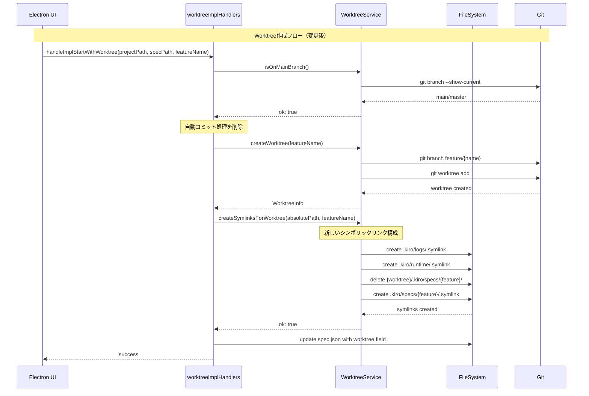
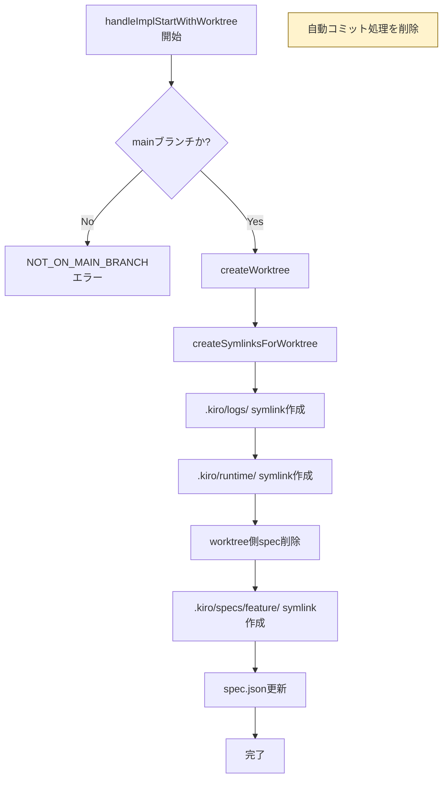
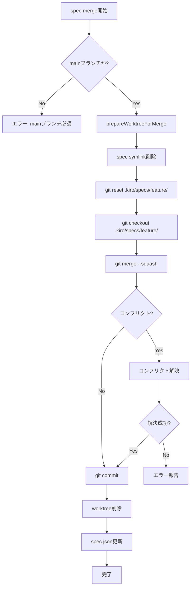

# Design: Worktree Spec Symlink

## Overview

**Purpose**: この機能は、worktreeモードでspec実装を行う際のファイル監視問題を解決する。worktree側のspecディレクトリをシンボリックリンクにすることで、メイン側のElectronアプリがtasks.mdの変更をリアルタイムで監視可能にする。

**Users**: SDD Orchestratorを使用してworktreeモードで機能実装を行う開発者が対象。

**Impact**: 既存のworktree作成フロー（`handleImplStartWithWorktree`）とマージフロー（`/kiro:spec-merge`）を修正し、シンボリックリンク戦略を変更する。

### Goals
- worktree側のspecディレクトリをメイン側へのシンボリックリンクにする
- worktree作成前の自動コミット処理を削除する
- spec-merge前にシンボリックリンクを削除し、gitリセットを実行してコンフリクトを回避する

### Non-Goals
- Bug worktreeのシンボリックリンク対応（別specで対応予定）
- Electronアプリ側の監視ロジック変更（既にメイン側を監視しているため不要）
- `.kiro/logs/`と`.kiro/runtime/`のシンボリックリンク戦略の変更（現状維持）

## Architecture

### Existing Architecture Analysis

現在のworktreeフローは以下の構造:

1. **worktree作成時**（`handleImplStartWithWorktree`）:
   - `checkUncommittedSpecChanges()` でspec変更を検出
   - `commitSpecChanges()` で自動コミット
   - `createWorktree()` でworktree作成
   - `createSymlinksForWorktree()` で3つのシンボリックリンク作成
     - `.kiro/logs/` → メイン側の`.kiro/logs/`
     - `.kiro/runtime/` → メイン側の`.kiro/runtime/`
     - `.kiro/specs/{feature}/logs/` → メイン側の`.kiro/specs/{feature}/logs/`
   - `spec.json`にworktreeフィールドを追加

2. **spec-merge時**（`/kiro:spec-merge`コマンド）:
   - メインブランチ確認
   - `git merge --squash`でマージ
   - コンフリクト解決（最大7回試行）
   - worktree削除、ブランチ削除
   - `spec.json`からworktreeフィールド削除

### Architecture Pattern & Boundary Map



**Architecture Integration**:
- Selected pattern: 既存のサービス層パターンを維持（WorktreeService）
- Domain boundaries: IPCハンドラ → サービス → Git/FSの責務分離を維持
- Existing patterns preserved: Result型によるエラーハンドリング、ログ出力パターン
- New components rationale: 新規コンポーネントなし、既存メソッドの修正のみ
- Steering compliance: KISS原則に従い最小限の変更で目的を達成

### Technology Stack

| Layer | Choice / Version | Role in Feature | Notes |
|-------|------------------|-----------------|-------|
| Backend / Services | Node.js (Electron 35) | WorktreeService修正 | 既存技術スタック |
| Data / Storage | fs/promises | シンボリックリンク操作 | Node.js標準API |

## System Flows

### Worktree作成フロー（変更後）



### Spec-Mergeフロー（変更後）



## Requirements Traceability

| Criterion ID | Summary | Components | Implementation Approach |
|--------------|---------|------------|------------------------|
| 1.1 | worktree作成時に自動コミットしない | `handleImplStartWithWorktree` | 既存コード削除 |
| 1.2 | `checkUncommittedSpecChanges()`呼び出し削除 | `worktreeImplHandlers.ts` | 関数呼び出し削除 |
| 1.3 | `commitSpecChanges()`呼び出し削除 | `worktreeImplHandlers.ts` | 関数呼び出し削除 |
| 2.1 | worktree作成時にspec全体のsymlink作成 | `createSymlinksForWorktree` | 既存修正 |
| 2.2 | worktree側にspecディレクトリが存在する場合は削除 | `createSymlinksForWorktree` | 既存修正 |
| 2.3 | `.kiro/logs/`と`.kiro/runtime/`のsymlinkは維持 | `createSymlinksForWorktree` | 変更なし |
| 2.4 | `.kiro/specs/{feature}/logs/`のsymlink削除 | `createSymlinksForWorktree` | 既存修正 |
| 3.1 | spec-merge時にメインプロジェクト確認 | `/kiro:spec-merge` | 既存実装済み |
| 3.2 | マージ前にsymlink削除 | `prepareWorktreeForMerge` | 新規追加 |
| 3.3 | symlink削除後にgit reset実行 | `prepareWorktreeForMerge` | 新規追加 |
| 3.4 | git reset後にgit checkout実行 | `prepareWorktreeForMerge` | 新規追加 |
| 3.5 | worktree側にspec変更がない状態でマージ | `/kiro:spec-merge` | フロー変更 |
| 4.1 | `createSymlinksForWorktree()`修正 | `WorktreeService` | 既存修正 |
| 4.2 | `prepareWorktreeForMerge()`新規追加 | `WorktreeService` | 新規追加 |
| 4.3 | `commitSpecChanges()`と`checkUncommittedSpecChanges()`は残す | `WorktreeService` | 変更なし |

### Coverage Validation Checklist

- [x] Every criterion ID from requirements.md appears in the table above
- [x] Each criterion has specific component names (not generic references)
- [x] Implementation approach distinguishes "reuse existing" vs "new implementation"
- [x] User-facing criteria specify concrete UI components (not just "shared components")

## Components and Interfaces

| Component | Domain/Layer | Intent | Req Coverage | Key Dependencies | Contracts |
|-----------|--------------|--------|--------------|------------------|-----------|
| `WorktreeService` | Main Process / Services | Git worktree操作のラッパー | 2.1-2.4, 4.1-4.3 | fs/promises, child_process | Service |
| `handleImplStartWithWorktree` | Main Process / IPC Handlers | worktree作成フローのオーケストレーション | 1.1-1.3 | WorktreeService | Service |
| `/kiro:spec-merge` | Claude Command | worktreeのマージとクリーンアップ | 3.1-3.5 | Git CLI, WorktreeService | N/A |

### Main Process / Services

#### WorktreeService

| Field | Detail |
|-------|--------|
| Intent | Git worktree操作およびシンボリックリンク管理 |
| Requirements | 2.1, 2.2, 2.3, 2.4, 4.1, 4.2, 4.3 |

**Responsibilities & Constraints**
- worktree作成・削除のGit操作を実行
- シンボリックリンクの作成・削除を管理
- パスの解決とセキュリティ検証

**Dependencies**
- Outbound: fs/promises — ファイルシステム操作 (P0)
- Outbound: child_process — Git コマンド実行 (P0)

**Contracts**: Service [x]

##### Service Interface

```typescript
// 既存メソッド（変更）
async createSymlinksForWorktree(
  worktreeAbsolutePath: string,
  featureName: string
): Promise<WorktreeServiceResult<void>>;

// 新規メソッド
async prepareWorktreeForMerge(
  featureName: string
): Promise<WorktreeServiceResult<void>>;

// 既存メソッド（変更なし、将来利用のため残す）
async checkUncommittedSpecChanges(
  specPath: string
): Promise<WorktreeServiceResult<{ hasChanges: boolean; files: string[] }>>;

async commitSpecChanges(
  specPath: string,
  featureName: string
): Promise<WorktreeServiceResult<void>>;
```

**Implementation Notes**
- `createSymlinksForWorktree`: symlinksリストから`.kiro/specs/{feature}/logs/`を削除し、`.kiro/specs/{feature}/`を追加
- `prepareWorktreeForMerge`: spec-mergeコマンドから呼び出される、もしくはコマンド内で直接実装

### Main Process / IPC Handlers

#### handleImplStartWithWorktree

| Field | Detail |
|-------|--------|
| Intent | worktree作成フローのオーケストレーション |
| Requirements | 1.1, 1.2, 1.3 |

**Responsibilities & Constraints**
- worktree作成の前提条件チェック
- WorktreeServiceを呼び出してworktree作成
- spec.jsonの更新

**Dependencies**
- Outbound: WorktreeService — worktree操作 (P0)
- Outbound: fs/promises — spec.json更新 (P0)

**Contracts**: Service [x]

##### Service Interface

```typescript
async function handleImplStartWithWorktree(
  projectPath: string,
  specPath: string,
  featureName: string
): Promise<ImplStartWithWorktreeResult>;
```

- Preconditions: mainブランチ上で実行されること
- Postconditions: worktree作成完了、symlink作成完了、spec.json更新完了
- Invariants: spec.jsonのworktreeフィールドが正しく設定される

**Implementation Notes**
- Integration: 既存の`checkUncommittedSpecChanges()`と`commitSpecChanges()`呼び出しを削除
- Validation: mainブランチチェックは既存実装を維持

### Claude Command

#### /kiro:spec-merge

| Field | Detail |
|-------|--------|
| Intent | worktreeブランチのマージとクリーンアップ |
| Requirements | 3.1, 3.2, 3.3, 3.4, 3.5 |

**Responsibilities & Constraints**
- マージ前のsymlink削除とgit reset/checkout
- squashマージの実行
- worktree・ブランチの削除
- spec.json更新

**Implementation Notes**
- Integration: Step 2（マージ実行）の前に新しいStep 1.5（symlink削除とreset）を追加
- Validation: メインブランチチェック、worktreeフィールド存在チェックは既存実装を維持
- Risks: git reset実行によりworktree側の変更が失われるが、これは意図した動作（Decision Logで合意済み）

## Data Models

### Domain Model

本機能はデータモデルの変更を伴わない。`spec.json`の`worktree`フィールドは既存のまま維持される。

### Logical Data Model

**シンボリックリンク構成（変更後）**:

```
{project}/
├── .kiro/
│   ├── logs/                    # 実体
│   ├── runtime/                 # 実体
│   └── specs/
│       └── {feature}/           # 実体
│           ├── spec.json
│           ├── requirements.md
│           ├── design.md
│           ├── tasks.md
│           └── logs/
└── .kiro/worktrees/specs/{feature}/  # worktree
    └── .kiro/
        ├── logs/    -> {project}/.kiro/logs/           # symlink（既存）
        ├── runtime/ -> {project}/.kiro/runtime/        # symlink（既存）
        └── specs/
            └── {feature}/ -> {project}/.kiro/specs/{feature}/  # symlink（新規）
```

## Error Handling

### Error Strategy

既存のResult型パターンを維持し、`WorktreeServiceResult<T>`で成功/失敗を返す。

### Error Categories and Responses

**System Errors**:
- シンボリックリンク作成失敗 → ログ出力して警告、処理は継続
- git reset/checkout失敗 → エラー返却、マージ処理を中断

**Business Logic Errors**:
- mainブランチ以外での実行 → NOT_ON_MAIN_BRANCHエラー
- worktreeフィールド未設定でspec-merge実行 → エラーメッセージ表示

### Monitoring

既存のloggerを使用してWorktreeService操作をログ出力。
- INFO: symlink作成成功、prepareWorktreeForMerge完了
- WARN: symlink作成失敗（処理継続時）
- ERROR: 致命的エラー

## Testing Strategy

### Unit Tests

- `WorktreeService.createSymlinksForWorktree`: 新しいsymlink構成が正しく作成されることを検証
- `WorktreeService.prepareWorktreeForMerge`: symlink削除とgit reset/checkoutが正しく実行されることを検証
- `handleImplStartWithWorktree`: 自動コミット処理が呼び出されないことを検証

### Integration Tests

- worktree作成からspec-mergeまでの一連のフローテスト
- worktree側でspec変更後のマージでコンフリクトが発生しないことを検証
- Electronアプリがworktree実装中にtasks.md変更を検知できることを検証

## Design Decisions

### DD-001: シンボリックリンクの方向

| Field | Detail |
|-------|--------|
| Status | Accepted |
| Context | worktree側とメイン側のどちらにspecファイルの実体を置くか |
| Decision | メイン側に実体、worktree側にシンボリックリンク |
| Rationale | Electronアプリがメイン側のtasks.mdを監視しており、worktree側での変更をリアルタイムで反映するため |
| Alternatives Considered | 1. worktree側に実体、メイン側にsymlink → Electronの監視対象変更が必要 2. 両方に実体を維持 → 同期問題が発生 |
| Consequences | worktree側での`cat tasks.md`等は透過的に動作する。Electronアプリの変更不要。 |

### DD-002: 自動コミット処理の削除

| Field | Detail |
|-------|--------|
| Status | Accepted |
| Context | worktree作成前にspec変更を自動コミットする処理が存在するが、symlinkアプローチでは不要 |
| Decision | `checkUncommittedSpecChanges()`と`commitSpecChanges()`の呼び出しを削除 |
| Rationale | symlink使用時はメイン側のspecを直接参照するため、コミット不要。未コミットのspec変更をworktree側から編集可能にする。 |
| Alternatives Considered | 1. コミット処理を残す → 不要なコミットが発生、gitログが煩雑に 2. オプションで切り替え → 複雑性増加、YAGNI違反 |
| Consequences | 関数自体はコードベースに残す（将来利用の可能性）が、worktree作成フローからは呼び出さない。 |

### DD-003: マージ前のgit reset戦略

| Field | Detail |
|-------|--------|
| Status | Accepted |
| Context | symlink削除後、worktree側のspecディレクトリが消失するため、gitがファイル削除と認識する可能性がある |
| Decision | symlink削除後に無条件で`git reset`と`git checkout`を実行 |
| Rationale | worktree側のspec変更はメイン側に反映されているため、resetしても変更は失われない。無条件実行により条件分岐を削減。 |
| Alternatives Considered | 1. 変更検出して条件付きreset → 複雑性増加、エッジケース発生リスク 2. resetなし → コンフリクト発生リスク |
| Consequences | `git reset`は空でもエラーにならないため、安全に無条件実行可能。 |

### DD-004: 既存logs/runtime symlinkの維持

| Field | Detail |
|-------|--------|
| Status | Accepted |
| Context | `.kiro/logs/`と`.kiro/runtime/`のsymlinkを維持するか変更するか |
| Decision | 現状維持（変更なし） |
| Rationale | ログ・ランタイムの共有は有用であり、削除する理由がない。本featureのスコープ外。 |
| Alternatives Considered | N/A |
| Consequences | 既存動作に影響なし。 |
