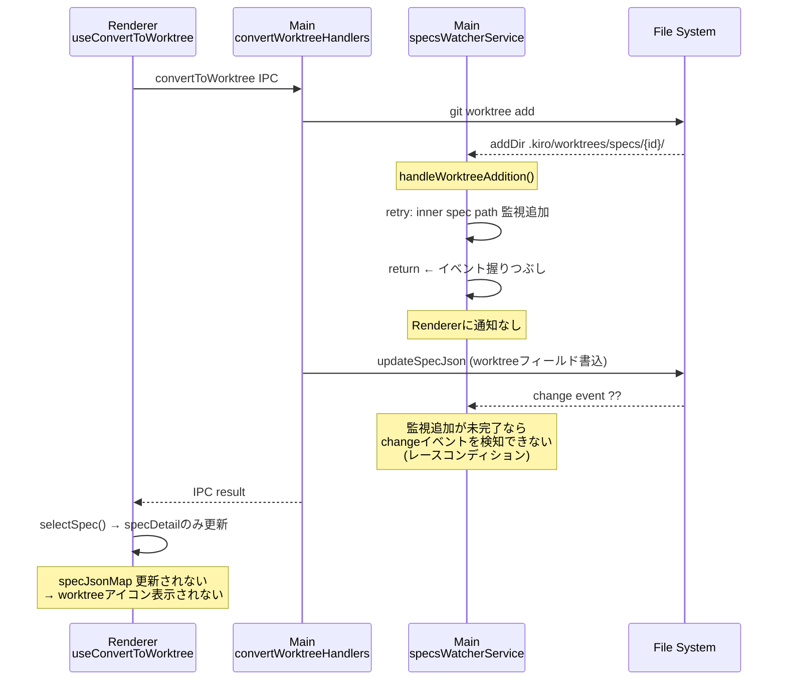
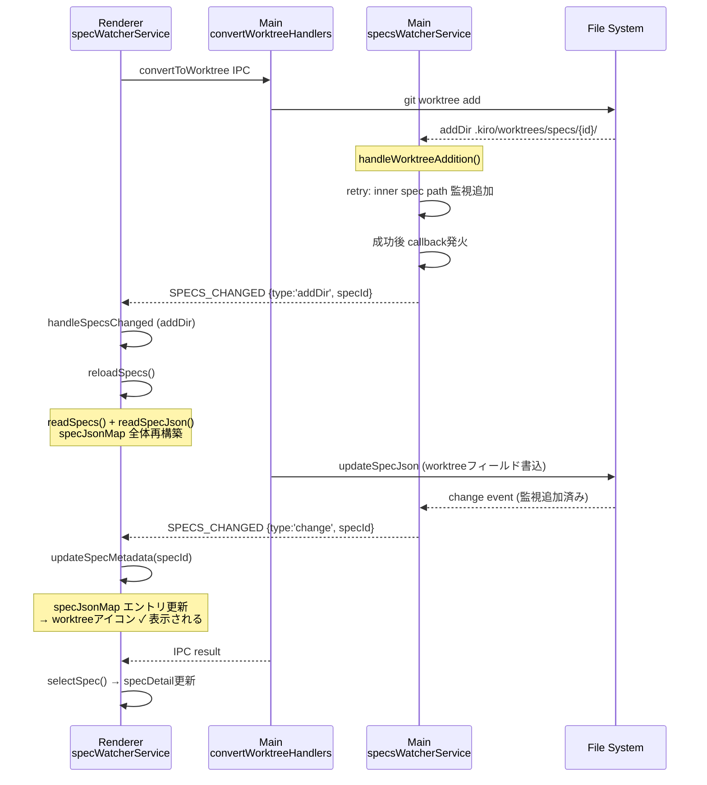

# Requirements: Worktree SpecList Event Propagation

## Decision Log

### Worktree変換後にSpecListのworktreeアイコンが更新されない問題
- **Discussion**: worktree変換後、SpecList上のworktreeバッジ（GitBranchアイコン）が表示されない。プロジェクト再読み込みで初めて反映される。原因調査の結果、Main側のspecsWatcherServiceがworktree `addDir` イベントをRendererに伝搬せず握りつぶしていることが判明した。
- **Conclusion**: Main側の `handleWorktreeAddition` でイベントを握りつぶさず、監視パス追加成功後にRendererへイベントを伝搬する
- **Rationale**: steering/structure.md の原則「ステート変更の流れは Main → ブロードキャスト → Renderer」に従い、Main側が状態変更の通知責務を持つべき。Renderer側での手動更新（useConvertToWorktreeに updateSpecMetadata を追加）はDRYに反し、今後のworktree関連IPC操作追加時に漏れの温床になる。

### 修正対象の範囲
- **Discussion**: specsWatcherServiceだけでなく、bugsWatcherServiceにも同じパターンが存在する
- **Conclusion**: 両方のWatcherServiceを修正する
- **Rationale**: 同一のコードパターン（handleWorktreeAddition内でreturnして握りつぶし）が両方に存在しており、片方だけ修正するのは不整合

### Renderer側の変更
- **Discussion**: Renderer側に変更は必要か
- **Conclusion**: 不要。既存の `handleSpecsChanged` が `addDir` → `reloadSpecs()` → specJsonMap再構築のパスをすでに持っているため、Main側がイベントを伝搬すれば自然に動く
- **Rationale**: 既存のイベント処理パスを活用することで最小変更に抑える

## Introduction

Worktree変換（`convertToWorktree`）完了後、SpecListのworktreeバッジアイコンが即座に反映されない不具合を修正する。根本原因はMain側の `specsWatcherService.handleWorktreeAddition` がworktreeディレクトリの `addDir` イベントをRendererに伝搬せず握りつぶしていることにある。同じ問題が `bugsWatcherService` にも存在する。

## 現況分析

### Before: 現在のイベント伝搬（壊れている）

### After: 修正後のイベント伝搬

## Requirements

### Requirement 1: handleWorktreeAddition 完了後のイベント伝搬

**Objective:** システム管理者として、worktreeディレクトリ追加時にRendererへイベントが伝搬されるようにしたい。これにより、SpecListのworktreeバッジが即座に反映される。

#### Acceptance Criteria

1.1. `specsWatcherService.handleWorktreeAddition` が inner spec path の監視追加に成功したとき、システムは `SpecsChangeEvent` を登録済みcallbackに発火しなければならない

1.2. 発火する `SpecsChangeEvent` は `{ type: 'addDir', path: innerSpecPath, specId: entityName }` の形式でなければならない

1.3. `bugsWatcherService.handleWorktreeAddition` にも同様の修正を適用しなければならない（DRY原則）

1.4. 監視追加に失敗した場合（retryが全て失敗）、callback発火は行わない

### Requirement 2: 既存のRenderer側イベント処理パスとの整合

**Objective:** 新しく伝搬されるイベントが既存のRenderer側処理パスで正しく処理されることを保証したい。

#### Acceptance Criteria

2.1. Renderer側の `specWatcherService.handleSpecsChanged` は、新たに伝搬される `addDir` イベントに対して既存の `reloadSpecs()` を呼び出さなければならない（既存動作、変更不要の確認）

2.2. `reloadSpecs()` により `specJsonMap` が再構築され、worktreeフィールドを含むspec.jsonが読み込まれなければならない

### Requirement 3: イベント重複の防止

**Objective:** 同一worktree追加に対して過剰なイベント発火を防ぎたい。

#### Acceptance Criteria

3.1. `handleWorktreeAddition` 内の既存debounceロジックにより、同一entityNameに対する重複発火が防止されなければならない

3.2. `watchedPaths` の重複チェック（既存）により、すでに監視済みのパスに対してイベントが重複発火されてはならない

### Requirement 4: Remote UI対応

**Objective:** Remote UIでも同様にworktreeバッジが反映されることを確認したい。

#### Acceptance Criteria

4.1. Remote UI側はWebSocket経由で同じイベントを受信するため、Renderer側と同様にspecJsonMapが更新されなければならない（既存動作の確認、変更不要）

## Out of Scope

- `convertToWorktreeHandler` からの明示的な `SPECS_CHANGED` 送信（設計フェーズで検討）
- Renderer側 `useConvertToWorktree` への `updateSpecMetadata` 追加（対症療法であり不採用）
- ファイルウォッチャーのアーキテクチャ全体の見直し
- worktree削除（unlinkDir）時のイベント伝搬（現状と同じ問題があるが、別issue）

## Open Questions

- `handleWorktreeAddition` のcallback発火タイミングと `convertToWorktree` の `updateSpecJson` 完了タイミングの間にレースコンディションが存在する可能性がある。`reloadSpecs()` がworktreeフィールド書き込み前に実行された場合、1回目の `addDir` イベントでは古いspec.jsonを読む。2回目の `change` イベントで最終的に反映されるが、この2段階更新で問題ないか、あるいは `convertToWorktreeHandler` からの明示的通知のほうがシンプルかは設計フェーズで検討する
