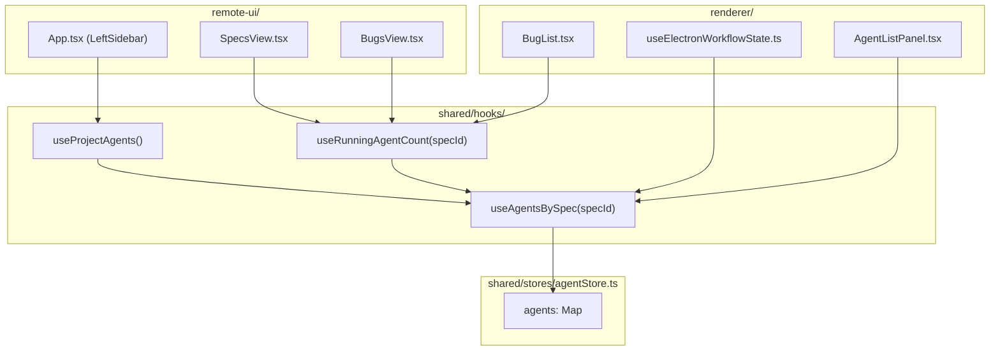
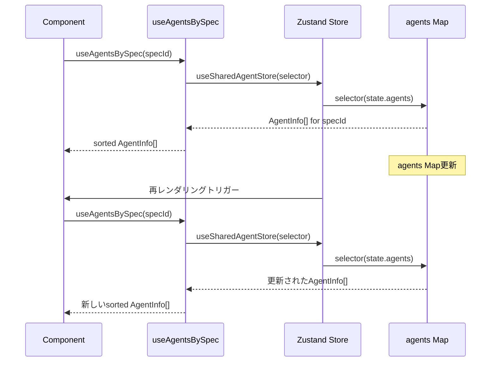

# Technical Design: Zustand Agent Selector Hooks

## Overview

**Purpose**: Remote UI Desktop版でProjectエージェント一覧が表示されない問題を解決する。Zustandのgetter関数がリアクティブでない問題に対し、正しいZustandセレクタパターンを強制するカスタムHookを提供する。

**Users**: Remote UI/Electron版の開発者が、Agent状態のサブスクリプションを正しく行うためにこのHookを使用する。

**Impact**: 既存の`getAgentsForSpec`/`getProjectAgents`メソッドを削除し、新規HookによるリアクティブなAgent状態アクセスに統一する。

### Goals

- ZustandのAgent状態変更時に確実にUIが再レンダリングされる仕組みを提供
- 開発者がアンチパターンを使用できないようAPIを制限
- Electron版とRemote UI版で一貫したパターンを確立

### Non-Goals

- 他のZustand storeのgetter関数の見直し（本Specはagent関連のみ）
- パフォーマンス最適化（現状の実装で十分）
- Mobile版のAgentsTabViewの修正（既に正しいパターンを使用）

## Architecture

### Existing Architecture Analysis

**現状の問題**:
- `getAgentsForSpec`はgetter関数であり、関数参照自体は不変
- `useMemo`の依存配列に入れても、`agents` Mapの変更を検知しない
- 結果、`agents` Mapが更新されても`useMemo`が再計算されない

```typescript
// ANTI-PATTERN: getAgentsForSpec参照は不変のため再計算されない
const projectAgents = useMemo(() => {
  const agents = getAgentsForSpec('');  // ここは毎回呼ばれるが...
  return [...agents].sort(/* ... */);
}, [getAgentsForSpec]);  // 依存配列の参照は不変
```

**正しいパターン**:
- `state.agents` Mapを直接セレクタでサブスクライブ
- Map変更時に新しい参照が返され、コンポーネントが再レンダリング

```typescript
// CORRECT: agents Mapを直接サブスクライブ
const agents = useSharedAgentStore((state) => state.agents);
const projectAgents = useMemo(() => {
  const agentList = agents.get('') || [];
  return [...agentList].sort(/* ... */);
}, [agents]);  // agents Map変更で再計算される
```

### Architecture Pattern & Boundary Map



**Key Decisions**:
- Hookは`shared/hooks/`に配置し、Electron/Remote UIの両方で使用可能
- `useAgentsBySpec`を基盤とし、他のHookはこれに委譲
- 既存の`getAgentsForSpec`/`getProjectAgents`は削除（breaking change）

### Technology Stack

| Layer | Choice / Version | Role in Feature | Notes |
|-------|------------------|-----------------|-------|
| State Management | Zustand 5.x | リアクティブなAgent状態管理 | 既存スタック |
| Hooks | React 19 | カスタムHook実装 | 既存スタック |
| Testing | Vitest | Hook/コンポーネントテスト | 既存スタック |

## System Flows

### Agent State Subscription Flow



**Key Decisions**:
- Zustandのセレクタを使用し、`agents` Map変更時に自動的に再レンダリング
- ソートロジックはHook内でメモ化し、不要な再計算を防止

## Requirements Traceability

| Criterion ID | Summary | Components | Implementation Approach |
|--------------|---------|------------|------------------------|
| 1.1 | useAgentsBySpec(specId) Hook作成 | `useAgentsBySpec` | 新規実装 |
| 1.2 | useProjectAgents() Hook作成 | `useProjectAgents` | useAgentsBySpecへの委譲 |
| 1.3 | useRunningAgentCount(specId) Hook作成 | `useRunningAgentCount` | useAgentsBySpecから派生 |
| 1.4 | Hookはshared/hooks/に配置 | `shared/hooks/index.ts` | バレルエクスポート追加 |
| 2.1 | SharedAgentState.getAgentsForSpec削除 | `shared/stores/agentStore.ts` | メソッド・型定義削除 |
| 2.2 | AgentStore.getAgentsForSpec削除 | `renderer/stores/agentStore.ts` | メソッド・型定義削除 |
| 2.3 | getProjectAgents削除 | `renderer/stores/agentStore.ts` | メソッド・型定義削除 |
| 3.1 | remote-ui/App.tsx修正 | `App.tsx` | useProjectAgents使用 |
| 3.2 | remote-ui/SpecsView.tsx修正 | `SpecsView.tsx` | useRunningAgentCount使用 |
| 3.3 | remote-ui/BugsView.tsx修正 | `BugsView.tsx` | useRunningAgentCount使用 |
| 3.4 | AgentsTabViewは変更不要 | - | 既に正しいパターン使用 |
| 4.1 | useElectronWorkflowState.ts修正 | `useElectronWorkflowState.ts` | useAgentsBySpec使用 |
| 4.2 | renderer/stores/agentStore.ts修正 | `agentStore.ts` | 内部使用箇所の置換 |
| 4.3 | 他のRenderer側使用箇所修正 | 各コンポーネント | Hook使用に移行 |
| 5.1 | 新規Hookのユニットテスト | `useAgentsBySpec.test.ts` | 新規作成 |
| 5.2 | 既存テストの更新 | 13ファイル | mock/使用箇所更新 |

### Coverage Validation Checklist

- [x] Every criterion ID from requirements.md appears in the table above
- [x] Each criterion has specific component names (not generic references)
- [x] Implementation approach distinguishes "reuse existing" vs "new implementation"
- [x] User-facing criteria specify concrete UI components (not just "shared components")

## Components and Interfaces

| Component | Domain/Layer | Intent | Req Coverage | Key Dependencies | Contracts |
|-----------|--------------|--------|--------------|------------------|-----------|
| useAgentsBySpec | shared/hooks | specId指定でAgent一覧取得、状態変更で再レンダリング | 1.1 | useSharedAgentStore (P0) | State |
| useProjectAgents | shared/hooks | Project Agent一覧取得 | 1.2 | useAgentsBySpec (P0) | State |
| useRunningAgentCount | shared/hooks | 実行中Agent数取得 | 1.3 | useAgentsBySpec (P0) | State |

### shared/hooks

#### useAgentsBySpec

| Field | Detail |
|-------|--------|
| Intent | 指定specIdのAgent一覧をリアクティブに取得し、ソート済みで返す |
| Requirements | 1.1 |

**Responsibilities & Constraints**
- `state.agents` Mapを直接サブスクライブ
- specId一致するAgentをフィルタリング
- ソート順: running first, then by startedAt descending
- Mapの参照変更時に再レンダリングをトリガー

**Dependencies**
- Inbound: なし
- Outbound: useSharedAgentStore - Agent状態の購読 (P0)
- External: なし

**Contracts**: State [x]

##### Service Interface

```typescript
/**
 * useAgentsBySpec - 指定specIdのAgent一覧をリアクティブに取得
 * @param specId - 対象のspecId（Project Agentは空文字列）
 * @returns ソート済みAgentInfo配列（running first, then by startedAt desc）
 */
function useAgentsBySpec(specId: string): AgentInfo[];
```

- Preconditions: specIdは文字列（空文字列許容）
- Postconditions: specIdに一致するAgentの配列を返す。存在しない場合は空配列
- Invariants: 返却配列は常にソート済み

##### State Management

- State model: Zustand subscriptionを使用、`state.agents.get(specId)`をセレクタで取得
- Persistence: なし（メモリ上のみ）
- Concurrency: React concurrent modeと互換

**Implementation Notes**
- Integration: 既存の`useSharedAgentStore`を活用
- Validation: なし（specIdは任意文字列）
- Risks: なし

#### useProjectAgents

| Field | Detail |
|-------|--------|
| Intent | Project Agent（specId=''）一覧を取得 |
| Requirements | 1.2 |

**Contracts**: State [x]

##### Service Interface

```typescript
/**
 * useProjectAgents - Project Agent一覧をリアクティブに取得
 * useAgentsBySpec('')への委譲
 */
function useProjectAgents(): AgentInfo[];
```

- Preconditions: なし
- Postconditions: specId=''のAgentを返す
- Invariants: useAgentsBySpec('')と同一結果

#### useRunningAgentCount

| Field | Detail |
|-------|--------|
| Intent | 指定specIdの実行中Agent数を取得 |
| Requirements | 1.3 |

**Contracts**: State [x]

##### Service Interface

```typescript
/**
 * useRunningAgentCount - 実行中Agent数をリアクティブに取得
 * @param specId - 対象のspecId
 * @returns 実行中Agent数
 */
function useRunningAgentCount(specId: string): number;
```

- Preconditions: specIdは文字列
- Postconditions: status='running'のAgent数を返す
- Invariants: 常に0以上の整数

## Data Models

### Domain Model

既存の`AgentInfo`型を使用。変更なし。

```typescript
interface AgentInfo {
  agentId: string;
  specId: string;
  phase: string;
  status: 'running' | 'completed' | 'failed' | 'interrupted';
  startedAt: string | number;
  lastActivityAt?: string;
  // ... other fields
}
```

## Error Handling

### Error Strategy

- Hook内でのエラーは発生しない設計（Zustand storeが常に有効なMapを返す）
- specIdが存在しない場合は空配列を返す

## Testing Strategy

### Unit Tests

1. **useAgentsBySpec**
   - 正しいspecIdでAgentを取得
   - agents Map変更時に再レンダリング
   - 存在しないspecIdで空配列
   - ソート順の検証（running first, startedAt desc）

2. **useProjectAgents**
   - useAgentsBySpec('')への委譲確認

3. **useRunningAgentCount**
   - running状態のAgent数をカウント
   - 状態変更時の再計算

### Integration Tests

1. Remote UI App.tsx - useProjectAgentsでAgent一覧表示
2. SpecsView/BugsView - useRunningAgentCountでバッジ表示

### E2E Tests

- 既存のAgent関連E2Eテストがカバー（API変更なし）

## Verification Contract

### User Journey Definition

| Journey ID | Operation Flow | Expected Result | E2E Required |
|------------|---------------|-----------------|--------------|
| UJ-001 | Remote UIでProject Agent起動 -> 左サイドバー確認 | Agent一覧に新規Agentが表示される | No |
| UJ-002 | Spec選択 -> Agent起動 -> Running Countバッジ確認 | バッジに「1」が表示される | No |
| UJ-003 | Agent完了 -> Running Countバッジ確認 | バッジが消える（0件） | No |

**Note**: 既存のE2Eテストでカバーされるため、新規E2Eテストは不要。

### Impact Analysis Contract

| Target File | Action | Reason |
|-------------|--------|--------|
| `src/shared/hooks/useAgentsBySpec.ts` | CREATE | 新規Hook実装 |
| `src/shared/hooks/useAgentsBySpec.test.ts` | CREATE | 新規Hookテスト |
| `src/shared/hooks/index.ts` | UPDATE | 新規Hookのバレルエクスポート追加 |
| `src/shared/stores/agentStore.ts` | UPDATE | getAgentsForSpec削除 |
| `src/shared/stores/agentStore.test.ts` | UPDATE | getAgentsForSpecテスト削除 |
| `src/renderer/stores/agentStore.ts` | UPDATE | getAgentsForSpec/getProjectAgents削除 |
| `src/renderer/stores/agentStore.test.ts` | UPDATE | 関連テスト削除/更新 |
| `src/remote-ui/App.tsx` | UPDATE | useProjectAgents使用に変更 |
| `src/remote-ui/views/SpecsView.tsx` | UPDATE | useRunningAgentCount使用に変更 |
| `src/remote-ui/views/BugsView.tsx` | UPDATE | useRunningAgentCount使用に変更 |
| `src/renderer/hooks/useElectronWorkflowState.ts` | UPDATE | useAgentsBySpec使用に変更 |
| `src/renderer/components/AgentListPanel.tsx` | UPDATE | useAgentsBySpec使用に変更 |
| `src/renderer/components/BugList.tsx` | UPDATE | useRunningAgentCount使用に変更 |
| `src/renderer/components/ProjectAgentPanel.tsx` | UPDATE | useProjectAgents使用に変更 |
| `src/renderer/stores/spec/specStoreFacade.ts` | UPDATE | useAgentsBySpec使用に変更 |
| `src/renderer/components/BugWorkflowView.tsx` | UPDATE | useAgentsBySpec使用に変更 |

**テストファイル更新（mock修正）**:

| Target File | Action | Reason |
|-------------|--------|--------|
| `src/renderer/components/AgentListPanel.test.tsx` | UPDATE | mock更新 |
| `src/renderer/components/BugList.test.tsx` | UPDATE | mock更新 |
| `src/renderer/components/BugList.integration.test.tsx` | UPDATE | mock更新 |
| `src/renderer/components/BugWorkflowView.test.tsx` | UPDATE | mock更新 |
| `src/renderer/components/DocsTabs.integration.test.tsx` | UPDATE | mock更新 |
| `src/renderer/components/DocumentReviewPanel.test.tsx` | UPDATE | mock更新 |
| `src/renderer/components/ProjectAgentPanel.test.tsx` | UPDATE | mock更新 |
| `src/renderer/components/SpecList.test.tsx` | UPDATE | mock更新 |
| `src/renderer/stores/agentStoreAdapter.test.ts` | UPDATE | mock更新 |
| `src/renderer/stores/specStore.specManager.test.ts` | UPDATE | mock更新 |
| `src/remote-ui/components/SpecDetailPage.test.tsx` | UPDATE | mock更新 |
| `e2e-wdio/helpers/auto-execution.helpers.ts` | UPDATE | getAgentsForSpec使用箇所修正 |
| `e2e-wdio/parsed-log-entry-display.e2e.spec.ts` | UPDATE | getAgentsForSpec使用箇所修正 |

### Interface Changes & Impact Analysis

**削除されるAPI**:

| API | 削除元 | 影響を受けるCaller |
|-----|-------|-------------------|
| `getAgentsForSpec(specId)` | SharedAgentState | App.tsx, SpecsView.tsx, BugsView.tsx, useElectronWorkflowState.ts, AgentListPanel.tsx, BugList.tsx, specStoreFacade.ts, BugWorkflowView.tsx |
| `getAgentsForSpec(specId)` | AgentStore (renderer) | 上記 + ProjectAgentPanel.tsx |
| `getProjectAgents()` | AgentStore (renderer) | ProjectAgentPanel.tsx |

**置き換え対応**:
- `getAgentsForSpec(specId)` -> `useAgentsBySpec(specId)`
- `getProjectAgents()` -> `useProjectAgents()`
- 実行中カウントのみ必要な場合 -> `useRunningAgentCount(specId)`

## Design Decisions

### DD-001: 既存APIの削除（Breaking Change）

| Field | Detail |
|-------|--------|
| Status | Accepted |
| Context | `getAgentsForSpec`は設計上リアクティブにならないアンチパターン。非推奨として残すか、削除するかの判断が必要。 |
| Decision | 完全に削除する（Breaking Change） |
| Rationale | 非推奨として残すと、開発者が誤って使用し続ける可能性がある。正しいパターンを強制することで同じ問題の再発を防止。 |
| Alternatives Considered | 1. 非推奨警告を追加して残す - 問題の再発リスクが残る 2. 名前を変更して内部使用のみに - 複雑性が増す |
| Consequences | 既存コードの修正が必要。テストファイルのmock更新も必要。 |

### DD-002: Hook配置場所

| Field | Detail |
|-------|--------|
| Status | Accepted |
| Context | 新規HookをどのディレクトリにHold配置するか |
| Decision | `shared/hooks/`に配置 |
| Rationale | Electron版とRemote UI版の両方で使用するため、sharedディレクトリが適切。既存の`useDeviceType`等と同じパターン。 |
| Alternatives Considered | 1. `remote-ui/hooks/`と`renderer/hooks/`に別々に作成 - DRY原則違反 |
| Consequences | `shared/hooks/index.ts`のバレルエクスポート更新が必要 |

### DD-003: useAgentsBySpecを基盤とした構成

| Field | Detail |
|-------|--------|
| Status | Accepted |
| Context | 複数のHook（useProjectAgents, useRunningAgentCount）をどう構成するか |
| Decision | `useAgentsBySpec`を基盤とし、他のHookはこれに委譲 |
| Rationale | DRY原則に従い、ソートロジックやサブスクリプションロジックを一箇所に集約。テスト容易性も向上。 |
| Alternatives Considered | 1. 各Hookが独立してstore購読 - 重複コード、ソートロジック不一致リスク |
| Consequences | `useRunningAgentCount`は`useAgentsBySpec`の結果をフィルタしてカウントするため、厳密には必要以上のデータを取得する。ただし現状のAgent数では問題なし。 |

## Supporting References

なし（外部依存なし、Zustand標準パターンの適用のみ）
