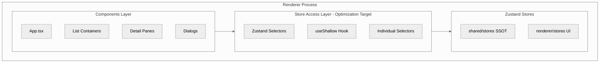
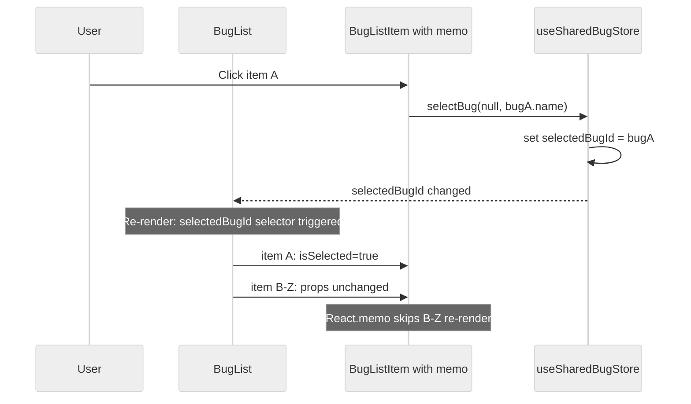

# Design: Zustand Selector Optimization

## Overview

**Purpose**: プロジェクト全体のZustandストア購読パターンを最適化し、不要な再レンダリングを根本的に排除する。24+コンポーネントがセレクターなしでストアを全フィールド購読しているアンチパターンを修正し、5つのリストアイテムコンポーネントに`React.memo`を適用する。

**Users**: 開発者（コードベースの保守性向上）およびエンドユーザー（UIの応答性改善）。

**Impact**: Renderer/Remote UIの全コンポーネントにおけるストア購読パターンを変更する。外部インターフェースやpropsの変更はなく、内部最適化に限定される。

### Goals

- 全コンポーネントで適切なZustandセレクターパターンを適用し、必要なフィールドのみ購読する
- リストアイテムコンポーネント5つに`React.memo`を適用し、リスト内の不要な再レンダリングを防止する
- `useShallow`の使用基準（3+フィールド）と個別セレクター（1-2フィールド）の統一規約を確立する

### Non-Goals

- パフォーマンス計測ツール（React Profiler等）の導入
- Zustandストア自体の分割・リアーキテクチャ
- カスタム等価比較関数の実装
- SSR/RSC対応
- 新規E2Eテストの追加

## Architecture

### Existing Architecture Analysis

本変更はRendererプロセス内部の最適化であり、アーキテクチャの境界やレイヤー構造に変更はない。

- **現行パターン**: `const { a, b, c } = useStore()` でストア全体を購読。1フィールドの変更が全購読コンポーネントの再レンダリングを引き起こす
- **修正後パターン**: セレクターによる選択的購読。コンポーネントは使用するフィールドの変更時のみ再レンダリングされる
- **既存のセレクター使用例**: `useSharedAgentStore((state) => state.agents)` がSpecsView, BugsView等で既に使用されており、このパターンを全コンポーネントに統一適用する

### Architecture Pattern & Boundary Map



**Key Decisions**:
- Store Access Layerに新しいモジュールは追加しない。各コンポーネント内のフック呼び出しパターンを修正するのみ
- 既存の`subscribeWithSelector`ミドルウェアとの競合なし。`useShallow`はコンポーネント側のフックであり、ストア定義には影響しない
- アクション関数（`selectBug`, `loadBugs`等）はZustand内部で参照が安定しているため、セレクター化の対象外

### Technology Stack

| Layer | Choice / Version | Role in Feature | Notes |
|-------|------------------|-----------------|-------|
| Frontend | React 19 | `React.memo`によるリストアイテムメモ化 | 既存依存 |
| State | Zustand 5.0.8 | `useShallow`フック、セレクターパターン | 既存依存、追加インストール不要 |

> `useShallow`はZustand 5.xに同梱済み。新規依存の追加は不要。

## System Flows

### セレクター適用による再レンダリング削減フロー



**Key Decisions**:
- `BugList`は`selectedBugId`のみセレクターで購読するため、`bugs`配列の変更では再レンダリングしない（逆も同様）
- `React.memo`によりpropsが変更されていないリストアイテム（B-Z）の再レンダリングをスキップ
- インラインコールバック`() => handler(item)`を排除し、アイテム内部で`onSelect(id)`を呼ぶパターンに統一

## Requirements Traceability

| Criterion ID | Summary | Components | Implementation Approach |
|--------------|---------|------------|------------------------|
| 1.1 | セレクターなし全購読の解消 | App.tsx, BugList, SpecList, BugPane, SpecPane, BugWorkflowView, ApprovalPanel, DocsTabs, SpecDetail, BugDetailView, ErrorBanner, CreateSpecDialog, CreateBugDialog, ProjectSelectionView, RecentProjectList, ProjectValidationPanel, ProjectPane, McpSettingsPanel, RemoteAccessPanel, RemoteAccessDialog, BugActionButtons, AgentListPanel, ProjectAgentPanel, NotificationProvider, ProjectFileEditor, ScheduleTaskSettingView, DocsTreeSection, BugsView, CreateBugDialogRemote, remote-ui/App.tsx (LeftSidebar, RightSidebar, FooterContent) | セレクター関数の追加（既存パターン拡張） |
| 1.2 | アクション関数のセレクター化対象外 | 全対象コンポーネント | アクションのみ使用するコンポーネントはセレクター化不要と判定 |
| 1.3 | useSharedBugStore全購読箇所の修正 | BugList, BugPane, BugWorkflowView, App.tsx, BugDetailView, CreateBugDialogRemote, BugsView | 個別セレクター or useShallow |
| 1.4 | Remote UIコンポーネントの修正 | remote-ui/App.tsx, BugsView, BugDetailView, CreateBugDialogRemote | 同一パターンを適用 |
| 2.1 | 5コンポーネントのReact.memo適用 | BugListItem, SpecListItem, AgentListItem, EventLogListItem, ScheduleTaskListItem | `React.memo`ラップ |
| 2.2 | インラインコールバックの排除 | BugListContainer, SpecListContainer, AgentList, ScheduleTaskList(ScheduleTaskSettingView内) | `useCallback` + id-basedコールバック |
| 2.3 | shallow equalでのprops比較 | 5つのListItemコンポーネント | Zustandのimmutable updateパターンにより参照安定性を保証 |
| 3.1 | renderer/App.tsxのセレクター最適化 | renderer/App.tsx | useShallowで必要フィールドのみ購読 |
| 3.2 | remote-ui/App.tsxの最適化 | remote-ui/App.tsx | 同一パターンを適用 |
| 4.1 | useShallowインポートパターンの確立 | 全useShallow使用コンポーネント | `import { useShallow } from 'zustand/react/shallow'` |
| 4.2 | useShallow使用基準の明確化 | 全対象コンポーネント | 3+フィールド: useShallow、1-2フィールド: 個別セレクター |
| 5.1 | 既存ユニットテストの通過 | ストアモックを使用するテストファイル | モックセットアップの更新（セレクター対応） |
| 5.2 | 既存E2Eテストの通過 | 全E2Eテスト | 動作変更なし、追加テスト不要 |
| 5.3 | TypeScript型チェックの通過 | 全変更ファイル | `tsc --noEmit`パス |

### Coverage Validation Checklist

- [x] 全criterion IDがトレーサビリティテーブルに記載済み
- [x] 各criterionに具体的なコンポーネント名を記載
- [x] 全て既存パターンの拡張（新規実装なし）
- [x] UI変更なし（内部最適化のみ）

## Components and Interfaces

| Component | Domain/Layer | Intent | Req Coverage | Key Dependencies | Contracts |
|-----------|-------------|--------|--------------|-----------------|-----------|
| Selector Migration (24+ files) | Renderer/UI | ストア購読をセレクターパターンに変更 | 1.1, 1.2, 1.3, 1.4, 3.1, 3.2 | Zustand useShallow (P0) | State |
| BugListItem | Shared/UI | React.memoによるメモ化 | 2.1, 2.2, 2.3 | React.memo (P0) | - |
| SpecListItem | Shared/UI | React.memoによるメモ化 | 2.1, 2.2, 2.3 | React.memo (P0) | - |
| AgentListItem | Shared/UI | React.memoによるメモ化 | 2.1, 2.2, 2.3 | React.memo (P0) | - |
| EventLogListItem | Shared/UI | React.memoによるメモ化 | 2.1, 2.2, 2.3 | React.memo (P0) | - |
| ScheduleTaskListItem | Shared/UI | React.memoによるメモ化 | 2.1, 2.2, 2.3 | React.memo (P0) | - |

### Renderer / Store Access

#### Selector Migration Pattern

| Field | Detail |
|-------|--------|
| Intent | 全コンポーネントのZustandストア購読をセレクターパターンに統一 |
| Requirements | 1.1, 1.2, 1.3, 1.4, 3.1, 3.2, 4.1, 4.2 |

**Responsibilities & Constraints**
- 各コンポーネントが使用するフィールドを特定し、適切なセレクターパターンを適用する
- 3+フィールド使用時は`useShallow`、1-2フィールドは個別セレクター
- アクション関数のみの場合はセレクター化不要

**Contracts**: State [x]

##### State Management

**セレクターパターン分類**:

```typescript
// Pattern A: 個別セレクター（1-2 state fields）
const selectedBugId = useSharedBugStore(s => s.selectedBugId);
const bugDetail = useSharedBugStore(s => s.bugDetail);

// Pattern B: useShallow（3+ state fields）
import { useShallow } from 'zustand/react/shallow';
const { bugs, selectedBugId, isLoading, error } = useSharedBugStore(
  useShallow(s => ({ bugs: s.bugs, selectedBugId: s.selectedBugId, isLoading: s.isLoading, error: s.error }))
);

// Pattern C: アクションのみ（セレクター不要）
const selectBug = useSharedBugStore(s => s.selectBug);
// または、アクション関数はZustandで参照安定のため:
const { selectBug, loadBugs } = useSharedBugStore();
// ↑ アクションのみの場合は全購読でも再レンダリングを引き起こさない
```

- Preconditions: Zustand 5.x がインストール済みであること（現行`^5.0.8`で充足）
- Postconditions: 各コンポーネントは使用するstateフィールドの変更時のみ再レンダリングされる
- Invariants: コンポーネントの外部動作（props、レンダリング結果）は変更前と同一

**Implementation Notes**
- Integration: 既存のコンポーネントファイルの`useXxxStore()`呼び出しをセレクター付きに変更するのみ
- Validation: `tsc --noEmit`でコンパイルエラーがないことを確認
- Risks: テストファイルのモックがセレクター呼び出しに対応していない場合、モック更新が必要

### Shared / UI Components

#### ListItem Memoization

| Field | Detail |
|-------|--------|
| Intent | 5つのリストアイテムをReact.memoでラップし、親の再レンダリング時に不要な再描画を防止 |
| Requirements | 2.1, 2.2, 2.3 |

**Responsibilities & Constraints**
- `React.memo`のshallow比較がprops変更を正しく検知すること
- インラインコールバックを排除し、安定した参照のコールバックを渡すこと
- `bug`, `spec`等のデータオブジェクトはZustandのimmutable updateにより参照安定性が保証される

**Contracts**: State [x]

##### State Management

**メモ化対象コンポーネントとコールバック安定化**:

```typescript
// BugListItem: React.memoラップ
interface BugListItemProps {
  bug: BugMetadata;
  isSelected: boolean;
  onSelect: () => void;  // 安定した参照であること
  runningAgentCount?: number;
  className?: string;
}

// 親コンポーネント側: インラインコールバックの排除
// Before: onSelect={() => handleSelectBug(bug)}
// After:  onSelect={handleSelectBug} + アイテム内部でbug.nameを使用
// または: useCallbackでメモ化されたコールバック
```

- Preconditions: 親コンポーネントがstableなpropsを渡すこと
- Postconditions: propsが変更されていないアイテムはre-renderされない
- Invariants: メモ化前後でレンダリング結果は同一

**Implementation Notes**
- Integration: 既存の`export function XxxListItem`を`export const XxxListItem = React.memo(function XxxListItem(...) { ... })`に変更
- Risks: インラインオブジェクトやコールバックが残るとメモ化が無効化される。親コンポーネントのレビューが必要

## Error Handling

本変更はレンダリング最適化のみであり、新しいエラーパスは導入しない。既存のエラーハンドリングはそのまま維持される。

## Testing Strategy

### Unit Tests

- **ストアモック更新**: セレクターパターンに変更したコンポーネントのテストで、ストアモックが正しくセレクター呼び出しに応答することを確認
- **React.memoの検証**: メモ化されたコンポーネントがprops変更なしで再レンダリングされないことを確認（既存テストの通過で充足）
- **useShallowの動作**: shallow equalが正しく機能し、同値オブジェクトの再レンダリングを防止することを確認

### Integration Tests

- **E2Eテストスイート（Electron 70+件、Web 18件）**: 全テストが変更前と同一の結果を返すことを確認。内部最適化のため新規テスト追加は不要

### Type Check

- `tsc --noEmit`が全変更ファイルでパスすること

### Integration Test Strategy

本変更はRenderer内部の最適化であり、IPC/イベント/ストア同期の境界を越えた新しい統合パスは導入しない。既存のE2Eテストスイートがリグレッションガードとして機能する。

- **Components**: Renderer内の24+コンポーネント、shared/components内の5つのListItem
- **Data Flow**: Store -> Selector -> Component（既存フローの購読方法のみ変更）
- **Mock Boundaries**: ユニットテストではZustandストアをモック。セレクター関数が呼ばれた場合に適切な値を返すようモック更新が必要
- **Verification Points**: 変更前と同一のUI状態・動作が維持されること
- **Robustness Strategy**: 既存E2Eテストは`waitFor`パターンを使用済み。新しいタイミング依存は導入しない
- **Prerequisites**: セレクター対応のストアモックパターンの確立（既存テストヘルパーの拡張で対応可能）

## Design Decisions

### DD-001: useShallow vs 個別セレクターの使い分け基準

| Field | Detail |
|-------|--------|
| Status | Accepted |
| Context | 複数フィールドを購読するコンポーネントでuseShallowを使うか、全て個別セレクターで統一するか |
| Decision | 3+フィールド使用時は`useShallow`、1-2フィールドは個別セレクターの併用方針 |
| Rationale | 5フィールドを個別セレクター5行で書くより`useShallow`1行の方が可読性・保守性が高い。Zustand v5公式推奨パターン。1-2フィールドの場合は個別セレクターの方がシンプル |
| Alternatives Considered | 1) 全て個別セレクター: コード量が増大し可読性低下。2) 全てuseShallow: 1フィールドにuseShallowはオーバーヘッド |
| Consequences | チーム内でフィールド数による判断基準が必要。requirements.mdのDecision Logで合意済み |

### DD-002: React.memoの適用範囲をリストアイテム5コンポーネントに限定

| Field | Detail |
|-------|--------|
| Status | Accepted |
| Context | どのコンポーネントにReact.memoを適用するか。ページレベルも含めるか |
| Decision | リスト内で繰り返し描画されるアイテムコンポーネント5つに限定 |
| Rationale | React.memoはリスト内の兄弟コンポーネント（選択状態が変わらないアイテム）の不要な再レンダリング防止に最も効果的。ページレベルのコンポーネントにはセレクター分離で十分。過度なmemo化はメモリオーバーヘッドと複雑性を増す |
| Alternatives Considered | 1) 全コンポーネントにmemo: 効果が薄い箇所にもオーバーヘッド。2) memo適用なし: リストアイテムのカスケード再レンダリングが残存 |
| Consequences | リストアイテムの親コンポーネントでstableなprops（`useCallback`等）を保証する必要がある |

### DD-003: useShallowのインポートパス

| Field | Detail |
|-------|--------|
| Status | Accepted |
| Context | Zustand v5では`zustand/shallow`と`zustand/react/shallow`の両パスが使用可能 |
| Decision | `import { useShallow } from 'zustand/react/shallow'`を統一パスとする |
| Rationale | React固有のフック（`useRef`使用）であることを明示するパス。`zustand/shallow`は`shallow`ユーティリティも再エクスポートしておりimport時の混乱を避ける。requirements.mdで合意済み |
| Alternatives Considered | `zustand/shallow`: 短いが`shallow`関数とのインポート混在リスク |
| Consequences | 全ファイルで統一されたインポートパスを使用 |

### DD-004: アクション関数のセレクター化不要の判断

| Field | Detail |
|-------|--------|
| Status | Accepted |
| Context | Zustandのアクション関数（`selectBug`、`loadBugs`等）もセレクター化すべきか |
| Decision | アクション関数はセレクター化の対象外とする |
| Rationale | Zustandのアクション関数はストア作成時に固定され参照が安定している。stateフィールドの変更でアクション関数の参照は変わらないため、再レンダリングを引き起こさない。ただし`const { action } = useStore()`で全購読しても、アクション*のみ*使用する場合は問題ない。stateフィールドとアクションを混在して取得する場合はセレクターが必要 |
| Alternatives Considered | アクションも含めて全てセレクター化: 不要な複雑性の追加 |
| Consequences | アクションのみ使用するコンポーネントは既存のデストラクチャリングを維持可能 |

### DD-005: インラインコールバック排除戦略

| Field | Detail |
|-------|--------|
| Status | Accepted |
| Context | リストアイテムに渡すコールバック`onSelect={() => handler(item)}`がReact.memoを無効化する |
| Decision | アイテムコンポーネント内部で`onSelect(id)`を呼ぶパターンを採用。親は`useCallback`でハンドラをメモ化 |
| Rationale | BugListItemは既に`onSelect: () => void`のシグネチャを持つ。現行のBugListContainerが各アイテムに`onSelectBug={() => handleSelect(bug)}`を渡しているため、Container側でuseCallbackまたはアイテム内部でのid呼び出しパターンに変更する |
| Alternatives Considered | 1) 全てuseCallback: コンテナコンポーネントの変更が増加。2) `onSelect(id)`パターン: propsインターフェース変更が必要な場合がある |
| Consequences | BugListItem等のpropsインターフェースが`onSelect: () => void`のままであれば、親側のコールバック安定化のみで対応可能。propsインターフェースの変更が必要な場合はインパクト分析セクション参照 |

## Integration & Deprecation Strategy

### 変更対象ファイル一覧

**セレクター適用対象（Renderer）**:
- `src/renderer/App.tsx` - useProjectStore, useSpecStore, useSharedBugStore, useAgentStore, useMcpStore, useNotificationStore, useEditorStore（isDirty: stateフィールド）, useRemoteAccessStore（isRunning等: state+actions混在）, useConnectionStore（authDialog, projectSwitchConfirm等: state+actions混在）, useWorkflowStore（setCommandPrefix: アクション専用→Req 1.2対象外）, useToolPathStore（fetchStatuses: アクション専用→Req 1.2対象外）, useProjectEditorStore（clearEditor: アクション専用→Req 1.2対象外）
- `src/renderer/components/BugList.tsx` - useSharedBugStore
- `src/renderer/components/SpecList.tsx` - useSpecStore, useAgentStore
- `src/renderer/components/BugPane.tsx` - useSharedBugStore
- `src/renderer/components/SpecPane.tsx` - useSpecStore
- `src/renderer/components/BugWorkflowView.tsx` - useSharedBugStore
- `src/renderer/components/ApprovalPanel.tsx` - useSpecStore
- `src/renderer/components/DocsTabs.tsx` - useProjectStore, useAgentStore
- `src/renderer/components/SpecDetail.tsx` - useSpecStore, useProjectStore
- `src/renderer/components/ErrorBanner.tsx` - useProjectStore
- `src/renderer/components/CreateSpecDialog.tsx` - useProjectStore, useAgentStore
- `src/renderer/components/CreateBugDialog.tsx` - useProjectStore, useAgentStore
- `src/renderer/components/ProjectSelectionView.tsx` - useProjectStore
- `src/renderer/components/RecentProjectList.tsx` - useProjectStore
- `src/renderer/components/ProjectValidationPanel.tsx` - useProjectStore
- `src/renderer/components/ProjectPane.tsx` - useProjectStore, useProjectEditorStore（7フィールド: currentFilePath, currentFileName, externalChangeDetected等 + actions）
- `src/renderer/components/McpSettingsPanel.tsx` - useProjectStore, useMcpStore
- `src/renderer/components/RemoteAccessPanel.tsx` - useProjectStore, useRemoteAccessStore（20フィールド: isRunning, port, url等 + actions）
- `src/renderer/components/BugActionButtons.tsx` - useAgentStore, useNotificationStore
- `src/renderer/components/AgentListPanel.tsx` - useAgentStore
- `src/renderer/components/ProjectAgentPanel.tsx` - useAgentStore, useProjectStore
- `src/renderer/components/NotificationProvider.tsx` - useNotificationStore
- `src/renderer/components/ProjectFileEditor.tsx` - useNotificationStore, useProjectEditorStore（10フィールド: content, isDirty, isSaving, mode, error等 + actions）
- `src/renderer/hooks/useElectronWorkflowState.ts` - useSpecStore, useWorkflowStore（セレクターなし全購読）
- `src/renderer/components/ArtifactEditor.tsx` - useEditorStore（18フィールド: activeTab, content, isDirty, isSaving等 + actions）
- `src/renderer/components/ToolSettingsPanel.tsx` - useToolPathStore（5フィールド: statuses, isLoading, error + actions）
- `src/renderer/components/RemoteAccessDialog.tsx` - useRemoteAccessStore

**セレクター適用対象（Remote UI）**:
- `src/remote-ui/App.tsx` - useSharedAgentStore（LeftSidebar, RightSidebar, FooterContent）
- `src/remote-ui/views/BugsView.tsx` - useSharedBugStore
- `src/remote-ui/views/BugDetailView.tsx` - useSharedBugStore
- `src/remote-ui/components/CreateBugDialogRemote.tsx` - useSharedBugStore
- `src/remote-ui/components/RemoteProjectEditor.tsx` - useProjectEditorStore（9フィールド: content, isDirty, isSaving, error, mode + actions）

**セレクター適用対象（Shared）**:
- `src/shared/components/schedule/ScheduleTaskSettingView.tsx` - useScheduleTaskStore（14フィールドを全購読、tRPCヘルパーとは別にストアを直接購読）
- `src/shared/components/project/DocsTreeSection.tsx` - useDocsTreeExpandedStore（DirectoryNode内で使用）
- `src/shared/components/git/GitView.tsx` - useSharedGitViewStore（11フィールド: isLoading, error, cachedStatus, fileTreeWidth, diffMode, selectedFilePath, cachedFileContent: state + setFileTreeWidth, refreshStatus, clearError, setDiffMode: action）
- `src/shared/components/git/GitDiffViewer.tsx` - useSharedGitViewStore（6フィールド: selectedFilePath, cachedDiffContent, isLoading, error, diffMode: state + setDiffMode: action）
- `src/shared/components/git/GitFileTree.tsx` - useSharedGitViewStore（5フィールド: cachedStatus, selectedFilePath, expandedDirs: state + selectFile, toggleDir: action）

**React.memoラップ対象**:
- `src/shared/components/bug/BugListItem.tsx`
- `src/shared/components/spec/SpecListItem.tsx`
- `src/shared/components/agent/AgentListItem.tsx`
- `src/shared/components/eventLog/EventLogListItem.tsx`
- `src/shared/components/schedule/ScheduleTaskListItem.tsx`

**インラインコールバック安定化対象（ListItemの親コンテナ）**:
- `src/shared/components/bug/BugListContainer.tsx`（BugListItemへのonSelect）
- `src/shared/components/spec/SpecListContainer.tsx`（SpecListItemへのonSelect）
- `src/shared/components/agent/AgentList.tsx`（AgentListItemへのonSelect, onStop, onRemove）
- `src/shared/components/schedule/ScheduleTaskSettingView.tsx`内ScheduleTaskList（ScheduleTaskListItemへのonClick）

**削除対象ファイル**: なし

**新規作成ファイル**: なし

## Interface Changes & Impact Analysis

本変更はコンポーネントの内部実装のみを変更し、外部インターフェース（props、エクスポート）は原則変更しない。

### 変更なしのインターフェース

- BugListItemProps: `onSelect: () => void` - 変更なし
- SpecListItemProps: `onSelect: () => void` - 変更なし
- 全コンポーネントのexport signature - 変更なし

### ストアモックへの影響

セレクター付き`useStore(selector)`呼び出しに変更するため、テストファイルのストアモックが影響を受ける可能性がある。

**影響パターン**:
- `vi.mock`でストア全体をモックしている場合: セレクター関数が呼ばれても正しく値を返す必要がある
- Zustandの`create`をモックしている場合: セレクター関数のサポートが必要

**対象テストファイル**: セレクター変更対象のコンポーネントに対応するテストファイル（`*.test.tsx`）

> Note: Zustandのモックパターンではセレクター関数を受け取り、モックstateに適用して返すのが標準的。既存のモックが`useStore.mockReturnValue({...})`形式の場合、`useStore.mockImplementation((selector) => selector ? selector(mockState) : mockState)`への更新が必要。
