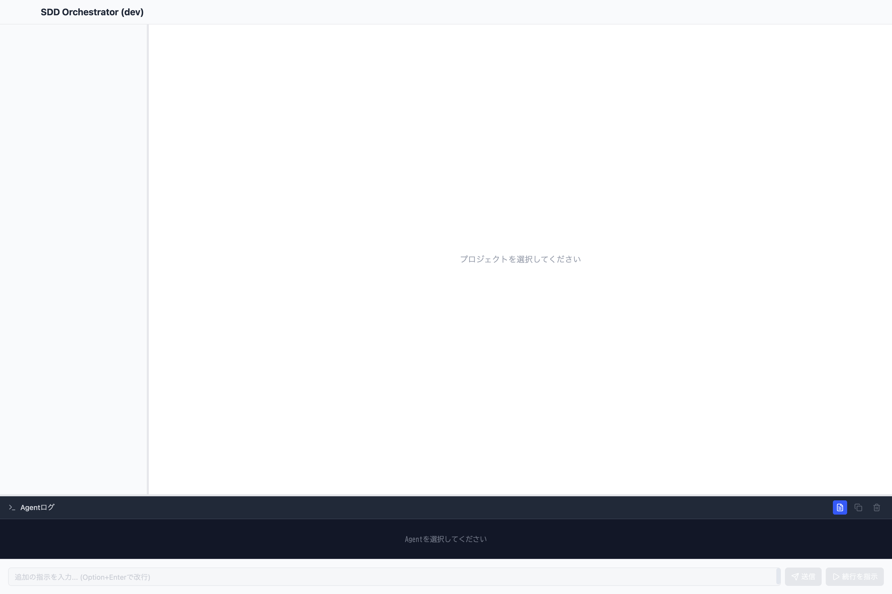
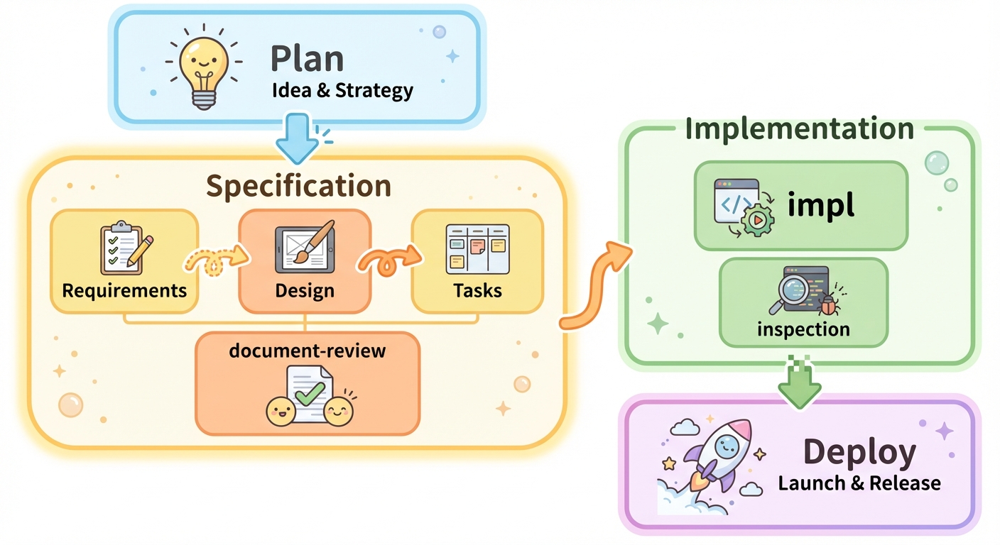

# SDD Orchestrator

日本語 | [English](README.md)

Spec-Driven Development (SDD) ワークフローの**コマンドセンター**となるデスクトップアプリケーション。



## 目次

- [概要](#概要)
- [主な機能](#主な機能)
- [SDD-Orchestratorワークフロー](#sdd-orchestratorワークフロー)
- [クイックスタート](#クイックスタート)
  - [プロファイル詳細](#プロファイル詳細)
- [Cloudflare Tunnelによるリモートアクセス](#cloudflare-tunnelによるリモートアクセス)
- [設計思想](#設計思想)
- [開発者向け](#開発者向け)

## 概要

SDD Orchestratorは、[kiro](https://kiro.dev/)/[SpecKit](https://speckit.dev/)/[cc-sdd](https://github.com/gotalab/cc-sdd)の手法を拡張し、視覚的な管理機能を備えた統合開発ワークフローを提供します。

**なぜSDD Orchestratorか？**

Claude Code for VSCodeやAntigravityなどのツールでは、対話セッションと進捗状況を仕様毎に管理・把握するのが困難です。SDD Orchestratorは**ダッシュボード**を提供し、以下を即座に把握できます：

- プロジェクト内のすべての仕様
- 各Specの現在のフェーズと状態
- ドキュメントレビューの課題と解決状況
- 実装の進捗とInspection結果

このコマンドセンターアプローチにより、複数の仕様が並行して進む複雑なプロジェクトを容易に管理できます。

### SDDについて詳しく

- [Anthropic: Claude Code Best Practices](https://www.anthropic.com/engineering/claude-code-best-practices) - Spec駆動開発の手法
- [SpecKit](https://speckit.dev/) - GitHubの仕様駆動開発ツールキット
- [cc-sdd](https://github.com/gotalab/cc-sdd) - Claude Code SDDワークフローコマンド

## 主な機能

- **ダッシュボード＆コマンドセンター**: 全Specのライフサイクル状態を視覚的に把握
- **8フェーズの完全なワークフロー**: Plan → Requirements → Design → Tasks → Review → Implementation → Inspection → Deploy
- **柔軟な人間-AI協調**: 人間がどこで介入するか、どこを自動化するかを選択可能
- **ドキュメントレビューシステム**: 課題追跡と解決ワークフロー
- **Claude Code連携**: スラッシュコマンドでSDDフェーズを実行
- **Kiro形式準拠**: `.kiro/specs/`ディレクトリ構造を使用
- **リモートアクセス**: LAN内アクセス、またはCloudflare Tunnel経由で外部からもアクセス可能

## SDD-Orchestratorワークフロー

完全な開発フローは8つのフェーズで構成されます。人間がどこで介入するか、どこを自動化するかを選択できます：



| フェーズ          | コマンド            | 説明                           | 成果物                                                   |
| ----------------- | ------------------- | ------------------------------ | -------------------------------------------------------- |
| 1. Plan           | (GUI)               | 説明付きでSpecを作成           | `spec.json`                                              |
| 2. Requirements   | `spec-requirements` | EARS形式で要件を定義           | `requirements.md`                                        |
| 3. Design         | `spec-design`       | 技術設計を作成                 | `design.md`                                              |
| 4. Tasks          | `spec-tasks`        | 実装タスクに分解               | `tasks.md`                                               |
| 5. Review         | `document-review`   | ドキュメントの整合性をレビュー | `document-review-{n}.md`, `document-review-{n}-reply.md` |
| 6. Implementation | `spec-impl`         | TDD手法で実装                  | ソースコード                                             |
| 7. Inspection     | `spec-inspection`   | 仕様に対する実装を検証         | `inspection-{n}.md`                                      |
| 8. Deploy         | (GUI)               | 完了としてマーク               | `spec.json`のステータス更新                              |

### オプションのバリデーション（cc-sdd準拠）

- **validate-gap**: 既存コードベースとのギャップ分析（Requirements後）
- **validate-design**: 設計品質レビュー（Design後）
- **validate-impl**: 実装検証（Implementation後）

### バグ修正（軽量ワークフロー）

フルSDDプロセスを必要としない小規模なバグ修正向け：

1. **bug-create**: バグレポート作成
2. **bug-analyze**: 根本原因の調査
3. **bug-fix**: 修正の実装
4. **bug-verify**: 修正の検証
5. **bug-status**: 進捗確認

**使い分け：**

- **小規模バグ**: Bug Fixワークフロー（軽量・高速）
- **設計変更を伴う複雑なバグ**: フルSDDワークフロー

## クイックスタート

### 必要環境

- macOS（Apple Silicon）
- Claude Code（AIエージェント）

### 1. SDD Orchestratorのインストール

[Releases](https://github.com/hummer98/sdd-orchestrator/releases)から最新版の `.zip` または `.dmg` をダウンロードし、アプリケーションを起動します。

### 2. プロジェクトを開く

SDD Orchestratorを起動し、開発対象のプロジェクトディレクトリを選択します。

### 3. コマンドセットのインストール

SDD Orchestratorの**ツール**メニュー → **コマンドセットをインストール...** を選択し、プロジェクトに `/kiro:*` スラッシュコマンドをインストールします。

**利用可能なプロファイル：**

| プロファイル | 含まれるコマンドセット               | 用途                     |
| ------------ | ------------------------------------ | ------------------------ |
| cc-sdd       | cc-sdd + bug + document-review       | 標準的なSDDワークフロー  |
| cc-sdd-agent | cc-sdd-agent + bug + document-review | エージェントベースのSDD  |
| spec-manager | spec-manager + bug + document-review | Spec Managerワークフロー |

> ⚠️ **注意**: `cc-sdd-agent` プロファイルを使用する場合は、**Skip Permissions** を有効にする必要があります。詳細は[プロファイル詳細](#プロファイル詳細)を参照してください。

**インストールされるもの：**

- **スラッシュコマンド**: `.claude/commands/kiro/` 配下に配置
- **エージェント**: `.claude/agents/` 配下に配置
- **設定ファイル**: `.claude/settings.json` および `.claude/settings.local.json` にマージ
- **CLAUDE.md**: プロジェクト指示が自動的にマージ

### 4. 最初のSpecを作成

Specタブの **+** ボタンをクリックして新規仕様を作成します。

### 実験的ツール

SDD Orchestratorでは、**ツール**メニュー → **実験的ツール** から実験的なスラッシュコマンドやエージェントをインストールできます。

| メニュー項目                    | インストール先               | 用途                               |
| ------------------------------- | ---------------------------- | ---------------------------------- |
| Debugエージェントをインストール | `.claude/agents/debug.md`    | デバッグ・トラブルシューティング   |

### プロファイル詳細

**プロファイル**は、SDD Orchestratorが各SDDフェーズでどのslash commands/skillsを使用するかを定義します。すべてのプロファイルは標準の[cc-sdd](https://github.com/gotalab/cc-sdd)ワークフローと互換性があり、SDD Orchestratorとの連携を向上させるための改良が加えられています。

#### cc-sdd

従来のcc-sddのslash commands/skillsを使用したワークフロー。最も安定しており、十分にテストされています。

- **コマンド**: `/kiro:spec-requirements`, `/kiro:spec-design`, `/kiro:spec-tasks`, `/kiro:spec-impl` 等を使用
- **実行方式**: 各コマンドはメインの会話コンテキスト内で実行
- **パーミッション**: デフォルトのClaude Codeパーミッション設定で動作
- **推奨ユーザー**: SDDの各フェーズを明示的にコントロールしたい方

#### cc-sdd-agent

Claude Code専用のsubagentを使ったワークフロー。各フェーズが独立したエージェントとして実行されます。

- **コマンド**: 同じ `/kiro:*` コマンドを使用するが、内部で専用のsubagentを起動
- **実行方式**: 各フェーズが独立したコンテキストを持つ自律的なsubagentとして実行
- **パーミッション**: ⚠️ **Skip Permissionsが必須** - subagentが適切に動作するには広範なファイルアクセス権限が必要です。Claude Codeの設定または `--dangerously-skip-permissions` フラグで有効化してください。
- **推奨ユーザー**: より自律的なAI実行を望み、手動介入を減らしたい方

#### spec-manager

本プロジェクト専用の実験的なワークフロー。異なる内部アーキテクチャを使用しています。

- **コマンド**: `spec-manager:*` skillバリアントを使用
- **実行方式**: 統合されたskillベースの実行
- **パーミッション**: デフォルトのパーミッション設定で動作
- **推奨ユーザー**: 新しいSDDアプローチの実験・テスト用途

## Cloudflare Tunnelによるリモートアクセス

SDD OrchestratorはCloudflare Tunnelを使用して、LAN外からもセキュアにリモートアクセス機能を利用できます。

### 機能概要

- **Named Tunnel接続**: Cloudflare Named Tunnelを使用したセキュアな接続
- **デュアルアクセス**: LAN内アクセスとTunnel経由アクセスの両方に対応
- **アクセストークン認証**: アプリ生成のトークンによる認証でセキュリティを確保
- **QRコード対応**: URL+トークン埋め込みQRコードでスマートフォンから簡単接続

### 前提条件

Cloudflare Tunnel機能を使用するには、`cloudflared`バイナリのインストールが必要です。

#### macOS

```bash
# Homebrew
brew install cloudflared

# MacPorts
sudo port install cloudflared
```

#### その他のプラットフォーム

[Cloudflare公式ダウンロードページ](https://developers.cloudflare.com/cloudflare-one/connections/connect-networks/downloads/)からダウンロードしてください。

### 基本的な使用方法

1. **Tunnel Tokenの設定**

   - アプリの設定画面でCloudflare Tunnel Tokenを入力
   - または環境変数`CLOUDFLARE_TUNNEL_TOKEN`を設定

2. **リモートサーバーの起動**

   - Remote Access Panelで「Cloudflareに公開」にチェック
   - サーバー開始ボタンをクリック

3. **接続**
   - 表示されたTunnel URLまたはQRコードを使用して接続
   - アクセストークンは自動的に認証されます

詳細な設定手順は[Cloudflare Tunnel設定ガイド](docs/guides/cloudflare-tunnel-setup.md)を参照してください。

## 設計思想

### 背景：SDDの限界

kiro、cc-sdd、SpecKit、OpenSpecなど、現在公開されているSDDワークフローは基本的に**ドキュメントドリブン**でAIエージェントに開発させる手法です。これはVibe Codingの問題点であった「ユーザーからのコンテキスト乖離」を減らすことを目的としています。

しかし、コンテキストの一致性を厳密に追求すると、人間に膨大なレビュー作業が発生し、結果的に生産性向上は限定的になります。

### アプローチ：レビューを観察可能にする

Opus 4.5やGemini 3 Proなどの登場により、レビュー行為自体はAIエージェントでも人間に伍する精度で実行できるようになりました。ただし、**暗黙的なコンテキスト**を見つける能力は依然として不安定です。

従来のSDDでは、検査プロセス（document-review、inspection）は刹那的に処理され、その結果からAIが「何を見て、何を気にして、何を見落としたか」を人間が観察するプロセスになっていませんでした。

SDD Orchestratorは、これらの検査結果を**ドキュメントとして残し**、人間が観察・洞察を繰り返すことで、プロジェクト固有・チーム固有・個人固有のコンテキストを発見し、AIの精度を向上させるという試みです。

### 目指すもの：人間とAIの相互学習


SDD Orchestratorは、**人間とAIの双方が学ぶ**ことでAI Agent Codingの生産性を持続的に向上させることを目指しています。

- **人間の学び**：AIが何を見て、何を見落とすかを観察し、パターンを理解する
- **AIの学び**：観察から得た洞察をプリセットコンテキストに反映し、精度を向上させる
  - **Steering**（`.kiro/steering/`）：プロジェクト固有の知識・ルール
  - **Rules**（`.claude/rules/`）：条件付きの行動指針
  - **Skills**（`.claude/commands/`）：再利用可能なワークフロー

この相互学習サイクルにより、使い込むほどAIエージェントがプロジェクトに適応し、生産性が向上していきます。

## 開発者向け

開発環境のセットアップ、ビルド方法、プロジェクト構造については [CONTRIBUTING-jp.md](CONTRIBUTING-jp.md) を参照してください。

## ToDo

- **Discord Bot連携**: 完了通知およびAI Agentコマンドインターフェースの提供
- **Deploy周りのバグフィックス**: Deployフェーズの安定性向上
- **洞察のSteering反映UI**: inspection結果からsteeringへの反映を支援するUI
- **Steering専用UI**: steeringファイルの管理・編集UI
- **Plan → Requirements UX向上**: 現在は外部ツール頼りの部分を改善
- **Project Agent UI**: コマンド指定無しでproject agentを開始するUI
- **エスカレーション機能**: エージェントが処理できない問題を人間にエスカレーションする仕組みの実装

## ライセンス

[MIT License](LICENSE.md)

## 作者

Yuji Yamamoto (rr.yamamoto@gmail.com)

GitHub: [@hummer98](https://github.com/hummer98)
