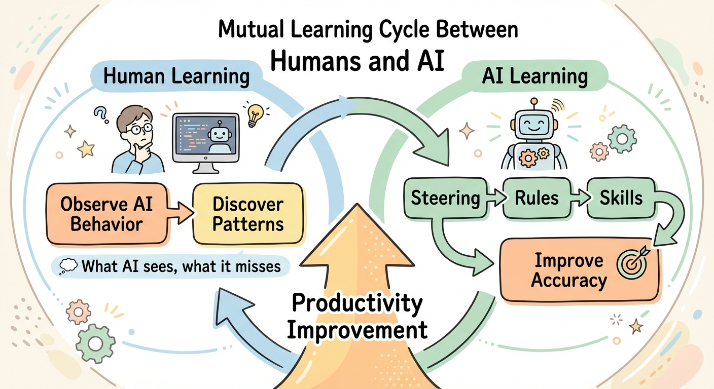

# SDD Orchestrator

[日本語](README-jp.md) | English

A desktop application that serves as a **command center** for Spec-Driven Development (SDD) workflows.


## Table of Contents

- [Overview](#overview)
- [Key Features](#key-features)
- [SDD-Orchestrator Workflow](#sdd-orchestrator-workflow)
- [Quick Start](#quick-start)
  - [Profile Details](#profile-details)
- [Remote Access with Cloudflare Tunnel](#remote-access-with-cloudflare-tunnel)
- [Design Philosophy](#design-philosophy)
- [For Developers](#for-developers)

## Overview

SDD Orchestrator extends [kiro](https://kiro.dev/)/[SpecKit](https://speckit.dev/)/[cc-sdd](https://github.com/gotalab/cc-sdd) methodologies into a complete, integrated development workflow with visual management.

**Why SDD Orchestrator?**

Tools like Claude Code for VSCode or Antigravity make it difficult to manage and track conversation sessions and progress per specification. SDD Orchestrator provides a **dashboard view** that gives you instant visibility into:
- All specifications across your project
- Current phase and status of each spec
- Document review issues and their resolution status
- Implementation progress with inspection results

This command center approach makes it easy to manage complex projects with multiple specifications running in parallel.

### Learn More About SDD

- [Anthropic: Claude Code Best Practices](https://www.anthropic.com/engineering/claude-code-best-practices) - Spec-driven development methodology
- [SpecKit](https://speckit.dev/) - GitHub's specification-driven development toolkit
- [cc-sdd](https://github.com/gotalab/cc-sdd) - Claude Code SDD workflow commands

## Key Features

- **Dashboard & Command Center**: Visual overview of all specs and their lifecycle status
- **Complete 8-Phase Workflow**: Plan → Requirements → Design → Tasks → Review → Implementation → Inspection → Deploy
- **Flexible Human-AI Collaboration**: Choose where humans intervene and what to automate
- **Document Review System**: Issue tracking with resolution workflow
- **Claude Code Integration**: Execute SDD phases via slash commands
- **Kiro Format Compliant**: Uses `.kiro/specs/` directory structure
- **Remote Access**: LAN access, or external access via Cloudflare Tunnel

## SDD-Orchestrator Workflow

The complete development flow consists of 8 phases. You can choose where humans intervene and what to automate:


| Phase | Command | Description | Output |
|-------|---------|-------------|--------|
| 1. Plan | (GUI) | Create spec with description | `spec.json` |
| 2. Requirements | `spec-requirements` | Define requirements in EARS format | `requirements.md` |
| 3. Design | `spec-design` | Create technical design | `design.md` |
| 4. Tasks | `spec-tasks` | Break down into implementation tasks | `tasks.md` |
| 5. Review | `document-review` | Review documents for consistency | `document-review-{n}.md`, `document-review-{n}-reply.md` |
| 6. Implementation | `spec-impl` | Implement using TDD methodology | Source code |
| 7. Inspection | `spec-inspection` | Verify implementation against spec | `inspection-{n}.md` |
| 8. Deploy | (GUI) | Mark as complete | Status update in `spec.json` |

### Optional Validation (cc-sdd)

- **validate-gap**: Gap analysis against existing codebase (after Requirements)
- **validate-design**: Design quality review (after Design)
- **validate-impl**: Implementation verification (after Implementation)

### Bug Fix (Lightweight Workflow)

For small-scale bug fixes without requiring full SDD process:

1. **bug-create**: Create bug report
2. **bug-analyze**: Investigate root cause
3. **bug-fix**: Implement fix
4. **bug-verify**: Verify resolution
5. **bug-status**: Check progress

**When to use:**
- **Small bugs**: Bug Fix workflow (lightweight & fast)
- **Complex bugs requiring design changes**: Full SDD workflow

## Quick Start

### Prerequisites

- macOS (Apple Silicon)
- Claude Code (AI agent)

### 1. Install SDD Orchestrator

Download the latest `.zip` or `.dmg` from [Releases](https://github.com/hummer98/sdd-orchestrator/releases) and launch the application.

### 2. Open Your Project

Launch SDD Orchestrator and select your project directory.

### 3. Install Command Set

From SDD Orchestrator's **Tools** menu, select **Install Commandset...** to install `/kiro:*` slash commands in your project.

**Available Profiles:**

| Profile | Included Commandsets | Use Case |
|---------|---------------------|----------|
| cc-sdd | cc-sdd + bug + document-review | Standard SDD workflow |
| cc-sdd-agent | cc-sdd-agent + bug + document-review | SDD with agent-based commands |
| spec-manager | spec-manager + bug + document-review | Spec manager workflow |

> ⚠️ **Note**: The `cc-sdd-agent` profile requires **Skip Permissions** to be enabled. See [Profile Details](#profile-details) for more information.

**What gets installed:**
- **Slash commands**: placed in `.claude/commands/kiro/`
- **Agents**: placed in `.claude/agents/`
- **Settings**: merged into `.claude/settings.json` and `.claude/settings.local.json`
- **CLAUDE.md**: Project instructions are automatically merged

### 4. Create Your First Spec

Click the **+** button in the Spec tab to create a new specification.

### Experimental Tools

SDD Orchestrator provides experimental slash commands and agents via **Tools** menu → **Experimental Tools**.

| Menu Item | Install Location | Purpose |
|-----------|-----------------|---------|
| Install Debug Agent | `.claude/agents/debug.md` | Debugging & troubleshooting |

### Profile Details

A **profile** defines which slash commands/skills SDD Orchestrator uses for each SDD phase. All profiles are compatible with the standard [cc-sdd](https://github.com/gotalab/cc-sdd) workflow, with some enhancements for better integration with SDD Orchestrator.

#### cc-sdd

The traditional cc-sdd workflow using slash commands/skills. This is the most stable and well-tested approach.

- **Commands**: Uses `/kiro:spec-requirements`, `/kiro:spec-design`, `/kiro:spec-tasks`, `/kiro:spec-impl`, etc.
- **Execution**: Each command runs within the main conversation context
- **Permissions**: Works with default Claude Code permission settings
- **Best for**: Users who prefer explicit control over each SDD phase

#### cc-sdd-agent

A Claude Code-native workflow using subagents for SDD phases. Each phase runs as an independent agent with full context.

- **Commands**: Uses the same `/kiro:*` commands but internally spawns dedicated subagents
- **Execution**: Each phase runs as an autonomous subagent with isolated context
- **Permissions**: ⚠️ **Requires Skip Permissions** - Subagents need broad file access to function properly. Enable via Claude Code settings or `--dangerously-skip-permissions` flag.
- **Best for**: Users who want more autonomous AI execution with less manual intervention

#### spec-manager

An experimental workflow specifically designed for this project. Uses a different internal architecture.

- **Commands**: Uses `spec-manager:*` skill variants
- **Execution**: Integrated skill-based execution
- **Permissions**: Works with default permission settings
- **Best for**: Experimental use and testing new SDD approaches

## Remote Access with Cloudflare Tunnel

SDD Orchestrator supports remote access from outside your LAN using Cloudflare Tunnel.

### Features

- **Named Tunnel Connection**: Secure connection via Cloudflare Named Tunnel
- **Dual Access**: Supports both LAN and Tunnel access simultaneously
- **Token Authentication**: Security ensured by app-generated access tokens
- **QR Code Support**: Easy smartphone connection via URL+token embedded QR code

### Prerequisites

To use the Cloudflare Tunnel feature, you need to install the `cloudflared` binary.

#### macOS

```bash
# Homebrew
brew install cloudflared

# MacPorts
sudo port install cloudflared
```

#### Other Platforms

Download from the [official Cloudflare download page](https://developers.cloudflare.com/cloudflare-one/connections/connect-networks/downloads/).

### Basic Usage

1. **Configure Tunnel Token**
   - Enter Cloudflare Tunnel Token in the app settings
   - Or set the `CLOUDFLARE_TUNNEL_TOKEN` environment variable

2. **Start Remote Server**
   - Check "Publish to Cloudflare" in Remote Access Panel
   - Click the Start Server button

3. **Connect**
   - Use the displayed Tunnel URL or QR code to connect
   - Access token is automatically authenticated

For detailed setup instructions, see [Cloudflare Tunnel Setup Guide](docs/guides/cloudflare-tunnel-setup.md).

## Design Philosophy

### Background: Limitations of SDD

SDD workflows like kiro, cc-sdd, SpecKit, and OpenSpec are fundamentally **document-driven** approaches to AI agent development. They aim to reduce the "context drift from user intent" problem inherent in Vibe Coding.

However, strictly pursuing context alignment results in massive review workload for humans, ultimately limiting productivity gains.

### Approach: Making Reviews Observable

With the advent of models like Opus 4.5 and Gemini 3 Pro, AI agents can now perform reviews at human-comparable accuracy. However, their ability to find **implicit context** remains unstable.

In traditional SDD, inspection processes (document-review, inspection) are handled transiently. There was no process for humans to observe "what the AI looked at, what it cared about, and what it missed."

SDD Orchestrator **persists these inspection results as documents**, allowing humans to repeatedly observe and gain insights, discovering project-specific, team-specific, and individual-specific contexts to improve AI accuracy.

### Goal: Mutual Learning Between Humans and AI



SDD Orchestrator aims to sustainably improve AI Agent Coding productivity through **mutual learning between humans and AI**.

- **Human Learning**: Observe what AI sees and misses, understand patterns
- **AI Learning**: Reflect insights into preset contexts to improve accuracy
  - **Steering** (`.kiro/steering/`): Project-specific knowledge and rules
  - **Rules** (`.claude/rules/`): Conditional behavioral guidelines
  - **Skills** (`.claude/commands/`): Reusable workflows

Through this mutual learning cycle, the AI agent adapts to your project over time, continuously improving productivity.

## For Developers

For development environment setup, build instructions, and project structure, see [CONTRIBUTING.md](CONTRIBUTING.md).

## ToDo

- **Discord Bot Integration**: Completion notifications and AI Agent command interface
- **Deploy Phase Bug Fixes**: Improve stability of the Deploy phase
- **Insight to Steering UI**: UI to help reflect inspection insights into steering
- **Steering Management UI**: Dedicated UI for managing and editing steering files
- **Plan → Requirements UX**: Improve the currently external-tool-dependent workflow
- **Project Agent UI**: UI to start project agent without specifying commands
- **Escalation Feature**: Mechanism for agents to escalate issues to humans

## License

[MIT License](LICENSE.md)

## Author

Yuji Yamamoto (rr.yamamoto@gmail.com)

GitHub: [@hummer98](https://github.com/hummer98)
