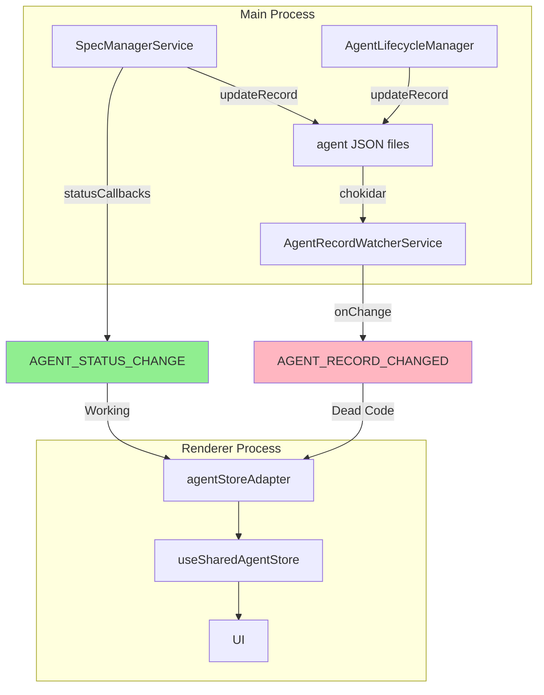
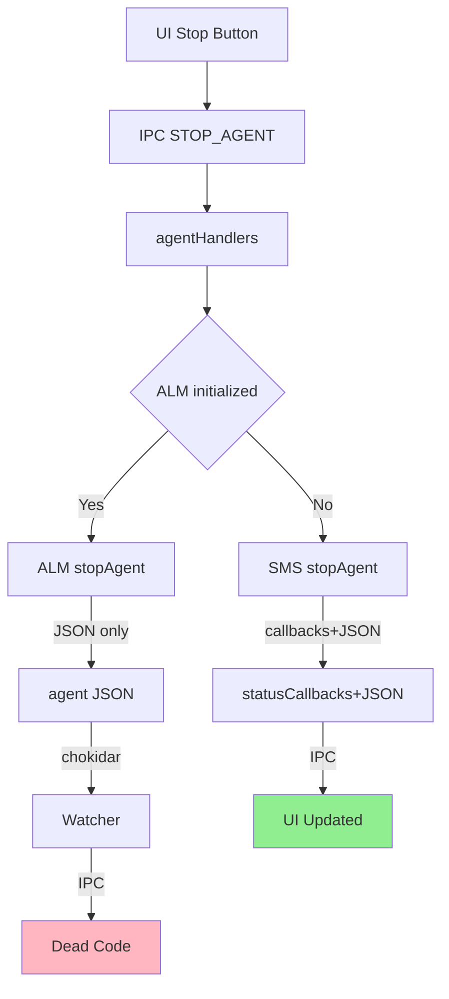
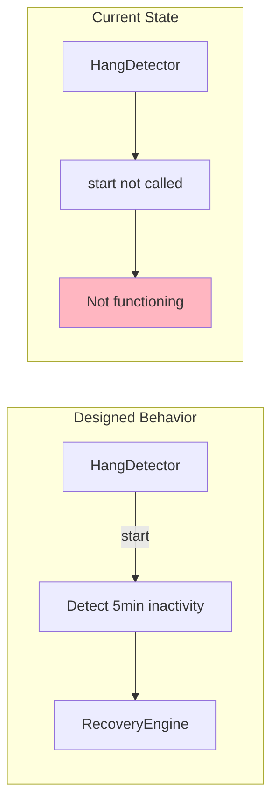
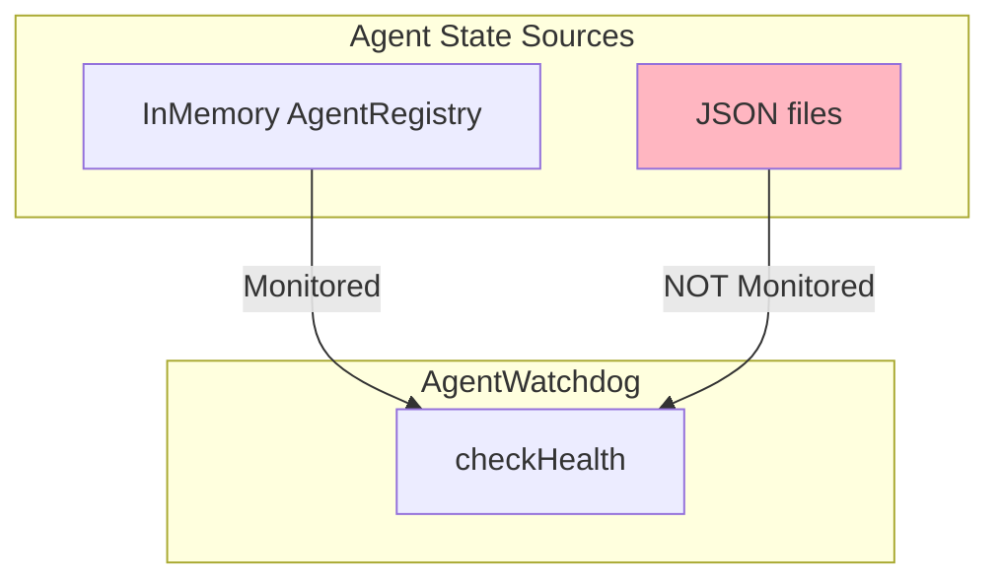
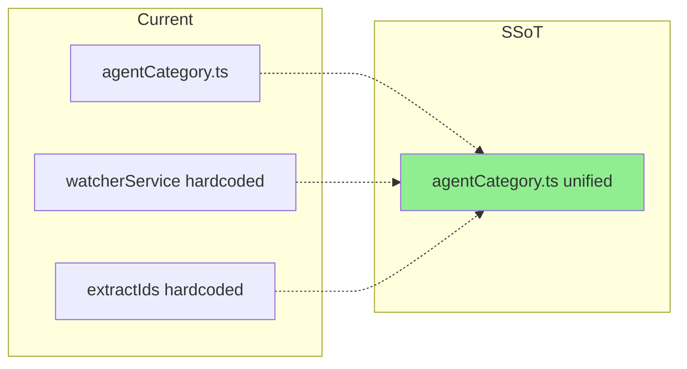
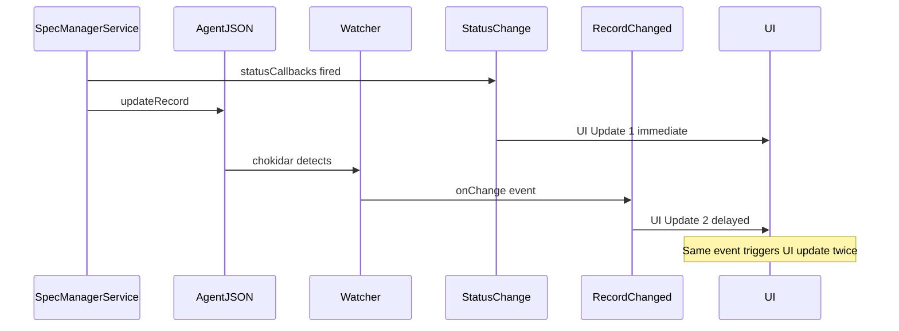
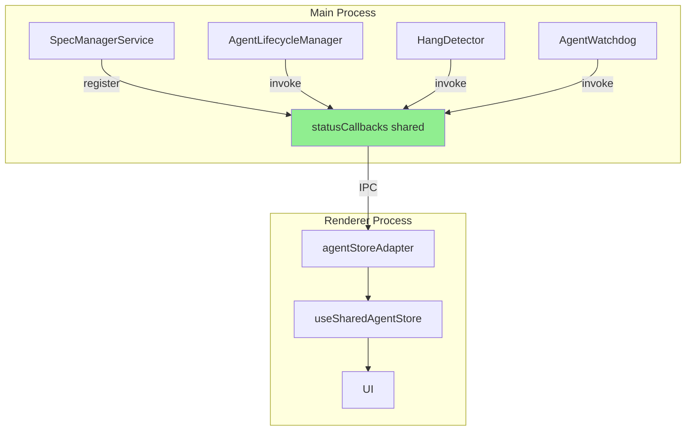
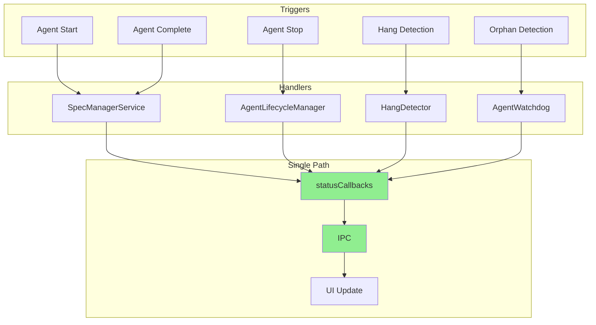
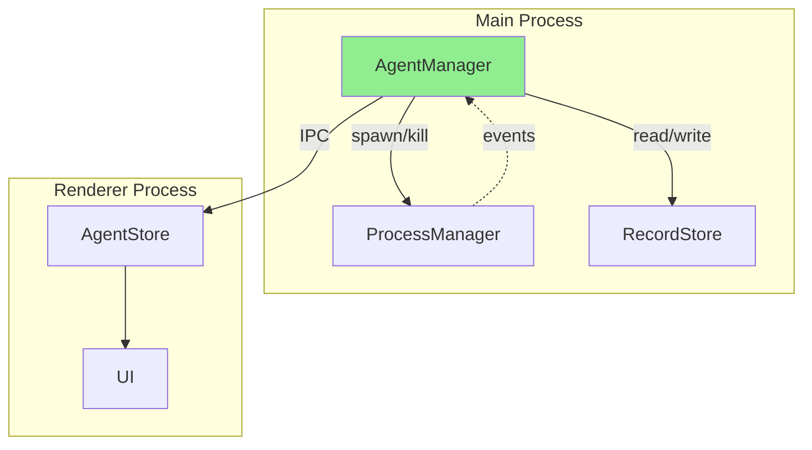
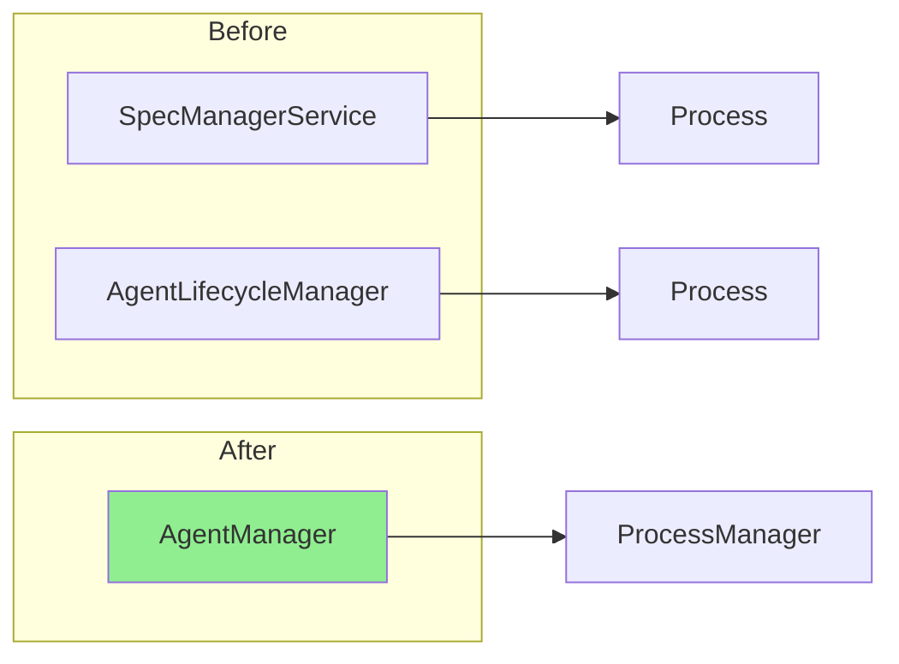

# Agent Status Architecture 分析レポート

**作成日**: 2026-01-31
**目的**: Agent状態管理の現状問題を整理し、改修案を提示

---

## 0. 現在発生している問題・バグ

### 0.1 確認されている問題

| 問題 | 重要度 | 影響 | 状態 |
|------|--------|------|------|
| AgentLifecycleManager経由でAgent停止時にUI更新されない | 高 | ユーザー体験 | 未解決 |
| HangDetectorが起動されていない | 中 | ハングしたAgentの検出不可 | 未解決 |
| AGENT_RECORD_CHANGEDのchangeハンドラがデッドコード | 中 | コード品質 | 未解決 |
| 監視パス定義がSSoT化されていない | 低 | 保守性 | 未解決 |

### 0.2 問題の詳細

#### 問題1: Agent停止時のUI更新漏れ（重要度: 高）

**現象**: UIからAgentを停止しても、UIのステータスが更新されないケースがある

**原因**:
- `STOP_AGENT` IPCハンドラで `AgentLifecycleManager` が優先される
- `AgentLifecycleManager.stopAgent()` はJSONを更新するが `statusCallbacks` を呼ばない
- `AGENT_RECORD_CHANGED` の changeハンドラはデッドコード（ログ出力のみ）

**影響**: ユーザーがAgent停止を実行しても、UIが `running` のまま表示され続ける可能性

#### 問題2: HangDetector未起動（重要度: 中）

**現象**: 5分以上応答のないAgentが検出・回復されない

**原因**: `agentLifecycleSetup.ts` で HangDetector がインスタンス化・起動されていない

**影響**: ハングしたAgentが放置され、リソースを消費し続ける

#### 問題3: デッドコードの存在（重要度: 中）

**現象**: `agentStoreAdapter.ts` の `AGENT_RECORD_CHANGED` changeハンドラが機能しない

**原因**: コメントに「Facade層に委譲」と書かれているが、実装がない

**影響**: コードの可読性低下、将来の保守時の混乱

#### 問題4: 監視パスのSSoT欠如（重要度: 低）

**現象**: 監視対象パス（specs, bugs, project）が複数箇所にハードコード

**原因**: `agentCategory.ts` に `getWatchPatterns()` がない

**影響**: パス追加時に複数ファイルを修正する必要がある

---

## 1. 現状のアーキテクチャ概要

### 1.1 関連コンポーネント

```
┌─────────────────────────────────────────────────────────────────────────────┐
│                              Main Process                                    │
├─────────────────────────────────────────────────────────────────────────────┤
│                                                                             │
│  ┌─────────────────────┐     ┌─────────────────────────┐                   │
│  │ SpecManagerService  │     │ AgentLifecycleManager   │                   │
│  │                     │     │                         │                   │
│  │ - startAgent()      │     │ - stopAgent()           │                   │
│  │ - stopAgent()       │     │ - killAgent()           │                   │
│  │ - handleAgentExit() │     │ - reattachAgent()       │                   │
│  │ - statusCallbacks[] │     │                         │                   │
│  └──────────┬──────────┘     └────────────┬────────────┘                   │
│             │                              │                                │
│             │ JSON更新                     │ JSON更新                       │
│             ▼                              ▼                                │
│  ┌─────────────────────────────────────────────────────────────────┐       │
│  │                    agent-*.json ファイル                         │       │
│  │                   (.kiro/runtime/agents/**)                      │       │
│  └─────────────────────────────────────────────────────────────────┘       │
│             │                                                               │
│             │ chokidar監視                                                  │
│             ▼                                                               │
│  ┌─────────────────────────┐                                               │
│  │ AgentRecordWatcherService│                                              │
│  └──────────┬──────────────┘                                               │
│             │                                                               │
├─────────────┼───────────────────────────────────────────────────────────────┤
│             │ IPC                                                           │
│             ▼                                                               │
│  ┌─────────────────────────────────────────────────────────────────┐       │
│  │                      Renderer Process                            │       │
│  │                                                                  │       │
│  │  ┌─────────────────────┐     ┌─────────────────────┐            │       │
│  │  │ agentStoreAdapter   │     │ useSharedAgentStore │            │       │
│  │  │                     │────▶│                     │────▶ UI    │       │
│  │  │ - onAgentStatusChange│    │ - updateAgentStatus │            │       │
│  │  │ - onAgentRecordChanged│   │ - removeAgent       │            │       │
│  │  └─────────────────────┘     └─────────────────────┘            │       │
│  │                                                                  │       │
│  └──────────────────────────────────────────────────────────────────┘       │
└─────────────────────────────────────────────────────────────────────────────┘
```

### 1.2 二つの通知パス

現在、Agent状態変更をRendererに通知するパスが2つ存在する：



---

## 2. 問題点の詳細

### 2.1 通知パスの不整合

| パス | 経路 | 状態 | 問題 |
|------|------|------|------|
| **パス1** | SpecManagerService → statusCallbacks → IPC | ✅ 動作中 | AgentLifecycleManager経由の更新を検知しない |
| **パス2** | JSON更新 → chokidar → IPC | ❌ デッドコード | `change`イベントハンドラが未実装 |

#### パス2のデッドコード（agentStoreAdapter.ts:254-259）

```typescript
} else {
  // add/change - reload agents
  // Note: Full reload is delegated to the Facade layer which handles
  // store-specific behaviors like auto-selection
  console.log('[agentStoreAdapter] Agent record add/change event - delegating to facade');
  // ← 実装なし！ログ出力のみ
}
```

### 2.2 Agent停止時の経路分岐



**問題**: AgentLifecycleManager経由で停止すると、`statusCallbacks`が呼ばれず、UIが更新されない可能性がある。

### 2.3 未起動のHangDetector



**問題**: `agentLifecycleSetup.ts`でHangDetectorがインスタンス化・起動されていない。

### 2.4 AgentWatchdogの監視範囲



**問題**: アプリ再起動後、JSONには`running`状態のAgentが残っていても、AgentRegistryに登録されていなければ監視されない。

### 2.5 Agent JSON Watcher のSSoT問題



---

## 3. 二重経路の問題

もし両方のパスを有効にすると：



**問題点**:
1. パフォーマンス低下（不要な再レンダリング）
2. 状態の競合リスク（タイミング差異）
3. デバッグ困難（どちらのパスが原因か特定しにくい）

---

## 4. 改修案E: パス1一本化 + statusCallbacks拡張

### 4.1 概要



### 4.2 変更内容

| コンポーネント | 変更内容 |
|---------------|---------|
| **SpecManagerService** | 変更なし（既存動作維持） |
| **AgentLifecycleManager** | `statusCallbacks`参照を追加、停止時に呼び出し |
| **HangDetector** | インスタンス化・起動を追加、状態変更時に`statusCallbacks`呼び出し |
| **AgentWatchdog** | `statusCallbacks`参照を追加、オーファン検出時に呼び出し |
| **agentStoreAdapter** | `AGENT_RECORD_CHANGED` changeハンドラのデッドコードを削除 |
| **agentCategory.ts** | `getWatchPatterns()`を追加してSSoT化 |
| **agentRecordWatcherService** | ハードコードをSSoT参照に変更 |

### 4.3 改修後のフロー



### 4.4 メリット・デメリット

| 観点 | 評価 |
|------|------|
| **シンプルさ** | ◎ 単一パスで理解しやすい |
| **既存動作** | ◎ SpecManagerService経由は変更なし |
| **即時性** | ◎ ファイルI/O遅延なし |
| **保守性** | ◎ デッドコード削除 |
| **テスト容易性** | ◎ 単一パスでテストしやすい |
| **外部編集対応** | △ 非対応（JSONを直接編集しても反映されない） |
| **SSOT** | △ インメモリが真実（JSONは永続化用） |

### 4.5 外部編集非対応について

JSONを直接編集するユースケース：
- Claude Codeからの編集 → 現状発生していない
- デバッグ目的の手動編集 → アプリ再起動で反映される

**結論**: 実用上問題なし

---

## 5. 理想的なアーキテクチャ（案F）

### 5.1 現状の複雑さの根本原因

現在、Agent管理に **7つのコンポーネント** が関わっている：

| コンポーネント | 責務 | 問題 |
|---------------|------|------|
| SpecManagerService | 起動・実行・完了 | 状態通知の責務も持つ |
| AgentLifecycleManager | 停止・強制終了・再アタッチ | 状態通知の責務がない |
| AgentRegistry | インメモリ状態 | JSONと二重管理 |
| AgentRecordService | JSON永続化 | 通知責務なし |
| AgentRecordWatcherService | JSON監視 | 通知パスがデッドコード |
| HangDetector | ハング検出 | 未起動 |
| AgentWatchdog | ヘルスチェック | 通知責務なし |

**根本原因**: 同じ責務（Agent状態管理）を複数コンポーネントが分担し、責務境界が不明確。

### 5.2 理想的な設計原則

1. **単一のエントリーポイント** - すべてのAgent操作は1つのサービス経由
2. **SSoTの明確化** - JSONかインメモリか、どちらか1つが真実
3. **単一の通知パス** - 状態変更の通知経路は1つだけ
4. **関心の分離** - プロセス管理と状態管理を分離

### 5.3 理想的なアーキテクチャ



### 5.4 責務の整理

| コンポーネント | 責務 | 保持するもの |
|---------------|------|-------------|
| **AgentManager** | Agent操作の単一エントリーポイント、状態通知 | statusCallbacks |
| **ProcessManager** | ChildProcess のspawn/kill のみ | ChildProcess, pid |
| **RecordStore** | JSON読み書き（永続化）のみ | なし（ファイルI/O） |

### 5.5 案F: AgentManager統合

**概要**: SpecManagerService と AgentLifecycleManager を統合し、単一の `AgentManager` にする。



**変更内容**:

1. **AgentManager 新設**
   - `start()`, `stop()`, `kill()`, `resume()` をすべて統合
   - `statusCallbacks` を唯一のホルダーとする
   - HangDetector, AgentWatchdog はAgentManagerの内部コンポーネントに

2. **SpecManagerService の責務縮小**
   - Agent管理をAgentManagerに委譲
   - Spec固有のロジック（phase判定、イベントログ）のみ残す

3. **AgentLifecycleManager の廃止**
   - 機能をAgentManagerに統合

4. **通知パスの一本化**
   - AgentManager.statusCallbacks が唯一の通知源
   - AGENT_RECORD_CHANGED のchangeハンドラは削除

### 5.6 案F vs 案E 比較

| 観点 | 案E（statusCallbacks拡張） | 案F（AgentManager統合） |
|------|--------------------------|------------------------|
| **複雑さ** | 既存構造を維持、パッチ的 | 構造を簡素化、根本解決 |
| **実装コスト** | 低〜中 | 高 |
| **リスク** | 低（既存動作維持） | 中（大規模リファクタ） |
| **保守性** | 改善（通知パス統一） | 大幅改善（責務明確化） |
| **将来拡張** | 困難さ残る | 容易 |

### 5.7 推奨: 段階的アプローチ

**Phase 1（短期）**: 案Eを実装
- statusCallbacksを各コンポーネントに渡す
- デッドコード削除
- 即座に動作する状態にする

**Phase 2（中期）**: 案Fに向けたリファクタリング
- AgentManagerを新設
- SpecManagerServiceからAgent管理を移行
- AgentLifecycleManagerを統合

**Phase 3（長期）**: 完全統合
- 不要になったコンポーネントを削除
- テストの整理

---

## 6. 実装タスク（案E - 短期）

### Phase 1: 基盤整備

1. **agentCategory.ts のSSoT化**
   - `getWatchPatterns()` 関数を追加
   - `extractCategoryFromPath()` 関数を追加

2. **agentRecordWatcherService.ts の修正**
   - ハードコードをSSoT参照に変更

### Phase 2: statusCallbacks拡張

3. **statusCallbacks の共有化**
   - コールバック登録/解除のインターフェース統一

4. **AgentLifecycleManager への統合**
   - `stopAgent()` / `killAgent()` で `statusCallbacks` 呼び出し

5. **HangDetector の有効化**
   - `agentLifecycleSetup.ts` でインスタンス化・起動
   - 状態変更時に `statusCallbacks` 呼び出し

6. **AgentWatchdog の拡張**
   - オーファン検出時に `statusCallbacks` 呼び出し

### Phase 3: クリーンアップ

7. **デッドコード削除**
   - `agentStoreAdapter.ts` の `AGENT_RECORD_CHANGED` changeハンドラを削除

---

## 7. 参考: 関連ファイル

| ファイル | 役割 |
|---------|------|
| `electron-sdd-manager/src/main/services/specManagerService.ts` | Agent起動・実行・完了管理 |
| `electron-sdd-manager/src/main/services/agentLifecycleManager.ts` | Agentライフサイクル管理 |
| `electron-sdd-manager/src/main/services/agentRecordWatcherService.ts` | JSONファイル監視 |
| `electron-sdd-manager/src/main/services/agentCategory.ts` | カテゴリ判定 |
| `electron-sdd-manager/src/main/services/hangDetector.ts` | ハング検出 |
| `electron-sdd-manager/src/main/services/agentWatchdog.ts` | ヘルスチェック |
| `electron-sdd-manager/src/main/ipc/agentHandlers.ts` | IPC ハンドラ |
| `electron-sdd-manager/src/main/setup/agentLifecycleSetup.ts` | 初期化 |
| `electron-sdd-manager/src/renderer/stores/agentStoreAdapter.ts` | Renderer側イベント受信 |
