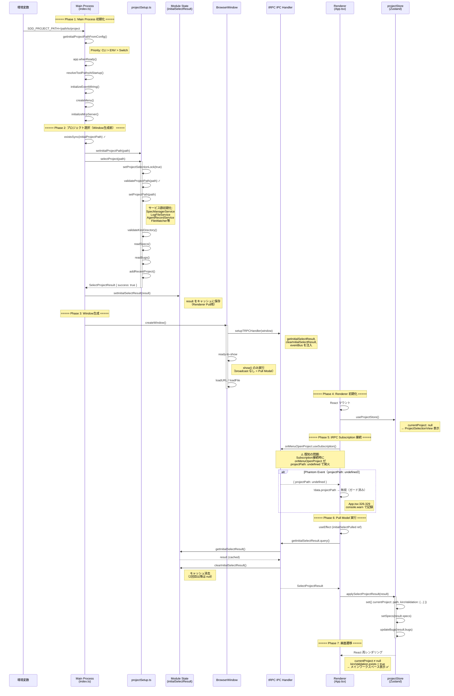
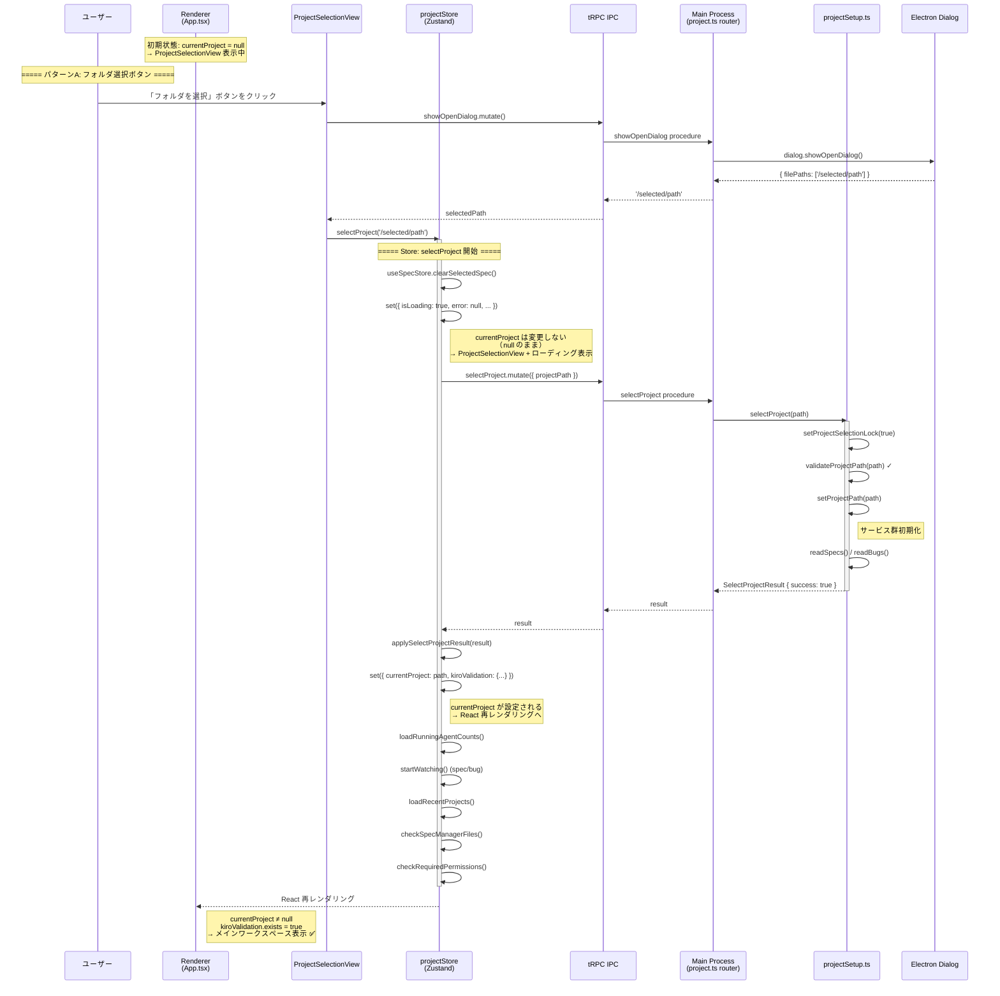
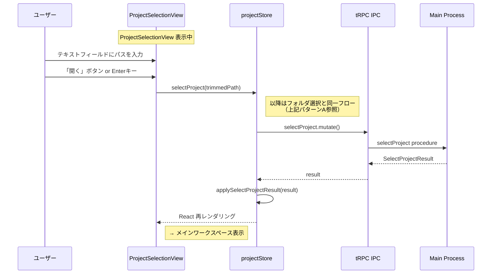
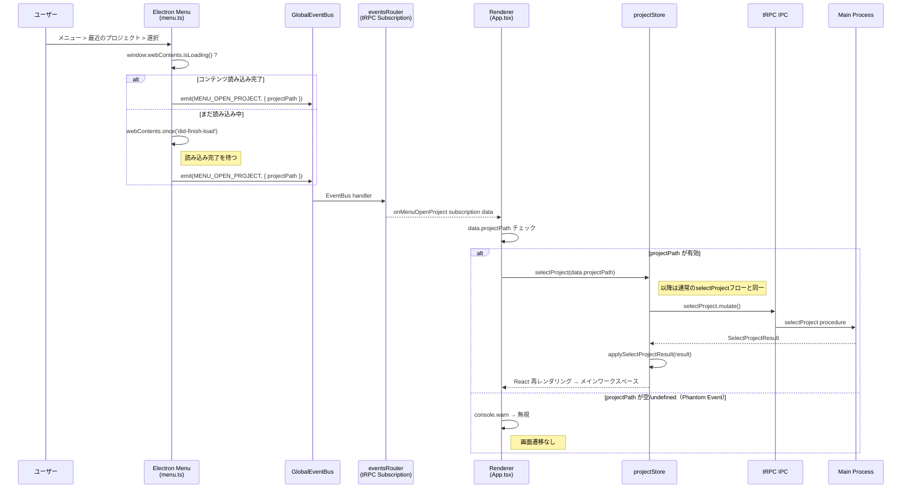
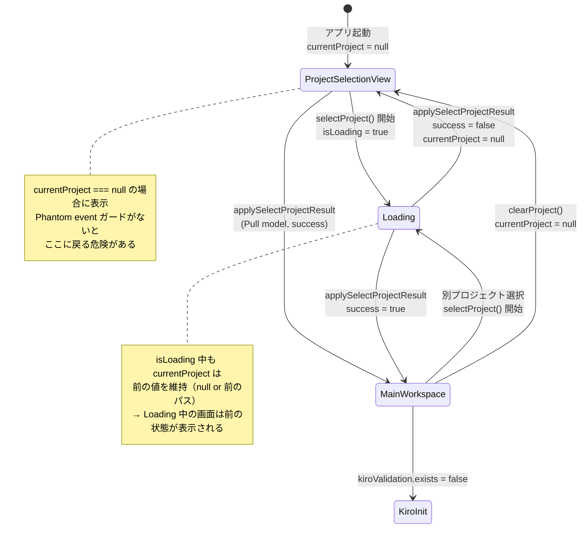

# プロジェクトを開くプロセス シーケンス分析

**日付**: 2026-02-08
**目的**: プロジェクト選択の2つのケースにおける完全なシーケンスを可視化し、画面遷移が「プロジェクトを開く」画面に戻ってしまう挙動の原因を特定する

## 概要

プロジェクトを開くプロセスには2つのパターンがある:

1. **起動時パス指定**: `SDD_PROJECT_PATH` 環境変数でプロジェクト選択済みの状態で起動
2. **UI選択**: 「プロジェクトを開く」画面からユーザーが手動で開く

いずれの場合も Renderer の画面遷移は `currentProject` と `kiroValidation?.exists` の2つの状態で決定される（`App.tsx:786`）:

```
currentProject && kiroValidation?.exists → メインワークスペース（タブ表示）
currentProject && !kiroValidation?.exists → 「.kiro初期化してください」
!currentProject                          → ProjectSelectionView（プロジェクトを開く画面）
```

---

## ケース1: SDD_PROJECT_PATH 指定起動

### シーケンス図



### タイムライン上の重要ポイント

| 時点 | Renderer の画面状態 | `currentProject` |
|------|---------------------|-------------------|
| React マウント直後 | `ProjectSelectionView` | `null` |
| Phantom event 受信（もしあれば） | `ProjectSelectionView`（ガードで無視） | `null` |
| `getInitialSelectResult` 完了後 | **メインワークスペース** | `/path/to/project` |

**一時的にProjectSelectionViewが表示される**: React マウントから `getInitialSelectResult` の応答が返るまでの間（通常数十ms）、`currentProject` が `null` なので ProjectSelectionView が瞬間的に表示される。これは視覚的にフラッシュとして見える場合がある。

---

## ケース2: UIからプロジェクトを開く

### シーケンス図（フォルダ選択ダイアログ経由）



### シーケンス図（パス入力経由）



### シーケンス図（メニューからの最近のプロジェクト選択）



---

## 画面が「プロジェクトを開く」に戻る原因分析

### `currentProject` が `null` に戻る全パスの特定

`currentProject` が `null` に設定される箇所を網羅的に洗い出した:

| # | 発生箇所 | 条件 | 深刻度 |
|---|----------|------|--------|
| 1 | `applySelectProjectResult` (L443) | `result.success === false` | **高** |
| 2 | `clearProject()` (L479) | 明示的なプロジェクトクリア | 低 |
| 3 | Store 初期状態 (L152) | アプリ起動直後 | 想定内 |

### 原因1: Phantom `onMenuOpenProject` イベント（対策済み）

```
起動シーケンス中:
1. React マウント
2. onMenuOpenProject.useSubscription() 接続
3. ⚠️ Subscription 接続時に { projectPath: undefined } が発火
   → selectProject(undefined) が呼ばれる
   → Main process で PATH_NOT_EXISTS エラー
   → applySelectProjectResult({ success: false })
   → currentProject = null に戻る ❌
```

**現状**: `App.tsx:326` の `if (!data.projectPath)` ガードにより対策済み。このガードがなければプロジェクトを開いた直後に「プロジェクトを開く」画面に戻る挙動が発生する。

### 原因2: Pull Model と Phantom Event の競合（タイミング依存）

```
危険なタイミングパターン:

Time
  |  App.tsx useEffect → getInitialSelectResult.query() 発行
  |  ...応答待ち...
  |  onMenuOpenProject subscription 接続
  |  ⚠️ Phantom event { projectPath: undefined } 発火
  |    → ガードで無視 ✓（対策済み）
  |  getInitialSelectResult 応答到着
  |    → applySelectProjectResult(result)
  |    → currentProject = path ✓
  |
  v

もし Phantom event にガードがなかった場合:
  |  getInitialSelectResult 応答 → currentProject = path ✓
  |  Phantom event 発火
  |    → selectProject('') → 失敗
  |    → currentProject = null ❌ ← ここで画面が戻る
  v
```

### 原因3: Selection Lock 競合

2つのプロジェクト選択が競合するケース:

```
1. Pull model: getInitialSelectResult → applySelectProjectResult 実行中
2. 同時にメニューから別プロジェクト選択
   → selectProject mutation 呼び出し
   → Main で SELECTION_IN_PROGRESS エラー
   → applySelectProjectResult({ success: false })
   → currentProject = null ❌
```

ただし、Pull model は `applySelectProjectResult` のみでロックを取得しないため、この競合は `selectProject` mutation 側でのみ発生する。起動直後にメニュー操作する場合に限定される。

### 原因4: selectProject 中の状態遷移

```
selectProject() 開始時:
  set({ isLoading: true, error: null, ... })
  ※ currentProject は変更しない（前の値を維持）

selectProject() 成功時:
  applySelectProjectResult → set({ currentProject: newPath })

selectProject() 失敗時:
  applySelectProjectResult → set({ currentProject: null }) ← ⚠️
```

**注意点**: 既にプロジェクトが開かれている状態で別プロジェクトへの切り替えが失敗すると `currentProject = null` になり、「プロジェクトを開く」画面に戻る。これは `applySelectProjectResult` が失敗時に無条件で `currentProject: null` を設定する設計による。

---

## 画面遷移の状態遷移図



---

## 関連コードの所在

| ファイル | 行 | 役割 |
|----------|-----|------|
| `src/main/index.ts:116-136` | `getInitialProjectPathFromConfig()` | 初期パス解決 |
| `src/main/index.ts:304-342` | 起動時プロジェクト選択 | `selectProject` + キャッシュ保存 |
| `src/main/index.ts:344` | `createWindow()` | Window 生成（選択後） |
| `src/main/trpc/handler.ts:41-74` | `setupTRPCHandler()` | tRPC IPC ハンドラ + DI |
| `src/main/trpc/helpers/projectSetup.ts` | `selectProject()` | プロジェクト選択本体 |
| `src/main/trpc/helpers/projectSetup.ts` | `setInitialSelectResult()` | Pull model キャッシュ |
| `src/main/trpc/routers/project.ts:79-83` | `selectProject` mutation | tRPC プロシージャ |
| `src/main/trpc/routers/project.ts:220-236` | `getInitialSelectResult` query | Pull model endpoint |
| `src/main/trpc/routers/events.ts:118-143` | `createEventSubscription()` | EventBus→Subscription 変換 |
| `src/main/trpc/routers/events.ts:336-338` | `onMenuOpenProject` | メニューイベント subscription |
| `src/main/menu.ts:35-56` | 最近のプロジェクト click | EventBus emit |
| `src/main/menu.ts:115-140` | フォルダ選択 dialog | EventBus emit |
| `src/renderer/App.tsx:294-321` | Pull model useEffect | 起動時キャッシュ取得 |
| `src/renderer/App.tsx:324-334` | `onMenuOpenProject` subscription | メニューイベント処理 |
| `src/renderer/App.tsx:786-820` | 画面遷移ロジック | `currentProject` 判定 |
| `src/renderer/stores/projectStore.ts:187-403` | `selectProject` action | Store 経由の選択処理 |
| `src/renderer/stores/projectStore.ts:415-464` | `applySelectProjectResult` | 結果適用（共通ロジック） |
| `src/renderer/stores/projectStore.ts:477-504` | `clearProject` | プロジェクトクリア |
| `src/renderer/components/ProjectSelectionView.tsx` | 全体 | プロジェクト選択UI |

---

## まとめ

### 現在の設計（Pull Model）は安定している

旧 Push Model のレースコンディションは Pull Model への移行で解消済み。Phantom event に対するガードも実装済み。

### 残存リスク

1. **起動直後の画面フラッシュ**: Pull model の応答到着まで数十ms の間 `ProjectSelectionView` が表示される（`currentProject` が `null` のため）
2. **`applySelectProjectResult` の失敗時挙動**: 既存プロジェクトが開いている状態での切り替え失敗時、`currentProject = null` になり ProjectSelectionView に戻る（前のプロジェクトを維持しない）
3. **Phantom event の根本原因は未解消**: tRPC Subscription 接続時に `onMenuOpenProject` が空データで発火する原因は未特定（ガードで対処中）
