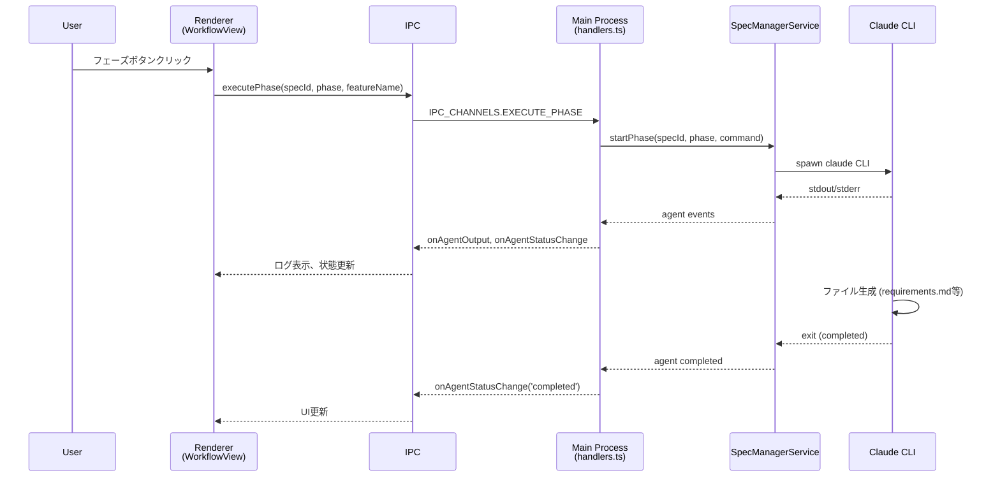
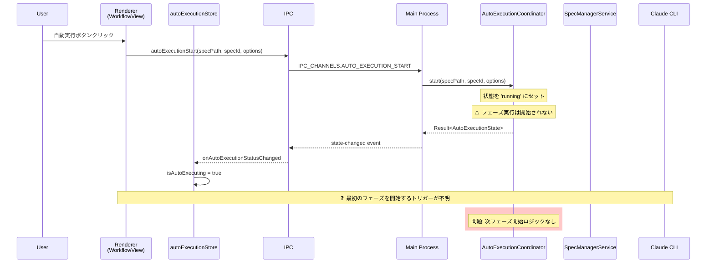
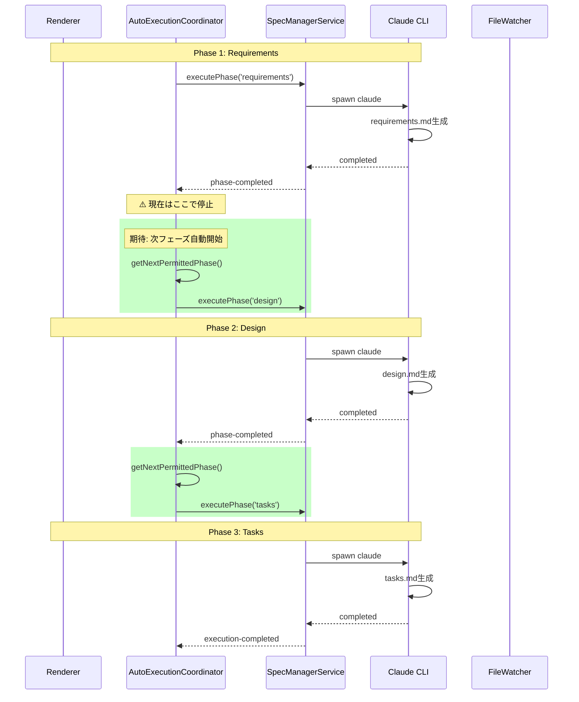
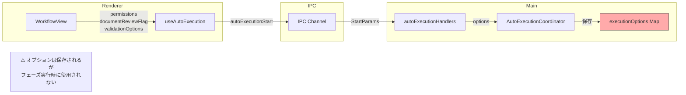
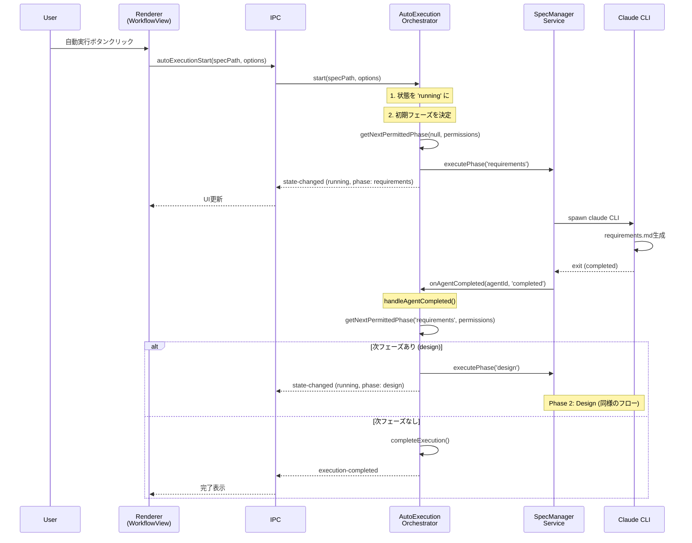

# Auto-Execution アーキテクチャ分析

## 概要

本ドキュメントは、SDD Orchestratorの自動実行機能のアーキテクチャを分析し、マルチフェーズ連続実行が動作しない原因を特定した調査結果をまとめたものです。

## 調査結果サマリー

### 発見された問題

**マルチフェーズ連続実行（requirements → design → tasks）が動作しない**

- モック環境でのE2Eテストで発覚
- 原因: フェーズ完了後に次のフェーズを自動開始するロジックが存在しない
- 影響範囲: モック環境だけでなく、本番環境でも同様の可能性あり

---

## イベント伝播フロー

### 1. 通常実行（手動でフェーズを1つずつ実行）



### 2. 自動実行（Auto-Execute）- 現在の実装



### 3. 期待される自動実行フロー（未実装）



---

## コンポーネント責務分析

### Main Process

| コンポーネント | ファイル | 責務 |
|---|---|---|
| AutoExecutionCoordinator | `autoExecutionCoordinator.ts` | 自動実行の状態管理、タイムアウト処理 |
| autoExecutionHandlers | `autoExecutionHandlers.ts` | IPC通信、イベント転送 |
| SpecManagerService | `specManagerService.ts` | Claude CLI実行、エージェント管理 |

### Renderer Process

| コンポーネント | ファイル | 責務 |
|---|---|---|
| autoExecutionStore | `autoExecutionStore.ts` | 自動実行状態の同期 |
| useAutoExecution | `useAutoExecution.ts` | IPC呼び出しのフック |
| specManagerExecutionStore | `specManagerExecutionStore.ts` | フェーズ実行状態管理 |
| WorkflowView | `WorkflowView.tsx` | UI表示、ボタン操作 |

---

## 主要メソッド分析

### AutoExecutionCoordinator

```typescript
// start() - 自動実行開始
async start(specPath, specId, options): Promise<Result<AutoExecutionState>> {
  // ✅ 状態を 'running' にセット
  // ✅ タイムアウト設定
  // ❌ フェーズ実行は開始しない
}

// handleAgentCompleted() - エージェント完了処理
async handleAgentCompleted(agentId, specPath, status) {
  // ✅ executedPhases に追加
  // ✅ 'phase-completed' イベント発火
  // ❌ 次フェーズは開始しない
}

// getNextPermittedPhase() - 次フェーズ取得（存在するが使われていない）
getNextPermittedPhase(currentPhase, permissions): WorkflowPhase | null {
  // ✅ 次の許可されたフェーズを計算
  // ⚠️ 呼び出し元がない
}

// markPhaseComplete() - フェーズ完了マーク
markPhaseComplete(specPath, phase) {
  // ✅ getNextPermittedPhase() を呼ぶ
  // ✅ 次フェーズがなければ 'completed' に
  // ❌ 次フェーズがあっても開始しない
}
```

### 問題の核心

```typescript
// handleAgentCompleted() の現在の実装
if (status === 'completed') {
  if (currentPhase) {
    newExecutedPhases.push(currentPhase);
    this.emit('phase-completed', specPath, currentPhase);
    // ❌ ここで次フェーズを開始すべきだが、していない
  }
}
```

---

## Mock CLI の動作

`scripts/e2e-mock/mock-claude.sh` の分析:

```bash
# spec.json の更新内容
data['approvals'][phase]['generated'] = True  # ✅ generated フラグは設定
# ❌ approved フラグは設定していない

# ファイル生成
generate_requirements()  # requirements.md を生成
generate_design()        # design.md を生成
generate_tasks()         # tasks.md を生成
```

### Mock環境での問題

1. `approved` フラグが設定されない
2. マルチフェーズ連続実行のトリガーがそもそも存在しない

---

## パラメータ伝播

### 自動実行オプション



### AutoExecutionOptions 構造

```typescript
interface AutoExecutionOptions {
  permissions: {
    requirements: boolean;
    design: boolean;
    tasks: boolean;
    impl: boolean;
  };
  documentReviewFlag: 'run' | 'pause' | 'skip';
  validationOptions: {
    gap: boolean;
    design: boolean;
    impl: boolean;
  };
  timeoutMs?: number;
}
```

---

## 修正方針（案）

### Option A: Coordinator でフェーズ連続実行

```typescript
// autoExecutionCoordinator.ts
async handleAgentCompleted(agentId, specPath, status) {
  if (status === 'completed' && currentPhase) {
    this.emit('phase-completed', specPath, currentPhase);

    // 追加: 次フェーズを自動開始
    const options = this.executionOptions.get(specPath);
    const nextPhase = this.getNextPermittedPhase(currentPhase, options.permissions);

    if (nextPhase) {
      await this.executePhase(specPath, nextPhase);
    } else {
      this.completeExecution(specPath);
    }
  }
}
```

### Option B: Renderer で phase-completed を監視

```typescript
// autoExecutionStore.ts
onAutoExecutionPhaseCompleted?.((data) => {
  const nextPhase = getNextPhase(data.phase, permissions);
  if (nextPhase) {
    window.electronAPI.executePhase(specId, nextPhase, featureName);
  }
});
```

### 推奨: Option A

- Main Process で完結するためシンプル
- Renderer の状態に依存しない
- タイムアウト処理と統合しやすい

---

## 関連ファイル

| ファイル | 役割 |
|---|---|
| `src/main/services/autoExecutionCoordinator.ts` | 状態管理（修正対象） |
| `src/main/ipc/autoExecutionHandlers.ts` | IPC通信 |
| `src/main/services/specManagerService.ts` | フェーズ実行 |
| `src/renderer/stores/spec/autoExecutionStore.ts` | 状態同期 |
| `src/renderer/hooks/useAutoExecution.ts` | IPC呼び出し |
| `scripts/e2e-mock/mock-claude.sh` | テスト用モック |

---

## 結論

1. **マルチフェーズ連続実行は未実装**
   - `getNextPermittedPhase()` は存在するが呼び出されていない
   - `handleAgentCompleted()` でフェーズ完了後に停止

2. **Mock環境固有の問題ではない**
   - 本番環境でも同じ問題が発生する可能性

3. **E2Eテストの修正は一時的対処**
   - テストの期待値を緩和したが根本解決ではない

4. **修正が必要**
   - `handleAgentCompleted()` で次フェーズを自動開始するロジック追加

---

## 理想的な自動実行アーキテクチャ

### 設計原則

自動実行システムを設計する際の基本原則:

1. **SSOT (Single Source of Truth)**: 自動実行状態はMain Processで一元管理
2. **イベント駆動**: Agent完了イベントをトリガーに次フェーズを決定
3. **宣言的なフェーズ遷移**: 許可設定に基づいて次フェーズを自動決定
4. **Rendererは受動的**: UIは状態の反映のみ、制御ロジックを持たない

### 理想的なコンポーネント構成

```
┌─────────────────────────────────────────────────────────────────────────┐
│                           Main Process                                   │
│                                                                          │
│  ┌────────────────────────────────────────────────────────────────────┐ │
│  │              AutoExecutionOrchestrator (SSOT)                      │ │
│  │                                                                     │ │
│  │  責務:                                                              │ │
│  │  ┌─────────────────┐  ┌─────────────────┐  ┌─────────────────┐    │ │
│  │  │ 1. 状態管理     │  │ 2. フェーズ遷移  │  │ 3. フェーズ実行  │    │ │
│  │  │   - running     │  │   決定ロジック   │  │   の起動         │    │ │
│  │  │   - paused      │  │   (次は何か？)   │  │   (実際の実行)   │    │ │
│  │  │   - error       │  │                  │  │                  │    │ │
│  │  │   - completed   │  │                  │  │                  │    │ │
│  │  └─────────────────┘  └─────────────────┘  └─────────────────┘    │ │
│  │                                                                     │ │
│  │  ┌─────────────────┐  ┌─────────────────┐                         │ │
│  │  │ 4. エラー       │  │ 5. タイムアウト  │                         │ │
│  │  │   ハンドリング  │  │   管理           │                         │ │
│  │  │   & リトライ    │  │                  │                         │ │
│  │  └─────────────────┘  └─────────────────┘                         │ │
│  └──────────────────────────┬─────────────────────────────────────────┘ │
│                             │                                            │
│                             │ executePhase(phase)                        │
│                             ▼                                            │
│  ┌────────────────────────────────────────────────────────────────────┐ │
│  │                    SpecManagerService                               │ │
│  │                                                                     │ │
│  │  責務: Claude CLI実行、プロセス管理                                │ │
│  │  - AgentRegistry (プロセス追跡)                                    │ │
│  │  - onStatusChange (完了通知) ─────────────────────────┐            │ │
│  │                                                        │            │ │
│  └────────────────────────────────────────────────────────┼────────────┘ │
│                                                           │              │
│                                                           │ 完了通知     │
│                                                           ▼              │
│                              Orchestrator.handleAgentCompleted()         │
│                                         │                                │
│                                         ▼                                │
│                              次フェーズを実行（ループ）                  │
└──────────────────────────────────────────────────────────────────────────┘
                                    │
                                    │ IPC (状態同期のみ)
                                    ▼
┌──────────────────────────────────────────────────────────────────────────┐
│                          Renderer Process                                 │
│                                                                           │
│  ┌─────────────────────────────────────────────────────────────────────┐ │
│  │                      autoExecutionStore                              │ │
│  │                                                                      │ │
│  │  責務: UIへの状態反映（受動的、制御ロジックなし）                   │ │
│  │  - isAutoExecuting: boolean                                         │ │
│  │  - currentPhase: WorkflowPhase | null                               │ │
│  │  - executedPhases: WorkflowPhase[]                                  │ │
│  │  - status: AutoExecutionStatus                                      │ │
│  └─────────────────────────────────────────────────────────────────────┘ │
└──────────────────────────────────────────────────────────────────────────┘
```

### 理想的なフローシーケンス



### 状態マシン

```
                    start()
                       │
                       ▼
    ┌───────────────────────────────────────┐
    │              RUNNING                   │
    │  ┌─────────────────────────────────┐  │
    │  │      PHASE_EXECUTING            │  │
    │  │  (requirements/design/tasks/impl)│  │
    │  └─────────────────────────────────┘  │
    │           │              │            │
    │    completed          failed          │
    │           │              │            │
    │           ▼              ▼            │
    │  ┌─────────────┐  ┌─────────────┐    │
    │  │ 次フェーズ?  │  │   ERROR     │    │
    │  └─────────────┘  └─────────────┘    │
    │    │         │           │           │
    │   yes        no      retry()         │
    │    │         │           │           │
    │    ▼         │           │           │
    │  [ループ]    │           │           │
    │              ▼           │           │
    └──────────────┼───────────┼───────────┘
                   │           │
                   ▼           ▼
            ┌──────────┐  ┌──────────┐
            │COMPLETED │  │ PAUSED   │
            └──────────┘  └──────────┘
                              │
                          resume()
                              │
                              ▼
                         [RUNNING]
```

---

## 現状との比較分析

### 責務の比較

| 責務 | 理想 | 現状 | 問題 |
|------|------|------|------|
| 状態管理 | Orchestrator | AutoExecutionCoordinator | ✅ 実装済み |
| フェーズ遷移決定 | Orchestrator | AutoExecutionCoordinator | ⚠️ メソッドは存在するが未使用 |
| **フェーズ実行の起動** | **Orchestrator** | **なし** | **❌ 未実装** |
| エラーハンドリング | Orchestrator | AutoExecutionCoordinator | ✅ 部分的に実装 |
| タイムアウト管理 | Orchestrator | AutoExecutionCoordinator | ✅ 実装済み |
| UI状態反映 | Store (受動的) | Store | ✅ 実装済み |

### 欠落している接続

```
現状の実装:

  SpecManagerService                 AutoExecutionCoordinator
  ┌─────────────────┐               ┌─────────────────────┐
  │                 │               │                     │
  │  onStatusChange ├──────────────→│ handleAgentCompleted│
  │                 │    通知       │         │          │
  └─────────────────┘               │         ▼          │
          ▲                         │   executedPhases   │
          │                         │   に追加           │
          │                         │         │          │
          │                         │         ▼          │
          │                         │   phase-completed  │
          │                         │   イベント発火     │
          │                         │         │          │
          │                         │         ▼          │
          │     ❌ 未接続           │   【ここで終了】   │
          │                         │                     │
          │                         │   getNextPhase()   │
          │                         │   は呼ばれない      │
          └─────────────────────────┤                     │
              期待: 次フェーズ実行   │   executePhase()   │
                                    │   も呼ばれない      │
                                    └─────────────────────┘

理想の実装:

  SpecManagerService                 AutoExecutionCoordinator
  ┌─────────────────┐               ┌─────────────────────┐
  │                 │               │                     │
  │  onStatusChange ├──────────────→│ handleAgentCompleted│
  │                 │    通知       │         │          │
  └─────────────────┘               │         ▼          │
          ▲                         │   executedPhases   │
          │                         │   に追加           │
          │                         │         │          │
          │                         │         ▼          │
          │                         │   getNextPhase()   │
          │                         │         │          │
          │                         │         ▼          │
          │     ✅ 接続             │   nextPhase ?      │
          │                         │     │       │      │
          │                         │    yes      no     │
          │                         │     │       │      │
          │                         │     ▼       ▼      │
          └─────────────────────────┤ executePhase  complete
                 次フェーズ実行     │                     │
                                    └─────────────────────┘
```

### 根本原因

**AutoExecutionServiceからAutoExecutionCoordinatorへの移行時に、フェーズ連続実行ロジックが移植されなかった。**

削除されたAutoExecutionService (Renderer) には以下のロジックがあった:

```typescript
// 削除されたコード (AutoExecutionService.ts 行808-812)
const nextPhase = this.getNextPermittedPhase(completedPhase);
if (nextPhase) {
  this.executePhaseForContext(context, nextPhase);
} else {
  this.completeAutoExecutionForContext(context);
}
```

現在のAutoExecutionCoordinator (Main Process) には:

```typescript
// 現在のコード (autoExecutionCoordinator.ts 行536-550)
if (status === 'completed') {
  if (currentPhase) {
    // ...
    this.emit('phase-completed', specPath, currentPhase);
    // ❌ 次フェーズを開始するコードがない
  }
}
```

---

## 修正の方向性

### 推奨: Coordinatorにフェーズ実行ロジックを追加

現在のAutoExecutionCoordinatorを拡張して、理想的なOrchestratorの責務を持たせる。

#### 必要な変更

1. **SpecManagerServiceへの参照を追加**
   - CoordinatorがSpecManagerServiceを直接呼び出せるようにする

2. **handleAgentCompleted()に次フェーズ実行を追加**
   ```typescript
   async handleAgentCompleted(agentId, specPath, status) {
     // 既存の処理...

     if (status === 'completed' && currentPhase) {
       const options = this.executionOptions.get(specPath);
       const nextPhase = this.getNextPermittedPhase(currentPhase, options.permissions);

       if (nextPhase) {
         await this.executeNextPhase(specPath, nextPhase);
       } else {
         this.completeExecution(specPath);
       }
     }
   }
   ```

3. **start()で初期フェーズを実行**
   ```typescript
   async start(specPath, specId, options) {
     // 既存の処理...

     // 初期フェーズを決定して実行
     const firstPhase = this.getNextPermittedPhase(null, options.permissions);
     if (firstPhase) {
       await this.executeNextPhase(specPath, firstPhase);
     }

     return { ok: true, value: state };
   }
   ```

#### 考慮事項

- **循環依存の回避**: CoordinatorとSpecManagerService間の依存関係に注意
- **テスト容易性**: 依存性注入パターンの使用を検討
- **既存IPCの維持**: Renderer側の変更を最小限に

### 代替案: イベントベースの分離設計

CoordinatorとSpecManagerServiceを疎結合に保ち、イベントを介して連携する。

```typescript
// handlers.ts で接続
specManagerService.onStatusChange((agentId, status) => {
  if (status === 'completed' || status === 'failed') {
    const agent = specManagerService.getAgentById(agentId);
    if (agent) {
      autoExecutionCoordinator.handleAgentCompleted(agentId, agent.specPath, status);
    }
  }
});

autoExecutionCoordinator.on('execute-next-phase', async (specPath, phase) => {
  await specManagerService.executePhase({ specId, phase, featureName });
});
```

この設計では:
- Coordinatorは「何を実行するか」を決定
- SpecManagerServiceは「どう実行するか」を担当
- handlers.tsが両者を接続