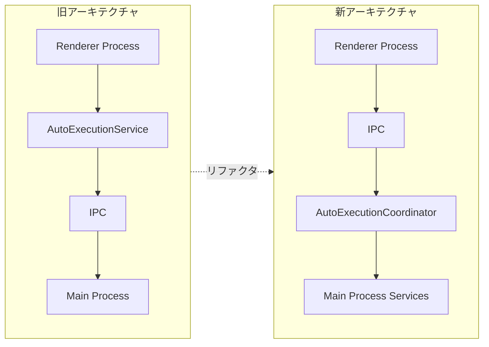
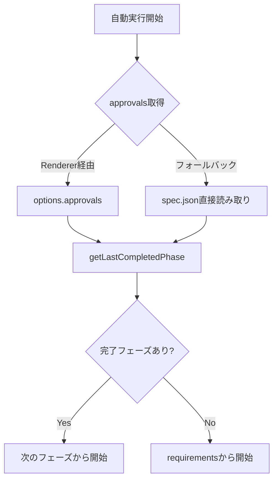
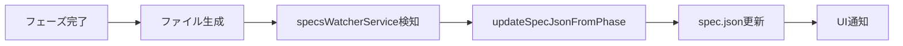
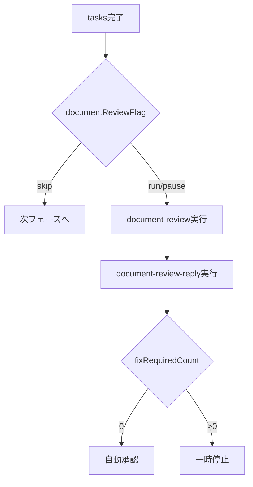

# AutoExecutionService → AutoExecutionCoordinator 移行監査レポート

**日付**: 2026-01-04
**対象コミット**: `00de666` (AutoExecutionService削除)
**調査目的**: 削除されたRenderer側の`AutoExecutionService`から現在のMain Process側`AutoExecutionCoordinator`への移行で、ロジック漏れがないか検証

---

## エグゼクティブサマリー

| 分類 | 件数 | 状態 |
|------|------|------|
| Critical（修正済み） | 1件 | ✅ 完了 |
| 問題なし（設計意図通り） | 7件 | ✅ 確認済み |
| 将来改善候補 | 4件 | 🟡 優先度低 |

**結論**: 唯一の移行漏れ（#1 開始フェーズ決定）は修正・E2Eテスト追加済み。追加の緊急修正は不要。

---

## アーキテクチャ変更の概要

**変更理由**: 自動実行ロジックをMain Processに集約し、SSoT（Single Source of Truth）を実現

---

## 移行項目一覧

### 🔴 Critical（修正済み）

| # | 機能 | 旧実装 | 問題点 | 対応 |
|---|------|--------|--------|------|
| 1 | 開始フェーズ決定 | `getLastCompletedPhase()` + `getNextPermittedPhase()` | 常に`null`から開始（完了フェーズをスキップしない） | ✅ 修正済み + E2Eテスト追加 |

**修正内容**:
- `getLastCompletedPhase(approvals)` メソッドを追加
- `start()` で approvals をチェックし、完了済みフェーズをスキップ
- Main Process で直接 spec.json を読み取るフォールバック追加

---

### 🟢 確認済み（問題なし）

| # | 機能 | 旧実装 | 現実装 | 状態 |
|---|------|--------|--------|------|
| 2 | フェーズ完了時の自動承認 | `autoApproveCompletedPhaseForContext()` | 設計変更: 手動承認のみ | ✅ 設計意図通り |
| 3 | 前フェーズの自動承認 | `requiresApproval` チェック | #1修正で `generated` チェックに変更 | ✅ 修正済み |
| 4 | spec.json フェーズ同期 | `updateSpecJsonFromPhase()` | `specsWatcherService` で自動検知 | ✅ 実装済み |
| 9 | タイムアウト処理 | 10分 | 30分に延長 | ✅ 設計変更 |
| 10 | 並行実行制御 | `MAX_CONCURRENT_SPECS` | `MAX_CONCURRENT_EXECUTIONS = 5` | ✅ 実装済み |
| 11 | AgentId→SpecId マッピング | `agentToSpecMap` | handlers.ts で直接処理 | ✅ 設計変更 |
| 12 | エラー追跡 | `context.errors` | `state.errors` | ✅ 実装済み |

#### #2〜#4 詳細確認結果

**#2 フェーズ完了時の自動承認**:
- 現在の設計では `generated=true` のみ自動設定
- `approved=true` はユーザーがApprovalPanelから手動で設定
- これは意図的な設計変更（ユーザー確認を必須とするため）

**#3 前フェーズの自動承認**:
- #1の修正で `getLastCompletedPhase()` が `generated || approved` をチェック
- `generated=true` の時点で「完了済み」として扱われる
- よって `approved=false` でも正しくスキップされる

**#4 spec.json フェーズ同期**:

---

### 🟡 将来改善候補（優先度低）

| # | 機能 | 状態 | 影響度 | 推奨対応 |
|---|------|------|--------|----------|
| 5 | validatePreconditions | running agentチェックなし | 低 | 問題報告時に対応 |
| 6 | Document Review ワークフロー | 別ロジックで実装の可能性 | 中 | 動作確認必要 |
| 7 | バリデーション実行 | `validationOptions` 使用状況不明 | 中 | 動作確認必要 |
| 8 | リトライカウンタ | 未実装（無限リトライ可能） | 低 | 必要に応じて追加 |

#### #5 validatePreconditions

**旧実装（5段階チェック）**:
1. specDetail 可用性チェック
2. running agent チェック
3. 前フェーズ承認チェック
4. document review status チェック
5. spec.json 最新状態読み込み

**現実装**:
- 並行実行チェック（`MAX_CONCURRENT_EXECUTIONS`）のみ

#### #6 Document Review ワークフロー

**確認必要**: 上記フローが1セットで実行されているか

---

## 修正ファイル一覧

### バグ修正 (#1)

| ファイル | 変更内容 |
|----------|----------|
| `src/main/services/autoExecutionCoordinator.ts` | `getLastCompletedPhase()` 追加、`start()` 修正 |
| `src/renderer/components/WorkflowView.tsx` | approvals を startAutoExecution に渡す |
| `src/renderer/hooks/useAutoExecution.ts` | `ApprovalsStatus` 型定義追加 |
| `src/renderer/types/electron.d.ts` | IPC型定義更新 |

### E2Eテスト追加

| ファイル | 内容 |
|----------|------|
| `e2e-wdio/auto-execution-resume.e2e.spec.ts` | 途中再開テスト |
| `e2e-wdio/fixtures/resume-test/` | テストフィクスチャ |

---

## 推奨アクション

### 完了

- [x] #1 開始フェーズ決定バグ修正
- [x] E2Eテスト追加
- [x] 移行監査レポート作成

### 必要に応じて対応

- [ ] Document Reviewワークフロー動作確認
- [ ] バリデーション実行動作確認
- [ ] リトライカウンタ追加（無限リトライ防止）

---

## 関連コミット

- バグ修正: `fix(auto-execution): 既に完了したフェーズをスキップして自動実行を開始`
- テスト追加: `test(e2e): 自動実行の途中再開テストを追加`
