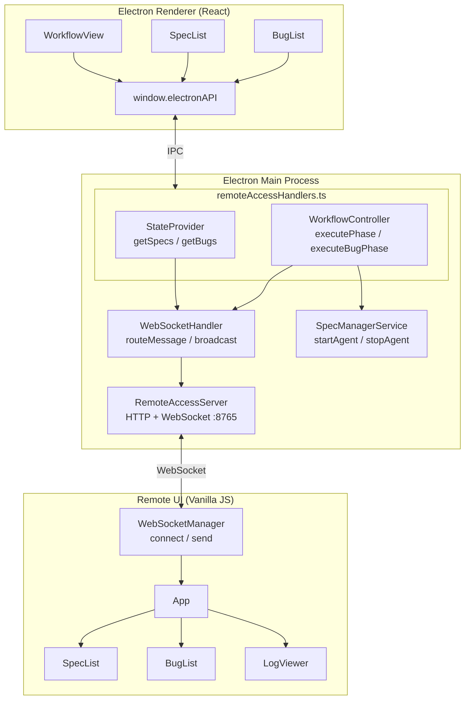
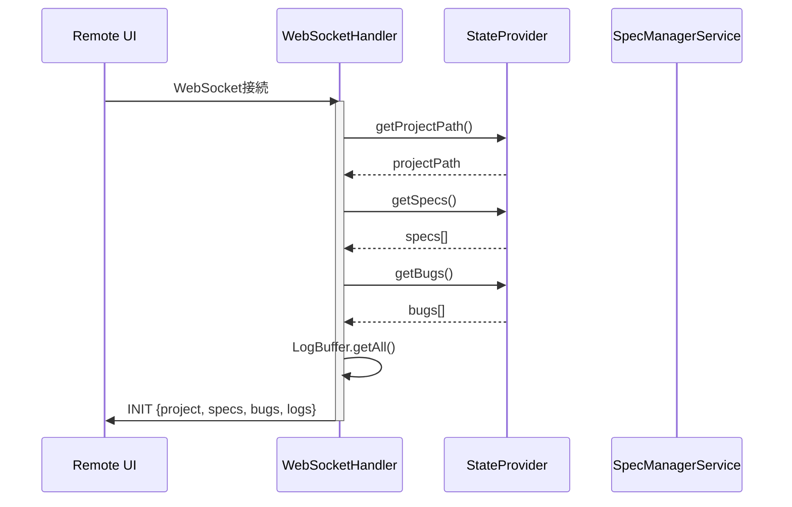
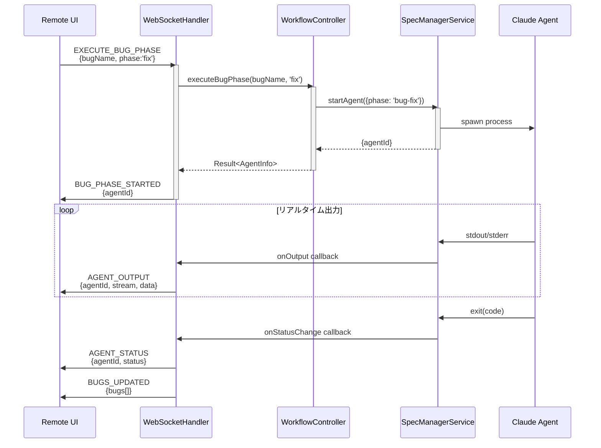
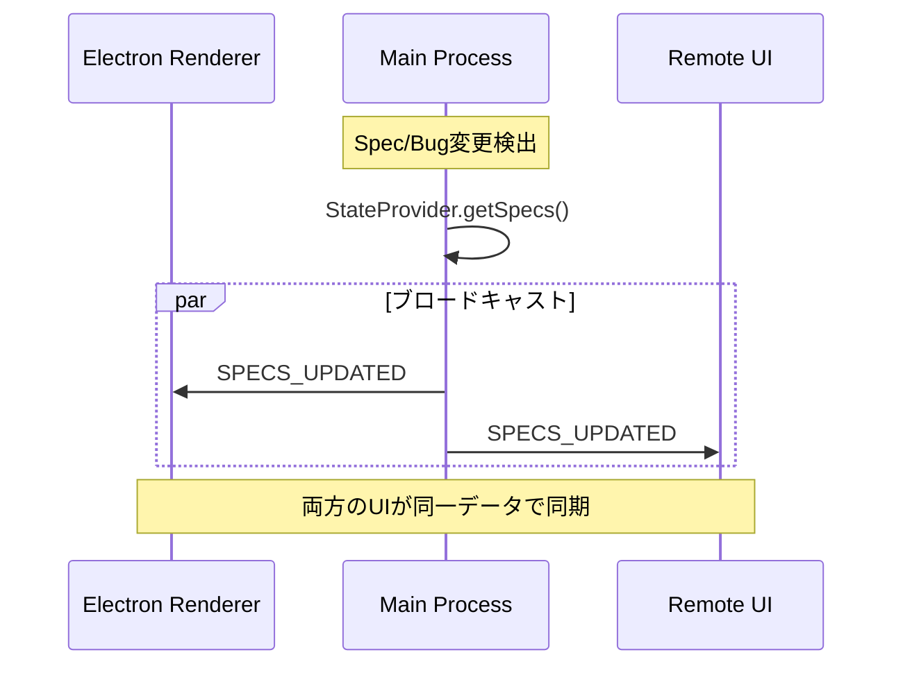
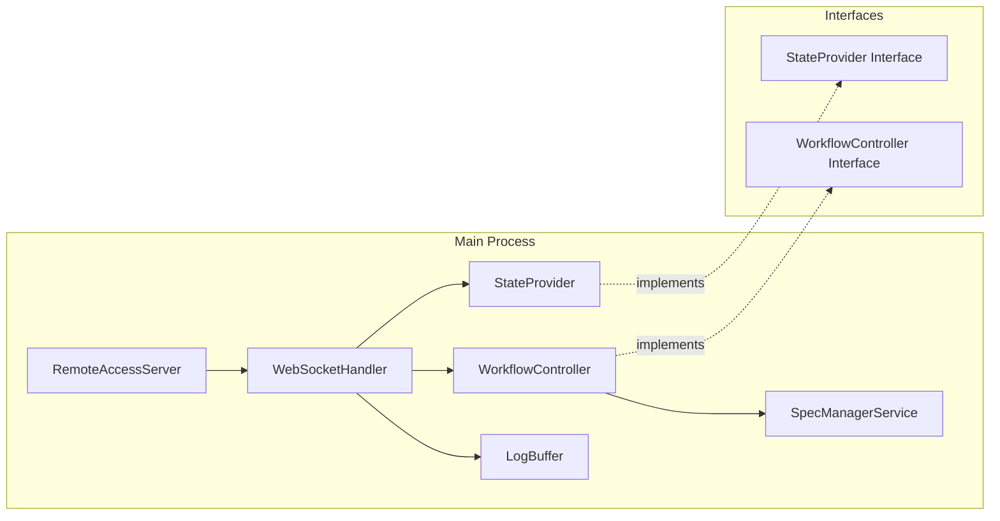
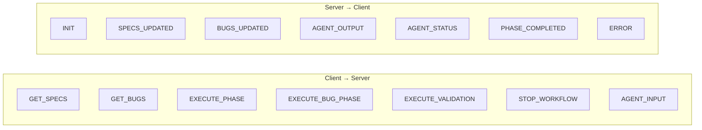
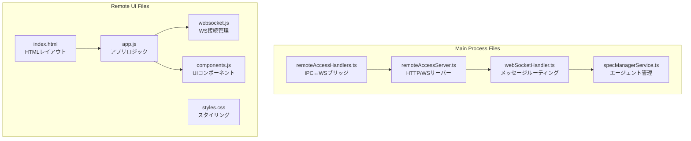

# internal-webserver-sync アーキテクチャ

## 全体構成（3層アーキテクチャ）

## データフロー

### 1. 初期接続時（INIT）

### 2. バグフェーズ実行フロー

### 3. 状態同期（ブロードキャスト）

## コンポーネント構成

## WebSocketメッセージ一覧

## ファイル構成

## 設計原則

| 原則 | 適用 |
|------|------|
| **SSOT** | Main Processが唯一の状態管理元 |
| **疎結合** | StateProvider/WorkflowControllerインターフェースで抽象化 |
| **リアルタイム** | WebSocketでエージェント出力をストリーミング |
| **同期** | broadcast()でRenderer/Remote UI両方に同一データ配信 |

## 通信ポート

| ポート | 用途 |
|--------|------|
| 8765 | デフォルト（HTTP + WebSocket） |
| 8766-8775 | フォールバック（自動探索） |

## セキュリティ

- **IP制限**: Private IP (192.168.*, 10.*, 172.16-31.*) のみ許可
- **最大接続数**: 10クライアント
- **レート制限**: 設定可能（デフォルト無効）
