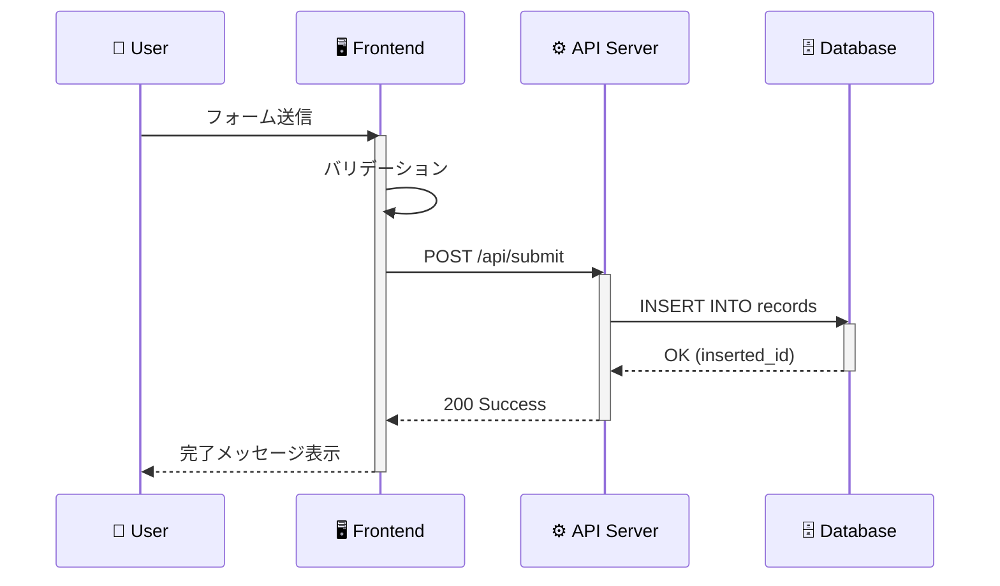
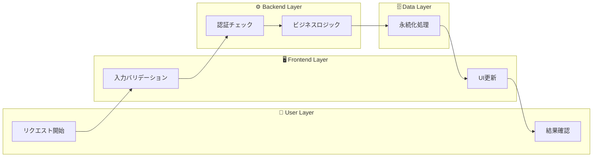
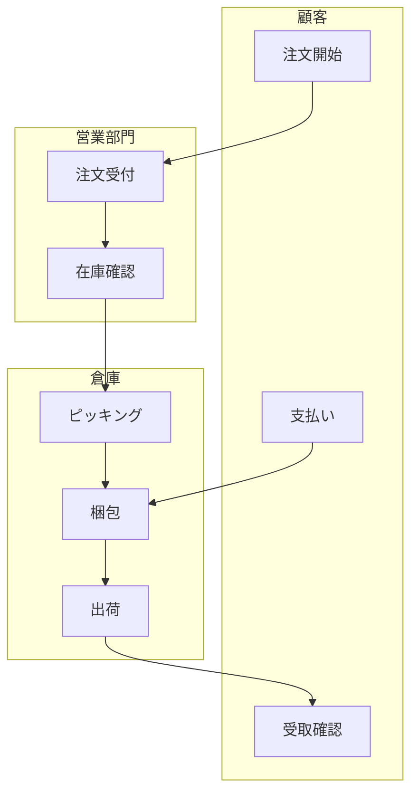
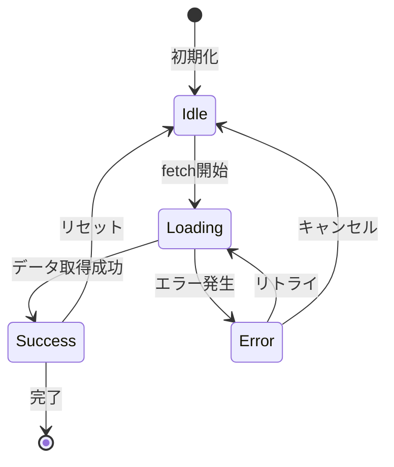
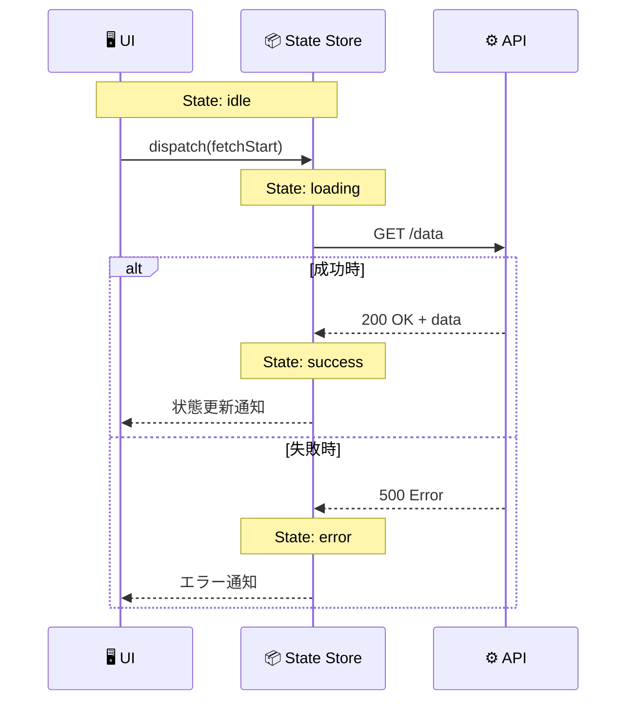

# Mermaid Swimlane Diagram Examples

Mermaidでスイムレーン的な表現を実現する方法のサンプル集。

## 方法1: Sequence Diagram（推奨）

複数のparticipantを使うことで、自然にスイムレーン的な表現になる。
アクター間のメッセージフローを時系列で表現するのに最適。

### 使用場面
- API呼び出しフロー
- ユーザー操作の処理フロー
- マイクロサービス間通信

---

## 方法2: Flowchart with Subgraphs（横型レーン）

`subgraph`を使って責任範囲を明確に分離。
プロセス全体の流れと担当を同時に表現。

### 使用場面
- レイヤードアーキテクチャの可視化
- 責任分担の明確化
- 横断的な処理フローの説明

---

## 方法3: Flowchart with Subgraphs（縦型レーン）

縦方向のフローで、より伝統的なスイムレーン表現に近い形式。

### 使用場面
- 業務フロー図
- 部門間連携の可視化
- ワークフロー定義

---

## 方法4: State Diagram（状態遷移）

状態とその遷移を表現。UIの状態管理やライフサイクル表現に最適。

### 使用場面
- UIコンポーネントの状態管理
- 注文ステータスのライフサイクル
- 認証状態の遷移

---

## 方法5: 複合パターン（Sequence + 状態表現）

Sequence Diagramにノートを追加して状態変化も表現。

### 使用場面
- Redux/Zustand等の状態管理フロー
- 非同期処理の状態遷移
- エラーハンドリングフロー

---

## spec-design での推奨使用方法

| 表現したい内容 | 推奨Mermaid図 |
|---------------|--------------|
| APIコールフロー | Sequence Diagram |
| コンポーネント間通信 | Sequence Diagram |
| レイヤー責任分担 | Flowchart + Subgraph |
| 状態ライフサイクル | State Diagram |
| 業務プロセス | Flowchart + Subgraph (縦型) |
| エラーハンドリング | Sequence + alt/else |

---

## 参考リンク

- [Mermaid Sequence Diagram](https://mermaid.js.org/syntax/sequenceDiagram.html)
- [Mermaid Flowchart](https://mermaid.js.org/syntax/flowchart.html)
- [Mermaid State Diagram](https://mermaid.js.org/syntax/stateDiagram.html)
