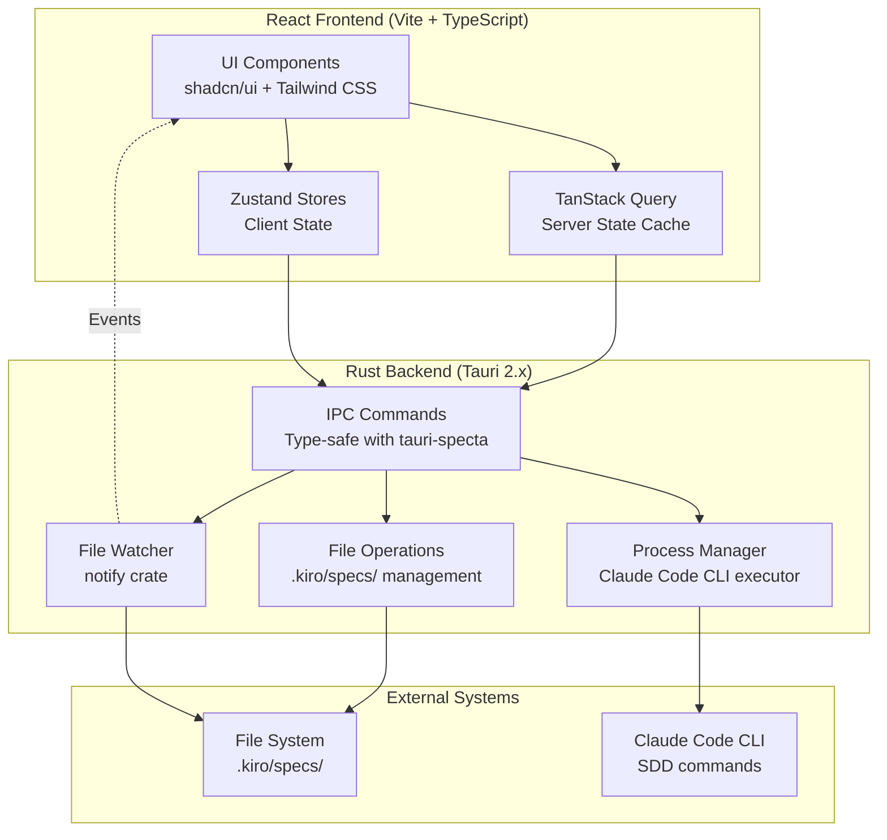
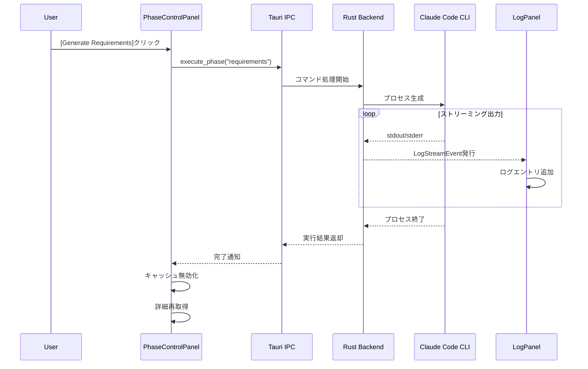
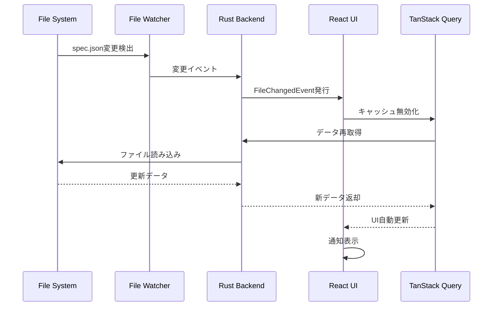

# SDD Manager UI - 概要図

## プロジェクト概要

**SDD Manager UI**は、Spec-Driven Development (SDD) ワークフローを視覚的に管理するデスクトップアプリケーションです。Tauri 2.x + React 18 + TypeScript 5で構築され、`.kiro/specs/`内の仕様を統合的に管理できます。

## アーキテクチャ概要



## UIレイアウト構成

### メイン画面レイアウト

```
┌─────────────────────────────────────────────────────────────────────┐
│ SDD Manager                                    [プロジェクト選択]    │
├─────────────────┬───────────────────────────────────────────────────┤
│                 │                                                     │
│  仕様一覧        │  仕様詳細パネル                                    │
│  SpecListPanel  │  SpecDetailPanel                                   │
│                 │                                                     │
│ ┌─────────────┐ │  ┌──────────────────────────────────────────────┐ │
│ │ spec-1      │ │  │ 仕様名: feature-auth                         │ │
│ │ ✓ Completed │ │  │ フェーズ: tasks-approved                     │ │
│ │ 2025-11-24  │ │  │ 更新: 2025-11-24                             │ │
│ │             │ │  └──────────────────────────────────────────────┘ │
│ ├─────────────┤ │                                                     │
│ │ spec-2      │ │  ┌──────────────────────────────────────────────┐ │
│ │ ⚙ Progress  │ │  │ [Requirements] [Design] [Tasks]              │ │
│ │ 2025-11-23  │ │  │                                                │ │
│ │             │◄─┼─►│ # Requirements Document                       │ │
│ ├─────────────┤ │  │ ## Project Description                        │ │
│ │ spec-3      │ │  │ ...                                           │ │
│ │ ⏸ Pending   │ │  │ (Markdown rendered content)                   │ │
│ │ 2025-11-22  │ │  │                                                │ │
│ └─────────────┘ │  └──────────────────────────────────────────────┘ │
│                 │                                                     │
│ [+ 新規仕様]    │  ┌──────────────────────────────────────────────┐ │
│                 │  │ フェーズ実行制御 (PhaseControlPanel)          │ │
│ [ソート: 更新順]│  │ [Generate Requirements] [Generate Design]     │ │
│ [フィルタ: 全て]│  │ [Generate Tasks] [Execute Implementation]     │ │
│                 │  │ □ Auto-approve                                │ │
│                 │  └──────────────────────────────────────────────┘ │
│                 │                                                     │
│                 │  ┌──────────────────────────────────────────────┐ │
│                 │  │ 承認パネル (ApprovalPanel)                    │ │
│                 │  │ Requirements: ✓ Approved                      │ │
│                 │  │ Design: ✓ Approved                            │ │
│                 │  │ Tasks: [Approve] [Reject]                     │ │
│                 │  └──────────────────────────────────────────────┘ │
│                 │                                                     │
└─────────────────┴───────────────────────────────────────────────────┘
│ 実行ログ (LogPanel)                                         [クリア] │
│ ┌──────────────────────────────────────────────────────────────────┐│
│ │ [12:34:56] Starting phase execution...                           ││
│ │ [12:34:57] Reading requirements.md...                            ││
│ │ [12:34:58] ✓ Success                                             ││
│ │ Exit code: 0 | Duration: 2.3s                                    ││
│ └──────────────────────────────────────────────────────────────────┘│
└─────────────────────────────────────────────────────────────────────┘
```

## 主要UIコンポーネント

### 1. SpecListPanel (仕様一覧パネル)

**機能:**
- `.kiro/specs/`内のすべての仕様を一覧表示
- 仕様名、ステータス、更新日時を表示
- ソート機能（名前、更新日時、ステータス）
- フィルタ機能（ステータス別）
- 新規仕様作成ボタン

**ステータス表示:**
- ✓ **Completed** (緑): すべてのフェーズ承認済み
- ⚙ **In Progress** (青): 一部フェーズ実行中
- ⏸ **Pending** (灰色): 未着手または待機中
- ❌ **Error** (赤): エラー発生

### 2. SpecDetailPanel (仕様詳細パネル)

**機能:**
- 選択された仕様のメタデータ表示
- 各フェーズの承認状態バッジ表示
- 作成日時・更新日時の表示

**承認状態バッジ:**
- ✓ **Approved** (緑): 承認済み
- ⚙ **Generated** (青): 生成済み・未承認
- ⏸ **Pending** (灰色): 未生成

### 3. SpecTabs (成果物タブコンポーネント)

**機能:**
- requirements.md、design.md、tasks.mdのタブ切り替え
- Markdownレンダリング表示（react-markdown）
- シンタックスハイライト（コードブロック）
- 未生成ファイルのプレースホルダー表示

### 4. PhaseControlPanel (フェーズ実行制御パネル)

**機能:**
- 4つのフェーズ実行ボタン
  - Generate Requirements
  - Generate Design
  - Generate Tasks
  - Execute Implementation
- 前提フェーズ未承認時のボタン無効化
- 実行中の進行状況インジケーター
- Auto-approveオプション

### 5. ApprovalPanel (承認パネル)

**機能:**
- 各フェーズの承認状態一覧表示
- 承認・却下ボタン
- 却下時の理由入力ダイアログ
- 承認履歴の表示

### 6. LogPanel (ログパネル)

**機能:**
- リアルタイムログ表示（標準出力・標準エラー）
- stderrの赤色ハイライト
- 自動スクロール機能
- 終了コード・実行時間表示
- ログクリア・コピー機能

### 7. CreateSpecDialog (仕様作成ダイアログ)

**機能:**
- 仕様名入力（小文字・数字・ハイフンのみ）
- 説明入力（10文字以上）
- バリデーションエラー表示
- 重複チェック
- 作成成功時の一覧自動更新

### 8. ProjectSettingsPanel (プロジェクト設定パネル)

**機能:**
- プロジェクトディレクトリ選択
- `.kiro/`ディレクトリ検証
- 最近のプロジェクト履歴表示
- steeringファイル存在確認

### 9. MarkdownEditor (Markdownエディタコンポーネント)

**機能:**
- 編集モード/プレビューモード切り替え
- Markdownツールバー（見出し、リスト、コード等）
- 未保存変更インジケーター
- 保存確認ダイアログ

### 10. NotificationProvider (通知プロバイダー)

**機能:**
- トースト通知表示（成功、エラー、警告、情報）
- 自動消去タイマー
- エラー詳細ダイアログ
- アクションボタン

## 主要フロー

### フェーズ実行フロー



### ファイル監視・自動更新フロー



## 状態管理

### Zustand Stores（クライアント状態）

1. **ConfigStore**: プロジェクト設定、履歴、テーマ
2. **NotificationStore**: 通知キュー管理
3. **LogStore**: 実行ログエントリ蓄積
4. **EditorStore**: 未保存変更追跡

### TanStack Query（サーバー状態キャッシュ）

- 仕様一覧キャッシュ (`['specs']`)
- 仕様詳細キャッシュ (`['spec', specName]`)
- 成果物コンテンツキャッシュ (`['artifact', specName, type]`)
- 自動再取得・無効化・ガベージコレクション

## 技術スタック

| レイヤー | 技術 | 役割 |
|---------|------|------|
| フロントエンド | React 18 + TypeScript 5 | UIコンポーネント・インタラクション |
| バンドラー | Vite | 高速ビルド・ホットリロード |
| 状態管理 | Zustand 5 + TanStack Query 5 | クライアント状態・サーバーキャッシュ |
| UIコンポーネント | shadcn/ui + Radix UI + Tailwind CSS 3 | アクセシブル・カスタマイズ可能UI |
| Markdown | react-markdown + rehype-highlight | レンダリング・シンタックスハイライト |
| エディタ | @uiw/react-md-editor | Markdown編集UI |
| バックエンド | Rust + Tauri 2.x | システムリソース・IPC |
| 型生成 | tauri-specta 2.x + specta 2.x | Rust↔TypeScript型同期 |
| ファイル監視 | tauri-plugin-fs-watch + notify | ファイルシステム監視 |

## セキュリティ

### Tauri Security Configuration

- **Shell Scope**: Claude Code CLIのみ実行許可
- **File System Scope**: プロジェクトディレクトリと設定ディレクトリのみアクセス許可
- **Content Security Policy**: 外部リソース読み込み禁止
- **IPC Validation**: すべてのコマンドで入力バリデーション実施

## パフォーマンス目標

- **初期ロード**: < 2秒（仕様100件時）
- **仕様一覧レンダリング**: < 100ms（ソート・フィルタ）
- **IPC応答**: < 500ms（ファイル読み込み）
- **ログストリーミング遅延**: < 50ms

### 最適化手法

- 仮想スクロール（大量仕様・ログ）
- ファイル監視デバウンス（300ms）
- 成果物遅延読み込み
- クエリキャッシュ（staleTime: 5秒）

## クロスプラットフォーム対応

- macOS、Windows、Linux対応
- プラットフォーム標準キーボードショートカット（Cmd/Ctrl）
- ネイティブウィンドウ装飾
- ファイルパス形式正規化
