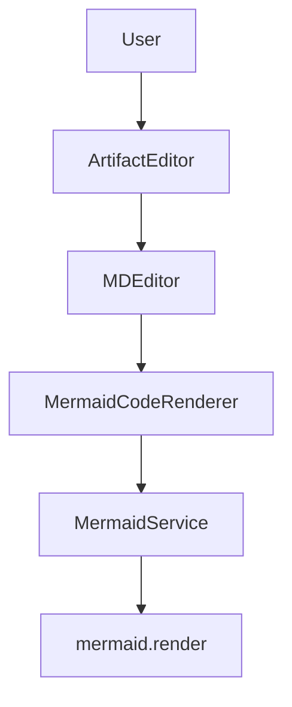
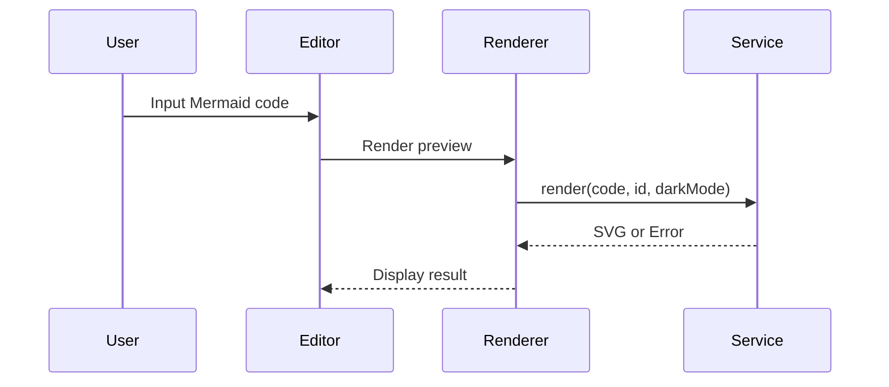

# Design Document

## Overview

This design document includes Mermaid diagrams for testing the Mermaid preview functionality.

## Architecture

The system architecture is shown below:



## Sequence Diagram

The rendering flow:



## Regular Code Block

This is a regular TypeScript code block (should NOT be rendered as Mermaid):

```typescript
function hello(): string {
  return 'Hello, World!';
}
```

## Components

- MermaidService: Handles Mermaid rendering
- MermaidCodeRenderer: React component for code blocks
